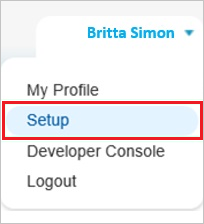
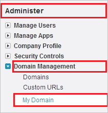
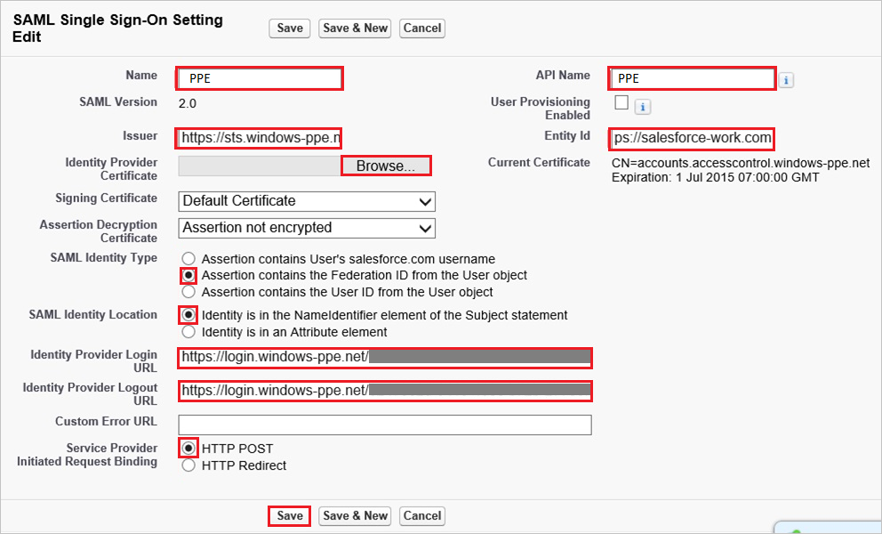
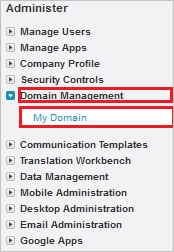
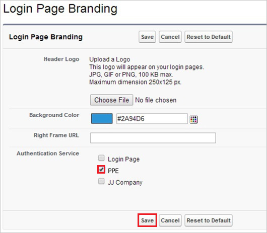
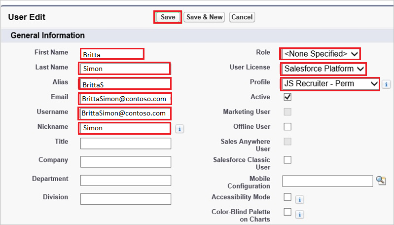

# Tutorial: Azure Active Directory integration with Work.com

In this tutorial, you learn how to integrate Work.com with Azure Active Directory (Azure AD).
Integrating Work.com with Azure AD provides you with the following benefits:

* You can control in Azure AD who has access to Work.com.
* You can enable your users to be automatically signed-in to Work.com (Single Sign-On) with their Azure AD accounts.
* You can manage your accounts in one central location - the Azure portal.

If you want to know more details about SaaS app integration with Azure AD, see [What is application access and single sign-on with Azure Active Directory](https://docs.microsoft.com/azure/active-directory/active-directory-appssoaccess-whatis).
If you don't have an Azure subscription, [create a free account](https://azure.microsoft.com/free/) before you begin.

## Prerequisites

To configure Azure AD integration with Work.com, you need the following items:

* An Azure AD subscription. If you don't have an Azure AD environment, you can get a [free account](https://azure.microsoft.com/free/)
* Work.com single sign-on enabled subscription

## Scenario description

In this tutorial, you configure and test Azure AD single sign-on in a test environment.

* Work.com supports **SP** initiated SSO

## Adding Work.com from the gallery

To configure the integration of Work.com into Azure AD, you need to add Work.com from the gallery to your list of managed SaaS apps.

**To add Work.com from the gallery, perform the following steps:**

1. In the **[Azure portal](https://portal.azure.com)**, on the left navigation panel, click **Azure Active Directory** icon.

	

2. Navigate to **Enterprise Applications** and then select the **All Applications** option.

	

3. To add new application, click **New application** button on the top of dialog.

	

4. In the search box, type **Work.com**, select **Work.com** from result panel then click **Add** button to add the application.

	

## Configure and test Azure AD single sign-on

In this section, you configure and test Azure AD single sign-on with Work.com based on a test user called **Britta Simon**.
For single sign-on to work, a link relationship between an Azure AD user and the related user in Work.com needs to be established.

To configure and test Azure AD single sign-on with Work.com, you need to complete the following building blocks:

1. **[Configure Azure AD Single Sign-On](#configure-azure-ad-single-sign-on)** - to enable your users to use this feature.
2. **[Configure Work.com Single Sign-On](#configure-workcom-single-sign-on)** - to configure the Single Sign-On settings on application side.
3. **[Create an Azure AD test user](#create-an-azure-ad-test-user)** - to test Azure AD single sign-on with Britta Simon.
4. **[Assign the Azure AD test user](#assign-the-azure-ad-test-user)** - to enable Britta Simon to use Azure AD single sign-on.
5. **[Create Work.com test user](#create-workcom-test-user)** - to have a counterpart of Britta Simon in Work.com that is linked to the Azure AD representation of user.
6. **[Test single sign-on](#test-single-sign-on)** - to verify whether the configuration works.

### Configure Azure AD single sign-on

In this section, you enable Azure AD single sign-on in the Azure portal.

>[!NOTE]
>To configure single sign-on, you need to setup a custom Work.com domain name yet. You need to define at least a domain name, test your domain name, and deploy it to your entire organization.

To configure Azure AD single sign-on with Work.com, perform the following steps:

1. In the [Azure portal](https://portal.azure.com/), on the **Work.com** application integration page, select **Single sign-on**.

    

2. On the **Select a Single sign-on method** dialog, select **SAML/WS-Fed** mode to enable single sign-on.

    

3. On the **Set up Single Sign-On with SAML** page, click **Edit** icon to open **Basic SAML Configuration** dialog.

	

4. On the **Basic SAML Configuration** section, perform the following steps:

    

    In the **Sign-on URL** text box, type a URL using the following pattern:
    `http://<companyname>.my.salesforce.com`

	> [!NOTE]
	> The value is not real. Update the value with the actual Sign-On URL. Contact [Work.com Client support team](https://help.salesforce.com/articleView?id=000159855&type=3) to get the value. You can also refer to the patterns shown in the **Basic SAML Configuration** section in the Azure portal.

5. On the **Set up Single Sign-On with SAML** page, in the **SAML Signing Certificate** section, click **Download** to download the **Certificate (Base64)** from the given options as per your requirement and save it on your computer.

	

6. On the **Set up Work.com** section, copy the appropriate URL(s) as per your requirement.

	

	a. Login URL

	b. Azure AD Identifier

	c. Logout URL

### Configure Work.com Single Sign-On

1. Sign in to your Work.com tenant as administrator.

2. Go to **Setup**.
   
    

3. On the left navigation pane, in the **Administer** section, click **Domain Management** to expand the related section, and then click **My Domain** to open the **My Domain** page. 
   
    

4. To verify that your domain has been set up correctly, make sure that it is in “**Step 4 Deployed to Users**” and review your “**My Domain Settings**”.
   
    

5. Sign in to your Work.com tenant.

6. Go to **Setup**.
    
    

7. Expand the **Security Controls** menu, and then click **Single Sign-On Settings**.
    
    

8. On the **Single Sign-On Settings** dialog page, perform the following steps:
    
    
    
    a. Select **SAML Enabled**.
    
    b. Click **New**.

9. In the **SAML Single Sign-On Settings** section, perform the following steps:
    
    
    
    a. In the **Name** textbox, type a name for your configuration.  
       
    > [!NOTE]
    > Providing a value for **Name** does automatically populate the **API Name** textbox.
    
    b. In **Issuer** textbox, paste the value of **Azure AD Identifier** which you have copied from Azure portal.
    
    c. To upload the downloaded certificate from Azure portal, click **Browse**.
    
    d. In the **Entity Id** textbox, type `https://salesforce-work.com`.
    
    e. As **SAML Identity Type**, select **Assertion contains the Federation ID from the User object**.
    
    f. As **SAML Identity Location**, select **Identity is in the NameIdentfier element of the Subject statement**.
    
    g. In **Identity Provider Login URL** textbox, paste the value of **Login URL** which you have copied from Azure portal.

    h. In **Identity Provider Logout URL** textbox, paste the value of **Logout URL** which you have copied from Azure portal.
    
    i. As **Service Provider Initiated Request Binding**, select **HTTP Post**.
    
    j. Click **Save**.

10. In your Work.com classic portal, on the left navigation pane, click **Domain Management** to expand the related section, and then click **My Domain** to open the **My Domain** page. 
    
    

11. On the **My Domain** page, in the **Login Page Branding** section, click **Edit**.
    
    

12. On the **Login Page Branding** page, in the **Authentication Service** section, the name of your **SAML SSO Settings** is displayed. Select it, and then click **Save**.
    
    

### Create an Azure AD test user 

The objective of this section is to create a test user in the Azure portal called Britta Simon.

1. In the Azure portal, in the left pane, select **Azure Active Directory**, select **Users**, and then select **All users**.

    

2. Select **New user** at the top of the screen.

    

3. In the User properties, perform the following steps.

    

    a. In the **Name** field enter **BrittaSimon**.
  
    b. In the **User name** field type `brittasimon@yourcompanydomain.extension`. For example, BrittaSimon@contoso.com

    c. Select **Show password** check box, and then write down the value that's displayed in the Password box.

    d. Click **Create**.

### Assign the Azure AD test user

In this section, you enable Britta Simon to use Azure single sign-on by granting access to Work.com.

1. In the Azure portal, select **Enterprise Applications**, select **All applications**, then select **Work.com**.

	

2. In the applications list, select **Work.com**.

	

3. In the menu on the left, select **Users and groups**.

    

4. Click the **Add user** button, then select **Users and groups** in the **Add Assignment** dialog.

    

5. In the **Users and groups** dialog select **Britta Simon** in the Users list, then click the **Select** button at the bottom of the screen.

6. If you are expecting any role value in the SAML assertion then in the **Select Role** dialog select the appropriate role for the user from the list, then click the **Select** button at the bottom of the screen.

7. In the **Add Assignment** dialog click the **Assign** button.

### Create Work.com test user

For Azure Active Directory users to be able to sign in, they must be provisioned to Work.com. In the case of Work.com, provisioning is a manual task.

### To configure user provisioning, perform the following steps:

1. Sign on to your Work.com company site as an administrator.

2. Go to **Setup**.
   
    

3. Go to **Manage Users \> Users**.
   
    

4. Click **New User**.
   
    

5. In the User Edit section, perform the following steps, in attributes of a valid Azure AD account you want to provision into the related textboxes:
   
    
   
    a. In the **First Name** textbox, type the **first name** of the user **Britta**.
	
	b. In the **Last Name** textbox, type the **last name** of the user **Simon**.
	
	c. In the **Alias** textbox, type the **name** of the user **BrittaS**.
    
    d. In the **Email** textbox, type the **email address** of user Brittasimon@contoso.com.
    
    e. In the **User Name** textbox, type a user name of user like Brittasimon@contoso.com.
    
    f. In the **Nick Name** textbox, type a **nick name** of user **Simon**.
    
    g. Select **Role**, **User License**, and **Profile**.
	
	h. Click **Save**.  
      
    > [!NOTE]
    > The Azure AD account holder will get an email including a link to confirm the account before it becomes active.
    > 

### Test single sign-on 

In this section, you test your Azure AD single sign-on configuration using the Access Panel.

When you click the Work.com tile in the Access Panel, you should be automatically signed in to the Work.com for which you set up SSO. For more information about the Access Panel, see [Introduction to the Access Panel](https://docs.microsoft.com/azure/active-directory/active-directory-saas-access-panel-introduction).

## Additional Resources

- [List of Tutorials on How to Integrate SaaS Apps with Azure Active Directory](https://docs.microsoft.com/azure/active-directory/active-directory-saas-tutorial-list)

- [What is application access and single sign-on with Azure Active Directory?](https://docs.microsoft.com/azure/active-directory/active-directory-appssoaccess-whatis)

- [What is Conditional Access in Azure Active Directory?](https://docs.microsoft.com/azure/active-directory/conditional-access/overview)

