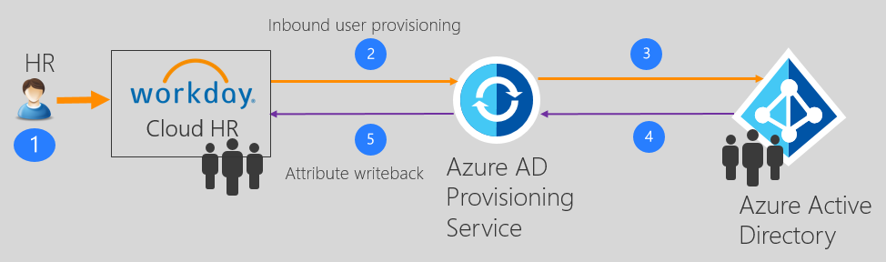
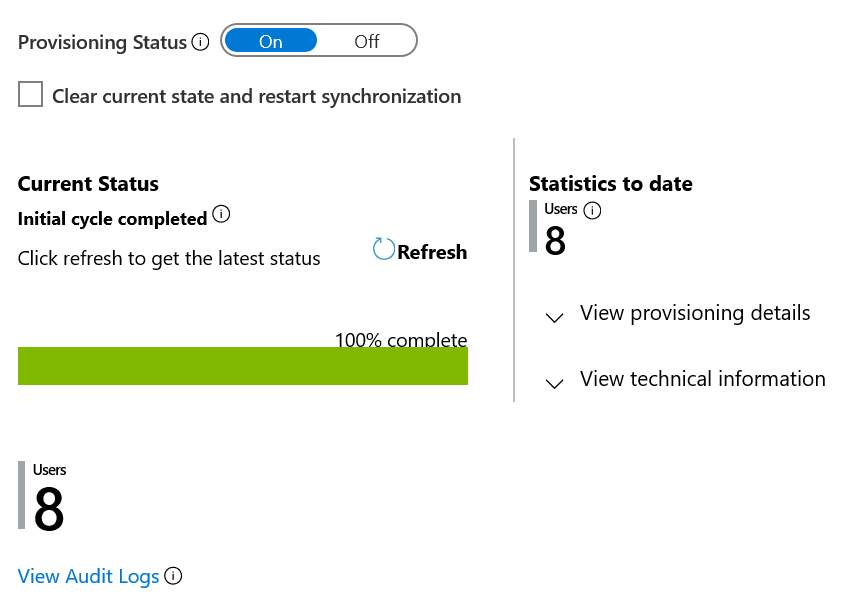

# Tutorial: Configure Workday to Azure AD user provisioning
The objective of this tutorial is to show the steps you need to perform to provision worker data from Workday into Azure Active Directory. 

>[!NOTE]
>Use this tutorial if the users you want to provision from Workday are cloud-only users who don't need an on-premises AD account. If the users require only on-premises AD account or both AD and Azure AD account, then please refer to the tutorial on [configure Workday to Active Directory](workday-inbound-tutorial.md) user provisioning. 

## Overview

The [Azure Active Directory user provisioning service](../app-provisioning/user-provisioning.md) integrates with the [Workday Human Resources API](https://community.workday.com/sites/default/files/file-hosting/productionapi/Human_Resources/v21.1/Get_Workers.html) in order to provision user accounts. The Workday user provisioning workflows supported by the Azure AD user provisioning service enable automation of the following human resources and identity lifecycle management scenarios:

* **Hiring new employees** - When a new employee is added to Workday, a user account is automatically created in Azure Active Directory and optionally Office 365 and [other SaaS applications supported by Azure AD](../app-provisioning/user-provisioning.md), with write-back of the email address to Workday.

* **Employee attribute and profile updates** - When an employee record is updated in Workday (such as their name, title, or manager), their user account will be automatically updated Azure Active Directory and optionally Office 365 and [other SaaS applications supported by Azure AD](../app-provisioning/user-provisioning.md).

* **Employee terminations** - When an employee is terminated in Workday, their user account is automatically disabled in Azure Active Directory and optionally Office 365 and [other SaaS applications supported by Azure AD](../app-provisioning/user-provisioning.md).

* **Employee rehires** - When an employee is rehired in Workday, their old account can be automatically reactivated or re-provisioned (depending on your preference) to Azure Active Directory and optionally Office 365 and [other SaaS applications supported by Azure AD](../app-provisioning/user-provisioning.md).

### Who is this user provisioning solution best suited for?

This Workday to Azure Active Directory user provisioning solution is ideally suited for:

* Organizations that desire a pre-built, cloud-based solution for Workday user provisioning

* Organizations that require direct user provisioning from Workday to Azure Active Directory

* Organizations that require users to be provisioned using data obtained from Workday

* Organizations using Office 365 for email

## Solution architecture

This section describes the end-to-end user provisioning solution architecture for cloud-only users. There are two related flows:

* **Authoritative HR data flow – from Workday to Azure Active Directory:** In this flow worker events (such as New Hires, Transfers, Terminations) first occur in Workday and then the event data flows into Azure Active Directory. Depending on the event, it may lead to create/update/enable/disable operations in Azure AD.
* **Writeback flow – from on-premises Active Directory to Workday:** Once the account creation is complete in Active Directory, it is synced with Azure AD through Azure AD Connect and information such as email, username and phone number  can be written back to Workday.

  

### End-to-end user data flow

1. The HR team performs worker transactions (Joiners/Movers/Leavers or New Hires/Transfers/Terminations) in Workday Employee Central
2. The Azure AD Provisioning Service runs scheduled synchronizations of identities from Workday EC and identifies changes that need to be processed for sync with on-premises Active Directory.
3. The Azure AD Provisioning Service determines the change and invokes create/update/enable/disable operation for the user in Azure AD.
4. If the [Workday Writeback](workday-writeback-tutorial.md) app is configured, it retrieves attributes such as email, username and phone number from Azure AD. 
5. Azure AD provisioning service sets email, username and phone number in Workday.

## Planning your deployment

Configuring Cloud HR driven user provisioning from Workday to Azure AD requires considerable planning covering different aspects such as:

* Determining the Matching ID 
* Attribute mapping
* Attribute transformation 
* Scoping filters

Please refer to the [cloud HR deployment plan](../app-provisioning/plan-cloud-hr-provision.md) for comprehensive guidelines around these topics. 

## Configure integration system user in Workday

Refer to the section [configure integration system user](workday-inbound-tutorial.md#configure-integration-system-user-in-workday) for creating a Workday integration system user account with permissions to retrieve worker data. 

## Configure user provisioning from Workday to Azure AD

The following sections describe steps for configuring user provisioning from Workday to Azure AD for cloud-only deployments.

* [Adding the Azure AD provisioning connector app and creating the connection to Workday](#part-1-adding-the-azure-ad-provisioning-connector-app-and-creating-the-connection-to-workday)
* [Configure Workday and Azure AD attribute mappings](#part-2-configure-workday-and-azure-ad-attribute-mappings)
* [Enable and launch user provisioning](#enable-and-launch-user-provisioning)

### Part 1: Adding the Azure AD provisioning connector app and creating the connection to Workday

**To configure Workday to Azure Active Directory provisioning for cloud-only users:**

1. Go to <https://portal.azure.com>.

2. In the Azure portal, search for and select **Azure Active Directory**.

3. Select **Enterprise Applications**, then **All Applications**.

4. Select **Add an application**, and then select the **All** category.

5. Search for **Workday to Azure AD user provisioning**, and add that app from the gallery.

6. After the app is added and the app details screen is shown, select **Provisioning**.

7. Change the **Provisioning** **Mode** to **Automatic**.

8. Complete the **Admin Credentials** section as follows:

   * **Workday Username** – Enter the username of the Workday integration system account, with the tenant domain name appended. Should look something like: username@contoso4

   * **Workday password –** Enter the password of the Workday integration system account

   * **Workday Web Services API URL –** Enter the URL to the Workday web services endpoint for your tenant. The URL determines the version of the Workday Web Services API used by the connector. 
   
     | URL format | WWS API version used | XPATH changes required |
     |------------|----------------------|------------------------|
     | https://####.workday.com/ccx/service/tenantName | v21.1 | No |
     | https://####.workday.com/ccx/service/tenantName/Human_Resources | v21.1 | No |
     | https://####.workday.com/ccx/service/tenantName/Human_Resources/v##.# | v##.# | Yes |

      > [!NOTE]
     > If no version information is specified in the URL, the app uses Workday Web Services (WWS) v21.1 and no changes are required to the default XPATH API expressions shipped with the app. To use a specific WWS API version, specify version number in the URL  
     > Example: `https://wd3-impl-services1.workday.com/ccx/service/contoso4/Human_Resources/v34.0`  
     >   If you are using a WWS API v30.0+, before turning on the provisioning job, please update the **XPATH API expressions** under **Attribute Mapping -> Advanced Options -> Edit attribute list for Workday** referring to the section [Managing your configuration](workday-inbound-tutorial.md#managing-your-configuration) and [Workday attribute reference](../app-provisioning/workday-attribute-reference.md#xpath-values-for-workday-web-services-wws-api-v30).  

   * **Notification Email –** Enter your email address, and check the  "send email if failure occurs" checkbox.

   * Click the **Test Connection** button.

   * If the connection test succeeds, click the **Save** button at
        the top. If it fails, double-check that the Workday URL and credentials are valid
        in Workday.

### Part 2: Configure Workday and Azure AD attribute mappings

In this section, you will configure how user data flows from Workday to Azure Active Directory for cloud-only users.

1. On the Provisioning tab under **Mappings**, click **Synchronize Workers to Azure AD**.

2. In the **Source Object Scope** field, you can select which sets of  users in Workday should be in scope for provisioning to Azure AD, by  defining a set of attribute-based filters. The default scope is "all  users in Workday". Example filters:

   * Example: Scope to users with Worker IDs between 1000000 and
        2000000

      * Attribute: WorkerID

      * Operator: REGEX Match

      * Value: (1[0-9][0-9][0-9][0-9][0-9][0-9])

   * Example: Only contingent workers and not regular employees

      * Attribute: ContingentID

      * Operator: IS NOT NULL

3. In the **Target Object Actions** field, you can globally filter what actions are performed on Azure AD. **Create**  and **Update** are most common.

4. In the **Attribute mappings** section, you can define how individual Workday attributes map to Active Directory attributes.

5. Click on an existing attribute mapping to update it, or click **Add new mapping** at the bottom of the screen to add new
        mappings. An individual attribute mapping supports these properties:

   * **Mapping Type**

      * **Direct** – Writes the value of the Workday attribute to the AD attribute, with no changes

      * **Constant** - Write a static, constant string value to the AD attribute

      * **Expression** – Allows you to write a custom value to the AD attribute, based on one or more Workday
                attributes. [For more info, see this article on expressions](../app-provisioning/functions-for-customizing-application-data.md).

   * **Source attribute** - The user attribute from Workday. If the attribute you are looking for is not present, see [Customizing the list of Workday user attributes](workday-inbound-tutorial.md#customizing-the-list-of-workday-user-attributes).

   * **Default value** – Optional. If the source attribute has an empty value, the mapping will write this value instead.
            Most common configuration is to leave this blank.

   * **Target attribute** – The user attribute in Azure AD.

   * **Match objects using this attribute** – Whether or not this attribute should be used to uniquely identify users between
            Workday and Azure AD. This value is typically set on the Worker ID field for Workday, which is typically mapped to
            the Employee ID attribute (new) or an extension attribute in Azure AD.

   * **Matching precedence** – Multiple matching attributes can be set. When there are multiple, they are evaluated in the
            order defined by this field. As soon as a match is found, no further matching attributes are evaluated.

   * **Apply this mapping**

     * **Always** – Apply this mapping on both user creation and update actions

     * **Only during creation** - Apply this mapping only on user creation actions

6. To save your mappings, click **Save** at the top of the Attribute-Mapping section.

## Enable and launch user provisioning

Once the Workday provisioning app configurations have been completed, you can turn on the provisioning service in the Azure portal.

> [!TIP]
> By default when you turn on the provisioning service, it will initiate provisioning operations for all users in scope. If there are errors in the mapping or Workday data issues, then the provisioning job might fail and go into the quarantine state. To avoid this, as a best practice, we recommend configuring **Source Object Scope** filter and testing  your attribute mappings with a few test users before launching the full sync for all users. Once you have verified that the mappings work and are giving you the desired results, then you can either remove the filter or gradually expand it to include more users.

1. In the **Provisioning** tab, set the **Provisioning Status** to **On**.

2. Click **Save**.

3. This operation will start the initial sync, which can take a variable number of hours depending on how many users are in the Workday tenant. You can check the progress bar to the track the progress of the sync cycle. 

4. At any time, check the **Audit logs** tab in the Azure portal to see what actions the provisioning service has performed. The audit logs lists all individual sync events performed by the provisioning service, such as which users are being read out of Workday and then subsequently added or updated to Azure Active Directory. 

5. Once the initial sync is completed, it will write an audit summary report in the **Provisioning** tab, as shown below.

   > [!div class="mx-imgBorder"]
   > 

## Next steps

* [Learn more about supported Workday Attributes for inbound provisioning](../app-provisioning/workday-attribute-reference.md)
* [Learn how to configure Workday Writeback](workday-writeback-tutorial.md)
* [Learn how to review logs and get reports on provisioning activity](../app-provisioning/check-status-user-account-provisioning.md)
* [Learn how to configure single sign-on between Workday and Azure Active Directory](workday-tutorial.md)
* [Learn how to integrate other SaaS applications with Azure Active Directory](tutorial-list.md)
* [Learn how to export and import your provisioning configurations](../app-provisioning/export-import-provisioning-configuration.md)

