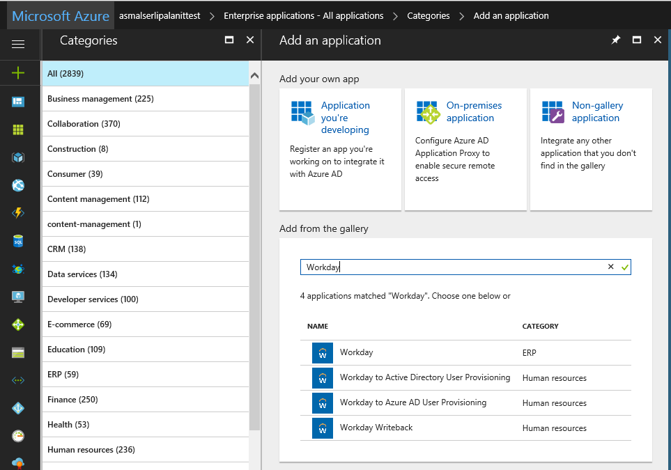
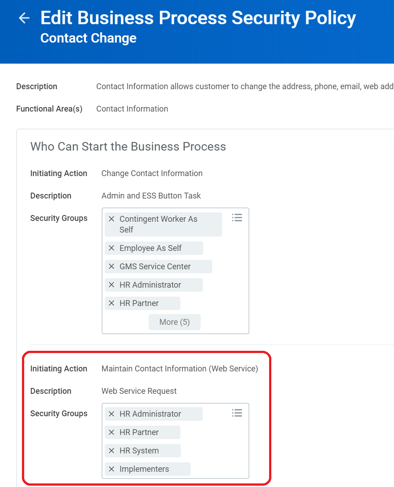
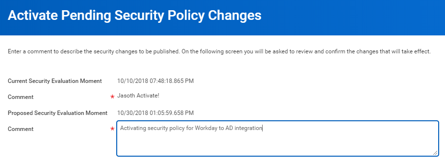

# Tutorial: Configure Workday for automatic user provisioning (preview)

The objective of this tutorial is to show you the steps you need to perform to import worker profiles from Workday into both Active Directory and Azure Active Directory, with optional write-back of email address to Workday.

## Overview

The [Azure Active Directory user provisioning service](../manage-apps/user-provisioning.md) integrates with the [Workday Human Resources API](https://community.workday.com/sites/default/files/file-hosting/productionapi/Human_Resources/v21.1/Get_Workers.html) in order to provision user accounts. Azure AD uses this connection to enable the following user provisioning workflows:

* **Provisioning users to Active Directory** - Synchronize selected sets of users from Workday into one or more Active Directory domains.

* **Provisioning cloud-only users to Azure Active Directory** - In scenarios where on-premises Active Directory is not used, users can be provisioned directly from Workday to Azure Active Directory using the Azure AD user provisioning service. 

* **Writeback of email addresses to Workday** - The Azure AD user provisioning service can write the email addresses of Azure AD users  back to Workday. 

### What human resources scenarios does it cover?

The Workday user provisioning workflows supported by the Azure AD user provisioning service enable automation of the following human resources and identity lifecycle management scenarios:

* **Hiring new employees** - When a new employee is added to Workday, a user account is automatically created in Active Directory, Azure Active Directory, and optionally Office 365 and [other SaaS applications supported by Azure AD](../manage-apps/user-provisioning.md), with write-back of the email address to Workday.

* **Employee attribute and profile updates** - When an employee record is updated in Workday (such as their name, title, or manager), their user account will be automatically updated in Active Directory, Azure Active Directory, and optionally Office 365 and [other SaaS applications supported by Azure AD](../manage-apps/user-provisioning.md).

* **Employee terminations** - When an employee is terminated in Workday, their user account is automatically disabled in Active Directory, Azure Active Directory, and optionally Office 365 and [other SaaS applications supported by Azure AD](../manage-apps/user-provisioning.md).

* **Employee re-hires** - When an employee is rehired in Workday, their old account can be automatically reactivated or re-provisioned (depending on your preference) to Active Directory, Azure Active Directory, and optionally Office 365 and [other SaaS applications supported by Azure AD](../manage-apps/user-provisioning.md).

### Who is this user provisioning solution best suited for?

This Workday user provisioning solution is presently in public preview, and is ideally suited for:

* Organizations that desire a pre-built, cloud-based solution for Workday user provisioning

* Organizations that require direct user provisioning from Workday to Active Directory, or Azure Active Directory

* Organizations that require users to be provisioned using data obtained from the Workday HCM module (see [Get_Workers](https://community.workday.com/sites/default/files/file-hosting/productionapi/Human_Resources/v21.1/Get_Workers.html))

* Organizations that require joining, moving, and leaving users to be synced to one or more Active Directory Forests, Domains, and OUs based only on change information detected in the Workday HCM module (see [Get_Workers](https://community.workday.com/sites/default/files/file-hosting/productionapi/Human_Resources/v21.1/Get_Workers.html))

* Organizations using Office 365 for email

[!INCLUDE [GDPR-related guidance](../../../includes/gdpr-hybrid-note.md)]

## Solution Architecture

This section describes the end-to-end user provisioning solution architecture for common hybrid environments. There are two related flows:

* **Authoritative HR Data Flow – from Workday to on-premises Active Directory:** In this flow worker events (such as New Hires, Transfers, Terminations) first occur in the cloud Workday HR tenant and then the event data flows into on-premises Active Directory through Azure AD and the Provisioning Agent. Depending on the event, it may lead to create/update/enable/disable operations in AD.
* **Email Writeback Flow – from on-premises Active Directory to Workday:** Once the account creation is complete in Active Directory, it is synced with Azure AD through Azure AD Connect and email attribute sourced from Active Directory can be written back to Workday.


### End-to-end user data flow

1. The HR team performs worker transactions (Joiners/Movers/Leavers or New Hires/Transfers/Terminations) in Workday HCM
2. The Azure AD Provisioning Service runs scheduled synchronizations of identities from Workday HR and identifies changes that need to be processed for sync with on-premises Active Directory.
3. The Azure AD Provisioning Service invokes the on-premises AAD Connect Provisioning Agent with a request payload containing AD account create/update/enable/disable operations.
4. The Azure AD Connect Provisioning Agent uses a service account to add/update AD account data.
5. The Azure AD Connect / AD Sync engine runs delta sync to pull updates in AD.
6. The Active Directory updates are synced with Azure Active Directory.
7. If the Workday Writeback connector is configured, it write-backs email attribute to Workday, based on the matching attribute used.


## Planning your deployment

Before beginning your Workday integration, check the prerequisites below and read the following guidance on how to match your current Active Directory architecture and user provisioning requirements with the solution(s) provided by Azure Active Directory.

### Prerequisites

The scenario outlined in this tutorial assumes that you already have the following items:

* A valid Azure AD Premium P1 subscription with global administrator access
* A Workday implementation tenant for testing and integration purposes
* Administrator permissions in Workday to create a system integration user, and make changes to test employee data for testing purposes
* For user provisioning to Active Directory, a server running Windows Server 2012 or greater with .NET 4.7+ runtime is required to host the [on-premises provisioning agent](https://go.microsoft.com/fwlink/?linkid=847801)
* [Azure AD Connect](../hybrid/whatis-hybrid-identity.md) for synchronizing between Active Directory and Azure AD

### Planning considerations

Azure AD provides a rich set of provisioning connectors to help you solve provisioning and identity life cycle management from Workday to Active Directory, Azure AD, SaaS apps, and beyond. Which features you will use and how you set up the solution will vary depending on your organization's environment and requirements. As a first step, take stock of how many of the following are present and deployed in your organization:

* How many Active Directory Forests are in use?
* How many Active Directory Domains are in use?
* How many Active Directory Organizational Units (OUs) are in use?
* How many Azure Active Directory tenants are in use?
* Are there users who need to be provisioned to both Active Directory and Azure Active Directory (for example "hybrid" users)?
* Are there users who need to be provisioned to Azure Active Directory, but not Active Directory (for example "cloud-only" users)?
* Do user email addresses need to be written back to Workday?

Once you have answers to these questions, you can plan your Workday provisioning deployment by following the guidance below.

#### Planning deployment of AAD Connect Provisioning Agent

The Workday to AD User Provisioning solution requires deploying one or more Provisioning Agents on servers running Windows 2012 R2 or greater with minimum of 4 GB RAM and .NET 4.7+ runtime. The following considerations must be taken into account before installing the Provisioning Agent:

* Ensure that the host server running the Provisioning Agent has network access to the target AD domain
* The Provisioning Agent Configuration Wizard registers the agent with your Azure AD tenant and the registration process requires access to *.msappproxy.net at port 8082. Ensure that outbound firewall rules are in place that enable this communication.
* The Provisioning Agent uses a service account to communicate with the on-premises AD domain(s). Prior to installation of the agent, it is recommended that you create a service account with User properties Read/Write permissions and a password that does not expire.  
* During the Provisioning Agent configuration, you can select domain controllers that should handle provisioning requests. If you have several geographically distributed domain controllers, install the Provisioning Agent in the same site as your preferred domain controller(s) to improve the reliability and performance of the end-to-end solution
* For high availability, you can deploy more than one Provisioning Agent and register it to handle the same set of on-premises AD domains.

> [!IMPORTANT]
> In production environments, Microsoft recommends that you have a minimum of 3 Provisioning Agents configured with your Azure AD tenant for high availability.

#### Selecting provisioning connector apps to deploy

When integrating Workday and Active Directory, there are multiple source and target systems to be considered:

| Source System | Target System | Notes |
| ---------- | ---------- | ---------- |
| Workday | Active Directory Domain | Each domain is treated as a distinct target system |
| Workday | Azure AD tenant | As required for cloud-only users |
| Active Directory Forest | Azure AD tenant | This flow is handled by AAD Connect today |
| Azure AD tenant | Workday | For write-back of email addresses |

To facilitate provisioning workflows between Workday and Active Directory, Azure AD provides multiple provisioning connector apps that you can add from the Azure AD app gallery:



* **Workday to Active Directory Provisioning** - This app facilitates user account provisioning from Workday to a single Active Directory domain. If you have multiple domains, you can add one instance of this app from the Azure AD app gallery for each Active Directory domain you need to provision to.

* **Workday to Azure AD Provisioning** - While AAD Connect is the tool that should be used to synchronize Active Directory users to Azure Active Directory, this app can be used to facilitate provisioning of cloud-only users from Workday to a single Azure Active Directory tenant.

* **Workday Writeback** - This app facilitates write-back of user's email addresses from Azure Active Directory to Workday.

> [!TIP]
> The regular "Workday" app is used for setting up single sign-on between Workday and Azure Active Directory. 

#### Determine Workday to AD User Attribute Mapping and Transformations

Before configuring user provisioning to an Active Directory domain, consider the following questions. The answers to these questions will determine how your scoping filters and attribute mappings need to be set.

* **What users in Workday need to be provisioned to this Active Directory forest?**

   * *Example: Users where the Workday "Company" attribute contains the value "Contoso", and the "Worker_Type" attribute contains "Regular"*

* **How are users routed into different organization units (OUs)?**

   * *Example: Users are routed to OUs that correspond to an office location, as defined in the Workday "Municipality" and "Country_Region_Reference" attributes*

* **How should the following attributes be populated in the Active Directory?**

   * Common Name (cn)
      * *Example: Use the Workday User_ID value, as set by human resources*
	  
   * Employee ID (employeeId)
      * *Example: Use the Workday Worker_ID value*
	  
   * SAM Account Name (sAMAccountName)
      * *Example: Use the Workday User_ID value, filtered through an Azure AD provisioning expression to remove illegal characters*
	  
   * User Principal Name (userPrincipalName)
      * *Example: Use the Workday User_ID value, with an Azure AD provisioning expression to append a domain name*

* **How should users be matched between Workday and Active Directory?**

  * *Example: Users with a specific Workday "Worker_ID" value are matched with Active Directory users where "employeeID" has the same value. If the Worker_ID value is not found in Active Directory, then create a new user.*
  
* **Does the Active Directory forest already contain the user IDs required for the matching logic to work?**

  * *Example: If this is a new Workday deployment, it is strongly recommended that Active Directory be pre-populated with the correct Workday Worker_ID values (or unique ID value of choice) to keep the matching logic as simple as possible.*


How to set up and configure these special provisioning connector apps is the subject of the remaining sections of this tutorial. Which apps you choose to configure will depend on which systems you need to provision to, and how many Active Directory Domains and Azure AD tenants are in your environment.


## Configure integration system user in Workday

A common requirement of all the Workday provisioning connectors is they require credentials for a Workday system integration account to connect to the Workday Human Resources API. This section describes how to create an integration system user in Workday.

> [!NOTE]
> It is possible to bypass this procedure and instead use a Workday global administrator account as the system integration account. This may work fine for demos, but is not recommended for production deployments.

### Create an integration system user

**To create an integration system user:**

1. Sign into your Workday tenant using an administrator account. In the **Workday Application**, enter create user in the search box, and then click **Create Integration System User**.

    
2. Complete the **Create Integration System User** task by supplying a user name and password for a new Integration System User.  
 * Leave the **Require New Password at Next Sign In** option unchecked, because this user will be logging on programmatically.
 * Leave the **Session Timeout Minutes** with its default value of 0, which will prevent the user’s sessions from timing out prematurely.
 * Select the option **Do Not Allow UI Sessions** as it provides an added layer of security that prevents a user with the password of the integration system from logging into Workday. 

    

### Create a security group
In this step, you will create an unconstrained integration system security group in Workday and assign the integration system user created in the previous step to this group.

**To create a security group:**

1. Enter create security group in the search box, and then click **Create Security Group**.

    
2. Complete the **Create Security Group** task.  
   * Select **Integration System Security Group (Unconstrained)** from the **Type of Tenanted Security Group** dropdown.

    

3. After the Security Group creation is successful, you will see a page where you can assign members to the Security Group. Add the new integration system user to this security group and select the appropriate organization scope.

 
### Configure domain security policy permissions
In this step, you'll grant "domain security" policy permissions for the worker data to the security group.

**To configure domain security policy permissions:**

1. Enter **Domain Security Configuration** in the search box, and then click on the link **Domain Security Configuration Report**.  

      
2. In the **Domain** text box, search for the following domains and add them to the filter one by one.  
   * *External Account Provisioning*
   * *Worker Data: Public Worker Reports*
   * *Person Data: Work Contact Information*
   * *Worker Data: All Positions*
   * *Worker Data: Current Staffing Information*
   * *Worker Data: Business Title on Worker Profile*
 
      

     

    Click **OK**.

3. In the report that shows up, select the ellipsis (...) that appears next to **External Account Provisioning** and click on the menu option **Domain -> Edit Security Policy Permissions**

      

4. On the **Edit Domain Security Policy Permissions** page, scroll down to the section **Integration Permissions**. Click on the "+" sign to add the integration system group to the list of security groups with **Get** and **Put** integration permissions.

      

5. Click on the "+" sign to add the integration system group to the list of security groups with **Get** and **Put** integration permissions.

      

6. Repeat steps 3-5 above for each of these remaining security policies:

   | Operation | Domain Security Policy |
   | ---------- | ---------- | 
   | Get and Put | Worker Data: Public Worker Reports |
   | Get and Put | Person Data: Work Contact Information |
   | Get | Worker Data: All Positions |
   | Get | Worker Data: Current Staffing Information |
   | Get | Worker Data: Business Title on Worker Profile |

### Configure business process security policy permissions
In this step, you'll grant "business process security" policy permissions for the worker data to the security group. This is required for setting up the Workday Writeback app connector. 

**To configure business process security policy permissions:**

1. Enter **Business Process Policy** in the search box, and then click on the link **Edit Business Process Security Policy** task.  

      

2. In the **Business Process Type** textbox, search for *Contact* and select **Contact Change** business process and click **OK**.

      

3. On the **Edit Business Process Security Policy** page, scroll to the **Maintain Contact Information (Web Service)** section.

      

4. Select and add the new integration system security group to the list of security groups that can initiate the web services request. Click on **Done**. 

      

 
### Activate security policy changes

**To activate security policy changes:**

1. Enter activate in the search box, and then click on the link **Activate Pending Security Policy Changes**.

     
2. Begin the Activate Pending Security Policy Changes task by entering a comment for auditing purposes, and then click **OK**. 

      
1. Complete the task on the next screen by checking the checkbox **Confirm**, and then click **OK**.

      

## Configuring user provisioning from Workday to Active Directory

Follow these instructions to configure user account provisioning from Workday to each Active Directory domain within the scope of your integration.

### Part 1: Install and configure on-premises Provisioning Agent(s)

To provision to Active Directory on-premises, an agent must be installed on a server that has .NET 4.7+ Framework and network access to the desired Active Directory domain(s).

> [!TIP]
> You can check the version of the .NET framework on your server using the instructions provided [here](https://docs.microsoft.com/dotnet/framework/migration-guide/how-to-determine-which-versions-are-installed).
> If the server does not have .NET 4.7 or higher installed, you can download it from [here](https://support.microsoft.com/help/3186497/the-net-framework-4-7-offline-installer-for-windows).  

Once you have deployed .NET 4.7+, you can download the **[on-premises provisioning agent here](https://go.microsoft.com/fwlink/?linkid=847801)** and follow the steps given below to complete the agent configuration.

1. Login to the Windows Server where you want to install the new agent.
2. Launch the Provisioning Agent installer, agree to the terms and click on the **Install** button.


3. After installation is complete, the wizard will launch and you will see the **Connect Azure AD** screen. Click on the **Authenticate** button to connect to your Azure AD instance.


4. Authenticate to your Azure AD instance using Global Admin Credentials. 


5. After successful authentication with Azure AD, you will see the **Connect Active Directory** screen. In this step, please enter your AD domain name and click on the **Add Directory** button.


6. You will now be prompted to enter the credentials required to connect to the AD Domain. On the same screen, you can use the **Select domain controller priority** to specify domain controllers that the agent should use for sending provisioning requests.


7. After configuring the domain, the installer displays a list of configured domains. On this screen, you can repeat step #5 and #6 to add more domains or click on **Next** to proceed to agent registration. 


   > [!NOTE]
   > If you have multiple AD domains (e.g. na.contoso.com, emea.contoso.com), then please add each domain individually to the list. Only adding the parent domain (e.g. contoso.com) is not sufficient and it is recommended that you register each child domain with the agent. 

8. Review the configuration details and click on **Confirm** to register the agent. 


9. The configuration wizard displays the progress of the agent registration.


10. Once the agent registration is successful, you can click on **Exit** to exit the Wizard. 


11. Verify the installation of the Agent and make sure it is running by opening the “Services” Snap-In and look for the Service named “Microsoft Azure AD Connect Provisioning Agent”
  


**Agent troubleshooting**

The [Windows Event Log](https://technet.microsoft.com/library/cc722404(v=ws.11).aspx) on the Windows Server machine hosting the agent contains events for all operations performed by the agent. To view these events:
	
1. Open **Eventvwr.msc**.
2. Select **Windows Logs > Application**.
3. View all events logged under the source **AAD.Connect.ProvisioningAgent**. 
4. Check for errors and warnings.

	
### Part 2: Adding the provisioning connector app and creating the connection to Workday

**To configure Workday to Active Directory provisioning:**

1.  Go to <https://portal.azure.com>

2.  In the left navigation bar, select **Azure Active Directory**

3.  Select **Enterprise Applications**, then **All Applications**.

4.  Select **Add an application**, and select the **All** category.

5.  Search for **Workday Provisioning to Active Directory**, and add that app from the gallery.

6.  After the app is added and the app details screen is shown, select **Provisioning**

7.  Change the **Provisioning** **Mode** to **Automatic**

8.  Complete the **Admin Credentials** section as follows:

   * **Admin Username** – Enter the username of the Workday
        integration system account, with the tenant domain name
        appended. **Should look something like: username@contoso4**

   * **Admin password –** Enter the password of the Workday
        integration system account

   * **Tenant URL –** Enter the URL to the Workday web services
        endpoint for your tenant. This should look like:
        https://wd3-impl-services1.workday.com/ccx/service/contoso4/Human_Resources,
        where contoso4 is replaced with your correct tenant name and
        wd3-impl is replaced with the correct environment string.

   * **Active Directory Forest -** The “Name” of your Active
        Directory domain, as registered with the agent. This is typically a string like: *contoso.com*

   * **Active Directory Container -** Enter the container DN where the agent should create user accounts by default. 
        Example: *OU=Standard Users,OU=Users,DC=contoso,DC=test*
> [!NOTE]
> This setting only comes into play for user account creations if the *parentDistinguishedName* attribute is not configured in the attribute mappings. This setting is not used for user search or update operations. The entire domain sub tree falls in the scope of the search operation.
   * **Notification Email –** Enter your email address, and check the
        “send email if failure occurs” checkbox.
> [!NOTE]
> The Azure AD Provisioning Service sends email notification if the provisioning job goes into a [quarantine](https://docs.microsoft.com/azure/active-directory/manage-apps/user-provisioning#quarantine) state.

   * Click the **Test Connection** button. If the connection test succeeds, click the **Save** button at
        the top. If it fails, double-check that the Workday credentials and the AD credentials configured on the agent setup are valid.


### Part 2: Configure attribute mappings 

In this section, you will configure how user data flows from Workday to
Active Directory.

1.  On the Provisioning tab under **Mappings**, click **Synchronize
    Workday Workers to OnPremises**.

2.  In the **Source Object Scope** field, you can select which sets of
    users in Workday should be in scope for provisioning to AD, by
    defining a set of attribute-based filters. The default scope is “all
    users in Workday”. Example filters:

   * Example: Scope to users with Worker IDs between 1000000 and
        2000000

      * Attribute: WorkerID

      * Operator: REGEX Match

      * Value: (1[0-9][0-9][0-9][0-9][0-9][0-9])

   * Example: Only employees and not contingent workers 

      * Attribute: EmployeeID

      * Operator: IS NOT NULL

3.  In the **Target Object Actions** field, you can globally filter what
    actions are allowed to be performed on Active Directory. **Create**
    and **Update** are most common.

4.  In the **Attribute mappings** section, you can define how individual
    Workday attributes map to Active Directory attributes.

5. Click on an existing attribute mapping to update it, or click **Add new mapping** at the bottom of the screen to add new
        mappings. An individual attribute mapping supports these properties:

      * **Mapping Type**

         * **Direct** – Writes the value of the Workday attribute
                to the AD attribute, with no changes

         * **Constant** - Write a static, constant string value to
                the AD attribute

         * **Expression** – Allows you to write a custom value to
                the AD attribute, based on one or more Workday
                attributes. [For more info, see this article on
                expressions](../manage-apps/functions-for-customizing-application-data.md).

      * **Source attribute** - The user attribute from Workday. If the attribute you are looking for is not present, see [Customizing the list of Workday user attributes](#customizing-the-list-of-workday-user-attributes).

      * **Default value** – Optional. If the source attribute has
            an empty value, the mapping will write this value instead.
            Most common configuration is to leave this blank.

      * **Target attribute** – The user attribute in Active
            Directory.

      * **Match objects using this attribute** – Whether or not this
            mapping should be used to uniquely identify users between
            Workday and Active Directory. This is typically set on the
            Worker ID field for Workday, which is typically mapped to
            one of the Employee ID attributes in Active Directory.

      * **Matching precedence** – Multiple matching attributes can
            be set. When there are multiple, they are evaluated in the
            order defined by this field. As soon as a match is found, no
            further matching attributes are evaluated.

      * **Apply this mapping**
       
         * **Always** – Apply this mapping on both user creation
                and update actions

         * **Only during creation** - Apply this mapping only on
                user creation actions

6. To save your mappings, click **Save** at the top of the
        Attribute-Mapping section.


**Below are some example attribute mappings between Workday and Active
Directory, with some common expressions**

-   The expression that maps to the parentDistinguishedName attribute
    is used to provision a users to different OUs based on one or
    more Workday source attributes. This example here places users in
    different OUs based on what city they are in.

-   The userPrincipalName attribute in Active Directory is generated by concatenating the Workday user ID with a domain suffix

-   [There is documentation on writing expressions here](../manage-apps/functions-for-customizing-application-data.md). This includes examples on how to remove special characters.

  
| WORKDAY ATTRIBUTE | ACTIVE DIRECTORY ATTRIBUTE |  MATCHING ID? | CREATE / UPDATE |
| ---------- | ---------- | ---------- | ---------- |
| **WorkerID**  |  EmployeeID | **Yes** | Written on create only |
| **UserID**    |  cn    |   |   Written on create only |
| **Join("@", [UserID], "contoso.com")**   | userPrincipalName     |     | Written on create only 
| **Replace(Mid(Replace(\[UserID\], , "(\[\\\\/\\\\\\\\\\\\\[\\\\\]\\\\:\\\\;\\\\|\\\\=\\\\,\\\\+\\\\\*\\\\?\\\\&lt;\\\\&gt;\])", , "", , ), 1, 20), , "([\\\\.)\*\$](file:///\\.)*$)", , "", , )**      |    sAMAccountName            |     |         Written on create only |
| **Switch(\[Active\], , "0", "True", "1", "False")** |  accountDisabled      |     | Create + update |
| **FirstName**   | givenName       |     |    Create + update |
| **LastName**   |   sn   |     |  Create + update |
| **PreferredNameData**  |  displayName |     |   Create + update |
| **Company**         | company   |     |  Create + update |
| **SupervisoryOrganization**  | department  |     |  Create + update |
| **ManagerReference**   | manager  |     |  Create + update |
| **BusinessTitle**   |  title     |     |  Create + update | 
| **AddressLineData**    |  streetAddress  |     |   Create + update |
| **Municipality**   |   l   |     | Create + update |
| **CountryReferenceTwoLetter**      |   co |     |   Create + update |
| **CountryReferenceTwoLetter**    |  c  |     |         Create + update |
| **CountryRegionReference** |  st     |     | Create + update |
| **WorkSpaceReference** | physicalDeliveryOfficeName    |     |  Create + update |
| **PostalCode**  |   postalCode  |     | Create + update |
| **PrimaryWorkTelephone**  |  telephoneNumber   |     | Create + update |
| **Fax**      | facsimileTelephoneNumber     |     |    Create + update |
| **Mobile**  |    mobile       |     |       Create + update |
| **LocalReference** |  preferredLanguage  |     |  Create + update |                                               
| **Switch(\[Municipality\], "OU=Standard Users,OU=Users,OU=Default,OU=Locations,DC=contoso,DC=com", "Dallas", "OU=Standard Users,OU=Users,OU=Dallas,OU=Locations,DC=contoso,DC=com", "Austin", "OU=Standard Users,OU=Users,OU=Austin,OU=Locations,DC=contoso,DC=com", "Seattle", "OU=Standard Users,OU=Users,OU=Seattle,OU=Locations,DC=contoso,DC=com", “London", "OU=Standard Users,OU=Users,OU=London,OU=Locations,DC=contoso,DC=com")**  | parentDistinguishedName     |     |  Create + update |
  


### Part 4: Start the service
Once parts 1-3 have been completed, you can start the provisioning service back in the Azure portal.

1.  In the **Provisioning** tab, set the **Provisioning Status** to **On**.

2. Click **Save**.

3. This will start the initial sync, which can take a variable number of hours depending on how many users are in Workday.

4. At any time, check the **Audit logs** tab in the Azure portal to see what actions the provisioning service has performed. The audit logs lists all individual sync events performed by the provisioning service, such as which users are being read out of Workday and then subsequently added or updated to Active Directory. **[See the provisioning reporting guide for detailed instructions on how to read the audit logs](../manage-apps/check-status-user-account-provisioning.md)**

1.  Check the [Windows Event Log](https://technet.microsoft.com/library/cc722404(v=ws.11).aspx) on the Windows Server machine hosting the agent for any new errors or warnings. These events are viewable by launching **Eventvwr.msc** on the server and selecting **Windows Logs > Application**. All provisioning-related messages are logged under the source **AADSyncAgent**.

6. One completed, it will write an audit summary report in the
    **Provisioning** tab, as shown below.


## Configuring user provisioning to Azure Active Directory
How you configure provisioning to Azure Active Directory will depend on your provisioning requirements, as detailed in the table below.

| Scenario | Solution |
| -------- | -------- |
| **Users need to be provisioned to Active Directory and Azure AD** | Use **[AAD Connect](../hybrid/whatis-hybrid-identity.md)** |
| **Users need to be provisioned to Active Directory only** | Use **[AAD Connect](../hybrid/whatis-hybrid-identity.md)** |
| **Users need to be provisioned to Azure AD only (cloud only)** | Use the **Workday to Azure Active Directory provisioning** app in the app gallery |

For instructions on setting up Azure AD Connect, see the [Azure AD Connect documentation](../hybrid/whatis-hybrid-identity.md).

The following sections describe setting up a connection between Workday and Azure AD to provision cloud-only users.

> [!IMPORTANT]
> Only follow the procedure below if you have cloud-only users that need to be provisioned to Azure AD and not on-premises Active Directory.

### Part 1: Adding the Azure AD provisioning connector app and creating the connection to Workday

**To configure Workday to Azure Active Directory provisioning for cloud-only users:**

1.  Go to <https://portal.azure.com>.

2.  In the left navigation bar, select **Azure Active Directory**

3.  Select **Enterprise Applications**, then **All Applications**.

4.  Select **Add an application**, and then select the **All** category.

5.  Search for **Workday to Azure AD provisioning**, and add that app from the gallery.

6.  After the app is added and the app details screen is shown, select **Provisioning**

7.  Change the **Provisioning** **Mode** to **Automatic**

8.  Complete the **Admin Credentials** section as follows:

   * **Admin Username** – Enter the username of the Workday
        integration system account, with the tenant domain name
        appended. Should look something like: username@contoso4

   * **Admin password –** Enter the password of the Workday
        integration system account

   * **Tenant URL –** Enter the URL to the Workday web services
        endpoint for your tenant. This should look like:
        https://wd3-impl-services1.workday.com/ccx/service/contoso4/Human_Resources,
        where contoso4 is replaced with your correct tenant name and
        wd3-impl is replaced with the correct environment string. If this URL is not known, please work with your Workday integration partner or support representative to determine the correct URL to use.

   * **Notification Email –** Enter your email address, and check the
        “send email if failure occurs” checkbox.

   * Click the **Test Connection** button.

   * If the connection test succeeds, click the **Save** button at
        the top. If it fails, double-check that the Workday URL and credentials are valid
        in Workday.

### Part 2: Configure attribute mappings 

In this section, you will configure how user data flows from Workday to
Azure Active Directory for cloud-only users.

1. On the Provisioning tab under **Mappings**, click **Synchronize
    Workers to Azure AD**.

2. In the **Source Object Scope** field, you can select which sets of
    users in Workday should be in scope for provisioning to Azure AD, by
    defining a set of attribute-based filters. The default scope is “all
    users in Workday”. Example filters:

   * Example: Scope to users with Worker IDs between 1000000 and
        2000000

      * Attribute: WorkerID

      * Operator: REGEX Match

      * Value: (1[0-9][0-9][0-9][0-9][0-9][0-9])

   * Example: Only contingent workers and not regular employees

      * Attribute: ContingentID

      * Operator: IS NOT NULL

3. In the **Target Object Actions** field, you can globally filter what
    actions are allowed to be performed on Azure AD. **Create**
    and **Update** are most common.

4. In the **Attribute mappings** section, you can define how individual
    Workday attributes map to Active Directory attributes.

5. Click on an existing attribute mapping to update it, or click **Add new mapping** at the bottom of the screen to add new
        mappings. An individual attribute mapping supports these properties:

   * **Mapping Type**

      * **Direct** – Writes the value of the Workday attribute
                to the AD attribute, with no changes

      * **Constant** - Write a static, constant string value to
                the AD attribute

      * **Expression** – Allows you to write a custom value to
                the AD attribute, based on one or more Workday
                attributes. [For more info, see this article on
                expressions](../manage-apps/functions-for-customizing-application-data.md).

   * **Source attribute** - The user attribute from Workday. If the attribute you are looking for is not present, see [Customizing the list of Workday user attributes](#customizing-the-list-of-workday-user-attributes).

   * **Default value** – Optional. If the source attribute has
            an empty value, the mapping will write this value instead.
            Most common configuration is to leave this blank.

   * **Target attribute** – The user attribute in Azure AD.

   * **Match objects using this attribute** – Whether or not this
            mapping should be used to uniquely identify users between
            Workday and Azure AD. This is typically set on the
            Worker ID field for Workday, which is typically mapped to
            the Employee ID attribute (new) or an extension attribute in Azure AD.

   * **Matching precedence** – Multiple matching attributes can
            be set. When there are multiple, they are evaluated in the
            order defined by this field. As soon as a match is found, no
            further matching attributes are evaluated.

   * **Apply this mapping**

     * **Always** – Apply this mapping on both user creation
                and update actions

     * **Only during creation** - Apply this mapping only on
                user creation actions

6. To save your mappings, click **Save** at the top of the
        Attribute-Mapping section.

### Part 3: Start the service
Once parts 1-2 have been completed, you can start the provisioning service.

1. In the **Provisioning** tab, set the **Provisioning Status** to
    **On**.

2. Click **Save**.

3. This will start the initial sync, which can take a variable number
    of hours depending on how many users are in Workday.

4. Individual sync events can be viewed in the **Audit Logs** tab. **[See the provisioning reporting guide for detailed instructions on how to read the audit logs](../manage-apps/check-status-user-account-provisioning.md)**

5. One completed, it will write an audit summary report in the
    **Provisioning** tab, as shown below.

## Configuring writeback of email addresses to Workday
Follow these instructions to configure writeback of user email addresses from Azure Active Directory to Workday.

### Part 1: Adding the provisioning connector app and creating the connection to Workday

**To configure Workday Writeback connector:**

1. Go to <https://portal.azure.com>

2. In the left navigation bar, select **Azure Active Directory**

3. Select **Enterprise Applications**, then **All Applications**.

4. Select **Add an application**, then select the **All** category.

5. Search for **Workday Writeback**, and add that app from the gallery.

6. After the app is added and the app details screen is shown, select **Provisioning**

7. Change the **Provisioning** **Mode** to **Automatic**

8. Complete the **Admin Credentials** section as follows:

   * **Admin Username** – Enter the username of the Workday
        integration system account, with the tenant domain name
        appended. Should look something like: username@contoso4

   * **Admin password –** Enter the password of the Workday
        integration system account

   * **Tenant URL –** Enter the URL to the Workday web services
        endpoint for your tenant. This should look like:
        https://wd3-impl-services1.workday.com/ccx/service/contoso4/Human_Resources,
        where contoso4 is replaced with your correct tenant name and
        wd3-impl is replaced with the correct environment string (if
        necessary).

   * **Notification Email –** Enter your email address, and check the
        “send email if failure occurs” checkbox.

   * Click the **Test Connection** button. If the connection test succeeds, click the **Save** button at
        the top. If it fails, double-check that the Workday URL and credentials are valid
        in Workday.

### Part 2: Configure attribute mappings 

In this section, you will configure how user data flows from Workday to
Active Directory.

1. On the Provisioning tab under **Mappings**, click **Synchronize
    Azure AD Users to Workday**.

2. In the **Source Object Scope** field, you can optionally filter which sets of
    users in Azure Active Directory should have their email addresses written back to Workday. The default scope is “all
    users in Azure AD”. 

3. In the **Attribute mappings** section, update the matching ID to indicate the attribute in Azure Active Directory where the Workday worker ID or employee ID is stored. A popular matching method is to synchronize the Workday worker ID or employee ID to extensionAttribute1-15 in Azure AD, and then use this attribute in Azure AD to match users back in Workday. 

4. To save your mappings, click **Save** at the top of the Attribute-Mapping section.

### Part 3: Start the service
Once parts 1-2 have been completed, you can start the provisioning service.

1. In the **Provisioning** tab, set the **Provisioning Status** to
    **On**.

2. Click **Save**.

3. This will start the initial sync, which can take a variable number
    of hours depending on how many users are in Workday.

4. Individual sync events can be viewed in the **Audit Logs** tab. **[See the provisioning reporting guide for detailed instructions on how to read the audit logs](../manage-apps/check-status-user-account-provisioning.md)**

5. One completed, it will write an audit summary report in the
    **Provisioning** tab, as shown below.

## Customizing the list of Workday user attributes
The Workday provisioning apps for Active Directory and Azure AD both include a default list of Workday user attributes you can select from. However, these lists are not comprehensive. Workday supports many hundreds of possible user attributes, which can either be standard or unique to your Workday tenant. 

The Azure AD provisioning service supports the ability to customize your list or Workday attribute to include any attributes exposed in the [Get_Workers](https://community.workday.com/sites/default/files/file-hosting/productionapi/Human_Resources/v21.1/Get_Workers.html) operation of the Human Resources API.

To do this, you must use [Workday Studio](https://community.workday.com/studio-download) to extract the XPath expressions that represent the attributes you wish to use, and then add them to your provisioning configuration using the advanced attribute editor in the Azure portal.

**To retrieve an XPath expression for a Workday user attribute:**

1. Download and install [Workday Studio](https://community.workday.com/studio-download). You will need a Workday community account to access the installer.

2. Download the Workday Human_Resources WDSL file from this URL: https://community.workday.com/sites/default/files/file-hosting/productionapi/Human_Resources/v21.1/Human_Resources.wsdl

3. Launch Workday Studio.

4. From the command bar, select the  **Workday > Test Web Service in Tester** option.

5. Select **External**, and select the Human_Resources WSDL file you downloaded in step 2.

    

6. Set the **Location** field to `https://IMPL-CC.workday.com/ccx/service/TENANT/Human_Resources`, but replacing "IMPL-CC" with your actual instance type, and "TENANT" with your real tenant name.

7. Set **Operation** to **Get_Workers**

8.	Click the small **configure** link below the Request/Response panes to set your Workday credentials. Check **Authentication**, and then enter the user name and password for your Workday integration system account. Be sure to format the user name as name@tenant, and leave the **WS-Security UsernameToken** option selected.

    

9. Select **OK**.

10.	The **Request** pane, paste in the XML below and set **Employee_ID** to the employee ID of a real user in your Workday tenant. Select a user that has the attribute populated that you wish to extract.

    ```
    <?xml version="1.0" encoding="UTF-8"?>
    <env:Envelope xmlns:env="http://schemas.xmlsoap.org/soap/envelope/" xmlns:xsd="https://www.w3.org/2001/XMLSchema">
      <env:Body>
        <wd:Get_Workers_Request xmlns:wd="urn:com.workday/bsvc" wd:version="v21.1">
          <wd:Request_References wd:Skip_Non_Existing_Instances="true">
            <wd:Worker_Reference>
              <wd:ID wd:type="Employee_ID">21008</wd:ID>
            </wd:Worker_Reference>
          </wd:Request_References>
		  <wd:Response_Group>
            <wd:Include_Reference>true</wd:Include_Reference>
            <wd:Include_Personal_Information>true</wd:Include_Personal_Information>
            <wd:Include_Employment_Information>true</wd:Include_Employment_Information>
            <wd:Include_Management_Chain_Data>true</wd:Include_Management_Chain_Data>
            <wd:Include_Organizations>true</wd:Include_Organizations>
            <wd:Include_Reference>true</wd:Include_Reference>
            <wd:Include_Transaction_Log_Data>true</wd:Include_Transaction_Log_Data>
            <wd:Include_Photo>true</wd:Include_Photo>
            <wd:Include_User_Account>true</wd:Include_User_Account>
			<wd:Include_Roles>true</wd:Include_Roles>
          </wd:Response_Group>
        </wd:Get_Workers_Request>
      </env:Body>
    </env:Envelope>
    ```
 
11. Click the **Send Request** (green arrow) to execute the command. If successful, the response should appear in the **Response** pane. Check the response to ensure it has the data of the user ID you entered, and not an error.

12. If successful, copy the XML from the **Response** pane and save it as an XML file.

13. In the command bar of Workday Studio, select **File > Open File...** and open the XML file you saved. This opens it in the Workday Studio XML editor.

    

14. In the file tree, navigate through **/env: Envelope > env: Body > wd:Get_Workers_Response > wd:Response_Data > wd: Worker** to find your user's data. 

15. Under **wd: Worker**, find the attribute that you wish to add, and select it.

16. Copy the XPath expression for your selected attribute out of the **Document Path** field.

1. Remove the **/env:Envelope/env:Body/wd:Get_Workers_Response/wd:Response_Data/** prefix from the copied expression.

18. If the last item in the copied expression is a node (example: "/wd: Birth_Date"), then append **/text()** at the end of the expression. This is not necessary if the last item is an attribute (example: "/@wd: type").

19. The result should be something like `wd:Worker/wd:Worker_Data/wd:Personal_Data/wd:Birth_Date/text()`. This is what you will copy into the Azure portal.


**To add your custom Workday user attribute to your provisioning configuration:**

1. Launch the [Azure portal](https://portal.azure.com), and navigate to the Provisioning section of your Workday provisioning application, as described earlier in this tutorial.

2. Set **Provisioning Status** to **Off**, and select **Save**. This will help ensure your changes will take effect only when you are ready.

3. Under **Mappings**, select **Synchronize Workers to OnPremises** (or **Synchronize Workers to Azure AD**).

4. Scroll to the bottom of the next screen, and select **Show advanced options**.

5. Select **Edit attribute list for Workday**.

    

6. Scroll to the bottom of the attribute list to where the input fields are.

7. For **Name**, enter a display name for your attribute.

8. For **Type**, select type that appropriately corresponds to your attribute (**String** is most common).

9. For **API Expression**, enter the XPath expression you copied from Workday Studio. Example: `wd:Worker/wd:Worker_Data/wd:Personal_Data/wd:Birth_Date/text()`

10. Select **Add Attribute**.

    

11. Select **Save** above, and then **Yes** to the dialog. Close the Attribute-Mapping screen if it is still open.

12. Back on the main **Provisioning** tab, select **Synchronize Workers to OnPremises** (or **Synchronize Workers to Azure AD**) again.

13. Select **Add new mapping**.

14. Your new attribute should now appear in the **Source attribute** list.

15. Add a mapping for your new attribute as desired.

16. When finished, remember to set **Provisioning Status** back to **On** and save.

## Known issues

* Writing data to the thumbnailPhoto user attribute in on-premises Active Directory is not currently supported.

* The "Workday to Azure AD" connector is not currently supported on Azure AD tenants where AAD Connect is enabled.  

## Managing personal data

The Workday provisioning solution for Active Directory requires a synchronization agent to be installed on a domain-joined server, and this agent creates logs in the Windows Event log which can contain personally-identifiable information.

## Next steps

* [Learn how to review logs and get reports on provisioning activity](../manage-apps/check-status-user-account-provisioning.md)
* [Learn how to configure single sign-on between Workday and Azure Active Directory](workday-tutorial.md)
* [Learn how to integrate other SaaS applications with Azure Active Directory](tutorial-list.md)

