# Tutorial: Configure Workday for automatic user provisioning

The objective of this tutorial is to show the steps you need to perform to provision worker profiles from Workday into on-premises Active Directory (AD).

>[!NOTE]
>Use this tutorial, if the users you want to provision from Workday need an on-premises AD account and an Azure AD account. 
>* If the users from Workday only need Azure AD account (cloud-only users), then please refer to the tutorial on [configure Workday to Azure AD](workday-inbound-cloud-only-tutorial.md) user provisioning. 
>* To configure writeback of attributes such as email address, username and phone number from Azure AD to Workday, please refer to the tutorial on [configure Workday writeback](workday-writeback-tutorial.md).


## Overview

The [Azure Active Directory user provisioning service](../app-provisioning/user-provisioning.md) integrates with the [Workday Human Resources API](https://community.workday.com/sites/default/files/file-hosting/productionapi/Human_Resources/v21.1/Get_Workers.html) in order to provision user accounts. The Workday user provisioning workflows supported by the Azure AD user provisioning service enable automation of the following human resources and identity lifecycle management scenarios:

* **Hiring new employees** - When a new employee is added to Workday, a user account is automatically created in Active Directory, Azure Active Directory, and optionally Office 365 and [other SaaS applications supported by Azure AD](../app-provisioning/user-provisioning.md), with write-back of IT-managed contact information to Workday.

* **Employee attribute and profile updates** - When an employee record is updated in Workday (such as their name, title, or manager), their user account will be automatically updated in Active Directory, Azure Active Directory, and optionally Office 365 and [other SaaS applications supported by Azure AD](../app-provisioning/user-provisioning.md).

* **Employee terminations** - When an employee is terminated in Workday, their user account is automatically disabled in Active Directory, Azure Active Directory, and optionally Office 365 and [other SaaS applications supported by Azure AD](../app-provisioning/user-provisioning.md).

* **Employee rehires** - When an employee is rehired in Workday, their old account can be automatically reactivated or re-provisioned (depending on your preference) to Active Directory, Azure Active Directory, and optionally Office 365 and [other SaaS applications supported by Azure AD](../app-provisioning/user-provisioning.md).

### What's new
This section captures recent Workday integration enhancements. For a list of comprehensive updates, planned changes and archives, please visit the page [What's new in Azure Active Directory?](../fundamentals/whats-new.md) 

* **May 2020 - Ability to writeback phone numbers to Workday:** In addition to email and username, you can now writeback work phone number and mobile phone number from Azure AD to Workday. For more details, refer to the [writeback app tutorial](workday-writeback-tutorial.md).

* **April 2020 - Support for the latest version of Workday Web Services (WWS) API:** Twice a year in March and September, Workday delivers feature-rich updates that help you meet your business goals and changing workforce demands. To keep up with the new features delivered by Workday you can now directly specify the WWS API version that you would like to use in the connection URL. For details on how to specify the Workday API version, refer to the section on [configuring Workday connectivity](#part-3-in-the-provisioning-app-configure-connectivity-to-workday-and-active-directory). 

* **Jan 2020 - Ability to set AD accountExpires attribute:** Using the function [NumFromDate](../app-provisioning/functions-for-customizing-application-data.md#numfromdate) you can now map Workday date fields such as *EndContractDate* or *StatusTerminationDate*. 

### Who is this user provisioning solution best suited for?

This Workday user provisioning solution is ideally suited for:

* Organizations that desire a pre-built, cloud-based solution for Workday user provisioning

* Organizations that require direct user provisioning from Workday to Active Directory, or Azure Active Directory

* Organizations that require users to be provisioned using data obtained from the Workday HCM module (see [Get_Workers](https://community.workday.com/sites/default/files/file-hosting/productionapi/Human_Resources/v21.1/Get_Workers.html))

* Organizations that require joining, moving, and leaving users to be synced to one or more Active Directory Forests, Domains, and OUs based only on change information detected in the Workday HCM module (see [Get_Workers](https://community.workday.com/sites/default/files/file-hosting/productionapi/Human_Resources/v21.1/Get_Workers.html))

* Organizations using Office 365 for email

## Solution Architecture

This section describes the end-to-end user provisioning solution architecture for common hybrid environments. There are two related flows:

* **Authoritative HR data flow – from Workday to on-premises Active Directory:** In this flow worker events (such as New Hires, Transfers, Terminations) first occur in the cloud Workday HR tenant and then the event data flows into on-premises Active Directory through Azure AD and the Provisioning Agent. Depending on the event, it may lead to create/update/enable/disable operations in AD.
* **Writeback flow – from on-premises Active Directory to Workday:** Once the account creation is complete in Active Directory, it is synced with Azure AD through Azure AD Connect and information such as email, username and phone number  can be written back to Workday.

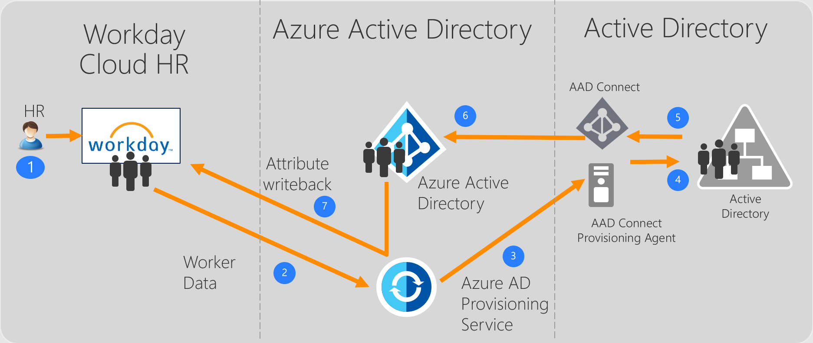

### End-to-end user data flow

1. The HR team performs worker transactions (Joiners/Movers/Leavers or New Hires/Transfers/Terminations) in Workday HCM
2. The Azure AD Provisioning Service runs scheduled synchronizations of identities from Workday HR and identifies changes that need to be processed for sync with on-premises Active Directory.
3. The Azure AD Provisioning Service invokes the on-premises Azure AD Connect Provisioning Agent with a request payload containing AD account create/update/enable/disable operations.
4. The Azure AD Connect Provisioning Agent uses a service account to add/update AD account data.
5. The Azure AD Connect / AD Sync engine runs delta sync to pull updates in AD.
6. The Active Directory updates are synced with Azure Active Directory.
7. If the [Workday Writeback](workday-writeback-tutorial.md) app is configured, it writes back attributes such as email, username and phone number to Workday.

## Planning your deployment

Configuring Workday to Active Directory user provisioning requires considerable planning covering different aspects such as:
* Setup of the Azure AD Connect provisioning agent 
* Number of Workday to AD user provisioning apps to deploy
* Selecting the the right matching identifier, attribute mapping, transformation and scoping filters

Please refer to the [cloud HR deployment plan](../app-provisioning/plan-cloud-hr-provision.md) for comprehensive guidelines and recommended best practices. 

## Configure integration system user in Workday

A common requirement of all the Workday provisioning connectors is that they require credentials of a Workday integration system user to connect to the Workday Human Resources API. This section describes how to create an integration system user in Workday and has the following sections:

* [Creating an integration system user](#creating-an-integration-system-user)
* [Creating an integration security group](#creating-an-integration-security-group)
* [Configuring domain security policy permissions](#configuring-domain-security-policy-permissions)
* [Configuring business process security policy permissions](#configuring-business-process-security-policy-permissions)
* [Activating security policy changes](#activating-security-policy-changes)

> [!NOTE]
> It is possible to bypass this procedure and instead use a Workday global administrator account as the system integration account. This may work fine for demos, but is not recommended for production deployments.

### Creating an integration system user

**To create an integration system user:**

1. Sign in to your Workday tenant using an administrator account. In the **Workday Application**, enter create user in the search box, and then click **Create Integration System User**.

   >[!div class="mx-imgBorder"] 
   >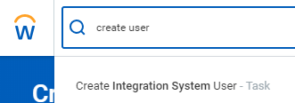
2. Complete the **Create Integration System User** task by supplying a user name and password for a new Integration System User.  
  
   * Leave the **Require New Password at Next Sign In** option unchecked, because this user will be logging on programmatically.
   * Leave the **Session Timeout Minutes** with its default value of 0, which will prevent the user's sessions from timing out prematurely.
   * Select the option **Do Not Allow UI Sessions** as it provides an added layer of security that prevents a user with the password of the integration system from logging into Workday.

   > [!div class="mx-imgBorder"]
   > 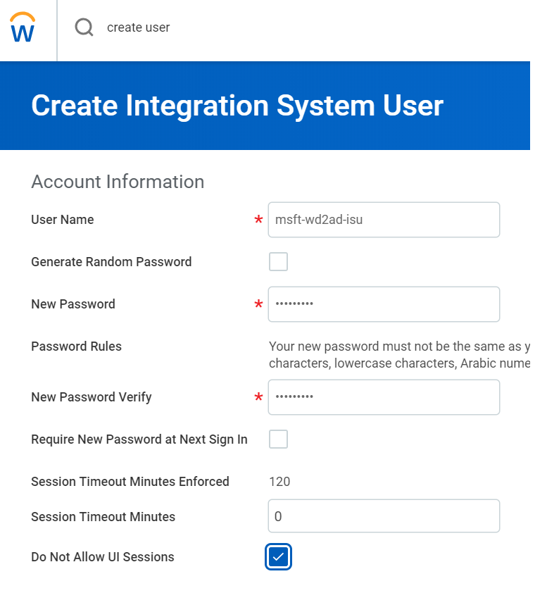

### Creating an integration security group

In this step, you will create an unconstrained or constrained integration system security group in Workday and assign the integration system user created in the previous step to this group.

**To create a security group:**

1. Enter create security group in the search box, and then click **Create Security Group**.

   > [!div class="mx-imgBorder"]
   > 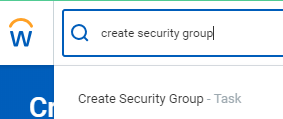
2. Complete the **Create Security Group** task. 

   * There are two types of security groups in Workday:
     * **Unconstrained:** All members of the security group can access all data instances secured by the security group.
     * **Constrained:** All security group members have contextual access to a subset of data instances (rows) that the security group can access.
   * Please check with your Workday integration partner to select the appropriate security group type for the integration.
   * Once you know the group type, select **Integration System Security Group (Unconstrained)** or **Integration System Security Group (Constrained)** from the **Type of Tenanted Security Group** dropdown.

     > [!div class="mx-imgBorder"]
     >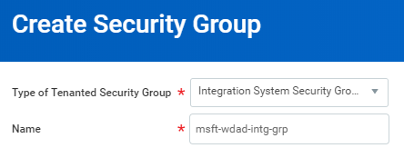

3. After the Security Group creation is successful, you will see a page where you can assign members to the Security Group. Add the new integration system user created in the previous step to this security group. If you are using *constrained* security group, you will also need to select the appropriate organization scope.

   >[!div class="mx-imgBorder"]
   >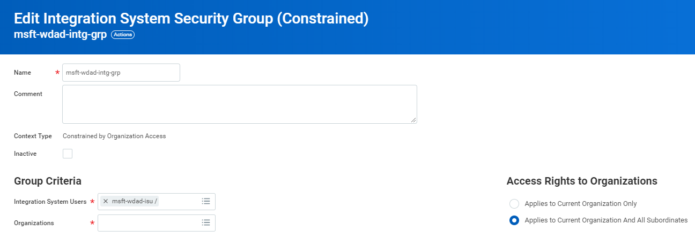

### Configuring domain security policy permissions

In this step, you'll grant "domain security" policy permissions for the worker data to the security group.

**To configure domain security policy permissions:**

1. Enter **Domain Security Configuration** in the search box, and then click on the link **Domain Security Configuration Report**.  
   >[!div class="mx-imgBorder"]
   >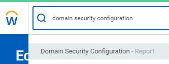  
2. In the **Domain** text box, search for the following domains and add them to the filter one by one.  
   * *External Account Provisioning*
   * *Worker Data: Workers*
   * *Worker Data: Public Worker Reports*
   * *Person Data: Work Contact Information*
   * *Worker Data: All Positions*
   * *Worker Data: Current Staffing Information*
   * *Worker Data: Business Title on Worker Profile*
   * *Workday Accounts*
   
     >[!div class="mx-imgBorder"]
     >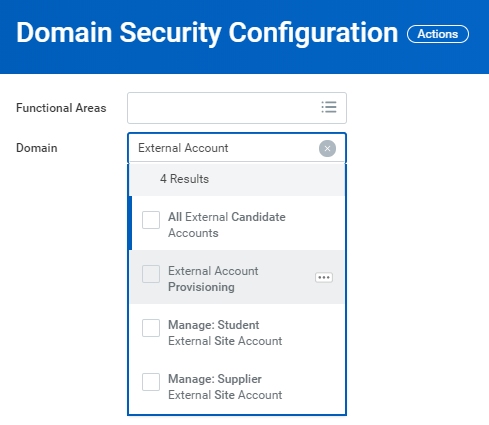  

     >[!div class="mx-imgBorder"]
     >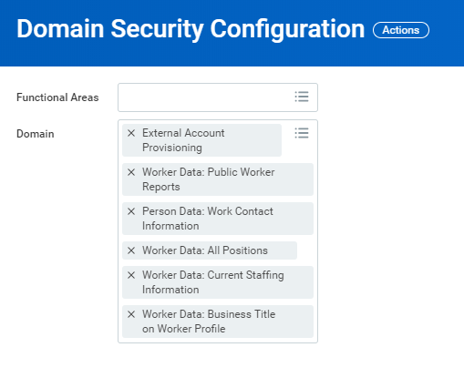 

     Click **OK**.

3. In the report that shows up, select the ellipsis (...) that appears next to **External Account Provisioning** and click on the menu option **Domain -> Edit Security Policy Permissions**
   >[!div class="mx-imgBorder"]
   >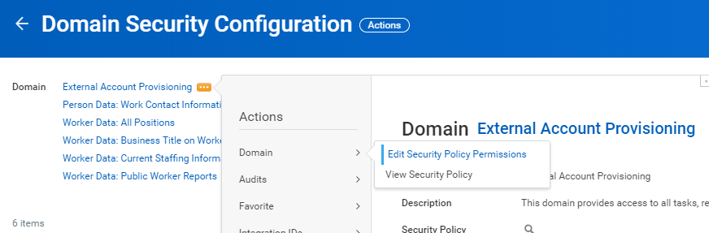  

4. On the **Edit Domain Security Policy Permissions** page, scroll down to the section **Integration Permissions**. Click on the "+" sign to add the integration system group to the list of security groups with **Get** and **Put** integration permissions.
   >[!div class="mx-imgBorder"]
   >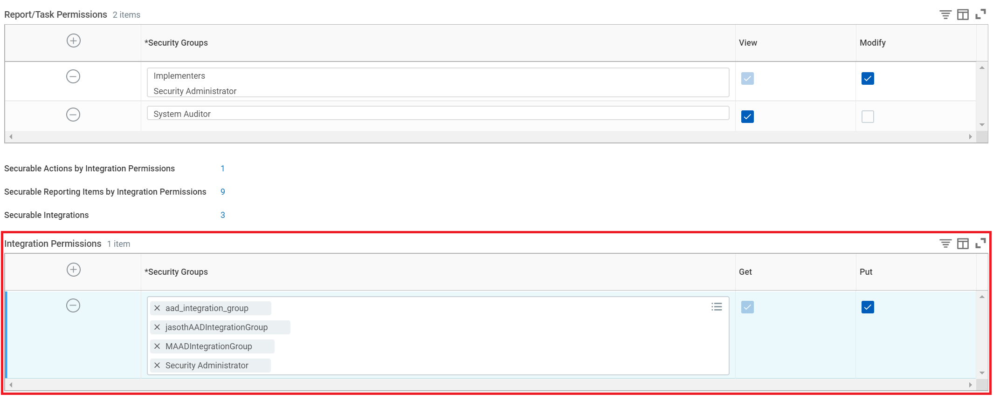  

5. Click on the "+" sign to add the integration system group to the list of security groups with **Get** and **Put** integration permissions.

   >[!div class="mx-imgBorder"]
   >  

6. Repeat steps 3-5 above for each of these remaining security policies:

   | Operation | Domain Security Policy |
   | ---------- | ---------- |
   | Get and Put | Worker Data: Public Worker Reports |
   | Get and Put | Person Data: Work Contact Information |
   | Get | Worker Data: Workers |
   | Get | Worker Data: All Positions |
   | Get | Worker Data: Current Staffing Information |
   | Get | Worker Data: Business Title on Worker Profile |
   | Get and Put | Workday Accounts |

### Configuring business process security policy permissions

In this step, you'll grant "business process security" policy permissions for the worker data to the security group. 

> [!NOTE]
> This step is required only for setting up the Workday Writeback app connector.

**To configure business process security policy permissions:**

1. Enter **Business Process Policy** in the search box, and then click on the link **Edit Business Process Security Policy** task.  

   >[!div class="mx-imgBorder"]
   >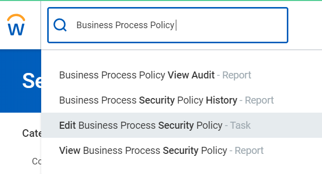  

2. In the **Business Process Type** textbox, search for *Contact* and select **Work Contact Change** business process and click **OK**.

   >[!div class="mx-imgBorder"]
   >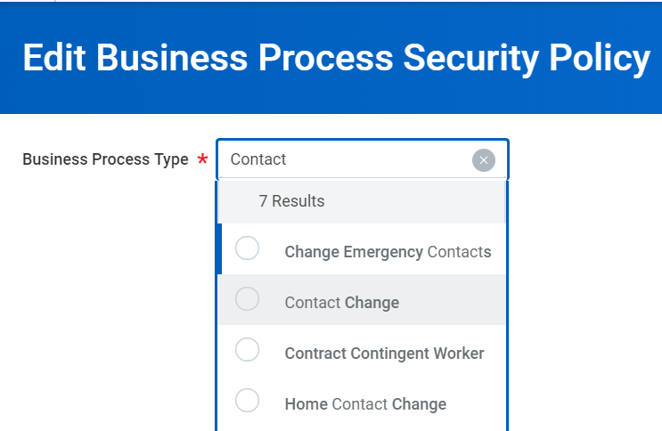  

3. On the **Edit Business Process Security Policy** page, scroll to the **Change Work Contact Information (Web Service)** section.
    

4. Select and add the new integration system security group to the list of security groups that can initiate the web services request. 

   >[!div class="mx-imgBorder"]
   >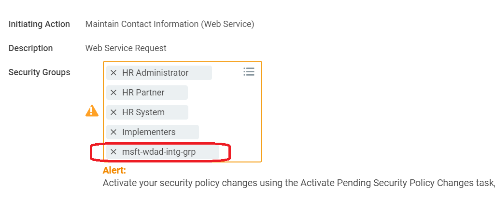  

5. Click on **Done**. 

### Activating security policy changes

**To activate security policy changes:**

1. Enter activate in the search box, and then click on the link **Activate Pending Security Policy Changes**.
   >[!div class="mx-imgBorder"]
   >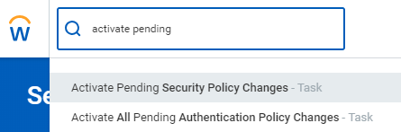

1. Begin the Activate Pending Security Policy Changes task by entering a comment for auditing purposes, and then click **OK**.
1. Complete the task on the next screen by checking the checkbox **Confirm**, and then click **OK**.

   >[!div class="mx-imgBorder"]
   >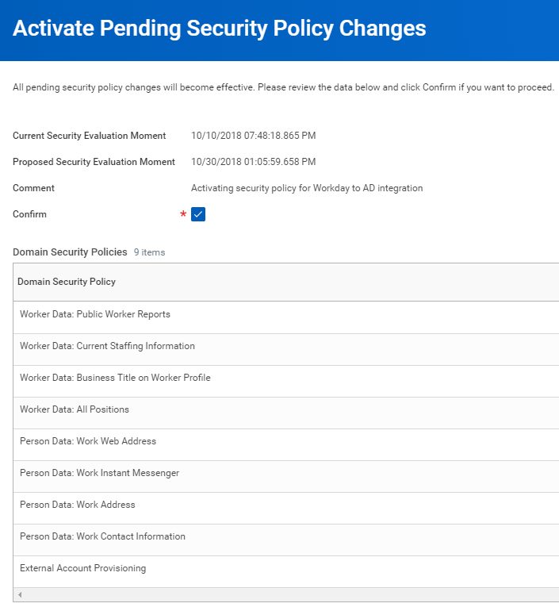  

## Configure Active Directory service account

This section describes the AD service account permissions required to install and configure the Azure AD Connect Provisioning Agent.

### Permissions required to run the Provisioning Agent Installer
Once you have identified the Windows Server that will host the Provisioning Agent, login to the server host using either local admin or domain admin credentials. The agent setup process creates secure key store credential files and updates the service profile configuration on the host server. This requires admin access on the server hosting the agent. 

### Permissions required to configure the Provisioning Agent service
Use the steps below to setup a service account that can be used for provisioning agent operations. 
1.	On your AD Domain Controller, open *Active Directory Users and Computers* snap-in. 
2.	Create a new domain user (example: *provAgentAdmin*)  
3.	Right click the OU or domain name and select *Delegate Control* which will open the *Delegation of Control Wizard*. 

> [!NOTE] 
> If you want to limit the provisioning agent to only create and read users from a certain OU for testing purposes, then we recommend delegating the control at the appropriate OU level during test runs.

4. Click **Next** on the welcome screen. 
5. On the **Select Users or Groups** screen, add the domain user you created in step 2. Click **Next**.
   >[!div class="mx-imgBorder"]
   >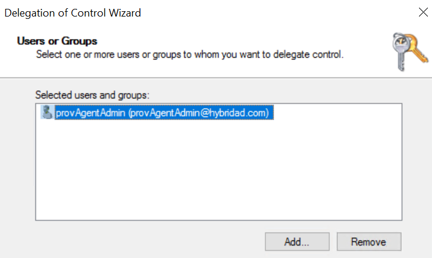

6. On the **Tasks to Delegate** screen, select the following tasks: 
   * Create, delete and manage user accounts
   * Read all user information

   >[!div class="mx-imgBorder"]
   >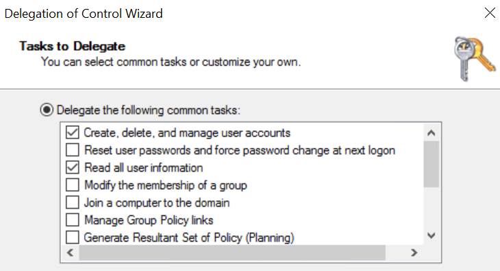

7. Click **Next** and **Save** the configuration


## Configuring user provisioning from Workday to Active Directory

This section provides steps for user account provisioning from Workday to each Active Directory domain within the scope of your integration.

* [Add the provisioning connector app and download the Provisioning Agent](#part-1-add-the-provisioning-connector-app-and-download-the-provisioning-agent)
* [Install and configure on-premises Provisioning Agent(s)](#part-2-install-and-configure-on-premises-provisioning-agents)
* [Configure connectivity to Workday and Active Directory](#part-3-in-the-provisioning-app-configure-connectivity-to-workday-and-active-directory)
* [Configure attribute mappings](#part-4-configure-attribute-mappings)
* [Enable and launch user provisioning](#enable-and-launch-user-provisioning)

### Part 1: Add the provisioning connector app and download the Provisioning Agent

**To configure Workday to Active Directory provisioning:**

1. Go to <https://portal.azure.com>.

2. In the Azure portal, search for and select **Azure Active Directory**.

3. Select **Enterprise Applications**, then **All Applications**.

4. Select **Add an application**, and select the **All** category.

5. Search for **Workday to Active Directory User Provisioning**, and add that app from the gallery.

6. After the app is added and the app details screen is shown, select **Provisioning**.

7. Change the **Provisioning** **Mode** to **Automatic**.

8. Click on the information banner displayed to download the Provisioning Agent. 

   >[!div class="mx-imgBorder"]
   >


### Part 2: Install and configure on-premises Provisioning Agent(s)

To provision to Active Directory on-premises, the Provisioning agent must be installed on a server that has .NET 4.7.1+ Framework and network access to the desired Active Directory domain(s).

> [!TIP]
> You can check the version of the .NET framework on your server using the instructions provided [here](https://docs.microsoft.com/dotnet/framework/migration-guide/how-to-determine-which-versions-are-installed).
> If the server does not have .NET 4.7.1 or higher installed, you can download it from [here](https://support.microsoft.com/help/4033342/the-net-framework-4-7-1-offline-installer-for-windows).  

Transfer the downloaded agent installer to the server host and follow the steps given below to complete the agent configuration.

1. Sign in to the Windows Server where you want to install the new agent.

1. Launch the Provisioning Agent installer, agree to the terms, and click on the **Install** button.

   >[!div class="mx-imgBorder"]
   >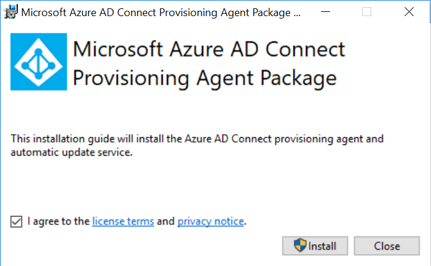
   
1. After installation is complete, the wizard will launch and you will see the **Connect Azure AD** screen. Click on the **Authenticate** button to connect to your Azure AD instance.

   >[!div class="mx-imgBorder"]
   >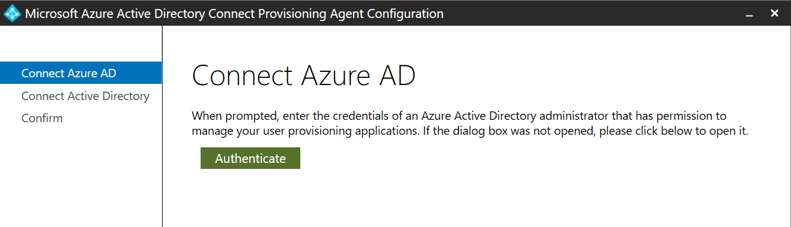
   
1. Authenticate to your Azure AD instance using Hybrid Identity Administrator Credentials.

   >[!div class="mx-imgBorder"]
   >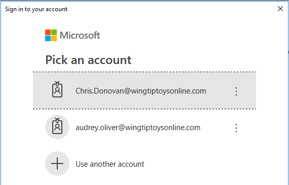

   > [!NOTE]
   > The Azure AD admin credentials is used only to connect to your Azure AD tenant. The agent does not store the credentials locally on the server.

1. After successful authentication with Azure AD, you will see the **Connect Active Directory** screen. In this step, enter your AD domain name and click on the **Add Directory** button.

   >[!div class="mx-imgBorder"]
   >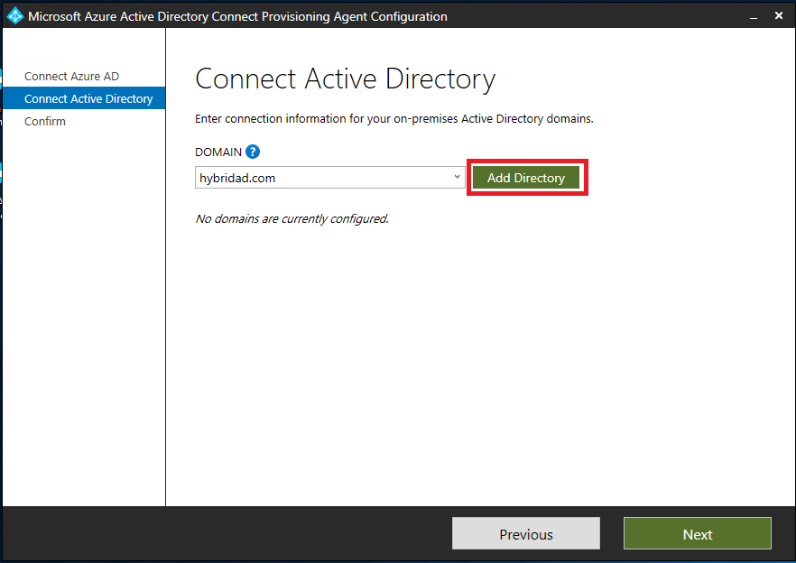
  
1. You will now be prompted to enter the credentials required to connect to the AD Domain. On the same screen, you can use the **Select domain controller priority** to specify domain controllers that the agent should use for sending provisioning requests.

   >[!div class="mx-imgBorder"]
   >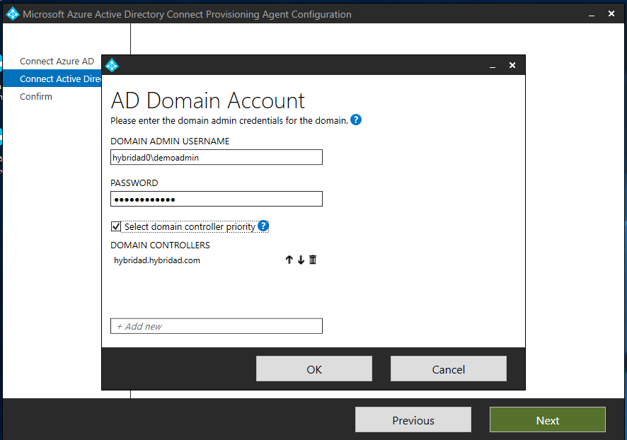
   
1. After configuring the domain, the installer displays a list of configured domains. On this screen, you can repeat step #5 and #6 to add more domains or click on **Next** to proceed to agent registration.

   >[!div class="mx-imgBorder"]
   >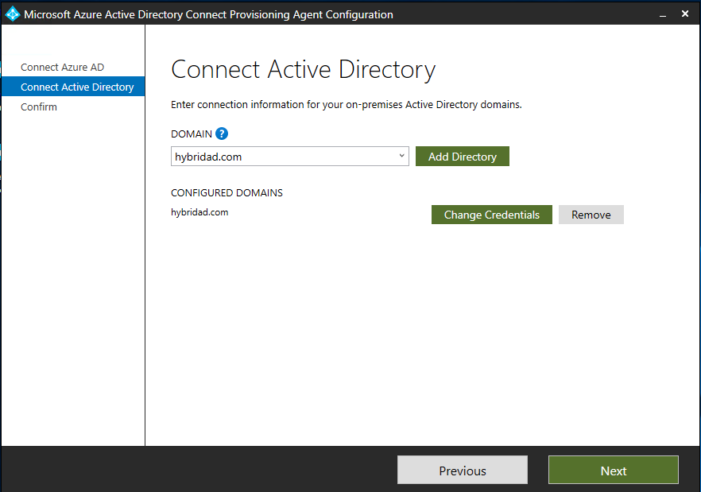

   > [!NOTE]
   > If you have multiple AD domains (e.g. na.contoso.com, emea.contoso.com), then please add each domain individually to the list.
   > Only adding the parent domain (e.g. contoso.com) is not sufficient. You must register each child domain with the agent.
   
1. Review the configuration details and click on **Confirm** to register the agent.
  
   >[!div class="mx-imgBorder"]
   >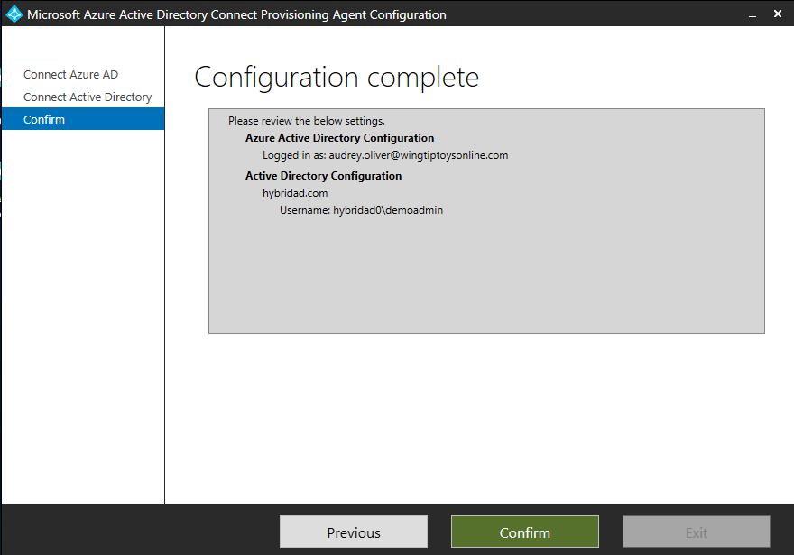
   
1. The configuration wizard displays the progress of the agent registration.
  
   >[!div class="mx-imgBorder"]
   >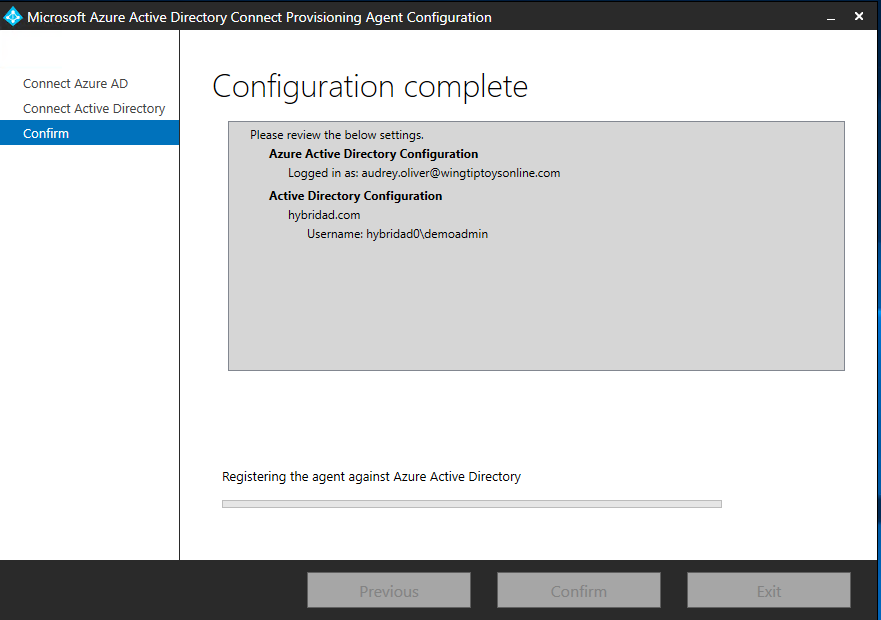
   
1. Once the agent registration is successful, you can click on **Exit** to exit the Wizard.

   >[!div class="mx-imgBorder"]
   >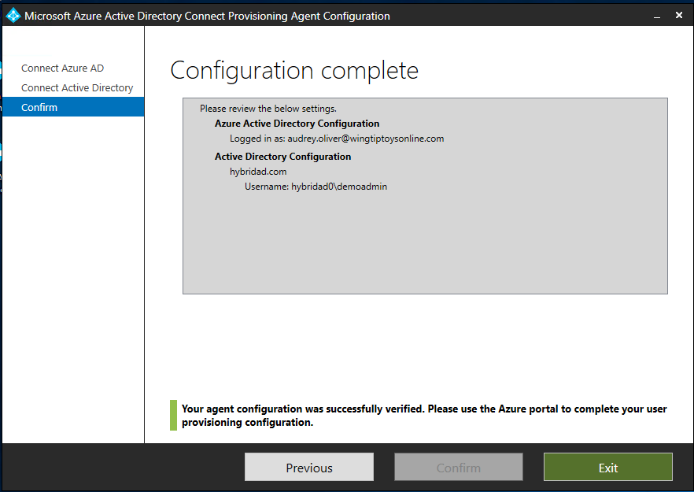
   
1. Verify the installation of the Agent and make sure it is running by opening the "Services" Snap-In and look for the Service named "Microsoft Azure AD Connect Provisioning Agent"

   >[!div class="mx-imgBorder"]
   >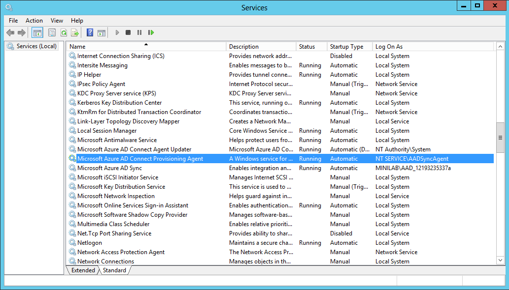

### Part 3: In the provisioning app, configure connectivity to Workday and Active Directory
In this step, we establish connectivity with Workday and Active Directory in the Azure portal. 

1. In the Azure portal, go back to the Workday to Active Directory User Provisioning App created in [Part 1](#part-1-add-the-provisioning-connector-app-and-download-the-provisioning-agent)

1. Complete the **Admin Credentials** section as follows:

   * **Workday Username** – Enter the username of the Workday  integration system account, with the tenant domain name appended. It should look something like: **username\@tenant_name**

   * **Workday password –** Enter the password of the Workday integration system account

   * **Workday Web Services API URL –** Enter the URL to the Workday web services endpoint for your tenant. The URL determines the version of the Workday Web Services API used by the connector. 
   
     | URL format | WWS API version used | XPATH changes required |
     |------------|----------------------|------------------------|
     | https://####.workday.com/ccx/service/tenantName | v21.1 | No |
     | https://####.workday.com/ccx/service/tenantName/Human_Resources | v21.1 | No |
     | https://####.workday.com/ccx/service/tenantName/Human_Resources/v##.# | v##.# | Yes |

      > [!NOTE]
     > If no version information is specified in the URL, the app uses Workday Web Services (WWS) v21.1 and no changes are required to the default XPATH API expressions shipped with the app. To use a specific WWS API version, specify version number in the URL <br>
     > Example: `https://wd3-impl-services1.workday.com/ccx/service/contoso4/Human_Resources/v34.0` <br>
     > <br> If you are using a WWS API v30.0+, before turning on the provisioning job, please update the **XPATH API expressions** under **Attribute Mapping -> Advanced Options -> Edit attribute list for Workday** referring to the section [Managing your configuration](#managing-your-configuration) and [Workday attribute reference](../app-provisioning/workday-attribute-reference.md#xpath-values-for-workday-web-services-wws-api-v30).  

   * **Active Directory Forest -** The "Name" of your Active Directory domain, as registered with the agent. Use the dropdown to select the target domain for provisioning. This value is typically a string like: *contoso.com*

   * **Active Directory Container -** Enter the container DN where the agent should create user accounts by default.
        Example: *OU=Standard Users,OU=Users,DC=contoso,DC=test*
        
     > [!NOTE]
     > This setting only comes into play for user account creations if the *parentDistinguishedName* attribute is not configured in the attribute mappings. This setting is not used for user search or update operations. The entire domain sub tree falls in the scope of the search operation.

   * **Notification Email –** Enter your email address, and check the "send email if failure occurs" checkbox.

     > [!NOTE]
     > The Azure AD Provisioning Service sends email notification if the provisioning job goes into a [quarantine](https://docs.microsoft.com/azure/active-directory/manage-apps/application-provisioning-quarantine-status) state.

   * Click the **Test Connection** button. If the connection test succeeds, click the **Save** button at  the top. If it fails, double-check that the Workday credentials and the AD credentials configured on the agent setup are valid.

     >[!div class="mx-imgBorder"]
     >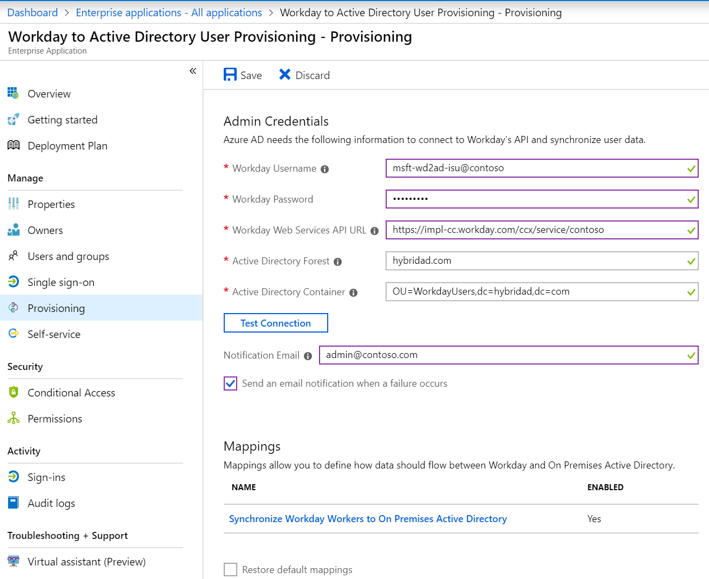

   * Once the credentials are saved successfully, the **Mappings** section will display the default mapping **Synchronize Workday Workers to On Premises Active Directory**

### Part 4: Configure attribute mappings

In this section, you will configure how user data flows from Workday to Active Directory.

1. On the Provisioning tab under **Mappings**, click **Synchronize Workday Workers to On Premises Active Directory**.

1. In the **Source Object Scope** field, you can select which sets of  users in Workday should be in scope for provisioning to AD, by defining a set of attribute-based filters. The default scope is "all users in Workday". Example filters:

   * Example: Scope to users with Worker IDs between 1000000 and
        2000000 (excluding 2000000)

      * Attribute: WorkerID

      * Operator: REGEX Match

      * Value: (1[0-9][0-9][0-9][0-9][0-9][0-9])

   * Example: Only employees and not contingent workers

      * Attribute: EmployeeID

      * Operator: IS NOT NULL

   > [!TIP]
   > When you are configuring the provisioning app for the first time, you will need to test and verify your attribute mappings and expressions to make sure that it is giving you the desired result. Microsoft recommends using the scoping filters under **Source Object Scope** to test your mappings with a few test users from Workday. Once you have verified that the mappings work, then you can either remove the filter or gradually expand it to include more users.

   > [!CAUTION] 
   > The default behavior of the provisioning engine is to disable/delete users that go out of scope. This may not be desirable in your Workday to AD integration. To override this default behavior refer to the article [Skip deletion of user accounts that go out of scope](../app-provisioning/skip-out-of-scope-deletions.md)
  
1. In the **Target Object Actions** field, you can globally filter what actions are performed on Active Directory. **Create** and **Update** are most common.

1. In the **Attribute mappings** section, you can define how individual Workday attributes map to Active Directory attributes.

1. Click on an existing attribute mapping to update it, or click **Add new mapping** at the bottom of the screen to add new
        mappings. An individual attribute mapping supports these properties:

      * **Mapping Type**

         * **Direct** – Writes the value of the Workday attribute to the AD attribute, with no changes

         * **Constant** - Write a static, constant string value to the AD attribute

         * **Expression** – Allows you to write a custom value to the AD attribute, based on one or more Workday attributes. [For more info, see this article on expressions](../app-provisioning/functions-for-customizing-application-data.md).

      * **Source attribute** - The user attribute from Workday. If the attribute you are looking for is not present, see [Customizing the list of Workday user attributes](#customizing-the-list-of-workday-user-attributes).

      * **Default value** – Optional. If the source attribute has an empty value, the mapping will write this value instead.
            Most common configuration is to leave this blank.

      * **Target attribute** – The user attribute in Active  Directory.

      * **Match objects using this attribute** – Whether or not this mapping should be used to uniquely identify users between
            Workday and Active Directory. This value is typically set on the  Worker ID field for Workday, which is typically mapped to one of the Employee ID attributes in Active Directory.

      * **Matching precedence** – Multiple matching attributes can be set. When there are multiple, they are evaluated in the
            order defined by this field. As soon as a match is found, no  further matching attributes are evaluated.

      * **Apply this mapping**

         * **Always** – Apply this mapping on both user creation and update actions

         * **Only during creation** - Apply this mapping only on user creation actions

1. To save your mappings, click **Save** at the top of the  Attribute-Mapping section.
   >[!div class="mx-imgBorder"]
   >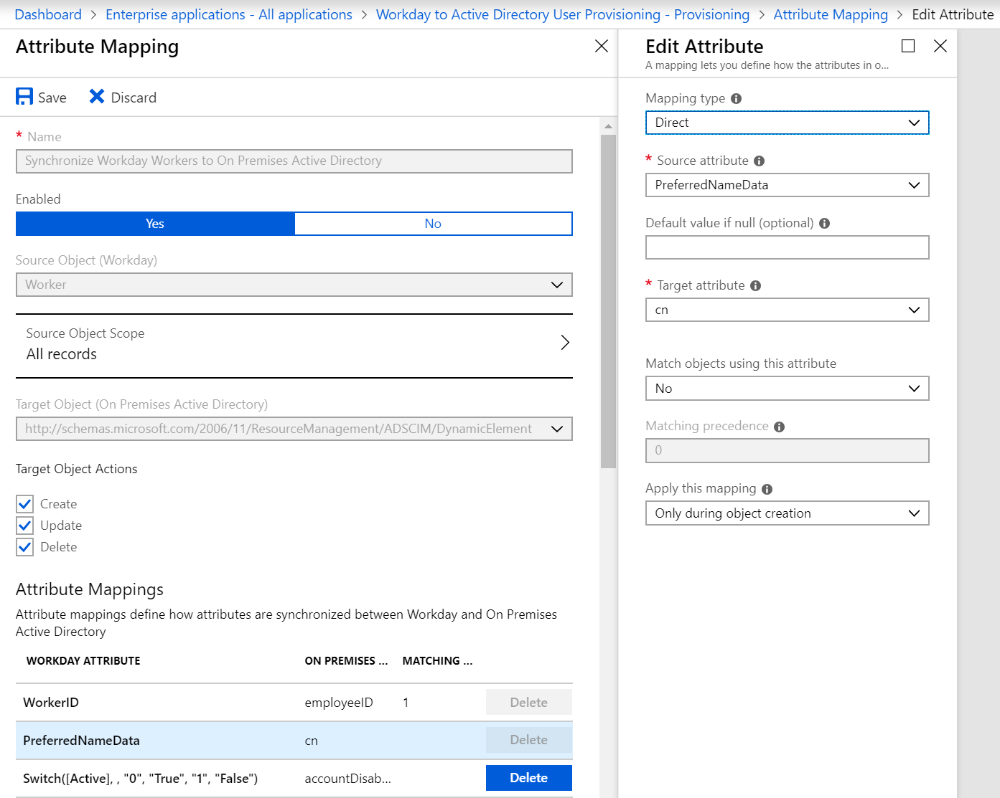

#### Below are some example attribute mappings between Workday and Active Directory, with some common expressions

* The expression that maps to the *parentDistinguishedName* attribute is used to provision a user to different OUs based on one or more Workday source attributes. This example here places users in different OUs based on what city they are in.

* The *userPrincipalName* attribute in Active Directory is generated using the de-duplication function [SelectUniqueValue](../app-provisioning/functions-for-customizing-application-data.md#selectuniquevalue) that checks for existence of a generated value in the target AD domain and only sets it if it is unique.  

* [There is documentation on writing expressions here](../app-provisioning/functions-for-customizing-application-data.md). This section includes examples on how to remove special characters.

| WORKDAY ATTRIBUTE | ACTIVE DIRECTORY ATTRIBUTE |  MATCHING ID? | CREATE / UPDATE |
| ---------- | ---------- | ---------- | ---------- |
| **WorkerID**  |  EmployeeID | **Yes** | Written on create only |
| **PreferredNameData**    |  cn    |   |   Written on create only |
| **SelectUniqueValue( Join("\@", Join(".",  \[FirstName\], \[LastName\]), "contoso.com"), Join("\@", Join(".",  Mid(\[FirstName\], 1, 1), \[LastName\]), "contoso.com"), Join("\@", Join(".",  Mid(\[FirstName\], 1, 2), \[LastName\]), "contoso.com"))**   | userPrincipalName     |     | Written on create only 
| `Replace(Mid(Replace(\[UserID\], , "(\[\\\\/\\\\\\\\\\\\\[\\\\\]\\\\:\\\\;\\\\\|\\\\=\\\\,\\\\+\\\\\*\\\\?\\\\&lt;\\\\&gt;\])", , "", , ), 1, 20), , "([\\\\.)\*\$](file:///\\.)*$)", , "", , )`      |    sAMAccountName            |     |         Written on create only |
| **Switch(\[Active\], , "0", "True", "1", "False")** |  accountDisabled      |     | Create + update |
| **FirstName**   | givenName       |     |    Create + update |
| **LastName**   |   sn   |     |  Create + update |
| **PreferredNameData**  |  displayName |     |   Create + update |
| **Company**         | company   |     |  Create + update |
| **SupervisoryOrganization**  | department  |     |  Create + update |
| **ManagerReference**   | manager  |     |  Create + update |
| **BusinessTitle**   |  title     |     |  Create + update | 
| **AddressLineData**    |  streetAddress  |     |   Create + update |
| **Municipality**   |   l   |     | Create + update |
| **CountryReferenceTwoLetter**      |   co |     |   Create + update |
| **CountryReferenceTwoLetter**    |  c  |     |         Create + update |
| **CountryRegionReference** |  st     |     | Create + update |
| **WorkSpaceReference** | physicalDeliveryOfficeName    |     |  Create + update |
| **PostalCode**  |   postalCode  |     | Create + update |
| **PrimaryWorkTelephone**  |  telephoneNumber   |     | Create + update |
| **Fax**      | facsimileTelephoneNumber     |     |    Create + update |
| **Mobile**  |    mobile       |     |       Create + update |
| **LocalReference** |  preferredLanguage  |     |  Create + update |                                               
| **Switch(\[Municipality\], "OU=Default Users,DC=contoso,DC=com", "Dallas", "OU=Dallas,OU=Users,DC=contoso,DC=com", "Austin", "OU=Austin,OU=Users,DC=contoso,DC=com", "Seattle", "OU=Seattle,OU=Users,DC=contoso,DC=com", "London", "OU=London,OU=Users,DC=contoso,DC=com")**  | parentDistinguishedName     |     |  Create + update |

Once your attribute mapping configuration is complete, you can now [enable and launch the user provisioning service](#enable-and-launch-user-provisioning).

## Enable and launch user provisioning

Once the Workday provisioning app configurations have been completed, you can turn on the provisioning service in the Azure portal.

> [!TIP]
> By default when you turn on the provisioning service, it will initiate provisioning operations for all users in scope. If there are errors in the mapping or Workday data issues, then the provisioning job might fail and go into the quarantine state. To avoid this, as a best practice, we recommend configuring **Source Object Scope** filter and testing  your attribute mappings with a few test users before launching the full sync for all users. Once you have verified that the mappings work and are giving you the desired results, then you can either remove the filter or gradually expand it to include more users.

1. In the **Provisioning** tab, set the **Provisioning Status** to **On**.

2. Click **Save**.

3. This operation will start the initial sync, which can take a variable number of hours depending on how many users are in the Workday tenant. 

4. At any time, check the **Audit logs** tab in the Azure portal to see what actions the provisioning service has performed. The audit logs lists all individual sync events performed by the provisioning service, such as which users are being read out of Workday and then subsequently added or updated to Active Directory. Refer to the Troubleshooting section for instructions on how to review the audit logs and fix provisioning errors.

5. Once the initial sync is completed, it will write an audit summary report in the **Provisioning** tab, as shown below.
   > [!div class="mx-imgBorder"]
   > 


## Frequently Asked Questions (FAQ)

* **Solution capability questions**
  * [When processing a new hire from Workday, how does the solution set the password for the new user account in Active Directory?](#when-processing-a-new-hire-from-workday-how-does-the-solution-set-the-password-for-the-new-user-account-in-active-directory)
  * [Does the solution support sending email notifications after provisioning operations complete?](#does-the-solution-support-sending-email-notifications-after-provisioning-operations-complete)
  * [How do I manage delivery of passwords for new hires and securely provide a mechanism to reset their password?](#how-do-i-manage-delivery-of-passwords-for-new-hires-and-securely-provide-a-mechanism-to-reset-their-password)
  * [Does the solution cache Workday user profiles in the Azure AD cloud or at the provisioning agent layer?](#does-the-solution-cache-workday-user-profiles-in-the-azure-ad-cloud-or-at-the-provisioning-agent-layer)
  * [Does the solution support assigning on-premises AD groups to the user?](#does-the-solution-support-assigning-on-premises-ad-groups-to-the-user)
  * [Which Workday APIs does the solution use to query and update Workday worker profiles?](#which-workday-apis-does-the-solution-use-to-query-and-update-workday-worker-profiles)
  * [Can I configure my Workday HCM tenant with two Azure AD tenants?](#can-i-configure-my-workday-hcm-tenant-with-two-azure-ad-tenants)
  * [Why "Workday to Azure AD" user provisioning app is not supported if we have deployed Azure AD Connect?](#why-workday-to-azure-ad-user-provisioning-app-is-not-supported-if-we-have-deployed-azure-ad-connect)
  * [How do I suggest improvements or request new features related to Workday and Azure AD integration?](#how-do-i-suggest-improvements-or-request-new-features-related-to-workday-and-azure-ad-integration)

* **Provisioning Agent questions**
  * [What is the GA version of the Provisioning Agent?](#what-is-the-ga-version-of-the-provisioning-agent)
  * [How do I know the version of my Provisioning Agent?](#how-do-i-know-the-version-of-my-provisioning-agent)
  * [Does Microsoft automatically push Provisioning Agent updates?](#does-microsoft-automatically-push-provisioning-agent-updates)
  * [Can I install the Provisioning Agent on the same server running Azure AD Connect?](#can-i-install-the-provisioning-agent-on-the-same-server-running-azure-ad-connect)
  * [How do I configure the Provisioning Agent to use a proxy server for outbound HTTP communication?](#how-do-i-configure-the-provisioning-agent-to-use-a-proxy-server-for-outbound-http-communication)
  * [How do I ensure that the Provisioning Agent is able to communicate with the Azure AD tenant and no firewalls are blocking ports required by the agent?](#how-do-i-ensure-that-the-provisioning-agent-is-able-to-communicate-with-the-azure-ad-tenant-and-no-firewalls-are-blocking-ports-required-by-the-agent)
  * [How do I de-register the domain associated with my Provisioning Agent?](#how-do-i-de-register-the-domain-associated-with-my-provisioning-agent)
  * [How do I uninstall the Provisioning Agent?](#how-do-i-uninstall-the-provisioning-agent)
  
* **Workday to AD attribute mapping and configuration questions**
  * [How do I back up or export a working copy of my Workday Provisioning Attribute Mapping and Schema?](#how-do-i-back-up-or-export-a-working-copy-of-my-workday-provisioning-attribute-mapping-and-schema)
  * [I have custom attributes in Workday and Active Directory. How do I configure the solution to work with my custom attributes?](#i-have-custom-attributes-in-workday-and-active-directory-how-do-i-configure-the-solution-to-work-with-my-custom-attributes)
  * [Can I provision user's photo from Workday to Active Directory?](#can-i-provision-users-photo-from-workday-to-active-directory)
  * [How do I sync mobile numbers from Workday based on user consent for public usage?](#how-do-i-sync-mobile-numbers-from-workday-based-on-user-consent-for-public-usage)
  * [How do I format display names in AD based on the user's department/country/city attributes and handle regional variances?](#how-do-i-format-display-names-in-ad-based-on-the-users-departmentcountrycity-attributes-and-handle-regional-variances)
  * [How can I use SelectUniqueValue to generate unique values for samAccountName attribute?](#how-can-i-use-selectuniquevalue-to-generate-unique-values-for-samaccountname-attribute)
  * [How do I remove characters with diacritics and convert them into normal English alphabets?](#how-do-i-remove-characters-with-diacritics-and-convert-them-into-normal-english-alphabets)

### Solution capability questions

#### When processing a new hire from Workday, how does the solution set the password for the new user account in Active Directory?

When the on-premises provisioning agent gets a request to create a new AD account, it automatically generates a complex random password designed to meet the password complexity requirements defined by the AD server and sets this on the user object. This password is not logged anywhere.

#### Does the solution support sending email notifications after provisioning operations complete?

No, sending email notifications after completing provisioning operations is not supported in the current release.

#### How do I manage delivery of passwords for new hires and securely provide a mechanism to reset their password?

One of the final steps involved in new AD account provisioning is the delivery of the temporary password assigned to the user's AD account. Many enterprises still use the traditional approach of delivering the temporary password to the user's manager, who then hands over the password to the new hire/contingent worker. This process has an inherent security flaw and there is an option available to implement a better approach using Azure AD capabilities.

As part of the hiring process, HR teams usually run a background check and vet the mobile number of the new hire. With the Workday to AD User Provisioning integration, you can build on top of this fact and rollout a self-service password reset capability for the user on Day 1. This is accomplished by propagating the "Mobile Number" attribute of the new hire from Workday to AD and then from AD to Azure AD using Azure AD Connect. Once the "Mobile Number" is present in Azure AD, you can enable the [Self-Service Password Reset (SSPR)](../authentication/howto-sspr-authenticationdata.md) for the user's account, so that on Day 1, a new hire can use the registered and verified mobile number for authentication.

#### Does the solution cache Workday user profiles in the Azure AD cloud or at the provisioning agent layer?

No, the solution does not maintain a cache of user profiles. The Azure AD provisioning service simply acts as a data processor, reading data from Workday and writing to the target Active Directory or Azure AD. See the section [Managing personal data](#managing-personal-data) for details related to user privacy and data retention.

#### Does the solution support assigning on-premises AD groups to the user?

This functionality is not supported currently. Recommended workaround is to deploy a PowerShell script that queries the Microsoft Graph API endpoint for [audit log data](https://docs.microsoft.com/graph/api/resources/azure-ad-auditlog-overview?view=graph-rest-beta) and use that to trigger scenarios such as group assignment. This PowerShell script can be attached to a task scheduler and deployed on the same box running the provisioning agent.  

#### Which Workday APIs does the solution use to query and update Workday worker profiles?

The solution currently uses the following Workday APIs:

* The **Workday Web Services API URL** format used in the **Admin Credentials** section, determines the API version used for Get_Workers
  * If the URL format is: https://\#\#\#\#\.workday\.com/ccx/service/tenantName , then API v21.1 is used. 
  * If the URL format is: https://\#\#\#\#\.workday\.com/ccx/service/tenantName/Human\_Resources , then API v21.1 is used 
  * If the URL format is: https://\#\#\#\#\.workday\.com/ccx/service/tenantName/Human\_Resources/v\#\#\.\# , then the specified API version is used. (Example: if v34.0 is specified, then it is used.)  
   
* Workday Email Writeback feature uses Change_Work_Contact_Information (v30.0) 
* Workday Username Writeback feature uses Update_Workday_Account (v31.2) 

#### Can I configure my Workday HCM tenant with two Azure AD tenants?

Yes, this configuration is supported. Here are the high level steps to configure this scenario:

* Deploy provisioning agent #1 and register it with Azure AD tenant #1.
* Deploy provisioning agent #2 and register it with Azure AD tenant #2.
* Based on the "Child Domains" that each Provisioning Agent will manage, configure each agent with the domain(s). One agent can handle multiple domains.
* In Azure portal, setup the Workday to AD User Provisioning App in each tenant and configure it with the respective domains.

#### Why "Workday to Azure AD" user provisioning app is not supported if we have deployed Azure AD Connect?

When Azure AD is used in hybrid mode (where it contains a mix of cloud + on-premises users), it's important to have a clear definition of "source of authority". Typically hybrid scenarios require deployment of Azure AD Connect. When Azure AD Connect is deployed, on-premises AD is the source of authority. Introducing the Workday to Azure AD connector into the mix can lead to a situation where Workday attribute values could potentially overwrite the values set by Azure AD Connect. Hence use of "Workday to Azure AD" provisioning app is not supported when Azure AD Connect is enabled. In such situations, we recommend using "Workday to AD User" provisioning app for getting users into on-premises AD and then syncing them into Azure AD using Azure AD Connect.

#### How do I suggest improvements or request new features related to Workday and Azure AD integration?

Your feedback is highly valued as it helps us set the direction for the future releases and enhancements. We welcome all feedback and encourage you to submit your idea or improvement suggestion in the [feedback forum of Azure AD](https://feedback.azure.com/forums/169401-azure-active-directory). For specific feedback related to the Workday integration, select the category *SaaS Applications* and search using the keywords *Workday* to find existing feedback related to the Workday.

> [!div class="mx-imgBorder"]
> 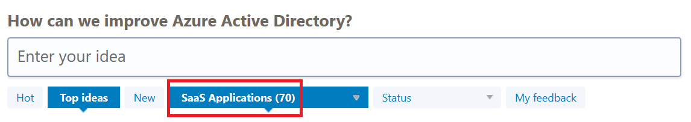

> [!div class="mx-imgBorder"]
> 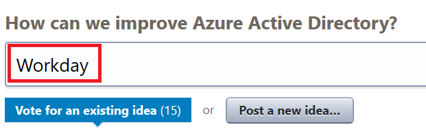

When suggesting a new idea, please check to see if someone else has already suggested a similar feature. In that case, you can up vote the feature or enhancement request. You can also leave a comment regarding your specific use case to show your support for the idea and demonstrate how the feature will be valuable for you too.

### Provisioning Agent questions

#### What is the GA version of the Provisioning Agent?

Refer to [Azure AD Connect Provisioning Agent: Version release history](../app-provisioning/provisioning-agent-release-version-history.md) for the latest GA version of the Provisioning Agent.  

#### How do I know the version of my Provisioning Agent?

* Sign in to the Windows server where the Provisioning Agent is installed.
* Go to **Control Panel** -> **Uninstall or Change a Program** menu
* Look for the version corresponding to the entry **Microsoft Azure AD Connect Provisioning Agent**

  >[!div class="mx-imgBorder"]
  >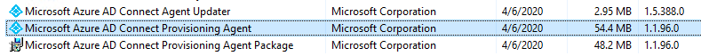

#### Does Microsoft automatically push Provisioning Agent updates?

Yes, Microsoft automatically updates the provisioning agent if the  Windows service **Microsoft Azure AD Connect Agent Updater** is up and running.

#### Can I install the Provisioning Agent on the same server running Azure AD Connect?

Yes, you can install the Provisioning Agent on the same server that runs Azure AD Connect.

#### At the time of configuration the Provisioning Agent prompts for Azure AD admin credentials. Does the Agent store the credentials locally on the server?

During configuration, the Provisioning Agent prompts for Azure AD admin credentials only to connect to your Azure AD tenant. It does not store the credentials locally on the server. However it does retain the credentials used to connect to the *on-premises Active Directory domain* in a local Windows password vault.

#### How do I configure the Provisioning Agent to use a proxy server for outbound HTTP communication?

The Provisioning Agent supports use of outbound proxy. You can configure it by editing the agent config file **C:\Program Files\Microsoft Azure AD Connect Provisioning Agent\AADConnectProvisioningAgent.exe.config**.
Add the following lines into it, towards the end of the file just before the closing `</configuration>` tag.
Replace the variables [proxy-server] and [proxy-port] with your proxy server name and port values.

```xml
    <system.net>
          <defaultProxy enabled="true" useDefaultCredentials="true">
             <proxy
                usesystemdefault="true"
                proxyaddress="http://[proxy-server]:[proxy-port]"
                bypassonlocal="true"
             />
         </defaultProxy>
    </system.net>
```

#### How do I ensure that the Provisioning Agent is able to communicate with the Azure AD tenant and no firewalls are blocking ports required by the agent?

You can also check whether you have all the required ports open by opening the [Connector Ports Test Tool](https://aadap-portcheck.connectorporttest.msappproxy.net/) from your on premises network. More green checkmarks means greater resiliency.

To make sure the tool gives you the right results, be sure to:

* Open the tool on a browser from the server where you have installed the Provisioning Agent.
* Ensure that any proxies or firewalls applicable to your Provisioning Agent are also applied to this page. This can be done in Internet Explorer by going to **Settings -> Internet Options -> Connections -> LAN Settings**. On this page, you see the field "Use a Proxy Server for your LAN". Select this box, and put the proxy address into the "Address" field.

#### Can one Provisioning Agent be configured to provision multiple AD domains?

Yes, one Provisioning Agent can be configured to handle multiple AD domains as long as the agent has line of sight to the respective domain controllers. Microsoft recommends setting up a group of 3 provisioning agents serving the same set of AD domains to ensure high availability and provide fail over support.

#### How do I de-register the domain associated with my Provisioning Agent?

* From the Azure portal, get the *tenant ID* of your Azure AD tenant.
* Sign in to the Windows server running the Provisioning Agent.
* Open PowerShell as Windows Administrator.
* Change to the directory containing the registration scripts and run the following commands replacing the \[tenant ID\] parameter with the value of your tenant ID.

  ```powershell
  cd "C:\Program Files\Microsoft Azure AD Connect Provisioning Agent\RegistrationPowershell\Modules\PSModulesFolder"
  Import-Module "C:\Program Files\Microsoft Azure AD Connect Provisioning Agent\RegistrationPowershell\Modules\PSModulesFolder\AppProxyPSModule.psd1"
  Get-PublishedResources -TenantId "[tenant ID]"
  ```

* From the list of agents that appear – copy the value of the `id` field from that resource whose *resourceName* equals to your AD domain name.
* Paste the ID value into this command and execute the command in PowerShell.

  ```powershell
  Remove-PublishedResource -ResourceId "[resource ID]" -TenantId "[tenant ID]"
  ```

* Rerun the Agent configuration wizard.
* Any other agents, that were previously assigned to this domain will need to be reconfigured.

#### How do I uninstall the Provisioning Agent?

* Sign in to the Windows server where the Provisioning Agent is installed.
* Go to **Control Panel** -> **Uninstall or Change a Program** menu
* Uninstall the following programs:
  * Microsoft Azure AD Connect Provisioning Agent
  * Microsoft Azure AD Connect Agent Updater
  * Microsoft Azure AD Connect Provisioning Agent Package

### Workday to AD attribute mapping and configuration questions

#### How do I back up or export a working copy of my Workday Provisioning Attribute Mapping and Schema?

You can use Microsoft Graph API to export your Workday User Provisioning configuration. Refer to the steps in the section [Exporting and Importing your Workday User Provisioning Attribute Mapping configuration](#exporting-and-importing-your-configuration) for details.

#### I have custom attributes in Workday and Active Directory. How do I configure the solution to work with my custom attributes?

The solution supports custom Workday and Active Directory attributes. To add your custom attributes to the mapping schema, open the **Attribute Mapping** blade and scroll down to expand the section **Show advanced options**. 

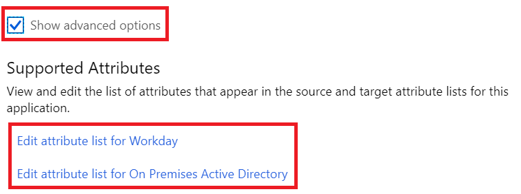

To add your custom Workday attributes, select the option *Edit attribute list for Workday* and to add your custom AD attributes, select the option *Edit attribute list for On Premises Active Directory*.

See also:

* [Customizing the list of Workday user attributes](#customizing-the-list-of-workday-user-attributes)

#### How do I configure the solution to only update attributes in AD based on Workday changes and not create any new AD accounts?

This configuration can be achieved by setting the **Target Object Actions** in the **Attribute Mappings** blade as shown below:

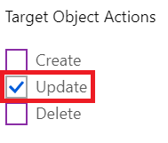

Select the checkbox "Update" for only update operations to flow from Workday to AD. 

#### Can I provision user's photo from Workday to Active Directory?

The solution currently does not support setting binary attributes such as *thumbnailPhoto* and *jpegPhoto* in Active Directory.

#### How do I sync mobile numbers from Workday based on user consent for public usage?

* Go the "Provisioning" blade of your Workday Provisioning App.
* Click on the Attribute Mappings 
* Under **Mappings**, select **Synchronize Workday Workers to On Premises Active Directory** (or **Synchronize Workday Workers to Azure AD**).
* On the Attribute Mappings page, scroll down and check the box "Show Advanced Options".  Click on **Edit attribute list for Workday**
* In the blade that opens up, locate the "Mobile" attribute and click on the row so you can edit the **API Expression**
     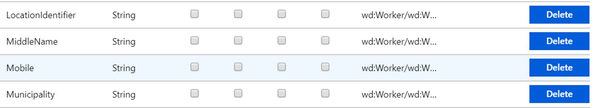

* Replace the **API Expression** with the following new expression, which retrieves the work mobile number only if the "Public Usage Flag" is set to "True" in Workday.

    ```
     wd:Worker/wd:Worker_Data/wd:Personal_Data/wd:Contact_Data/wd:Phone_Data[translate(string(wd:Phone_Device_Type_Reference/@wd:Descriptor),'abcdefghijklmnopqrstuvwxyz','ABCDEFGHIJKLMNOPQRSTUVWXYZ')='MOBILE' and translate(string(wd:Usage_Data/wd:Type_Data/wd:Type_Reference/@wd:Descriptor),'abcdefghijklmnopqrstuvwxyz','ABCDEFGHIJKLMNOPQRSTUVWXYZ')='WORK' and string(wd:Usage_Data/@wd:Public)='1']/@wd:Formatted_Phone
    ```

* Save the Attribute List.
* Save the Attribute Mapping.
* Clear current state and restart the full sync.

#### How do I format display names in AD based on the user's department/country/city attributes and handle regional variances?

It is a common requirement to configure the *displayName* attribute in AD so that it also provides information about the user's department and country/region. For e.g. if John Smith works in the Marketing Department in US, you might want his *displayName* to show up as *Smith, John (Marketing-US)*.

Here is how you can handle such requirements for constructing *CN* or *displayName* to include attributes such as company, business unit, city, or country/region.

* Each Workday attribute is retrieved using an underlying XPATH API expression, which is configurable in  **Attribute Mapping -> Advanced Section -> Edit attribute list for Workday**. Here is the default XPATH API expression for Workday *PreferredFirstName*, *PreferredLastName*, *Company* and *SupervisoryOrganization* attributes.

     | Workday Attribute | API XPATH Expression |
     | ----------------- | -------------------- |
     | PreferredFirstName | wd:Worker/wd:Worker_Data/wd:Personal_Data/wd:Name_Data/wd:Preferred_Name_Data/wd:Name_Detail_Data/wd:First_Name/text() |
     | PreferredLastName | wd:Worker/wd:Worker_Data/wd:Personal_Data/wd:Name_Data/wd:Preferred_Name_Data/wd:Name_Detail_Data/wd:Last_Name/text() |
     | Company | wd:Worker/wd:Worker_Data/wd:Organization_Data/wd:Worker_Organization_Data[wd:Organization_Data/wd:Organization_Type_Reference/wd:ID[@wd:type='Organization_Type_ID']='Company']/wd:Organization_Reference/@wd:Descriptor |
     | SupervisoryOrganization | wd:Worker/wd:Worker_Data/wd:Organization_Data/wd:Worker_Organization_Data/wd:Organization_Data[wd:Organization_Type_Reference/wd:ID[@wd:type='Organization_Type_ID']='Supervisory']/wd:Organization_Name/text() |
  
   Confirm with your Workday team that the API expression above is valid for your Workday tenant configuration. If necessary, you can edit them as described in the section [Customizing the list of Workday user attributes](#customizing-the-list-of-workday-user-attributes).

* Similarly the country/region information present in Workday is retrieved using the following XPATH: *wd:Worker/wd:Worker_Data/wd:Employment_Data/wd:Position_Data/wd:Business_Site_Summary_Data/wd:Address_Data/wd:Country_Reference*

     There are 5 country/region-related attributes that are available in the Workday attribute list section.

     | Workday Attribute | API XPATH Expression |
     | ----------------- | -------------------- |
     | CountryReference | wd:Worker/wd:Worker_Data/wd:Employment_Data/wd:Position_Data/wd:Business_Site_Summary_Data/wd:Address_Data/wd:Country_Reference/wd:ID[@wd:type='ISO_3166-1_Alpha-3_Code']/text() |
     | CountryReferenceFriendly | wd:Worker/wd:Worker_Data/wd:Employment_Data/wd:Position_Data/wd:Business_Site_Summary_Data/wd:Address_Data/wd:Country_Reference/@wd:Descriptor |
     | CountryReferenceNumeric | wd:Worker/wd:Worker_Data/wd:Employment_Data/wd:Position_Data/wd:Business_Site_Summary_Data/wd:Address_Data/wd:Country_Reference/wd:ID[@wd:type='ISO_3166-1_Numeric-3_Code']/text() |
     | CountryReferenceTwoLetter | wd:Worker/wd:Worker_Data/wd:Employment_Data/wd:Position_Data/wd:Business_Site_Summary_Data/wd:Address_Data/wd:Country_Reference/wd:ID[@wd:type='ISO_3166-1_Alpha-2_Code']/text() |
     | CountryRegionReference | wd:Worker/wd:Worker_Data/wd:Employment_Data/wd:Position_Data/wd:Business_Site_Summary_Data/wd:Address_Data/wd:Country_Region_Reference/@wd:Descriptor |

  Confirm with your Workday team that the API expressions above are valid for your Workday tenant configuration. If necessary, you can edit them as described in the section [Customizing the list of Workday user attributes](#customizing-the-list-of-workday-user-attributes).

* To build the right attribute mapping expression, identify which Workday attribute "authoritatively" represents the user's first name, last name, country/region and department. Let's say the attributes are *PreferredFirstName*, *PreferredLastName*, *CountryReferenceTwoLetter* and *SupervisoryOrganization* respectively. You can use this to build an expression for the AD *displayName* attribute as follows to get a display name like *Smith, John (Marketing-US)*.

    ```
     Append(Join(", ",[PreferredLastName],[PreferredFirstName]), Join(""," (",[SupervisoryOrganization],"-",[CountryReferenceTwoLetter],")"))
    ```
    Once you have the right expression, edit the Attribute Mappings table and modify the *displayName* attribute mapping as shown below: 
    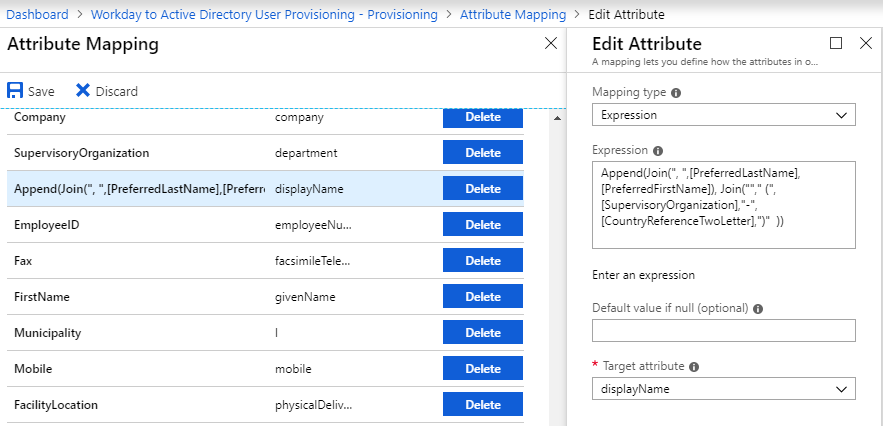

* Extending the above example, let's say you would like to convert city names coming from Workday into shorthand values and then use it to build display names such as *Smith, John (CHI)* or *Doe, Jane (NYC)*, then this result can be achieved using a Switch expression with the Workday *Municipality* attribute as the determinant variable.

     ```
    Switch
    (
      [Municipality],
      Join(", ", [PreferredLastName], [PreferredFirstName]),  
           "Chicago", Append(Join(", ",[PreferredLastName], [PreferredFirstName]), "(CHI)"),
           "New York", Append(Join(", ",[PreferredLastName], [PreferredFirstName]), "(NYC)"),
           "Phoenix", Append(Join(", ",[PreferredLastName], [PreferredFirstName]), "(PHX)")
    )
     ```
    See also:
  * [Switch Function Syntax](../app-provisioning/functions-for-customizing-application-data.md#switch)
  * [Join Function Syntax](../app-provisioning/functions-for-customizing-application-data.md#join)
  * [Append Function Syntax](../app-provisioning/functions-for-customizing-application-data.md#append)

#### How can I use SelectUniqueValue to generate unique values for samAccountName attribute?

Let's say you want to generate unique values for *samAccountName* attribute using a combination of *FirstName* and *LastName* attributes from Workday. Given below is an expression that you can start with:

```
SelectUniqueValue(
    Replace(Mid(Replace(NormalizeDiacritics(StripSpaces(Join("",  Mid([FirstName],1,1), [LastName]))), , "([\\/\\\\\\[\\]\\:\\;\\|\\=\\,\\+\\*\\?\\<\\>])", , "", , ), 1, 20), , "(\\.)*$", , "", , ),
    Replace(Mid(Replace(NormalizeDiacritics(StripSpaces(Join("",  Mid([FirstName],1,2), [LastName]))), , "([\\/\\\\\\[\\]\\:\\;\\|\\=\\,\\+\\*\\?\\<\\>])", , "", , ), 1, 20), , "(\\.)*$", , "", , ),
    Replace(Mid(Replace(NormalizeDiacritics(StripSpaces(Join("",  Mid([FirstName],1,3), [LastName]))), , "([\\/\\\\\\[\\]\\:\\;\\|\\=\\,\\+\\*\\?\\<\\>])", , "", , ), 1, 20), , "(\\.)*$", , "", , )
)
```

How the above expression works: If the user is John Smith, it first tries to generate JSmith, if JSmith already exists, then it generates JoSmith, if that exists, it generates JohSmith. The expression also ensures that the value generated meets the length restriction and special characters restriction associated with *samAccountName*.

See also:

* [Mid Function Syntax](../app-provisioning/functions-for-customizing-application-data.md#mid)
* [Replace Function Syntax](../app-provisioning/functions-for-customizing-application-data.md#replace)
* [SelectUniqueValue Function Syntax](../app-provisioning/functions-for-customizing-application-data.md#selectuniquevalue)

#### How do I remove characters with diacritics and convert them into normal English alphabets?

Use the function [NormalizeDiacritics](../app-provisioning/functions-for-customizing-application-data.md#normalizediacritics) to remove special characters in first name and last name of the user, while constructing the email address or CN value for the user.

## Troubleshooting tips

This section provides specific guidance on how to troubleshoot provisioning issues with your Workday integration using the Azure AD Audit Logs and Windows Server Event Viewer logs. It builds on top of the generic troubleshooting steps and concepts captured in the [Tutorial: Reporting on automatic user account provisioning](../app-provisioning/check-status-user-account-provisioning.md)

This section covers the following aspects of troubleshooting:

* [Setting up Windows Event Viewer for agent troubleshooting](#setting-up-windows-event-viewer-for-agent-troubleshooting)
* [Setting up Azure portal Audit Logs for service troubleshooting](#setting-up-azure-portal-audit-logs-for-service-troubleshooting)
* [Understanding logs for AD User Account create operations](#understanding-logs-for-ad-user-account-create-operations)
* [Understanding logs for Manager update operations](#understanding-logs-for-manager-update-operations)
* [Resolving commonly encountered errors](#resolving-commonly-encountered-errors)

### Setting up Windows Event Viewer for agent troubleshooting

* Sign in to the Windows Server machine where the Provisioning Agent is deployed
* Open **Windows Server Event Viewer** desktop app.
* Select **Windows Logs > Application**.
* Use the **Filter Current Log…** option to view all events logged under the source **AAD.Connect.ProvisioningAgent** and exclude events with Event ID "5", by specifying the filter "-5" as shown below.

  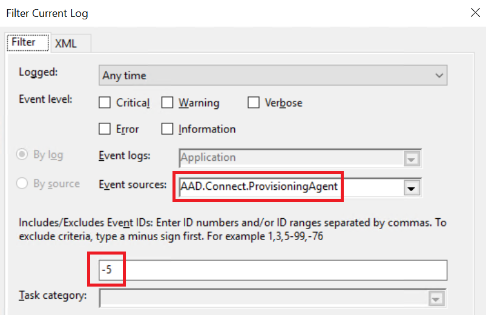)

* Click **OK** and sort the result view by **Date and Time** column.

### Setting up Azure portal Audit Logs for service troubleshooting

* Launch the [Azure portal](https://portal.azure.com), and navigate to the **Audit logs** section of your Workday provisioning application.
* Use the **Columns** button on the Audit Logs page to display only the following columns in the view (Date, Activity, Status, Status Reason). This configuration ensures that you focus only on data that is relevant for troubleshooting.

  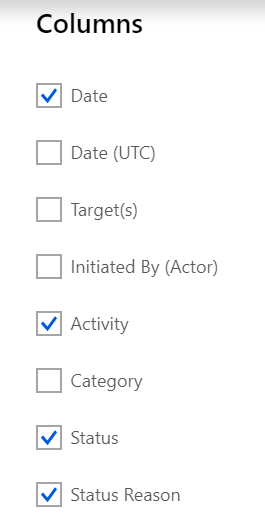

* Use the **Target** and **Date Range** query parameters to filter the view. 
  * Set the **Target** query parameter to the "Worker ID" or "Employee ID" of the Workday worker object.
  * Set the **Date Range** to an appropriate time period over which you want to investigate for errors or issues with the provisioning.

  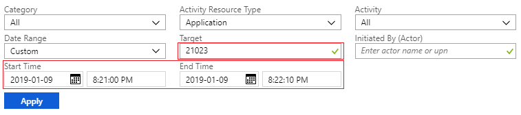

### Understanding logs for AD User Account create operations

When a new hire in Workday is detected (let's say with Employee ID *21023*), the Azure AD provisioning service attempts to create a new AD user account for the worker and in the process creates 4 audit log records as described below:

  [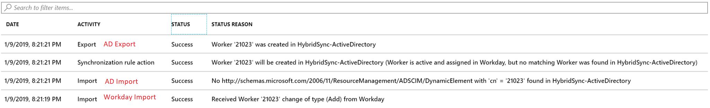](media/workday-inbound-tutorial/wd_audit_logs_02.png#lightbox)

When you click on any of the audit log records, the **Activity Details** page opens up. Here is what the **Activity Details** page displays for each log record type.

* **Workday Import** record: This log record displays the worker information fetched from Workday. Use information in the *Additional Details* section of the log record to troubleshoot issues with fetching data from Workday. An example record is shown below along with pointers on how to interpret each field.

  ```JSON
  ErrorCode : None  // Use the error code captured here to troubleshoot Workday issues
  EventName : EntryImportAdd // For full sync, value is "EntryImportAdd" and for delta sync, value is "EntryImport"
  JoiningProperty : 21023 // Value of the Workday attribute that serves as the Matching ID (usually the Worker ID or Employee ID field)
  SourceAnchor : a071861412de4c2486eb10e5ae0834c3 // set to the WorkdayID (WID) associated with the record
  ```

* **AD Import** record: This log record displays information of the account fetched from AD. As during initial user creation there is no AD account, the *Activity Status Reason* will indicate that no account with the Matching ID attribute value was found in Active Directory. Use information in the *Additional Details* section of the log record to troubleshoot issues with fetching data from Workday. An example record is shown below along with pointers on how to interpret each field.

  ```JSON
  ErrorCode : None // Use the error code captured here to troubleshoot Workday issues
  EventName : EntryImportObjectNotFound // Implies that object was not found in AD
  JoiningProperty : 21023 // Value of the Workday attribute that serves as the Matching ID
  ```

  To find Provisioning Agent log records corresponding to this AD import operation, open the Windows Event Viewer logs and use the **Find…** menu option to find log entries containing the Matching ID/Joining Property attribute value (in this case *21023*).

  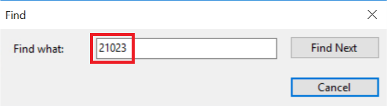

  Look for the entry with *Event ID = 9*, which will provide you the LDAP search filter used by the agent to retrieve the AD account. You can verify if this is the right search filter to retrieve unique user entries.

  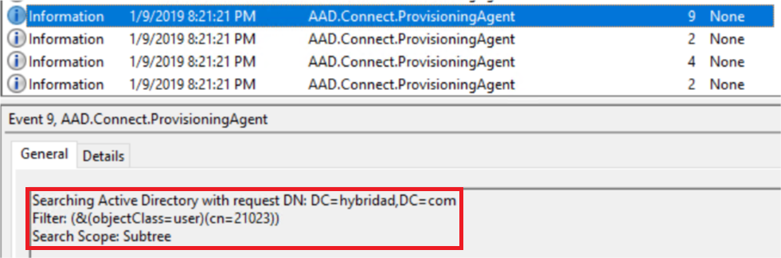

  The record that immediately follows it with *Event ID = 2* captures the result of the search operation and if it returned any results.

  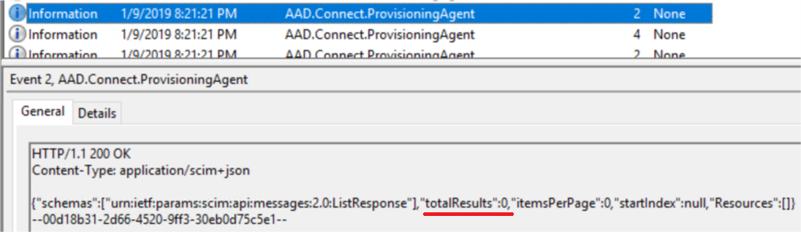

* **Synchronization rule action** record: This log record displays the results of the attribute mapping rules and configured scoping filters along with the provisioning action that will be taken to process the incoming Workday event. Use information in the *Additional Details* section of the log record to troubleshoot issues with the synchronization action. An example record is shown below along with pointers on how to interpret each field.

  ```JSON
  ErrorCode : None // Use the error code captured here to troubleshoot sync issues
  EventName : EntrySynchronizationAdd // Implies that the object will be added
  JoiningProperty : 21023 // Value of the Workday attribute that serves as the Matching ID
  SourceAnchor : a071861412de4c2486eb10e5ae0834c3 // set to the WorkdayID (WID) associated with the profile in Workday
  ```

  If there are issues with your attribute mapping expressions or the incoming Workday data has issues (for example: empty or null value for required attributes), then you will observe a failure at this stage with the ErrorCode providing details of the failure.

* **AD Export** record: This log record displays the result of AD account creation operation along with the attribute values that were set in the process. Use information in the *Additional Details* section of the log record to troubleshoot issues with the account create operation. An example record is shown below along with pointers on how to interpret each field. In the "Additional Details" section, the "EventName" is set to "EntryExportAdd", the "JoiningProperty" is set to the value of the Matching ID attribute, the "SourceAnchor" is set to the WorkdayID (WID) associated with the record and the "TargetAnchor" is set to the value of the AD "ObjectGuid" attribute of the newly created user. 

  ```JSON
  ErrorCode : None // Use the error code captured here to troubleshoot AD account creation issues
  EventName : EntryExportAdd // Implies that object will be created
  JoiningProperty : 21023 // Value of the Workday attribute that serves as the Matching ID
  SourceAnchor : a071861412de4c2486eb10e5ae0834c3 // set to the WorkdayID (WID) associated with the profile in Workday
  TargetAnchor : 83f0156c-3222-407e-939c-56677831d525 // set to the value of the AD "objectGuid" attribute of the new user
  ```

  To find Provisioning Agent log records corresponding to this AD export operation, open the Windows Event Viewer logs and use the **Find…** menu option to find log entries containing the Matching ID/Joining Property attribute value (in this case *21023*).  

  Look for a HTTP POST record corresponding to the timestamp of the export operation with *Event ID = 2*. This record will contain the attribute values sent by the provisioning service to the provisioning agent.

  [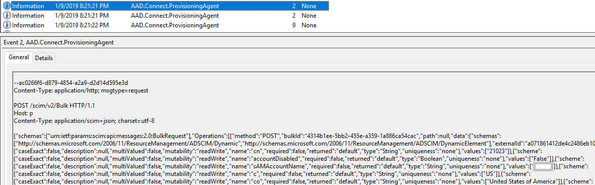](media/workday-inbound-tutorial/wd_event_viewer_05.png#lightbox)

  Immediately following the above event, there should be another event that captures the response of the create AD account operation. This event returns the new objectGuid created in AD and it is set as the TargetAnchor attribute in the provisioning service.

  [](media/workday-inbound-tutorial/wd_event_viewer_06.png#lightbox)

### Understanding logs for manager update operations

The manager attribute is a reference attribute in AD. The provisioning service does not set the manager attribute as part of the user creation operation. Rather the manager attribute is set as part of an *update* operation after AD account is created for the user. Expanding the example above, let's say a new hire with Employee ID "21451" is activated in Workday and the new hire's manager (*21023*) already has an AD account. In this scenario, searching the Audit logs for user 21451 shows up 5 entries.

  [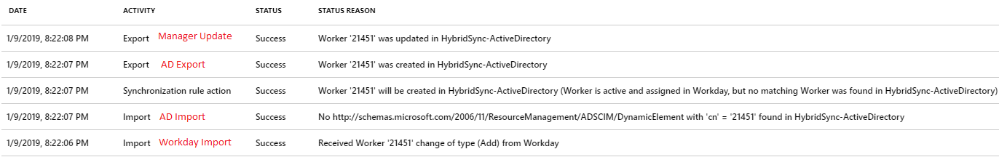](media/workday-inbound-tutorial/wd_audit_logs_03.png#lightbox)

The first 4 records are like the ones we explored as part of the user create operation. The 5th record is the export associated with manager attribute update. The log record displays the result of AD account manager update operation, which is performed using the manager's *objectGuid* attribute.

  ```JSON
  // Modified Properties
  Name : manager
  New Value : "83f0156c-3222-407e-939c-56677831d525" // objectGuid of the user 21023

  // Additional Details
  ErrorCode : None // Use the error code captured here to troubleshoot AD account creation issues
  EventName : EntryExportUpdate // Implies that object will be created
  JoiningProperty : 21451 // Value of the Workday attribute that serves as the Matching ID
  SourceAnchor : 9603bf594b9901693f307815bf21870a // WorkdayID of the user
  TargetAnchor : 43b668e7-1d73-401c-a00a-fed14d31a1a8 // objectGuid of the user 21451

  ```

### Resolving commonly encountered errors

This section covers commonly seen errors with Workday user provisioning and how to resolve it. The errors are grouped as follows:

* [Provisioning agent errors](#provisioning-agent-errors)
* [Connectivity errors](#connectivity-errors)
* [AD user account creation errors](#ad-user-account-creation-errors)
* [AD user account update errors](#ad-user-account-update-errors)

#### Provisioning agent errors

|#|Error Scenario |Probable Causes|Recommended Resolution|
|--|---|---|---|
|1.| Error installing the provisioning agent with error message:  *Service 'Microsoft Azure AD Connect Provisioning Agent' (AADConnectProvisioningAgent) failed to start. Verify that you have sufficient privileges to start the system.* | This error usually shows up if you are trying to install the provisioning agent on a domain controller and group policy prevents the service from starting.  It is also seen if you have a previous version of the agent running and  you have not uninstalled it before starting a new installation.| Install the provisioning agent on a non-DC server. Ensure that previous versions of the agent are uninstalled before installing the new agent.|
|2.| The Windows Service 'Microsoft Azure AD Connect Provisioning Agent' is in *Starting* state and does not switch to *Running* state. | As part of the installation, the agent wizard creates a local account (**NT Service\\AADConnectProvisioningAgent**) on the server and this is the logon account used for starting the service. If a security policy on your Windows server prevents local accounts from running the services, you will encounter this error. | Open the *Services console*. Right click on the Windows Service 'Microsoft Azure AD Connect Provisioning Agent' and in the logon tab specify the account of a domain administrator to run the service. Restart the service. |
|3.| When configuring the provisioning agent with your AD domain in the step *Connect Active Directory*, the wizard takes a long time trying to load the AD schema and eventually times out. | This error usually shows up if the wizard is unable to contact the AD domain controller server due to firewall issues. | On the *Connect Active Directory* wizard screen, while providing the credentials for your AD domain, there is an option called *Select domain controller priority*. Use this option to select a domain controller that is in the same site as the agent server and ensure that there are no firewall rules blocking the communication. |

#### Connectivity errors

If the provisioning service is unable to connect to Workday or Active Directory, it could cause the provisioning to go into a quarantined state. Use the table below to troubleshoot connectivity issues.

|#|Error Scenario |Probable Causes|Recommended Resolution|
|--|---|---|---|
|1.| When you click on **Test Connection**, you get the error message: *There was an error connecting to Active Directory. Please ensure that the on-premises Provisioning Agent is running and it is configured with the correct Active Directory domain.* | This error usually shows up if the provisioning agent is not running or there is a firewall blocking communication between Azure AD and the provisioning agent. You may also see this error, if the domain is not configured in the Agent Wizard. | Open the *Services* console on the Windows server to confirm that the agent is running. Open the provisioning agent wizard and confirm that the right domain is registered with the agent.  |
|2.| The provisioning job goes into quarantine state over the weekends (Fri-Sat) and we get an email notification that there is an error with the synchronization. | One of the common causes for this error is the planned Workday downtime. If you are using a Workday implementation tenant, please note that Workday has scheduled down time for its implementation tenants over weekends (usually from Friday evening to Saturday morning) and during that period the Workday provisioning apps may go into quarantine state as it is not able to connect to Workday. It gets back to normal state once the Workday implementation tenant is back online. In rare cases, you may also see this error, if the password of the Integration System User changed due to tenant refresh or if the account is in locked or expired state. | Check with your Workday administrator or integration partner to see when Workday schedules downtime to ignore alert messages during the downtime period and confirm availability once Workday instance is back online.  |


#### AD user account creation errors

|#|Error Scenario |Probable Causes|Recommended Resolution|
|--|---|---|---|
|1.| Export operation failures in the audit log with the message *Error: OperationsError-SvcErr: An operation error occurred. No superior reference has been configured for the directory service. The directory service is therefore unable to issue referrals to objects outside this forest.* | This error usually shows up if the *Active Directory Container* OU is not set correctly or if there are issues with the Expression Mapping used for *parentDistinguishedName*. | Check the *Active Directory Container* OU parameter for typos. If you are using *parentDistinguishedName* in the attribute mapping ensure that it always evaluates to a known container within the AD domain. Check the *Export* event in the audit logs to see the generated value. |
|2.| Export operation failures in the audit log with error code: *SystemForCrossDomainIdentityManagementBadResponse* and message *Error: ConstraintViolation-AtrErr: A value in the request is invalid. A value for the attribute was not in the acceptable range of values. \nError Details: CONSTRAINT_ATT_TYPE - company*. | While this error is specific to the *company* attribute, you may see this error for other attributes like *CN* as well. This error appears due to AD enforced schema constraint. By default, the attributes like *company* and *CN* in AD have an upper limit of 64 characters. If the value coming from Workday is more than 64 characters, then you will see this error message. | Check the *Export* event in the audit logs to see the value for the attribute reported in the error message. Consider truncating the value coming from Workday using the [Mid](../app-provisioning/functions-for-customizing-application-data.md#mid) function or changing the mappings to an AD attribute that does not have similar length constraints.  |

#### AD user account update errors

During the AD user account update process, the provisioning service reads information from both Workday and AD, runs the attribute mapping rules and determines if any change needs to take effect. Accordingly an update event is triggered. If any of these steps encounters a failure, it is logged in the audit logs. Use the table below to troubleshoot common update errors.

|#|Error Scenario |Probable Causes|Recommended Resolution|
|--|---|---|---|
|1.| Synchronization rule action failures in the audit log with the message *EventName = EntrySynchronizationError and ErrorCode = EndpointUnavailable*. | This error shows up if the provisioning service is unable to retrieve user profile data from Active Directory due to a processing error encountered by the on-premises provisioning agent. | Check the Provisioning Agent Event Viewer logs for error events that indicate issues with the read operation (Filter by Event ID #2). |
|2.| The manager attribute in AD does not get updated for certain users in AD. | The most likely cause of this error is if you are using scoping rules and the user's manager is not part of the scope. You may also run into this issue if the manager's matching ID attribute (e.g. EmployeeID) is not found in the target AD domain or not set to the correct value. | Review the scoping filter and add the manager user in scope. Check the manager's profile in AD to make sure that there is a value for the matching ID attribute. |

## Managing your configuration

This section describes how you can further extend, customize and manage your Workday-driven user provisioning configuration. It covers the following topics:

* [Customizing the list of Workday user attributes](#customizing-the-list-of-workday-user-attributes)  
* [Exporting and importing your configuration](#exporting-and-importing-your-configuration)

### Customizing the list of Workday user attributes

The Workday provisioning apps for Active Directory and Azure AD both include a default list of Workday user attributes you can select from. However, these lists are not comprehensive. Workday supports many hundreds of possible user attributes, which can either be standard or unique to your Workday tenant.

The Azure AD provisioning service supports the ability to customize your list or Workday attribute to include any attributes exposed in the [Get_Workers](https://community.workday.com/sites/default/files/file-hosting/productionapi/Human_Resources/v21.1/Get_Workers.html) operation of the Human Resources API.

To do this change, you must use [Workday Studio](https://community.workday.com/studio-download) to extract the XPath expressions that represent the attributes you wish to use, and then add them to your provisioning configuration using the advanced attribute editor in the Azure portal.

**To retrieve an XPath expression for a Workday user attribute:**

1. Download and install [Workday Studio](https://community.workday.com/studio-download). You will need a Workday community account to access the installer.

2. Download the Workday **Human_Resources** WSDL file specific to the WWS API version you plan to use from the [Workday Web Services Directory](https://community.workday.com/sites/default/files/file-hosting/productionapi/index.html)

3. Launch Workday Studio.

4. From the command bar, select the  **Workday > Test Web Service in Tester** option.

5. Select **External**, and select the Human_Resources WSDL file you downloaded in step 2.

    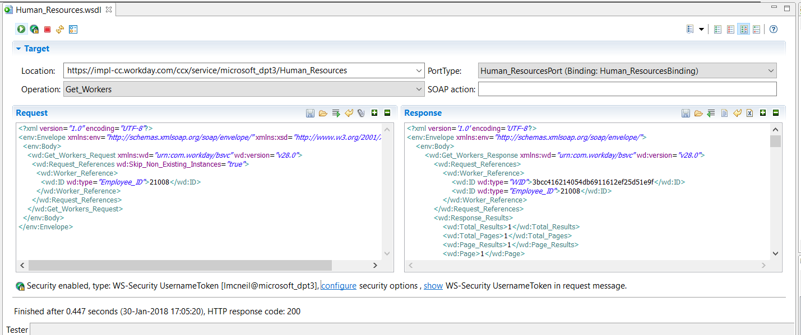

6. Set the **Location** field to `https://IMPL-CC.workday.com/ccx/service/TENANT/Human_Resources`, but replacing "IMPL-CC" with your actual instance type, and "TENANT" with your real tenant name.

7. Set **Operation** to **Get_Workers**

8.    Click the small **configure** link below the Request/Response panes to set your Workday credentials. Check **Authentication**, and then enter the user name and password for your Workday integration system account. Be sure to format the user name as name\@tenant, and leave the **WS-Security UsernameToken** option selected.
   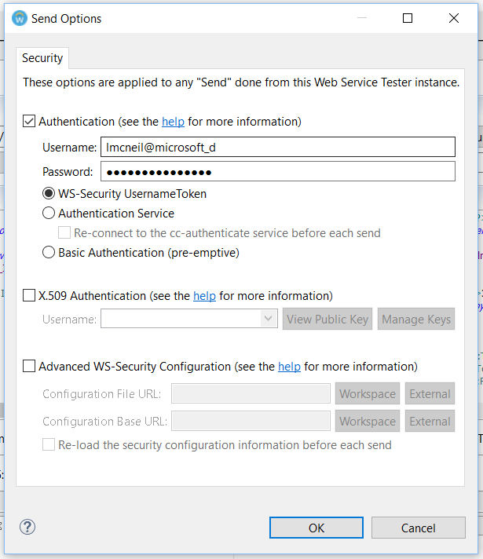

9. Select **OK**.

10. In the **Request** pane, paste in the XML below. Set **Employee_ID** to the employee ID of a real user in your Workday tenant. Set **wd:version** to the version of WWS that you plan to use. Select a user that has the attribute populated that you wish to extract.

    ```xml
    <?xml version="1.0" encoding="UTF-8"?>
    <env:Envelope xmlns:env="http://schemas.xmlsoap.org/soap/envelope/" xmlns:xsd="https://www.w3.org/2001/XMLSchema">
      <env:Body>
        <wd:Get_Workers_Request xmlns:wd="urn:com.workday/bsvc" wd:version="v21.1">
          <wd:Request_References wd:Skip_Non_Existing_Instances="true">
            <wd:Worker_Reference>
              <wd:ID wd:type="Employee_ID">21008</wd:ID>
            </wd:Worker_Reference>
          </wd:Request_References>
          <wd:Response_Group>
            <wd:Include_Reference>true</wd:Include_Reference>
            <wd:Include_Personal_Information>true</wd:Include_Personal_Information>
            <wd:Include_Employment_Information>true</wd:Include_Employment_Information>
            <wd:Include_Management_Chain_Data>true</wd:Include_Management_Chain_Data>
            <wd:Include_Organizations>true</wd:Include_Organizations>
            <wd:Include_Reference>true</wd:Include_Reference>
            <wd:Include_Transaction_Log_Data>true</wd:Include_Transaction_Log_Data>
            <wd:Include_Photo>true</wd:Include_Photo>
            <wd:Include_User_Account>true</wd:Include_User_Account>
          <wd:Include_Roles>true</wd:Include_Roles>
          </wd:Response_Group>
        </wd:Get_Workers_Request>
      </env:Body>
    </env:Envelope>
    ```

11. Click the **Send Request** (green arrow) to execute the command. If successful, the response should appear in the **Response** pane. Check the response to ensure it has the data of the user ID you entered, and not an error.

12. If successful, copy the XML from the **Response** pane and save it as an XML file.

13. In the command bar of Workday Studio, select **File > Open File...** and open the XML file you saved. This action will open the file in the Workday Studio XML editor.

    

14. In the file tree, navigate through **/env: Envelope > env: Body > wd:Get_Workers_Response > wd:Response_Data > wd: Worker** to find your user's data.

15. Under **wd: Worker**, find the attribute that you wish to add, and select it.

16. Copy the XPath expression for your selected attribute out of the **Document Path** field.

17. Remove the **/env:Envelope/env:Body/wd:Get_Workers_Response/wd:Response_Data/** prefix from the copied expression.

18. If the last item in the copied expression is a node (example: "/wd: Birth_Date"), then append **/text()** at the end of the expression. This is not necessary if the last item is an attribute (example: "/@wd: type").

19. The result should be something like `wd:Worker/wd:Worker_Data/wd:Personal_Data/wd:Birth_Date/text()`. This value is what you will copy into the Azure portal.

**To add your custom Workday user attribute to your provisioning configuration:**

1. Launch the [Azure portal](https://portal.azure.com), and navigate to the Provisioning section of your Workday provisioning application, as described earlier in this tutorial.

2. Set **Provisioning Status** to **Off**, and select **Save**. This step will help ensure your changes will take effect only when you are ready.

3. Under **Mappings**, select **Synchronize Workday Workers to On Premises Active Directory** (or **Synchronize Workday Workers to Azure AD**).

4. Scroll to the bottom of the next screen, and select **Show advanced options**.

5. Select **Edit attribute list for Workday**.

    

6. Scroll to the bottom of the attribute list to where the input fields are.

7. For **Name**, enter a display name for your attribute.

8. For **Type**, select type that appropriately corresponds to your attribute (**String** is most common).

9. For **API Expression**, enter the XPath expression you copied from Workday Studio. Example: `wd:Worker/wd:Worker_Data/wd:Personal_Data/wd:Birth_Date/text()`

10. Select **Add Attribute**.

    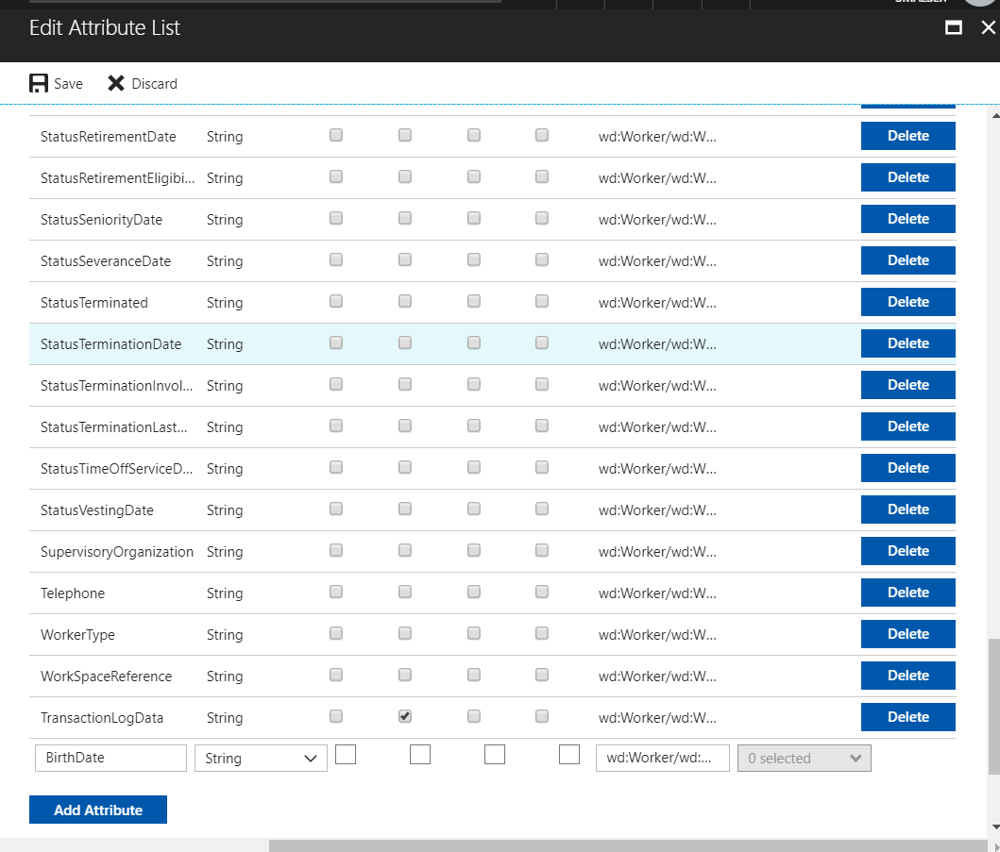

11. Select **Save** above, and then **Yes** to the dialog. Close the Attribute-Mapping screen if it is still open.

12. Back on the main **Provisioning** tab, select **Synchronize Workday Workers to On Premises Active Directory** (or **Synchronize Workers to Azure AD**) again.

13. Select **Add new mapping**.

14. Your new attribute should now appear in the **Source attribute** list.

15. Add a mapping for your new attribute as desired.

16. When finished, remember to set **Provisioning Status** back to **On** and save.

### Exporting and importing your configuration

Refer to the article [Exporting and importing provisioning configuration](../app-provisioning/export-import-provisioning-configuration.md)

## Managing personal data

The Workday provisioning solution for Active Directory requires a provisioning agent to be installed on an on-premises Windows server, and this agent creates logs in the Windows Event log which may contain personal data depending on your Workday to AD attribute mappings. To comply with user privacy obligations, you can ensure that no data is retained in the Event logs beyond 48 hours by setting up a Windows scheduled task to clear the event log.

The Azure AD provisioning service falls into the **data processor** category of GDPR classification. As a data processor pipeline, the service provides data processing services to key partners and end consumers. Azure AD provisioning service does not generate user data and has no independent control over what personal data is collected and how it is used. Data retrieval, aggregation, analysis, and reporting in Azure AD provisioning service are based on existing enterprise data.

[!INCLUDE [GDPR-related guidance](../../../includes/gdpr-hybrid-note.md)]

With respect to data retention, the Azure AD provisioning service does not generate reports, perform analytics, or provide insights beyond 30 days. Therefore, Azure AD provisioning service does not store, process, or retain any data beyond 30 days. This design is compliant with the GDPR regulations, Microsoft privacy compliance regulations, and Azure AD data retention policies.

## Next steps

* [Learn how to review logs and get reports on provisioning activity](../app-provisioning/check-status-user-account-provisioning.md)
* [Learn how to configure single sign-on between Workday and Azure Active Directory](workday-tutorial.md)
* [Learn how to integrate other SaaS applications with Azure Active Directory](tutorial-list.md)
* [Learn how to use Microsoft Graph APIs to manage provisioning configurations](https://developer.microsoft.com/graph/docs/api-reference/beta/resources/synchronization-overview)
