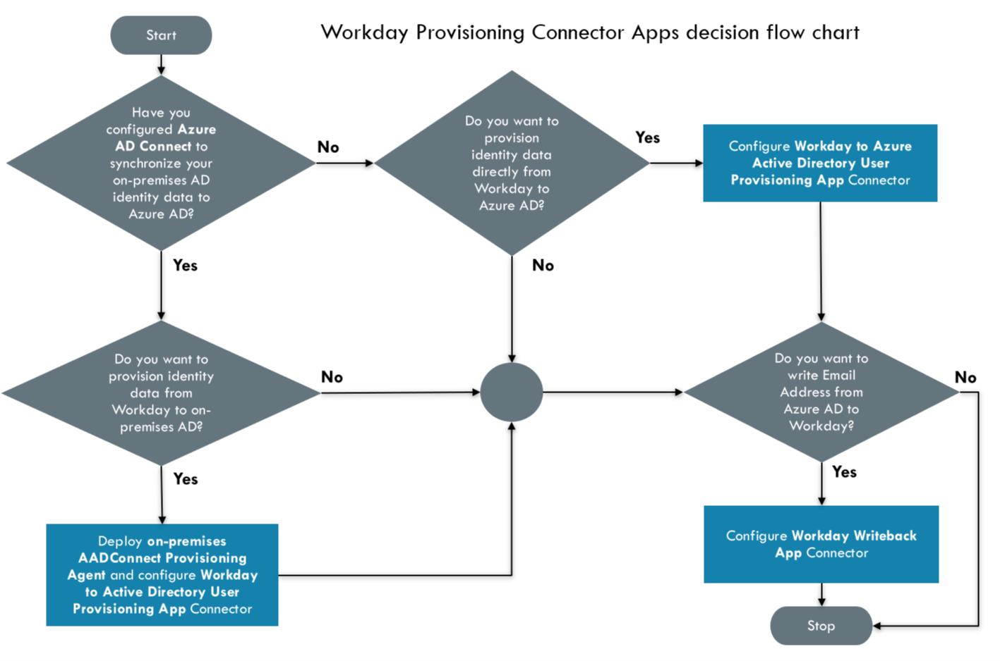
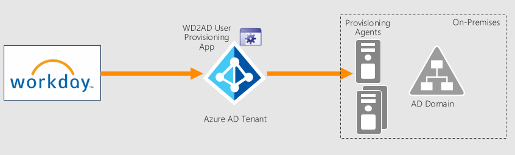
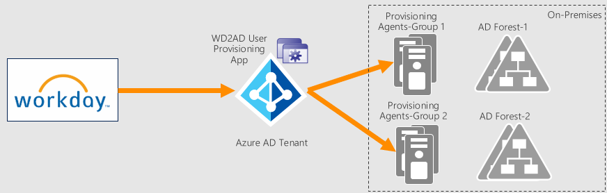
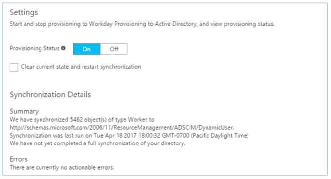
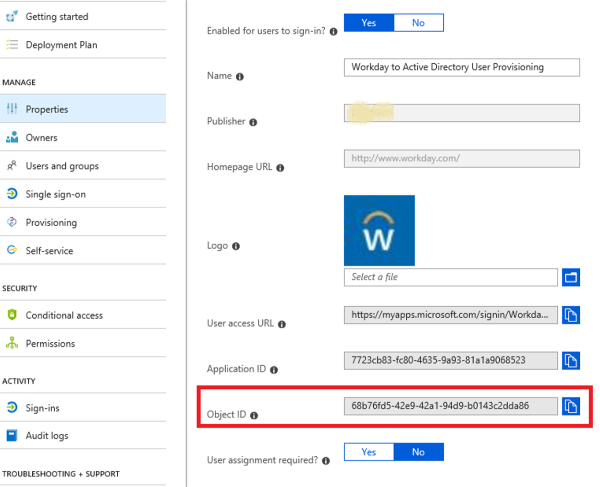
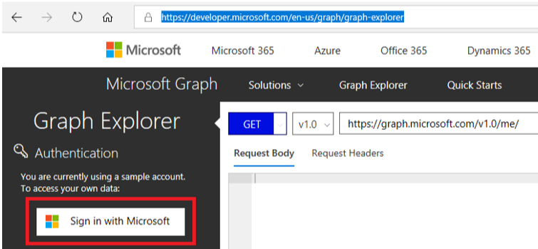
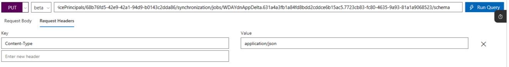

# Tutorial: Configure Workday for automatic user provisioning

The objective of this tutorial is to show you the steps you need to perform to import worker profiles from Workday into both Active Directory and Azure Active Directory, with optional write-back of email address to Workday.

## Overview

The [Azure Active Directory user provisioning service](../manage-apps/user-provisioning.md) integrates with the [Workday Human Resources API](https://community.workday.com/sites/default/files/file-hosting/productionapi/Human_Resources/v21.1/Get_Workers.html) in order to provision user accounts. Azure AD uses this connection to enable the following user provisioning workflows:

* **Provisioning users to Active Directory** - Synchronize selected sets of users from Workday into one or more Active Directory domains.

* **Provisioning cloud-only users to Azure Active Directory** - In scenarios where on-premises Active Directory is not used, users can be provisioned directly from Workday to Azure Active Directory using the Azure AD user provisioning service. 

* **Write back of email addresses to Workday** - The Azure AD user provisioning service can write the email addresses of Azure AD users  back to Workday. 

### What human resources scenarios does it cover?

The Workday user provisioning workflows supported by the Azure AD user provisioning service enable automation of the following human resources and identity lifecycle management scenarios:

* **Hiring new employees** - When a new employee is added to Workday, a user account is automatically created in Active Directory, Azure Active Directory, and optionally Office 365 and [other SaaS applications supported by Azure AD](../manage-apps/user-provisioning.md), with write-back of the email address to Workday.

* **Employee attribute and profile updates** - When an employee record is updated in Workday (such as their name, title, or manager), their user account will be automatically updated in Active Directory, Azure Active Directory, and optionally Office 365 and [other SaaS applications supported by Azure AD](../manage-apps/user-provisioning.md).

* **Employee terminations** - When an employee is terminated in Workday, their user account is automatically disabled in Active Directory, Azure Active Directory, and optionally Office 365 and [other SaaS applications supported by Azure AD](../manage-apps/user-provisioning.md).

* **Employee rehires** - When an employee is rehired in Workday, their old account can be automatically reactivated or re-provisioned (depending on your preference) to Active Directory, Azure Active Directory, and optionally Office 365 and [other SaaS applications supported by Azure AD](../manage-apps/user-provisioning.md).

### Who is this user provisioning solution best suited for?

This Workday user provisioning solution is presently in public preview, and is ideally suited for:

* Organizations that desire a pre-built, cloud-based solution for Workday user provisioning

* Organizations that require direct user provisioning from Workday to Active Directory, or Azure Active Directory

* Organizations that require users to be provisioned using data obtained from the Workday HCM module (see [Get_Workers](https://community.workday.com/sites/default/files/file-hosting/productionapi/Human_Resources/v21.1/Get_Workers.html))

* Organizations that require joining, moving, and leaving users to be synced to one or more Active Directory Forests, Domains, and OUs based only on change information detected in the Workday HCM module (see [Get_Workers](https://community.workday.com/sites/default/files/file-hosting/productionapi/Human_Resources/v21.1/Get_Workers.html))

* Organizations using Office 365 for email

[!INCLUDE [GDPR-related guidance](../../../includes/gdpr-hybrid-note.md)]

## Solution Architecture

This section describes the end-to-end user provisioning solution architecture for common hybrid environments. There are two related flows:

* **Authoritative HR Data Flow – from Workday to on-premises Active Directory:** In this flow worker events (such as New Hires, Transfers, Terminations) first occur in the cloud Workday HR tenant and then the event data flows into on-premises Active Directory through Azure AD and the Provisioning Agent. Depending on the event, it may lead to create/update/enable/disable operations in AD.
* **Email Writeback Flow – from on-premises Active Directory to Workday:** Once the account creation is complete in Active Directory, it is synced with Azure AD through Azure AD Connect and email attribute sourced from Active Directory can be written back to Workday.


### End-to-end user data flow

1. The HR team performs worker transactions (Joiners/Movers/Leavers or New Hires/Transfers/Terminations) in Workday HCM
2. The Azure AD Provisioning Service runs scheduled synchronizations of identities from Workday HR and identifies changes that need to be processed for sync with on-premises Active Directory.
3. The Azure AD Provisioning Service invokes the on-premises AAD Connect Provisioning Agent with a request payload containing AD account create/update/enable/disable operations.
4. The Azure AD Connect Provisioning Agent uses a service account to add/update AD account data.
5. The Azure AD Connect / AD Sync engine runs delta sync to pull updates in AD.
6. The Active Directory updates are synced with Azure Active Directory.
7. If the Workday Writeback connector is configured, it write-backs email attribute to Workday, based on the matching attribute used.

## Planning your deployment

Before beginning your Workday integration, check the prerequisites below and read the following guidance on how to match your current Active Directory architecture and user provisioning requirements with the solution(s) provided by Azure Active Directory.

This section covers the following aspects of planning:

* [Prerequisites](#prerequisites)
* [Selecting provisioning connector apps to deploy](#selecting-provisioning-connector-apps-to-deploy)
* [Planning deployment of Azure AD Connect Provisioning Agent](#planning-deployment-of-azure-ad-connect-provisioning-agent)
* [Integrating with multiple Active Directory domains](#integrating-with-multiple-active-directory-domains)
* [Planning Workday to Active Directory User Attribute Mapping and Transformations](#planning-workday-to-active-directory-user-attribute-mapping-and-transformations)

### Prerequisites

The scenario outlined in this tutorial assumes that you already have the following items:

* A valid Azure AD Premium P1 subscription with global administrator access
* A Workday implementation tenant for testing and integration purposes
* Administrator permissions in Workday to create a system integration user, and make changes to test employee data for testing purposes
* For user provisioning to Active Directory, a server running Windows Server 2012 or greater with .NET 4.7.1+ runtime is required to host the [on-premises provisioning agent](https://go.microsoft.com/fwlink/?linkid=847801)
* [Azure AD Connect](../hybrid/whatis-hybrid-identity.md) for synchronizing between Active Directory and Azure AD

### Selecting provisioning connector apps to deploy

To facilitate provisioning workflows between Workday and Active Directory, Azure AD provides multiple provisioning connector apps that you can add from the Azure AD app gallery:


* **Workday to Active Directory User Provisioning** - This app facilitates user account provisioning from Workday to a single Active Directory domain. If you have multiple domains, you can add one instance of this app from the Azure AD app gallery for each Active Directory domain you need to provision to.

* **Workday to Azure AD User Provisioning** - While AAD Connect is the tool that should be used to synchronize Active Directory users to Azure Active Directory, this app can be used to facilitate provisioning of cloud-only users from Workday to a single Azure Active Directory tenant.

* **Workday Writeback** - This app facilitates write-back of user's email addresses from Azure Active Directory to Workday.

> [!TIP]
> The regular "Workday" app is used for setting up single sign-on between Workday and Azure Active Directory.

Use the decision flow chart below to identify which Workday provisioning apps are relevant to your scenario.
    

Use the table of contents to go to the relevant section of this tutorial.

### Planning deployment of Azure AD Connect Provisioning Agent

> [!NOTE]
> This section is relevant only if you plan to deploy the Workday to Active Directory User Provisioning App. You can skip this if you are deploying the Workday Writeback or Workday to Azure AD User Provisioning App.

The Workday to AD User Provisioning solution requires deploying one or more Provisioning Agents on servers running Windows 2012 R2 or greater with minimum of 4 GB RAM and .NET 4.7.1+ runtime. The following considerations must be taken into account before installing the Provisioning Agent:

* Ensure that the host server running the Provisioning Agent has network access to the target AD domain
* The Provisioning Agent Configuration Wizard registers the agent with your Azure AD tenant and the registration process requires access to *.msappproxy.net over the SSL port 443. Ensure that outbound firewall rules are in place that enable this communication. The agent supports [outbound HTTPS proxy configuration](#how-do-i-configure-the-provisioning-agent-to-use-a-proxy-server-for-outbound-http-communication)
* The Provisioning Agent uses a service account to communicate with the on-premises AD domain(s). Prior to installation of the agent, it is recommended that you create a service account with domain administrator permissions and a password that does not expire.  
* During the Provisioning Agent configuration, you can select domain controllers that should handle provisioning requests. If you have several geographically distributed domain controllers, install the Provisioning Agent in the same site as your preferred domain controller(s) to improve the reliability and performance of the end-to-end solution
* For high availability, you can deploy more than one Provisioning Agent and register it to handle the same set of on-premises AD domains.

> [!IMPORTANT]
> In production environments, Microsoft recommends that you have a minimum of 3 Provisioning Agents configured with your Azure AD tenant for high availability.

### Integrating with multiple Active Directory domains

> [!NOTE]
> This section is relevant only if you plan to deploy the Workday to Active Directory User Provisioning App. You can skip this if you are deploying the Workday Writeback or Workday to Azure AD User Provisioning App.

Depending on your Active Directory topology, you will need to decide the number of User Provisioning Connector Apps and number of Provisioning Agents to configure. Listed below are some of the common deployment patterns that you can refer to as you plan your deployment.

#### Deployment Scenario #1 : Single Workday Tenant -> Single AD domain

In this scenario, you have one Workday tenant and you would like to provision users to a single target AD domain. Here is the recommended production configuration for this deployment.

|   |   |
| - | - |
| No. of provisioning agents to deploy on-premises | 3 (for high availability and fail over) |
| No. of Workday to AD User Provisioning Apps to configure in Azure Portal | 1 |

  

#### Deployment Scenario #2 : Single Workday Tenant -> Multiple child AD domains

This scenario involves provisioning users from Workday to multiple target AD child domains in a forest. Here is the recommended production configuration for this deployment.

|   |   |
| - | - |
| No. of provisioning agents to deploy on-premises | 3 (for high availability and fail over) |
| No. of Workday to AD User Provisioning Apps to configure in Azure Portal | 1 app per child domain |

  

#### Deployment Scenario #3 : Single Workday Tenant -> Disjoint AD forests

This scenario involves provisioning users from Workday to domains in disjoint AD forests. Here is the recommended production configuration for this deployment.

|   |   |
| - | - |
| No. of provisioning agents to deploy on-premises | 3 per disjoint AD forest |
| No. of Workday to AD User Provisioning Apps to configure in Azure Portal | 1 app per child domain |

  

### Planning Workday to Active Directory User Attribute Mapping and Transformations

> [!NOTE]
> This section is relevant only if you plan to deploy the Workday to Active Directory User Provisioning App. You can skip this if you are deploying the Workday Writeback or Workday to Azure AD User Provisioning App.

Before configuring user provisioning to an Active Directory domain, consider the following questions. The answers to these questions will determine how your scoping filters and attribute mappings need to be set.

* **What users in Workday need to be provisioned to this Active Directory forest?**

  * *Example: Users where the Workday "Company" attribute contains the value "Contoso", and the "Worker_Type" attribute contains "Regular"*

* **How are users routed into different organization units (OUs)?**

  * *Example: Users are routed to OUs that correspond to an office location, as defined in the Workday "Municipality" and "Country_Region_Reference" attributes*

* **How should the following attributes be populated in the Active Directory?**

  * Common Name (cn)
    * *Example: Use the Workday User_ID value, as set by human resources*

  * Employee ID (employeeId)
    * *Example: Use the Workday Worker_ID value*

  * SAM Account Name (sAMAccountName)
    * *Example: Use the Workday User_ID value, filtered through an Azure AD provisioning expression to remove illegal characters*

  * User Principal Name (userPrincipalName)
    * *Example: Use the Workday User_ID value, with an Azure AD provisioning expression to append a domain name*

* **How should users be matched between Workday and Active Directory?**

  * *Example: Users with a specific Workday "Worker_ID" value are matched with Active Directory users where "employeeID" has the same value. If the Worker_ID value is not found in Active Directory, then create a new user.*
  
* **Does the Active Directory forest already contain the user IDs required for the matching logic to work?**

  * *Example: If this is a new Workday deployment, it is recommended that Active Directory be pre-populated with the correct Workday Worker_ID values (or unique ID value of choice) to keep the matching logic as simple as possible.*

How to set up and configure these special provisioning connector apps is the subject of the remaining sections of this tutorial. Which apps you choose to configure will depend on which systems you need to provision to, and how many Active Directory Domains and Azure AD tenants are in your environment.

## Configure integration system user in Workday

A common requirement of all the Workday provisioning connectors is they require credentials for a Workday system integration account to connect to the Workday Human Resources API. This section describes how to create an integration system user in Workday and has the following sections:

* [Creating an integration system user](#creating-an-integration-system-user)
* [Creating an integration security group](#creating-an-integration-security-group)
* [Configuring domain security policy permissions](#configuring-domain-security-policy-permissions)
* [Configuring business process security policy permissions](#configuring-business-process-security-policy-permissions)
* [Activating security policy changes](#activating-security-policy-changes)

> [!NOTE]
> It is possible to bypass this procedure and instead use a Workday global administrator account as the system integration account. This may work fine for demos, but is not recommended for production deployments.

### Creating an integration system user

**To create an integration system user:**

1. Sign into your Workday tenant using an administrator account. In the **Workday Application**, enter create user in the search box, and then click **Create Integration System User**.

    
2. Complete the **Create Integration System User** task by supplying a user name and password for a new Integration System User.  
  
* Leave the **Require New Password at Next Sign In** option unchecked, because this user will be logging on programmatically.
* Leave the **Session Timeout Minutes** with its default value of 0, which will prevent the user’s sessions from timing out prematurely.
* Select the option **Do Not Allow UI Sessions** as it provides an added layer of security that prevents a user with the password of the integration system from logging into Workday.

    

### Creating an integration security group

In this step, you will create an unconstrained or constrained integration system security group in Workday and assign the integration system user created in the previous step to this group.

**To create a security group:**

1. Enter create security group in the search box, and then click **Create Security Group**.

    
2. Complete the **Create Security Group** task. 

  * There are two types of security groups in Workday
    * Unconstrained: All members of the security group can access all data instances secured by the security group.
    * Constrained: All security group members have contextual access to a subset of data instances (rows) that the security group can access.

  * Depending on your requirements related to Workday profile data, select **Integration System Security Group (Unconstrained)** or **Integration System Security Group (Unconstrained)** from the **Type of Tenanted Security Group** dropdown.

    

3. After the Security Group creation is successful, you will see a page where you can assign members to the Security Group. Add the new integration system user to this security group and select the appropriate organization scope.

    

### Configuring domain security policy permissions

In this step, you'll grant "domain security" policy permissions for the worker data to the security group.

**To configure domain security policy permissions:**

1. Enter **Domain Security Configuration** in the search box, and then click on the link **Domain Security Configuration Report**.  

      
2. In the **Domain** text box, search for the following domains and add them to the filter one by one.  
   * *External Account Provisioning*
   * *Worker Data: Public Worker Reports*
   * *Person Data: Work Contact Information*
   * *Worker Data: All Positions*
   * *Worker Data: Current Staffing Information*
   * *Worker Data: Business Title on Worker Profile*

      

     

    Click **OK**.

3. In the report that shows up, select the ellipsis (...) that appears next to **External Account Provisioning** and click on the menu option **Domain -> Edit Security Policy Permissions**

      

4. On the **Edit Domain Security Policy Permissions** page, scroll down to the section **Integration Permissions**. Click on the "+" sign to add the integration system group to the list of security groups with **Get** and **Put** integration permissions.

      

5. Click on the "+" sign to add the integration system group to the list of security groups with **Get** and **Put** integration permissions.

      

6. Repeat steps 3-5 above for each of these remaining security policies:

   | Operation | Domain Security Policy |
   | ---------- | ---------- |
   | Get and Put | Worker Data: Public Worker Reports |
   | Get and Put | Person Data: Work Contact Information |
   | Get | Worker Data: All Positions |
   | Get | Worker Data: Current Staffing Information |
   | Get | Worker Data: Business Title on Worker Profile |

### Configuring business process security policy permissions

In this step, you'll grant "business process security" policy permissions for the worker data to the security group. This step is required for setting up the Workday Writeback app connector.

**To configure business process security policy permissions:**

1. Enter **Business Process Policy** in the search box, and then click on the link **Edit Business Process Security Policy** task.  

      

2. In the **Business Process Type** textbox, search for *Contact* and select **Contact Change** business process and click **OK**.

      

3. On the **Edit Business Process Security Policy** page, scroll to the **Maintain Contact Information (Web Service)** section.

      

4. Select and add the new integration system security group to the list of security groups that can initiate the web services request. Click on **Done**. 

      

### Activating security policy changes

**To activate security policy changes:**

1. Enter activate in the search box, and then click on the link **Activate Pending Security Policy Changes**.

    

1. Begin the Activate Pending Security Policy Changes task by entering a comment for auditing purposes, and then click **OK**.
1. Complete the task on the next screen by checking the checkbox **Confirm**, and then click **OK**.

      

## Configuring user provisioning from Workday to Active Directory

This section provides steps for user account provisioning from Workday to each Active Directory domain within the scope of your integration.

* [Install and configure on-premises Provisioning Agent(s)](#part-1-install-and-configure-on-premises-provisioning-agents)
* [Adding the provisioning connector app and creating the connection to Workday](#part-2-adding-the-provisioning-connector-app-and-creating-the-connection-to-workday)
* [Configure attribute mappings](#part-3-configure-attribute-mappings)
* [Enable and launch user provisioning](#enable-and-launch-user-provisioning)

### Part 1: Install and configure on-premises Provisioning Agent(s)

To provision to Active Directory on-premises, an agent must be installed on a server that has .NET 4.7.1+ Framework and network access to the desired Active Directory domain(s).

> [!TIP]
> You can check the version of the .NET framework on your server using the instructions provided [here](https://docs.microsoft.com/dotnet/framework/migration-guide/how-to-determine-which-versions-are-installed).
> If the server does not have .NET 4.7.1 or higher installed, you can download it from [here](https://support.microsoft.com/help/4033342/the-net-framework-4-7-1-offline-installer-for-windows).  

Once you have deployed .NET 4.7.1+, you can download the **[on-premises provisioning agent here](https://go.microsoft.com/fwlink/?linkid=847801)** and follow the steps given below to complete the agent configuration.

1. Login to the Windows Server where you want to install the new agent.
2. Launch the Provisioning Agent installer, agree to the terms and click on the **Install** button.

   
3. After installation is complete, the wizard will launch and you will see the **Connect Azure AD** screen. Click on the **Authenticate** button to connect to your Azure AD instance.

   
1. Authenticate to your Azure AD instance using Global Admin Credentials.

   

> [!NOTE]
> The Azure AD admin credentials is used only to connect to your Azure AD tenant. The agent does not store the credentials locally on the server.

1. After successful authentication with Azure AD, you will see the **Connect Active Directory** screen. In this step, enter your AD domain name and click on the **Add Directory** button.

   
  
1. You will now be prompted to enter the credentials required to connect to the AD Domain. On the same screen, you can use the **Select domain controller priority** to specify domain controllers that the agent should use for sending provisioning requests.

   
1. After configuring the domain, the installer displays a list of configured domains. On this screen, you can repeat step #5 and #6 to add more domains or click on **Next** to proceed to agent registration.

   

   > [!NOTE]
   > If you have multiple AD domains (e.g. na.contoso.com, emea.contoso.com), then please add each domain individually to the list. Only adding the parent domain (e.g. contoso.com) is not sufficient. You must register each child domain with the agent.
1. Review the configuration details and click on **Confirm** to register the agent.
  
   
1. The configuration wizard displays the progress of the agent registration.
  
   
1. Once the agent registration is successful, you can click on **Exit** to exit the Wizard.
  
   
1. Verify the installation of the Agent and make sure it is running by opening the “Services” Snap-In and look for the Service named “Microsoft Azure AD Connect Provisioning Agent”
  
   

### Part 2: Adding the provisioning connector app and creating the connection to Workday

**To configure Workday to Active Directory provisioning:**

1. Go to <https://portal.azure.com>

2. In the left navigation bar, select **Azure Active Directory**

3. Select **Enterprise Applications**, then **All Applications**.

4. Select **Add an application**, and select the **All** category.

5. Search for **Workday Provisioning to Active Directory**, and add that app from the gallery.

6. After the app is added and the app details screen is shown, select **Provisioning**

7. Change the **Provisioning** **Mode** to **Automatic**

8. Complete the **Admin Credentials** section as follows:

   * **Admin Username** – Enter the username of the Workday  integration system account, with the tenant domain name appended. It should look something like: **username@tenant_name**

   * **Admin password –** Enter the password of the Workday integration system account

   * **Tenant URL –** Enter the URL to the Workday web services  endpoint for your tenant. This value should look like:
        https://wd3-impl-services1.workday.com/ccx/service/contoso4/Human_Resources, where *contoso4* is replaced with your correct tenant name and *wd3-impl* is replaced with the correct environment string.

   * **Active Directory Forest -** The "Name" of your Active Directory domain, as registered with the agent. This value is typically a string like: *contoso.com*

   * **Active Directory Container -** Enter the container DN where the agent should create user accounts by default.
        Example: *OU=Standard Users,OU=Users,DC=contoso,DC=test*
> [!NOTE]
> This setting only comes into play for user account creations if the *parentDistinguishedName* attribute is not configured in the attribute mappings. This setting is not used for user search or update operations. The entire domain sub tree falls in the scope of the search operation.

   * **Notification Email –** Enter your email address, and check the “send email if failure occurs” checkbox.

> [!NOTE]
> The Azure AD Provisioning Service sends email notification if the provisioning job goes into a [quarantine](https://docs.microsoft.com/azure/active-directory/manage-apps/user-provisioning#quarantine) state.

   * Click the **Test Connection** button. If the connection test succeeds, click the **Save** button at  the top. If it fails, double-check that the Workday credentials and the AD credentials configured on the agent setup are valid.

     

   * Once the credentials are saved successfully, the **Mappings** section will display the default mapping **Synchronize Workday Workers to On Premises Active Directory**

### Part 3: Configure attribute mappings

In this section, you will configure how user data flows from Workday to Active Directory.

1. On the Provisioning tab under **Mappings**, click **Synchronize Workday Workers to On Premises Active Directory**.

2. In the **Source Object Scope** field, you can select which sets of  users in Workday should be in scope for provisioning to AD, by defining a set of attribute-based filters. The default scope is “all users in Workday”. Example filters:

   * Example: Scope to users with Worker IDs between 1000000 and
        2000000

      * Attribute: WorkerID

      * Operator: REGEX Match

      * Value: (1[0-9][0-9][0-9][0-9][0-9][0-9])

   * Example: Only employees and not contingent workers

      * Attribute: EmployeeID

      * Operator: IS NOT NULL

> [!TIP]
> When you are configuring the provisioning app for the first time, you will need to test and verify your attribute mappings and expressions to make sure that it is giving you the desired result. Microsoft recommends using the scoping filters under **Source Object Scope** to test your mappings with a few test users from Workday. Once you have verified that the mappings work, then you can either remove the filter or gradually expand it to include more users.

3. In the **Target Object Actions** field, you can globally filter what actions are performed on Active Directory. **Create** and **Update** are most common.

4. In the **Attribute mappings** section, you can define how individual Workday attributes map to Active Directory attributes.

5. Click on an existing attribute mapping to update it, or click **Add new mapping** at the bottom of the screen to add new
        mappings. An individual attribute mapping supports these properties:

      * **Mapping Type**

         * **Direct** – Writes the value of the Workday attribute to the AD attribute, with no changes

         * **Constant** - Write a static, constant string value to the AD attribute

         * **Expression** – Allows you to write a custom value to the AD attribute, based on one or more Workday attributes. [For more info, see this article on expressions](../manage-apps/functions-for-customizing-application-data.md).

      * **Source attribute** - The user attribute from Workday. If the attribute you are looking for is not present, see [Customizing the list of Workday user attributes](#customizing-the-list-of-workday-user-attributes).

      * **Default value** – Optional. If the source attribute has an empty value, the mapping will write this value instead.
            Most common configuration is to leave this blank.

      * **Target attribute** – The user attribute in Active  Directory.

      * **Match objects using this attribute** – Whether or not this mapping should be used to uniquely identify users between
            Workday and Active Directory. This value is typically set on the  Worker ID field for Workday, which is typically mapped to one of the Employee ID attributes in Active Directory.

      * **Matching precedence** – Multiple matching attributes can be set. When there are multiple, they are evaluated in the
            order defined by this field. As soon as a match is found, no  further matching attributes are evaluated.

      * **Apply this mapping**

         * **Always** – Apply this mapping on both user creation and update actions

         * **Only during creation** - Apply this mapping only on user creation actions

6. To save your mappings, click **Save** at the top of the  Attribute-Mapping section.

   

#### Below are some example attribute mappings between Workday and Active Directory, with some common expressions

* The expression that maps to the *parentDistinguishedName* attribute is used to provision a users to different OUs based on one or more Workday source attributes. This example here places users in different OUs based on what city they are in.

* The *userPrincipalName* attribute in Active Directory is generated using the de-duplication function [SelectUniqueValue](../manage-apps/functions-for-customizing-application-data.md#selectuniquevalue) that checks for existence of a generated value in the target AD domain and only sets it if it is unique.  

* [There is documentation on writing expressions here](../manage-apps/functions-for-customizing-application-data.md). This includes examples on how to remove special characters.

| WORKDAY ATTRIBUTE | ACTIVE DIRECTORY ATTRIBUTE |  MATCHING ID? | CREATE / UPDATE |
| ---------- | ---------- | ---------- | ---------- |
| **WorkerID**  |  EmployeeID | **Yes** | Written on create only |
| **PreferredNameData**    |  cn    |   |   Written on create only |
| **SelectUniqueValue( Join("@", Join(".",  \[FirstName\], \[LastName\]), "contoso.com"), Join("@", Join(".",  Mid(\[FirstName\], 1, 1), \[LastName\]), "contoso.com"), Join("@", Join(".",  Mid(\[FirstName\], 1, 2), \[LastName\]), "contoso.com"))**   | userPrincipalName     |     | Written on create only 
| **Replace(Mid(Replace(\[UserID\], , "(\[\\\\/\\\\\\\\\\\\\[\\\\\]\\\\:\\\\;\\\\|\\\\=\\\\,\\\\+\\\\\*\\\\?\\\\&lt;\\\\&gt;\])", , "", , ), 1, 20), , "([\\\\.)\*\$](file:///\\.)*$)", , "", , )**      |    sAMAccountName            |     |         Written on create only |
| **Switch(\[Active\], , "0", "True", "1", "False")** |  accountDisabled      |     | Create + update |
| **FirstName**   | givenName       |     |    Create + update |
| **LastName**   |   sn   |     |  Create + update |
| **PreferredNameData**  |  displayName |     |   Create + update |
| **Company**         | company   |     |  Create + update |
| **SupervisoryOrganization**  | department  |     |  Create + update |
| **ManagerReference**   | manager  |     |  Create + update |
| **BusinessTitle**   |  title     |     |  Create + update | 
| **AddressLineData**    |  streetAddress  |     |   Create + update |
| **Municipality**   |   l   |     | Create + update |
| **CountryReferenceTwoLetter**      |   co |     |   Create + update |
| **CountryReferenceTwoLetter**    |  c  |     |         Create + update |
| **CountryRegionReference** |  st     |     | Create + update |
| **WorkSpaceReference** | physicalDeliveryOfficeName    |     |  Create + update |
| **PostalCode**  |   postalCode  |     | Create + update |
| **PrimaryWorkTelephone**  |  telephoneNumber   |     | Create + update |
| **Fax**      | facsimileTelephoneNumber     |     |    Create + update |
| **Mobile**  |    mobile       |     |       Create + update |
| **LocalReference** |  preferredLanguage  |     |  Create + update |                                               
| **Switch(\[Municipality\], "OU=Standard Users,OU=Users,OU=Default,OU=Locations,DC=contoso,DC=com", "Dallas", "OU=Standard Users,OU=Users,OU=Dallas,OU=Locations,DC=contoso,DC=com", "Austin", "OU=Standard Users,OU=Users,OU=Austin,OU=Locations,DC=contoso,DC=com", "Seattle", "OU=Standard Users,OU=Users,OU=Seattle,OU=Locations,DC=contoso,DC=com", “London", "OU=Standard Users,OU=Users,OU=London,OU=Locations,DC=contoso,DC=com")**  | parentDistinguishedName     |     |  Create + update |

Once your attribute mapping configuration is complete, you can now [enable and launch the user provisioning service](#enable-and-launch-user-provisioning).

## Configuring user provisioning to Azure AD

The following sections describe steps for configuring user provisioning from Workday to Azure AD for cloud-only deployments.

* [Adding the Azure AD provisioning connector app and creating the connection to Workday](#part-1-adding-the-azure-ad-provisioning-connector-app-and-creating-the-connection-to-workday)
* [Configure Workday and Azure AD attribute mappings](#part-2-configure-workday-and-azure-ad-attribute-mappings)
* [Enable and launch user provisioning](#enable-and-launch-user-provisioning)

> [!IMPORTANT]
> Only follow the procedure below if you have cloud-only users that need to be provisioned to Azure AD and not on-premises Active Directory.

### Part 1: Adding the Azure AD provisioning connector app and creating the connection to Workday

**To configure Workday to Azure Active Directory provisioning for cloud-only users:**

1. Go to <https://portal.azure.com>.

2. In the left navigation bar, select **Azure Active Directory**

3. Select **Enterprise Applications**, then **All Applications**.

4. Select **Add an application**, and then select the **All** category.

5. Search for **Workday to Azure AD provisioning**, and add that app from the gallery.

6. After the app is added and the app details screen is shown, select **Provisioning**

7. Change the **Provisioning** **Mode** to **Automatic**

8. Complete the **Admin Credentials** section as follows:

   * **Admin Username** – Enter the username of the Workday integration system account, with the tenant domain name appended. Should look something like: username@contoso4

   * **Admin password –** Enter the password of the Workday integration system account

   * **Tenant URL –** Enter the URL to the Workday web services  endpoint for your tenant. This value should look like:
        https://wd3-impl-services1.workday.com/ccx/service/contoso4/Human_Resources,
        where *contoso4* is replaced with your correct tenant name and  *wd3-impl* is replaced with the correct environment string. If this URL is not known, please work with your Workday integration partner or support representative to determine the correct URL to use.

   * **Notification Email –** Enter your email address, and check the  “send email if failure occurs” checkbox.

   * Click the **Test Connection** button.

   * If the connection test succeeds, click the **Save** button at
        the top. If it fails, double-check that the Workday URL and credentials are valid
        in Workday.

### Part 2: Configure Workday and Azure AD attribute mappings

In this section, you will configure how user data flows from Workday to Azure Active Directory for cloud-only users.

1. On the Provisioning tab under **Mappings**, click **Synchronize Workers to Azure AD**.

2. In the **Source Object Scope** field, you can select which sets of  users in Workday should be in scope for provisioning to Azure AD, by  defining a set of attribute-based filters. The default scope is “all  users in Workday”. Example filters:

   * Example: Scope to users with Worker IDs between 1000000 and
        2000000

      * Attribute: WorkerID

      * Operator: REGEX Match

      * Value: (1[0-9][0-9][0-9][0-9][0-9][0-9])

   * Example: Only contingent workers and not regular employees

      * Attribute: ContingentID

      * Operator: IS NOT NULL

3. In the **Target Object Actions** field, you can globally filter what actions are performed on Azure AD. **Create**  and **Update** are most common.

4. In the **Attribute mappings** section, you can define how individual Workday attributes map to Active Directory attributes.

5. Click on an existing attribute mapping to update it, or click **Add new mapping** at the bottom of the screen to add new
        mappings. An individual attribute mapping supports these properties:

   * **Mapping Type**

      * **Direct** – Writes the value of the Workday attribute to the AD attribute, with no changes

      * **Constant** - Write a static, constant string value to the AD attribute

      * **Expression** – Allows you to write a custom value to the AD attribute, based on one or more Workday
                attributes. [For more info, see this article on expressions](../manage-apps/functions-for-customizing-application-data.md).

   * **Source attribute** - The user attribute from Workday. If the attribute you are looking for is not present, see [Customizing the list of Workday user attributes](#customizing-the-list-of-workday-user-attributes).

   * **Default value** – Optional. If the source attribute has an empty value, the mapping will write this value instead.
            Most common configuration is to leave this blank.

   * **Target attribute** – The user attribute in Azure AD.

   * **Match objects using this attribute** – Whether or not this attribute should be used to uniquely identify users between
            Workday and Azure AD. This value is typically set on the Worker ID field for Workday, which is typically mapped to
            the Employee ID attribute (new) or an extension attribute in Azure AD.

   * **Matching precedence** – Multiple matching attributes can be set. When there are multiple, they are evaluated in the
            order defined by this field. As soon as a match is found, no further matching attributes are evaluated.

   * **Apply this mapping**

     * **Always** – Apply this mapping on both user creation and update actions

     * **Only during creation** - Apply this mapping only on user creation actions

6. To save your mappings, click **Save** at the top of the Attribute-Mapping section.

Once your attribute mapping configuration is complete, you can now [enable and launch the user provisioning service](#enable-and-launch-user-provisioning).

## Configuring writeback of email addresses to Workday

Follow these instructions to configure writeback of user email addresses from Azure Active Directory to Workday.

* [Adding the Writeback connector app and creating the connection to Workday](#part-1-adding-the-writeback-connector-app-and-creating-the-connection-to-workday)
* [Configure writeback attribute mappings](#part-2-configure-writeback-attribute-mappings)
* [Enable and launch user provisioning](#enable-and-launch-user-provisioning)

### Part 1: Adding the Writeback connector app and creating the connection to Workday

**To configure Workday Writeback connector:**

1. Go to <https://portal.azure.com>

2. In the left navigation bar, select **Azure Active Directory**

3. Select **Enterprise Applications**, then **All Applications**.

4. Select **Add an application**, then select the **All** category.

5. Search for **Workday Writeback**, and add that app from the gallery.

6. After the app is added and the app details screen is shown, select **Provisioning**

7. Change the **Provisioning** **Mode** to **Automatic**

8. Complete the **Admin Credentials** section as follows:

   * **Admin Username** – Enter the username of the Workday integration system account, with the tenant domain name
        appended. Should look something like: *username@contoso4*

   * **Admin password –** Enter the password of the Workday integration system account

   * **Tenant URL –** Enter the URL to the Workday web services endpoint for your tenant. This value should look like:
        https://wd3-impl-services1.workday.com/ccx/service/contoso4/Human_Resources,
        where *contoso4* is replaced with your correct tenant name and *wd3-impl* is replaced with the correct environment string (if necessary).

   * **Notification Email –** Enter your email address, and check the  “send email if failure occurs” checkbox.

   * Click the **Test Connection** button. If the connection test succeeds, click the **Save** button at
        the top. If it fails, double-check that the Workday URL and credentials are valid in Workday.

### Part 2: Configure writeback attribute mappings

In this section, you will configure how writeback attributes flow from Azure AD to Workday.

1. On the Provisioning tab under **Mappings**, click **Synchronize Azure Active Directory Users to Workday**.

2. In the **Source Object Scope** field, you can optionally filter, which sets of users in Azure Active Directory should have their email addresses written back to Workday. The default scope is “all users in Azure AD”.

3. In the **Attribute mappings** section, update the matching ID to indicate the attribute in Azure Active Directory where the Workday worker ID or employee ID is stored. A popular matching method is to synchronize the Workday worker ID or employee ID to extensionAttribute1-15 in Azure AD, and then use this attribute in Azure AD to match users back in Workday.

4. To save your mappings, click **Save** at the top of the Attribute-Mapping section.

Once your attribute mapping configuration is complete, you can now [enable and launch the user provisioning service](#enable-and-launch-user-provisioning). 

## Enable and launch user provisioning

Once the Workday provisioning app configurations have been completed, you can turn on the provisioning service in the Azure portal.

> [!TIP]
> By default when you turn on the provisioning service, it will initial provisioning operations for all users in scope. If there are errors in the mapping or Workday data issues, then it may cause the provisioning job to fail and go into the quarantine state. To avoid this, as a best practice, we recommend configuring **Source Object Scope** filter and testing  your attribute mappings with a few test users before launching the full sync for all users. Once you have verified that the mappings work and are giving you the desired results, then you can either remove the filter or gradually expand it to include more users.

1. In the **Provisioning** tab, set the **Provisioning Status** to **On**.

2. Click **Save**.

3. This operation will start the initial sync, which can take a variable number of hours depending on how many users are in Workday.

4. At any time, check the **Audit logs** tab in the Azure portal to see what actions the provisioning service has performed. The audit logs lists all individual sync events performed by the provisioning service, such as which users are being read out of Workday and then subsequently added or updated to Active Directory. [See the provisioning reporting guide for detailed instructions on how to read the audit logs](../manage-apps/check-status-user-account-provisioning.md)

5. Once the initial sync is completed, it will write an audit summary report in the **Provisioning** tab, as shown below.

   

In case you run into errors, please refer to the [Troubleshooting](#troubleshooting-provisioning-issues) section for guidance on fixing the errors. 

## Frequently Asked Questions (FAQ)

* **Solution capability questions**
  * [When processing a new hire from Workday, how does the solution set the password for the new user account in Active Directory?](#when-processing-a-new-hire-from-workday-how-does-the-solution-set-the-password-for-the-new-user-account-in-active-directory)
  * [Does the solution support sending email notifications after provisioning operations complete?](#does-the-solution-support-sending-email-notifications-after-provisioning-operations-complete)
  * [How do I manage delivery of passwords for new hires and securely provide a mechanism to reset their password?](#how-do-i-manage-delivery-of-passwords-for-new-hires-and-securely-provide-a-mechanism-to-reset-their-password)
  * [Does the solution support assigning on-premises AD groups to the user?](#does-the-solution-support-assigning-on-premises-ad-groups-to-the-user)
  * [Which Workday APIs does the solution use to query and update Workday worker profiles?](#which-workday-apis-does-the-solution-use-to-query-and-update-workday-worker-profiles)
  * [Why Workday to Azure AD provisioning app is not supported with Azure AD Connect?](#why-workday-to-azure-ad-provisioning-app-is-not-supported-with-azure-ad-connect)

* **Provisioning Agent questions**
  * [What is the GA version of the Provisioning Agent?](#what-is-the-ga-version-of-the-provisioning-agent)
  * [How do I know the version of my Provisioning Agent?](#how-do-i-know-the-version-of-my-provisioning-agent)
  * [Does Microsoft automatically push Provisioning Agent updates?](#does-microsoft-automatically-push-provisioning-agent-updates)
  * [Can I install the Provisioning Agent on the same server running AAD Connect?](#can-i-install-the-provisioning-agent-on-the-same-server-running-aad-connect)
  * [How do I configure the Provisioning Agent to use a proxy server for outbound HTTP communication?](#how-do-i-configure-the-provisioning-agent-to-use-a-proxy-server-for-outbound-http-communication)
  * [How do I ensure that the Provisioning Agent is able to communicate with the Azure AD tenant and no firewalls are blocking ports required by the agent?](#how-do-i-ensure-that-the-provisioning-agent-is-able-to-communicate-with-the-azure-ad-tenant-and-no-firewalls-are-blocking-ports-required-by-the-agent)
  * [How do I uninstall the Provisioning Agent?](#how-do-i-uninstall-the-provisioning-agent)
  
* **Workday to AD attribute mapping and configuration questions**
  * [How do I back up or export a working copy of my Workday Provisioning Attribute Mapping and Schema?](#how-do-i-back-up-or-export-a-working-copy-of-my-workday-provisioning-attribute-mapping-and-schema)
  * [How do I sync mobile numbers from Workday based on user consent for public usage?](#how-do-i-sync-mobile-numbers-from-workday-based-on-user-consent-for-public-usage)
  * [How do I format display names in AD based on the user’s department/country/city attributes and handle regional variances?](#how-do-i-format-display-names-in-ad-based-on-the-users-departmentcountrycity-attributes-and-handle-regional-variances)
  * [How can I use SelectUniqueValue to generate unique values for samAccountName attribute?](#how-can-i-use-selectuniquevalue-to-generate-unique-values-for-samaccountname-attribute)
  * [How do I remove characters with diacritics and convert them into normal English alphabets?](#how-do-i-remove-characters-with-diacritics-and-convert-them-into-normal-english-alphabets)

### Solution capability questions

#### When processing a new hire from Workday, how does the solution set the password for the new user account in Active Directory?

When the on-premises provisioning agent gets a request to create a new AD account, it automatically generates a complex random password designed to meet the password complexity requirements defined by the AD server and sets this on the user object. This password is not logged anywhere.

#### Does the solution support sending email notifications after provisioning operations complete?

No, sending email notifications after completing provisioning operations is not supported in the current release.

#### How do I manage delivery of passwords for new hires and securely provide a mechanism to reset their password?

One of the final steps involved in new AD account provisioning is the delivery of the temporary password assigned to the user’s AD account. Many enterprises still use the traditional approach of delivering the temporary password to the user’s manager, who then hands over the password to the new hire/contingent worker. This process has an inherent security flaws and there is an option available to implement a better approach using Azure AD capabilities.

As part of the hiring process, HR teams usually run a background check and vet the mobile number of the new hire. With the Workday to AD User Provisioning integration, you can build on top of this fact and rollout a self-service password reset capability for the user on Day 1. This is accomplished by propagating the “Mobile Number” attribute of the new hire from Workday to AD and then from AD to Azure AD using AAD Connect. Once the “Mobile Number” is present in Azure AD, you can enable the [Self-Service Password Reset (SSPR)](../authentication/howto-sspr-authenticationdata.md) for the user’s account, so that on Day 1, a new hire can use the registered and verified mobile number for authentication.

#### Does the solution support assigning on-premises AD groups to the user?

This functionality is not supported natively. Recommended workaround is to deploy a PowerShell script that queries the Azure AD Graph API endpoint for audit log data and use that to trigger scenarios such as group assignment. This PowerShell script can be attached to a task scheduler and deployed on the same box running the provisioning agent.  

#### Which Workday APIs does the solution use to query and update Workday worker profiles?

The solution currently uses the following Workday APIs:

* Get_Workers (v21.1) for fetching worker information
* Maintain_Contact_Information (v26.1) for the Work Email Writeback feature

#### Why Workday to Azure AD provisioning app is not supported with Azure AD Connect?

When Azure AD is used in hybrid mode (where it contains a mix of cloud + on-premises users), it's important to have a clear definition of "source of authority". Typically hybrid scenarios require deployment of Azure AD Connect. When Azure AD Connect is deployed, on-premises AD is the source of authority. Introducing the Workday to Azure AD connector into the mix can lead to a situation where Workday attribute values could potentially overwrite the values set by Azure AD Connect. Hence use of "Workday to Azure AD" provisioning app is not supported when Azure AD Connect is enabled. In such situations, we recommend using "Workday to AD User" provisioning app for getting users into on-premises AD and then syncing them into Azure AD using Azure AD Connect.

### Provisioning Agent questions

#### What is the GA version of the Provisioning Agent?

* The GA version of the Provisioning Agent is 1.1.30 and above.
* If your agent version is less than 1.1.30, you are using the public preview version and we recommend you to upgrade to the GA version of the agent. As part of the upgrade, you may need to install .NET 4.7.1, which is a pre-requisite for the GA version of the agent.

#### How do I know the version of my Provisioning Agent?

* Login to the Windows server where the Provisioning Agent is installed.
* Go to **Control Panel** -> **Uninstall or Change a Program** menu
* Look for the version corresponding to the entry **Microsoft Azure AD Connect Provisioning Agent**

  

#### Does Microsoft automatically push Provisioning Agent updates?

Yes, Microsoft automatically updates the provisioning agent. You can disable automatic updates by stopping the Windows service **Microsoft Azure AD Connect Agent Updater**.

#### Can I install the Provisioning Agent on the same server running AAD Connect?

Yes, you can install the Provisioning Agent on the same server that runs AAD Connect.

#### At the time of configuration the Provisioning Agent prompts for Azure AD admin credentials. Does the Agent store the credentials locally on the server?

During configuration, the Provisioning Agent prompts for Azure AD admin credentials only to connect to your Azure AD tenant. It does not store the credentials locally on the server. However it does retain the credentials used to connect to the *on-premises Active Directory domain* in a local Windows password vault.

#### How do I configure the Provisioning Agent to use a proxy server for outbound HTTP communication?

The Provisioning Agent supports use of outbound proxy. You can configure it by editing the agent config file **C:\Program Files\Microsoft Azure AD Connect Provisioning Agent\AADConnectProvisioningAgent.exe.config**.
Add the following lines into it, towards the end of the file just before the closing `</configuration>` tag.
Replace the variables [proxy-server] and [proxy-port] with your proxy server name and port values.

```xml
    <system.net>
          <defaultProxy enabled="true" useDefaultCredentials="true">
             <proxy
                usesystemdefault="true"
                proxyaddress="http://[proxy-server]:[proxy-port]"
                bypassonlocal="true"
             />
         </defaultProxy>
    </system.net>
```

#### How do I ensure that the Provisioning Agent is able to communicate with the Azure AD tenant and no firewalls are blocking ports required by the agent?

You can also check whether you have all the required ports open by opening the [Connector Ports Test Tool](https://aadap-portcheck.connectorporttest.msappproxy.net/) from your on-prem network. More green checkmarks means greater resiliency.

To make sure the tool gives you the right results, be sure to:

* Open the tool on a browser from the server where you have installed the Provisioning Agent.
* Ensure that any proxies or firewalls applicable to your Provisioning Agent are also applied to this page. This can be done in Internet Explorer by going to **Settings -> Internet Options -> Connections -> Lan Settings**. On this page, you see the field "Use a Proxy Server for your LAN". Select this box, and put the proxy address into the "Address" field.

#### Can one Provisioning Agent be configured to provision multiple AD domains?

Yes, one Provisioning Agent can be configured to handle multiple AD domains as long as the agent has line of sight to the respective domain controllers. Microsoft recommends setting up a group of 3 provisioning agents serving the same set of AD domains to ensure high availability and provide fail over support.

#### How do I de-register the domain associated with my Provisioning Agent?

* From the Azure portal, get the *tenant ID* of your Azure AD tenant.
* Login to the Windows server running the Provisioning Agent.
* Open powershell as Windows Administrator.
* Change to the directory containing the registration scripts and run the following commands replacing the \[tenant ID\] parameter with the value of your tenant ID.

  ```powershell
  cd “C:\Program Files\Microsoft Azure AD Connect Provisioning Agent\RegistrationPowershell\Modules\PSModulesFolder”
  Import-Module "C:\Program Files\Microsoft Azure AD Connect Provisioning Agent\RegistrationPowershell\Modules\PSModulesFolder\AppProxyPSModule.psd1"
  Get-PublishedResources -TenantId "[tenant ID]"
  ```

* From the list of agents that appear – copy the value of the "id" field from that resource whose *resourceName* equals to your AD domain name.
* Paste the id into this command and execute it in Powershell.

  ```powershell
  Remove-PublishedResource -ResourceId "[resource ID]" -TenantId "[tenant ID]"
  ```

* Rerun the Agent configuration wizard.
* Any other agents, that were previously assigned to this domain will need to be reconfigured.

#### How do I uninstall the Provisioning Agent?

* Login to the Windows server where the Provisioning Agent is installed.
* Go to **Control Panel** -> **Uninstall or Change a Program** menu
* Uninstall the following programs:
  * Microsoft Azure AD Connect Provisioning Agent
  * Microsoft Azure AD Connect Agent Updater
  * Microsoft Azure AD Connect Provisioning Agent Package

### Workday to AD attribute mapping and configuration questions

#### How do I back up or export a working copy of my Workday Provisioning Attribute Mapping and Schema?

You can use Microsoft Graph API to export your Workday User Provisioning configuration. Refer to the steps in the section [Exporting and Importing your Workday User Provisioning Attribute Mapping configuration](#exporting-and-importing-your-workday-user-provisioning-attribute-mapping-configuration) for details.

#### How do I sync mobile numbers from Workday based on user consent for public usage?

* Go the "Provisioning" blade of your Workday Provisioning App.
* Click on the Attribute Mappings 
* Under **Mappings**, select **Synchronize Workday Workers to On Premises Active Directory** (or **Synchronize Workday Workers to Azure AD**).
* On the Attribute Mappings page, scroll down and check the box "Show Advanced Options".  Click on **Edit attribute list for Workday**
* In the blade that opens up, locate the "Mobile" attribute and click on the row so you can edit the **API Expression**
     

* Replace the **API Expression** with the following new expression, which retrieves the work mobile number only if the "Public Usage Flag" is set to "True" in Workday.

    ```csharp
     wd:Worker/wd:Worker_Data/wd:Personal_Data/wd:Contact_Data/wd:Phone_Data[translate(string(wd:Phone_Device_Type_Reference/@wd:Descriptor),'abcdefghijklmnopqrstuvwxyz','ABCDEFGHIJKLMNOPQRSTUVWXYZ')='MOBILE' and translate(string(wd:Usage_Data/wd:Type_Data/wd:Type_Reference/@wd:Descriptor),'abcdefghijklmnopqrstuvwxyz','ABCDEFGHIJKLMNOPQRSTUVWXYZ')='WORK' and string(wd:Usage_Data/@wd:Public)='1']/@wd:Formatted_Phone
    ```

* Save the Attribute List.
* Save the Attribute Mapping.
* Clear current state and restart the full sync.

#### How do I format display names in AD based on the user’s department/country/city attributes and handle regional variances?

It is a common requirement to configure the *displayName* attribute in AD so that it also provides information about the user's department and country. For e.g. if John Smith works in the Marketing Department in US, you might want his *displayName* to show up as *Smith, John (Marketing-US)*.

Here is how you can handle such requirements for constructing *CN* or *displayName* to include attributes such as company, business unit, city, or country.

* Each Workday attribute is retrieved using an underlying XPATH API expression, which is configurable in  **Attribute Mapping -> Advanced Section -> Edit attribute list for Workday**. Here is the default XPATH API expression for Workday *PreferredFirstName*, *PreferredLastName*, *Company* and *SupervisoryOrganization* attributes.

     | Workday Attribute | API XPATH Expression |
     | ----------------- | -------------------- |
     | PreferredFirstName | wd:Worker/wd:Worker_Data/wd:Personal_Data/wd:Name_Data/wd:Preferred_Name_Data/wd:Name_Detail_Data/wd:First_Name/text() |
     | PreferredLastName | wd:Worker/wd:Worker_Data/wd:Personal_Data/wd:Name_Data/wd:Preferred_Name_Data/wd:Name_Detail_Data/wd:Last_Name/text() |
     | Company | wd:Worker/wd:Worker_Data/wd:Organization_Data/wd:Worker_Organization_Data[wd:Organization_Data/wd:Organization_Type_Reference/wd:ID[@wd:type='Organization_Type_ID']='Company']/wd:Organization_Reference/@wd:Descriptor |
     | SupervisoryOrganization | wd:Worker/wd:Worker_Data/wd:Organization_Data/wd:Worker_Organization_Data/wd:Organization_Data[wd:Organization_Type_Reference/wd:ID[@wd:type='Organization_Type_ID']='Supervisory']/wd:Organization_Name/text() |
  
   Confirm with your Workday team that the API expression above is valid for your Workday tenant configuration. If necessary, you can edit them as described in the section [Customizing the list of Workday user attributes](#customizing-the-list-of-workday-user-attributes).

* Similarly the country information present in Workday is retrieved using the following XPATH: *wd:Worker/wd:Worker_Data/wd:Employment_Data/wd:Position_Data/wd:Business_Site_Summary_Data/wd:Address_Data/wd:Country_Reference*

     There are 5 country-related attributes that are available in the Workday attribute list section.

     | Workday Attribute | API XPATH Expression |
     | ----------------- | -------------------- |
     | CountryReference | wd:Worker/wd:Worker_Data/wd:Employment_Data/wd:Position_Data/wd:Business_Site_Summary_Data/wd:Address_Data/wd:Country_Reference/wd:ID[@wd:type='ISO_3166-1_Alpha-3_Code']/text() |
     | CountryReferenceFriendly | wd:Worker/wd:Worker_Data/wd:Employment_Data/wd:Position_Data/wd:Business_Site_Summary_Data/wd:Address_Data/wd:Country_Reference/@wd:Descriptor |
     | CountryReferenceNumeric | wd:Worker/wd:Worker_Data/wd:Employment_Data/wd:Position_Data/wd:Business_Site_Summary_Data/wd:Address_Data/wd:Country_Reference/wd:ID[@wd:type='ISO_3166-1_Numeric-3_Code']/text() |
     | CountryReferenceTwoLetter | wd:Worker/wd:Worker_Data/wd:Employment_Data/wd:Position_Data/wd:Business_Site_Summary_Data/wd:Address_Data/wd:Country_Reference/wd:ID[@wd:type='ISO_3166-1_Alpha-2_Code']/text() |
     | CountryRegionReference | wd:Worker/wd:Worker_Data/wd:Employment_Data/wd:Position_Data/wd:Business_Site_Summary_Data/wd:Address_Data/wd:Country_Region_Reference/@wd:Descriptor |

  Confirm with your Workday team that the API expressions above are valid for your Workday tenant configuration. If necessary, you can edit them as described in the section [Customizing the list of Workday user attributes](#customizing-the-list-of-workday-user-attributes).

* To build the right attribute mapping expression, identify which Workday attribute “authoritatively” represents the user’s first name, last name, country and department. Let’s say the attributes are *PreferredFirstName*, *PreferredLastName*, *CountryReferenceTwoLetter* and *SupervisoryOrganization* respectively. You can use this to build an expression for the AD *displayName* attribute as follows to get a display name like *Smith, John (Marketing-US)*.

    ```csharp
     Append(Join(", ",[PreferredLastName],[PreferredFirstName]), Join(""," (",[SupervisoryOrganization],"-",[CountryReferenceTwoLetter],")"))
    ```
    Once you have the right expression, edit the Attribute Mappings table and modify the *displayName* attribute mapping as shown below: 
    

* Extending the above example, let's say you would like to convert city names coming from Workday into shorthand values and then use it to build display names such as *Smith, John (CHI)* or *Doe, Jane (NYC)*, then this result can be achieved using a Switch expression with the Workday *Municipality* attribute as the determinant variable.

     ```csharp
    Switch
    (
      [Municipality],
      Join(", ", [PreferredLastName], [PreferredFirstName]),  
           "Chicago", Append(Join(", ",[PreferredLastName], [PreferredFirstName]), "(CHI)"),
           "New York", Append(Join(", ",[PreferredLastName], [PreferredFirstName]), "(NYC)"),
           "Phoenix", Append(Join(", ",[PreferredLastName], [PreferredFirstName]), "(PHX)")
    )
     ```
    See also:
  * [Switch Function Syntax](../manage-apps/functions-for-customizing-application-data.md#switch)
  * [Join Function Syntax](../manage-apps/functions-for-customizing-application-data.md#join)
  * [Append Function Syntax](../manage-apps/functions-for-customizing-application-data.md#append)

#### How can I use SelectUniqueValue to generate unique values for samAccountName attribute?

Let's say you want to generate unique values for *samAccountName* attribute using a combination of *FirstName* and *LastName* attributes from Workday. Given below is an expression that you can start with:

```csharp
SelectUniqueValue(
    Replace(Mid(Replace(NormalizeDiacritics(StripSpaces(Join("",  Mid([FirstName],1,1), [LastName]))), , "([\\/\\\\\\[\\]\\:\\;\\|\\=\\,\\+\\*\\?\\<\\>])", , "", , ), 1, 20), , "(\\.)*$", , "", , ),
    Replace(Mid(Replace(NormalizeDiacritics(StripSpaces(Join("",  Mid([FirstName],1,2), [LastName]))), , "([\\/\\\\\\[\\]\\:\\;\\|\\=\\,\\+\\*\\?\\<\\>])", , "", , ), 1, 20), , "(\\.)*$", , "", , ),
    Replace(Mid(Replace(NormalizeDiacritics(StripSpaces(Join("",  Mid([FirstName],1,3), [LastName]))), , "([\\/\\\\\\[\\]\\:\\;\\|\\=\\,\\+\\*\\?\\<\\>])", , "", , ), 1, 20), , "(\\.)*$", , "", , ),
)
```

How the above expression works: If the user is John Smith, it first tries to generate JSmith, if JSmith already exists, then it generates JoSmith, if that exists, it generates JohSmith.The expression also ensures that the value generated meets the length restriction and special characters restriction associated with *samAccountName*.

See also:

* [Mid Function Syntax](../manage-apps/functions-for-customizing-application-data.md#mid)
* [Replace Function Syntax](../manage-apps/functions-for-customizing-application-data.md#replace)
* [SelectUniqueValue Function Syntax](../manage-apps/functions-for-customizing-application-data.md#selectuniquevalue)

#### How do I remove characters with diacritics and convert them into normal English alphabets?

Use the function [NormalizeDiacritics](../manage-apps/functions-for-customizing-application-data.md#normalizediacritics) to remove special characters in first name and last name of the user, while constructing the email address or CN value for the user.

## Troubleshooting provisioning issues

This section provides specific guidance on how to troubleshoot provisioning issues with your Workday integration using the Azure AD Audit Logs and Windows Server Event Viewer logs. It builds on top of the generic troubleshooting steps and concepts captured in the [Tutorial: Reporting on automatic user account provisioning](../manage-apps/check-status-user-account-provisioning.md)

This section covers the following aspects of troubleshooting:

* [Setting up Windows Event Viewer for agent troubleshooting](#setting-up-windows-event-viewer-for-agent-troubleshooting)
* [Setting up Azure Portal Audit Logs for service troubleshooting](#setting-up-azure-portal-audit-logs-for-service-troubleshooting)
* [Understanding logs for AD User Account create operations](#understanding-logs-for-ad-user-account-create-operations)
* [Understanding logs for Manager update operations](#understanding-logs-for-manager-update-operations)


### Setting up Windows Event Viewer for agent troubleshooting

* Login to the Windows Server machine where the Provisioning Agent is deployed
* Open **Windows Server Event Viewer** desktop app.
* Select **Windows Logs > Application**.
* Use the **Filter Current Log…** option to view all events logged under the source **AAD.Connect.ProvisioningAgent** and exclude events with Event ID "5", by specifying the filter "-5" as shown below.

  )

* Click **OK** and sort the result view by **Date and Time** column.

### Setting up Azure Portal Audit Logs for service troubleshooting

* Launch the [Azure portal](https://portal.azure.com), and navigate to the **Audit logs** section of your Workday provisioning application.
* Use the **Columns** button on the Audit Logs page to display only the following columns in the view (Date, Activity, Status, Status Reason). This configuration ensures that you focus only on data that is relevant for troubleshooting.

  

* Use the **Target** and **Date Range** query parameters to filter the view. 
  * Set the **Target** query parameter to the "Worker ID" or "Employee ID" of the Workday worker object.
  * Set the **Date Range** to an appropriate time period over which you want to investigate for errors or issues with the provisioning.

  

### Understanding logs for AD User Account create operations

When a new hire in Workday is detected (let's say with Employee ID *21023*), the Azure AD provisioning service attempts to create a new AD user account for the worker and in the process creates 4 audit log records as described below:

  

When you click on any of the audit log records, the **Activity Details** page opens up. Here is what the **Activity Details** page displays for each log record type.

* **Workday Import** record: This log record displays the worker information fetched from Workday. Use information in the *Additional Details* section of the log record to troubleshoot issues with fetching data from Workday. An example record is shown below along with pointers on how to interpret each field.

  ```csharp
  ErrorCode : None  // Use the error code captured here to troubleshoot Workday issues
  EventName : EntryImportAdd // For full sync, value is "EntryImportAdd" and for delta sync, value is "EntryImport"
  JoiningProperty : 21023 // Value of the Workday attribute that serves as the Matching ID (usually the Worker ID or Employee ID field)
  SourceAnchor : a071861412de4c2486eb10e5ae0834c3 // set to the WorkdayID (WID) associated with the record
  ```

* **AD Import** record: This log record displays information of the account fetched from AD. As during initial user creation there is no AD account, the *Activity Status Reason* will indicate that no account with the Matching ID attribute value was found in Active Directory. Use information in the *Additional Details* section of the log record to troubleshoot issues with fetching data from Workday. An example record is shown below along with pointers on how to interpret each field.

  ```csharp
  ErrorCode : None // Use the error code captured here to troubleshoot Workday issues
  EventName : EntryImportObjectNotFound // Implies that object was not found in AD
  JoiningProperty : 21023 // Value of the Workday attribute that serves as the Matching ID
  ```

  To find Provisioning Agent log records corresponding to this AD import operation, open the Windows Event Viewer logs and use the **Find…** menu option to find log entries containing the Matching ID/Joining Property attribute value (in this case *21023*).

  

  Look for the entry with *Event ID = 9*, which will provide you the LDAP search filter used by the agent to retrieve the AD account. You can verify if this is the right search filter to retrieve unique user entries.

  

  The record that immediately follows it with *Event ID = 2* captures the result of the search operation and if it returned any results.

  

* **Synchronization rule action** record: This log record displays the results of the attribute mapping rules and configured scoping filters along with the provisioning action that will be taken to process the incoming Workday event. Use information in the *Additional Details* section of the log record to troubleshoot issues with the synchronization action. An example record is shown below along with pointers on how to interpret each field.

  ```csharp
  ErrorCode : None // Use the error code captured here to troubleshoot sync issues
  EventName : EntrySynchronizationAdd // Implies that the object will be added
  JoiningProperty : 21023 // Value of the Workday attribute that serves as the Matching ID
  SourceAnchor : a071861412de4c2486eb10e5ae0834c3 // set to the WorkdayID (WID) associated with the profile in Workday
  ```

  If there are issues with your attribute mapping expressions or the incoming Workday data has issues (for example: empty or null value for required attributes), then you will observe a failure at this stage with the ErrorCode providing details of the failure.

* **AD Export** record: This log record displays the result of AD account creation operation along with the attribute values that were set in the process. Use information in the *Additional Details* section of the log record to troubleshoot issues with the account create operation. An example record is shown below along with pointers on how to interpret each field. In the “Additional Details” section, the “EventName” is set to “EntryExportAdd”, the “JoiningProperty” is set to the value of the Matching ID attribute, the “SourceAnchor” is set to the WorkdayID (WID) associated with the record and the “TargetAnchor” is set to the value of the AD “ObjectGuid” attribute of the newly created user. 

  ```csharp
  ErrorCode : None // Use the error code captured here to troubleshoot AD account creation issues
  EventName : EntryExportAdd // Implies that object will be created
  JoiningProperty : 21023 // Value of the Workday attribute that serves as the Matching ID
  SourceAnchor : a071861412de4c2486eb10e5ae0834c3 // set to the WorkdayID (WID) associated with the profile in Workday
  TargetAnchor : 83f0156c-3222-407e-939c-56677831d525 // set to the value of the AD "objectGuid" attribute of the new user
  ```

  To find Provisioning Agent log records corresponding to this AD export operation, open the Windows Event Viewer logs and use the **Find…** menu option to find log entries containing the Matching ID/Joining Property attribute value (in this case *21023*).  

  Look for a HTTP POST record corresponding to the timestamp of the export operation with *Event ID = 2*. This record will contain the attribute values sent by the provisioning service to the provisioning agent.

  

  Immediately following the above event, there should be another event that captures the response of the create AD account operation. This event returns the new objectGuid created in AD and it is set as the TargetAnchor attribute in the provisioning service.

  

### Understanding logs for Manager update operations

The manager attribute is a reference attribute in AD. The provisioning service does not set the manager attribute as part of the user creation operation. Rather the manager attribute is set as part of an *update* operation after AD account is created for the user.Expanding the example above, let’s say a new hire with Employee ID "21451" is activated in Workday and the new hire’s manager (*21023*) already has an AD account. In this scenario, searching the Audit logs for user 21451 shows up 5 entries.

  

The first 4 records are like the ones we explored as part of the user create operation. The 5th record is the export associated with manager attribute update. The log record displays the result of AD account manager update operation, which is performed using the manager’s *objectGuid* attribute.

  ```csharp
  // Modified Properties
  Name : manager
  New Value : "83f0156c-3222-407e-939c-56677831d525" // objectGuid of the user 21023

  // Additional Details
  ErrorCode : None // Use the error code captured here to troubleshoot AD account creation issues
  EventName : EntryExportUpdate // Implies that object will be created
  JoiningProperty : 21451 // Value of the Workday attribute that serves as the Matching ID
  SourceAnchor : 9603bf594b9901693f307815bf21870a // WorkdayID of the user
  TargetAnchor : 43b668e7-1d73-401c-a00a-fed14d31a1a8 // objectGuid of the user 21451

  ```

## Customizing the list of Workday user attributes

The Workday provisioning apps for Active Directory and Azure AD both include a default list of Workday user attributes you can select from. However, these lists are not comprehensive. Workday supports many hundreds of possible user attributes, which can either be standard or unique to your Workday tenant. 

The Azure AD provisioning service supports the ability to customize your list or Workday attribute to include any attributes exposed in the [Get_Workers](https://community.workday.com/sites/default/files/file-hosting/productionapi/Human_Resources/v21.1/Get_Workers.html) operation of the Human Resources API.

To do this change, you must use [Workday Studio](https://community.workday.com/studio-download) to extract the XPath expressions that represent the attributes you wish to use, and then add them to your provisioning configuration using the advanced attribute editor in the Azure portal.

**To retrieve an XPath expression for a Workday user attribute:**

1. Download and install [Workday Studio](https://community.workday.com/studio-download). You will need a Workday community account to access the installer.

2. Download the Workday Human_Resources WSDL file from this URL: https://community.workday.com/sites/default/files/file-hosting/productionapi/Human_Resources/v21.1/Human_Resources.wsdl

3. Launch Workday Studio.

4. From the command bar, select the  **Workday > Test Web Service in Tester** option.

5. Select **External**, and select the Human_Resources WSDL file you downloaded in step 2.

    

6. Set the **Location** field to `https://IMPL-CC.workday.com/ccx/service/TENANT/Human_Resources`, but replacing "IMPL-CC" with your actual instance type, and "TENANT" with your real tenant name.

7. Set **Operation** to **Get_Workers**

8.	Click the small **configure** link below the Request/Response panes to set your Workday credentials. Check **Authentication**, and then enter the user name and password for your Workday integration system account. Be sure to format the user name as name@tenant, and leave the **WS-Security UsernameToken** option selected.

    

9. Select **OK**.

10. In the **Request** pane, paste in the XML below and set **Employee_ID** to the employee ID of a real user in your Workday tenant. Select a user that has the attribute populated that you wish to extract.

    ```xml
    <?xml version="1.0" encoding="UTF-8"?>
    <env:Envelope xmlns:env="http://schemas.xmlsoap.org/soap/envelope/" xmlns:xsd="https://www.w3.org/2001/XMLSchema">
      <env:Body>
        <wd:Get_Workers_Request xmlns:wd="urn:com.workday/bsvc" wd:version="v21.1">
          <wd:Request_References wd:Skip_Non_Existing_Instances="true">
            <wd:Worker_Reference>
              <wd:ID wd:type="Employee_ID">21008</wd:ID>
            </wd:Worker_Reference>
          </wd:Request_References>
          <wd:Response_Group>
            <wd:Include_Reference>true</wd:Include_Reference>
            <wd:Include_Personal_Information>true</wd:Include_Personal_Information>
            <wd:Include_Employment_Information>true</wd:Include_Employment_Information>
            <wd:Include_Management_Chain_Data>true</wd:Include_Management_Chain_Data>
            <wd:Include_Organizations>true</wd:Include_Organizations>
            <wd:Include_Reference>true</wd:Include_Reference>
            <wd:Include_Transaction_Log_Data>true</wd:Include_Transaction_Log_Data>
            <wd:Include_Photo>true</wd:Include_Photo>
            <wd:Include_User_Account>true</wd:Include_User_Account>
          <wd:Include_Roles>true</wd:Include_Roles>
          </wd:Response_Group>
        </wd:Get_Workers_Request>
      </env:Body>
    </env:Envelope>
    ```

11. Click the **Send Request** (green arrow) to execute the command. If successful, the response should appear in the **Response** pane. Check the response to ensure it has the data of the user ID you entered, and not an error.

12. If successful, copy the XML from the **Response** pane and save it as an XML file.

13. In the command bar of Workday Studio, select **File > Open File...** and open the XML file you saved. This action will open the file in the Workday Studio XML editor.

    

14. In the file tree, navigate through **/env: Envelope > env: Body > wd:Get_Workers_Response > wd:Response_Data > wd: Worker** to find your user's data.

15. Under **wd: Worker**, find the attribute that you wish to add, and select it.

16. Copy the XPath expression for your selected attribute out of the **Document Path** field.

17. Remove the **/env:Envelope/env:Body/wd:Get_Workers_Response/wd:Response_Data/** prefix from the copied expression.

18. If the last item in the copied expression is a node (example: "/wd: Birth_Date"), then append **/text()** at the end of the expression. This is not necessary if the last item is an attribute (example: "/@wd: type").

19. The result should be something like `wd:Worker/wd:Worker_Data/wd:Personal_Data/wd:Birth_Date/text()`. This value is what you will copy into the Azure portal.

**To add your custom Workday user attribute to your provisioning configuration:**

1. Launch the [Azure portal](https://portal.azure.com), and navigate to the Provisioning section of your Workday provisioning application, as described earlier in this tutorial.

2. Set **Provisioning Status** to **Off**, and select **Save**. This step will help ensure your changes will take effect only when you are ready.

3. Under **Mappings**, select **Synchronize Workday Workers to On Premises Active Directory** (or **Synchronize Workday Workers to Azure AD**).

4. Scroll to the bottom of the next screen, and select **Show advanced options**.

5. Select **Edit attribute list for Workday**.

    

6. Scroll to the bottom of the attribute list to where the input fields are.

7. For **Name**, enter a display name for your attribute.

8. For **Type**, select type that appropriately corresponds to your attribute (**String** is most common).

9. For **API Expression**, enter the XPath expression you copied from Workday Studio. Example: `wd:Worker/wd:Worker_Data/wd:Personal_Data/wd:Birth_Date/text()`

10. Select **Add Attribute**.

    

11. Select **Save** above, and then **Yes** to the dialog. Close the Attribute-Mapping screen if it is still open.

12. Back on the main **Provisioning** tab, select **Synchronize Workday Workers to On Premises Active Directory** (or **Synchronize Workers to Azure AD**) again.

13. Select **Add new mapping**.

14. Your new attribute should now appear in the **Source attribute** list.

15. Add a mapping for your new attribute as desired.

16. When finished, remember to set **Provisioning Status** back to **On** and save.

## Exporting and Importing your Workday User Provisioning Attribute Mapping configuration

This section describes how to use the Microsoft Graph API and Graph Explorer to export your Workday Provisioning attribute mappings and schema to a JSON file and import it back into Azure AD.

### Step 1: Retrieve your Workday Provisioning App Service Principal ID (Object ID)

1. Launch the [Azure portal](https://portal.azure.com), and navigate to the Properties section of your Workday provisioning application.
1. In the Properties section of your provisioning app, copy the GUID value associated with the *Object ID* field. This value is also called the **ServicePrincipalId** of your App and it will be used in Graph Explorer operations.

   

### Step 2: Sign into Microsoft Graph Explorer

1. Launch [Microsoft Graph Explorer](https://developer.microsoft.com/graph/graph-explorer)
1. Click on the "Sign-In with Microsoft" button and sign-in using Azure AD Global Admin or App Admin credentials.

    

1. Upon successful sign-in, you will see the user account details in the left-hand pane.

### Step 3: Retrieve the Provisioning Job ID of the Workday Provisioning App

In the Microsoft Graph Explorer, run the following GET query replacing [servicePrincipalId]  with the **ServicePrincipalId** extracted from the [Step 1](#step-1-retrieve-your-workday-provisioning-app-service-principal-id-object-id).

```http
   GET https://graph.microsoft.com/beta/servicePrincipals/[servicePrincipalId]/synchronization/jobs
```

You will get a response as shown below. Copy the "id attribute" present in the response. This value is the **ProvisioningJobId** and will be used to retrieve the underlying schema metadata.

   

### Step 4: Download the Provisioning Schema

In the Microsoft Graph Explorer, run the following GET query, replacing [servicePrincipalId] and [ProvisioningJobId] with the ServicePrincipalId and the ProvisioningJobId retrieved in the previous steps.

```http
   GET https://graph.microsoft.com/beta/servicePrincipals/[servicePrincipalId]/synchronization/jobs/[ProvisioningJobId]/schema
```

Copy the JSON object from the response and save it to a file to create a backup of the schema.

### Step 5: Import the Provisioning Schema

> [!CAUTION]
> Perform this step only if you need to modify the schema for configuration that cannot be changed using the Azure Portal or if you need to restore the configuration from a previously backed up file with valid and working schema.

In the Microsoft Graph Explorer, configure the following PUT query, replacing [servicePrincipalId] and [ProvisioningJobId] with the ServicePrincipalId and the ProvisioningJobId retrieved in the previous steps.

```http
    PUT https://graph.microsoft.com/beta/servicePrincipals/[servicePrincipalId]/synchronization/jobs/[ProvisioningJobId]/schema
```

In the "Request Body" tab, copy the contents of the JSON schema file.

   

In the "Request Headers" tab, add the Content-Type header attribute with value “application/json”

   

Click on the "Run Query" button to import the new schema.

## Known issues

* Writing data to the thumbnailPhoto user attribute in on-premises Active Directory is not currently supported.

* The "Workday to Azure AD" connector is not currently supported on Azure AD tenants where AAD Connect is enabled.  

## Managing personal data

The Workday provisioning solution for Active Directory requires a provisioning agent to be installed on a domain-joined server, and this agent creates logs in the Windows Event log which can contain personally-identifiable information.

## Next steps

* [Learn how to review logs and get reports on provisioning activity](../manage-apps/check-status-user-account-provisioning.md)
* [Learn how to configure single sign-on between Workday and Azure Active Directory](workday-tutorial.md)
* [Learn how to integrate other SaaS applications with Azure Active Directory](tutorial-list.md)
* [Learn how to use Microsoft Graph APIs to manage provisioning configurations](https://developer.microsoft.com/graph/docs/api-reference/beta/resources/synchronization-overview)
