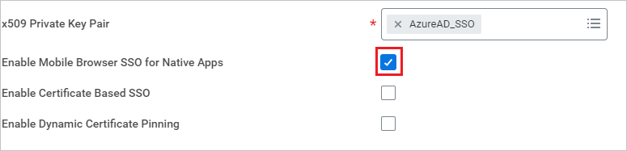
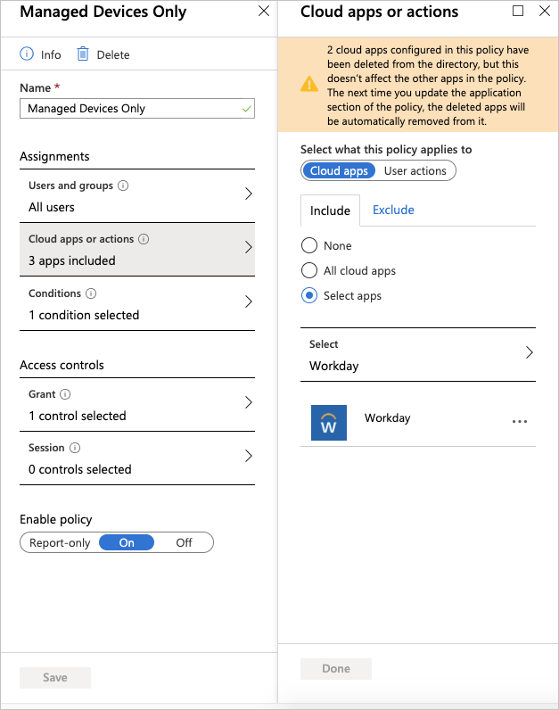
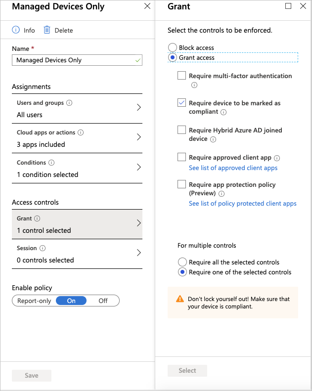
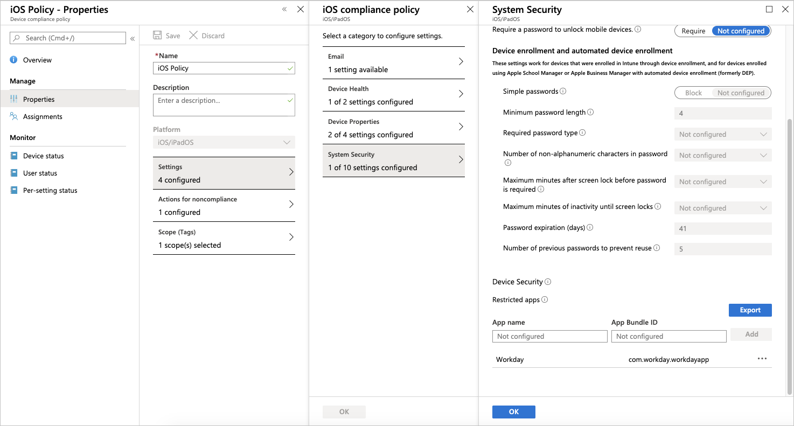

# Tutorial: Microsoft Entra single sign-on (SSO) integration with Workday Mobile Application

In this tutorial, you’ll learn how to integrate Microsoft Entra ID, Conditional Access, and Intune with Workday Mobile Application. When you integrate Workday Mobile Application with Microsoft, you can:

* Ensure that devices are compliant with your policies prior to sign-in.
* Add controls to Workday Mobile Application to ensure that users are securely accessing corporate data. 
* Control in Microsoft Entra ID who has access to Workday.
* Enable your users to be automatically signed in to Workday with their Microsoft Entra accounts.
* Manage your accounts in one central location: the Azure portal.

## Prerequisites

To get started:

* Integrate Workday with Microsoft Entra ID.
* Read [Microsoft Entra single sign-on (SSO) integration with Workday](./workday-tutorial.md).

## Scenario description

In this tutorial, you configure and test Microsoft Entra Conditional Access policies and Intune with Workday Mobile Application.

For enabling single sign-on (SSO), you can configure Workday Federated application with Microsoft Entra ID. For more information, see [Microsoft Entra single sign-on (SSO) integration with Workday](./workday-tutorial.md).

> [!NOTE] 
> Workday doesn't support the app protection policies of Intune. You must use mobile device management to use Conditional Access.


## Ensure users have access to Workday Mobile Application

Configure Workday to allow access to their mobile apps. You need to configure the following policies for Workday Mobile:

1. Access the domain security policies for functional area report.
1. Select the appropriate security policy:
    * Mobile Usage - Android
    * Mobile Usage - iPad
    * Mobile Usage - iPhone
1. Select **Edit Permissions**.
1. Select the **View or Modify** check box to grant the security groups access to the report or task securable items.
1. Select the **Get or Put** check box to grant the security groups access to integration and report or task securable actions.

Activate pending security policy changes by running **Activate Pending Security Policy Changes**.

## Open Workday sign-in page in Workday Mobile Browser

To apply Conditional Access to Workday Mobile Application, you must open the app in an external browser. In **Edit Tenant Setup - Security**, select **Enable Mobile Browser SSO for Native Apps**. This requires a browser approved by Intune to be installed on the device for iOS, and in the work profile for Android.



## Set up Conditional Access policy

This policy only affects signing in on an iOS or Android device. If you want to extend it to all platforms, select **Any Device**. This policy requires the device to be compliant with the policy, and verifies this via Intune. Because Android has work profiles, this blocks any users from signing into Workday, unless they're signing in through their work profile and have installed the app through the Intune company portal. There's one additional step for iOS to make sure that the same situation applies.

Workday supports the following access controls:
* Require multifactor authentication
* Require device to be marked as compliant

Workday App doesn't support the following:
* Require approved client app
* Require app protection policy (preview)

To set up Workday as a managed device, perform the following steps:



1. Select **Home** > **Microsoft Intune** > **Conditional Access-Policies**. Then select **Managed Devices Only**. 

1. In **Managed Devices Only**, under **Name**, select **Managed Devices Only** and then select **Cloud apps or actions**.

1. In **Cloud apps or actions**:

    1. Switch **Select what this policy applies to** to **Cloud apps**.

    1. In **Include**, choose **Select apps**.

    1. From the **Select** list, choose **Workday**.

    1. Select **Done**.

1. Switch **Enable policy** to **On**.

1. Select **Save**.

For **Grant** access, perform the following steps:



1. Select **Home** > **Microsoft Intune** > **Conditional Access-Policies**. Then select **Managed Devices Only**. 

1. In the **Managed Devices Only**, under **Name**, select **Managed Devices Only**. Under **Access controls**, select **Grant**.

1. In **Grant**:

    1. Select the controls to be enforced as **Grant access**.

    1. Select **Require device to be marked as compliant**.

    1. Select **Require one of the selected controls**.

    1. Choose **Select**.

1. Switch **Enable policy** to **On**.

1. Select **Save**.

## Set up device compliance policy

To ensure that iOS devices are only able to sign in through Workday managed by mobile device management, you must block the App Store app by adding **com.workday.workdayapp** to the list of restricted apps. This ensures that only devices that have Workday installed through the company portal can access Workday. For the browser, devices are only able to access Workday if the device is managed by Intune and is using a managed browser.



## Set up Intune app configuration policies

| Scenario | Key value pairs |
|----------------------------------------------------------------------------------------	|-----------|
| Automatically populate the Tenant and Web Address fields for:<br>● Workday on Android when you enable Android for work profiles.<br>●	Workday on iPad and iPhone.  	| Use these values to configure your Tenant: <br>● Configuration Key = `UserGroupCode`<br>●	Value Type = String <br>●	Configuration Value = Your tenant name. Example: `gms`<br>Use these values to configure your Web Address:<br>●	Configuration Key = `AppServiceHost`<br>●	Value Type = String<br>●	Configuration Value = The base URL for your tenant. Example: `https://www.myworkday.com`                            	| 
| Disable these actions for Workday on iPad and iPhone:<br>●	Cut, Copy, and Paste<br>●	Print                     	| Set the value (Boolean) to `False` on these keys to disable the functionality:<br>●	`AllowCutCopyPaste`<br>●	`AllowPrint` 	|
| Disable screenshots for Workday on Android. |Set the value (Boolean) to `False` on the `AllowScreenshots` key to disable functionality.|
| Disable suggested updates for your users.|Set the value (Boolean) to `False` on the `AllowSuggestedUpdates` key to disable functionality.|
|Customize the app store URL to direct mobile users to the app store of your choice.|Use these values to change the app store URL:<br>●	Configuration Key = `AppUpdateURL`<br>●	Value Type = String<br> ●	Configuration Value = App store URL|

## iOS configuration policies

1. Sign in to the [Azure portal](https://portal.azure.com/).
1. Search for **Intune** or select the widget from the list.
1. Go to **Client Apps** > **Apps** > **App Configuration Policies**. Then select **+ Add** > **Managed Devices**.
1. Enter a name.
1. Under **Platform**, choose **iOS/iPadOS**.
1. Under **Associated App**, choose the Workday for iOS app that you added.
1. Select **Configuration Settings**. Under **Configuration settings format**, select **Enter XML Data**.
1. Here's an example XML file. Add the configurations you want to apply. Replace `STRING_VALUE` with the string you want to use. Replace `<true /> or <false />` with `<true />` or  `<false />`. If you don't add a configuration, this example functions like it is set to `True`.

    ```
    <dict>
    <key>UserGroupCode</key>
    <string>STRING_VALUE</string>
    <key>AppServiceHost</key>
    <string>STRING_VALUE</string>
    <key>AllowCutCopyPaste</key>
    <true /> or <false />
    <key>AllowPrint</key>
    <true /> or <false />
    <key>AllowSuggestedUpdates</key>
    <true /> or <false />
    <key>AppUpdateURL</key>
    <string>STRING_VALUE</string>
    </dict>

    ```
1. Select **Add**.
1. Refresh the page, and select the newly created policy.
1. Select **Assignments**, and choose who you want the app to apply to.
1. Select **Save**.

## Android configuration policies

1. Sign in to the [Azure portal](https://portal.azure.com/).
2. Search for **Intune** or select the widget from the list.
3. Go to **Client Apps** > **Apps** > **App Configuration Policies**. Then select **+ Add** > **Managed Devices**.
5. Enter a name. 
6. Under **Platform**, choose **Android**.
7. Under **Associated App**, choose the Workday for Android app that you added.
8. Select **Configuration Settings**. Under **Configuration settings format**, select **Enter JSON Data**.
