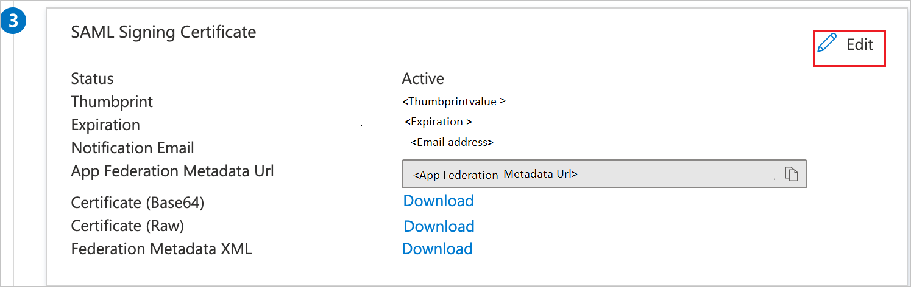
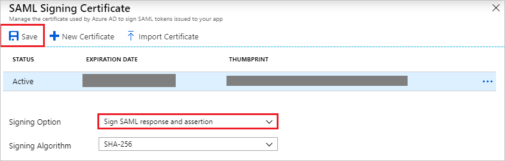

# Tutorial: Azure Active Directory single sign-on (SSO) integration with Workday

In this tutorial, you'll learn how to integrate Workday with Azure Active Directory (Azure AD). When you integrate Workday with Azure AD, you can:

* Control in Azure AD who has access to Workday.
* Enable your users to be automatically signed-in to Workday with their Azure AD accounts.
* Manage your accounts in one central location - the Azure portal.

To learn more about SaaS app integration with Azure AD, see [What is application access and single sign-on with Azure Active Directory](https://docs.microsoft.com/azure/active-directory/active-directory-appssoaccess-whatis).

## Prerequisites

To get started, you need the following items:

* An Azure AD subscription. If you don't have a subscription, you can get a [free account](https://azure.microsoft.com/free/).
* Workday single sign-on (SSO) enabled subscription.

## Scenario description

In this tutorial, you configure and test Azure AD SSO in a test environment.

* Workday supports **SP** initiated SSO.

* Once you configure the Workday you can enforce session controls, which protect exfiltration and infiltration of your organization’s sensitive data in real-time. Session controls extend from Conditional Access. [Learn how to enforce session control with Microsoft Cloud App Security](https://docs.microsoft.com/cloud-app-security/proxy-deployment-aad)

## Adding Workday from the gallery

To configure the integration of Workday into Azure AD, you need to add Workday from the gallery to your list of managed SaaS apps.

1. Sign in to the [Azure portal](https://portal.azure.com) using either a work or school account, or a personal Microsoft account.
1. On the left navigation pane, select the **Azure Active Directory** service.
1. Navigate to **Enterprise Applications** and then select **All Applications**.
1. To add new application, select **New application**.
1. In the **Add from the gallery** section, type **Workday** in the search box.
1. Select **Workday** from results panel and then add the app. Wait a few seconds while the app is added to your tenant.

## Configure and test Azure AD single sign-on for Workday

Configure and test Azure AD SSO with Workday using a test user called **B.Simon**. For SSO to work, you need to establish a link relationship between an Azure AD user and the related user in Workday.

To configure and test Azure AD SSO with Workday, complete the following building blocks:

1. **[Configure Azure AD SSO](#configure-azure-ad-sso)** to enable your users to use this feature.
    1. **[Create an Azure AD test user](#create-an-azure-ad-test-user)** to test Azure AD single sign-on with B.Simon.
    1. **[Assign the Azure AD test user](#assign-the-azure-ad-test-user)** to enable B.Simon to use Azure AD single sign-on.
2. **[Configure Workday](#configure-workday)** to configure the SSO settings on application side.
    1. **[Create Workday test user](#create-workday-test-user)** to have a counterpart of B.Simon in Workday that is linked to the Azure AD representation of user.
3. **[Test SSO](#test-sso)** to verify whether the configuration works.

## Configure Azure AD SSO

Follow these steps to enable Azure AD SSO in the Azure portal.

1. In the [Azure portal](https://portal.azure.com/), on the **Workday** application integration page, find the **Manage** section and select **Single sign-on**.
1. On the **Select a Single sign-on method** page, select **SAML**.
1. On the **Set up Single Sign-On with SAML** page, click the edit/pen icon for **Basic SAML Configuration** to edit the settings.

   

1. On the **Basic SAML Configuration** page, enter the values for the following fields:

	a. In the **Sign-on URL** text box, type a URL using the following pattern:
    `https://impl.workday.com/<tenant>/login-saml2.flex`

    b. In the **Identifier** text box, type a URL using the following pattern:
    `http://www.workday.com`

	c. In the **Reply URL** text box, type a URL using the following pattern:
    `https://impl.workday.com/<tenant>/login-saml.htmld`

	> [!NOTE]
	> These values are not the real. Update these values with the actual Sign-on URL and Reply URL. Your reply URL must have a subdomain for example: www, wd2, wd3, wd3-impl, wd5, wd5-impl).
    > Using something like `http://www.myworkday.com` works but `http://myworkday.com` does not. Contact [Workday Client support team](https://www.workday.com/en-us/partners-services/services/support.html) to get these values. You can also refer to the patterns shown in the **Basic SAML Configuration** section in the Azure portal.

6. Your Workday application expects the SAML assertions in a specific format, which requires you to add custom attribute mappings to your SAML token attributes configuration. The following screenshot shows the list of default attributes, where as **nameidentifier** is mapped with **user.userprincipalname**. Workday application expects **nameidentifier** to be mapped with **user.mail**, **UPN**, etc., so you need to edit the attribute mapping by clicking on **Edit** icon and change the attribute mapping.

	

	> [!NOTE]
    > Here we have mapped the Name ID with UPN (user.userprincipalname) as default. You need to map the Name ID with actual User ID in your Workday account (your email, UPN, etc.) for successful working of SSO.

1. On the **Set up Single Sign-On with SAML** page, in the **SAML Signing Certificate** section, find **Certificate (Base64)** and select **Download** to download the certificate and save it on your computer.

   

1. To modify the **Signing** options as per your requirement, click **Edit** button to open **SAML Signing Certificate** dialog.

	 

	

	a. Select **Sign SAML response and assertion** for **Signing Option**.

	b. Click **Save**

1. On the **Set up Workday** section, copy the appropriate URL(s) based on your requirement.

   

### Create an Azure AD test user

In this section, you'll create a test user in the Azure portal called B.Simon.

1. From the left pane in the Azure portal, select **Azure Active Directory**, select **Users**, and then select **All users**.
1. Select **New user** at the top of the screen.
1. In the **User** properties, follow these steps:
   1. In the **Name** field, enter `B.Simon`.  
   1. In the **User name** field, enter the username@companydomain.extension. For example, `B.Simon@contoso.com`.
   1. Select the **Show password** check box, and then write down the value that's displayed in the **Password** box.
   1. Click **Create**.

### Assign the Azure AD test user

In this section, you'll enable B.Simon to use Azure single sign-on by granting access to Workday.

1. In the Azure portal, select **Enterprise Applications**, and then select **All applications**.
1. In the applications list, select **Workday**.
1. In the app's overview page, find the **Manage** section and select **Users and groups**.

   

1. Select **Add user**, then select **Users and groups** in the **Add Assignment** dialog.

	

1. In the **Users and groups** dialog, select **B.Simon** from the Users list, then click the **Select** button at the bottom of the screen.
1. If you're expecting any role value in the SAML assertion, in the **Select Role** dialog, select the appropriate role for the user from the list and then click the **Select** button at the bottom of the screen.
1. In the **Add Assignment** dialog, click the **Assign** button.

## Configure Workday

1. In a different web browser window, sign in to your Workday company site as an administrator.

2. In the **Search box** search with the name **Edit Tenant Setup – Security** on the top left side of the home page.

    

3. In the **Redirection URLs** section, perform the following steps:

    

    a. Click **Add Row**.

    b. In the **Login Redirect URL**, **Timeout Redirect URL** and **Mobile Redirect URL** textbox, paste the **Login URL** which you have copied from the **Set up Workday** section of Azure portal.

    c. In the **Logout Redirect URL** textbox, paste the **Logout URL** which you have copied from the **Set up Workday** section of Azure portal.

    d. In **Used for Environments** textbox, select the environment name.  

   > [!NOTE]
   > The value of the Environment attribute is tied to the value of the tenant URL:  
   > -If the domain name of the Workday tenant URL starts with impl for example: *https://www.myworkday.com/"tenant"/login-saml2.htmld*), the **Environment** attribute must be set to Implementation.  
   > -If the domain name starts with something else, you need to contact [Workday Client support team](https://www.workday.com/en-us/partners-services/services/support.html) to get the matching **Environment** value.

4. In the **SAML Setup** section, perform the following steps:

    

    a.  Select **Enable SAML Authentication**.

    b.  Click **Add Row**.

5. In the **SAML Identity Providers** section, perform the following steps:

    

    a. In the **Identity Provider Name** textbox, type a provider name (for example: *SPInitiatedSSO*).

    b. In the Azure portal, on the **Set up Workday** section, copy the **Azure AD Identifier** value, and then paste it into the **Issuer** textbox.

    

    c. In the Azure portal, on the **Set up Workday** section, copy the **Logout URL** value, and then paste it into the **Logout Response URL** textbox.

	d. In the Azure portal, on the **Set up Workday** section, copy the **Login URL** value, and then paste it into the **IdP SSO Service URL** textbox.

	e. In **Used for Environments** textbox, select the environment name.

    f. Click **Identity Provider Public Key Certificate**, and then click **Create**.

    

    g. Click **Create x509 Public Key**.

    

6. In the **View x509 Public Key** section, perform the following steps:

    

    a. In the **Name** textbox, type a name for your certificate (for example: *PPE\_SP*).

    b. In the **Valid From** textbox, type the valid from attribute value of your certificate.

    c.  In the **Valid To** textbox, type the valid to attribute value of your certificate.

    > [!NOTE]
    > You can get the valid from date and the valid to date from the downloaded certificate by double-clicking it.  The dates are listed under the **Details** tab.
    >
    >

    d.  Open your base-64 encoded certificate in notepad, and then copy the content of it.

    e.  In the **Certificate** textbox, paste the content of your clipboard.

    f.  Click **OK**.

7. Perform the following steps:

    

    a.  In the **Service Provider ID** textbox, type **http://www.workday.com**.

    b. Select **Do Not Deflate SP-initiated Authentication Request**.

    c. As **Authentication Request Signature Method**, select **SHA256**.

    

    d. Click **OK**.

    

    > [!NOTE]
    > Please ensure you set up single sign-on correctly. In case you enable single sign-on with incorrect setup, you may not be able to enter the application with your credentials and get locked out. In this situation, Workday provides a backup log-in url where users can sign-in using their normal username and password in the following format:[Your Workday URL]/login.flex?redirect=n

### Create Workday test user

In this section, you create a user called B.Simon in Workday. Work with [Workday Client support team](https://www.workday.com/partners-services/services/support.html) to add the users in the Workday platform. Users must be created and activated before you use single sign-on.

## Test SSO

When you select the Workday tile in the Access Panel, you should be automatically signed in to the Workday for which you set up SSO. For more information about the Access Panel, see [Introduction to the Access Panel](https://docs.microsoft.com/azure/active-directory/active-directory-saas-access-panel-introduction).

## Additional resources

- [List of Tutorials on How to Integrate SaaS Apps with Azure Active Directory](https://docs.microsoft.com/azure/active-directory/active-directory-saas-tutorial-list)

- [What is application access and single sign-on with Azure Active Directory?](https://docs.microsoft.com/azure/active-directory/active-directory-appssoaccess-whatis)

- [What is Conditional Access in Azure Active Directory?](https://docs.microsoft.com/azure/active-directory/conditional-access/overview)

- [Try Workday with Azure AD](https://aad.portal.azure.com)

- [What is session control in Microsoft Cloud App Security?](https://docs.microsoft.com/cloud-app-security/protect-workday)

- [How to protect Workday with advanced visibility and controls](https://docs.microsoft.com/cloud-app-security/proxy-intro-aad)
