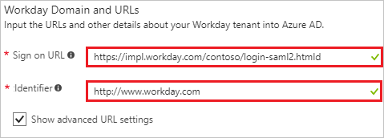
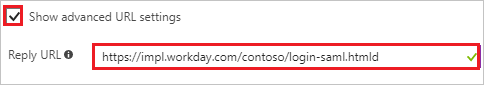
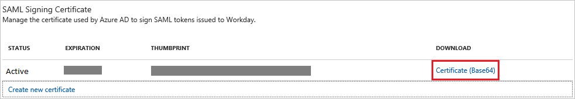
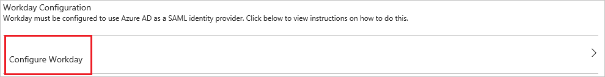

# Tutorial: Azure Active Directory integration with Workday

In this tutorial, you learn how to integrate Workday with Azure Active Directory (Azure AD).

Integrating Workday with Azure AD provides you with the following benefits:

- You can control in Azure AD who has access to Workday.
- You can enable your users to automatically get signed-on to Workday (Single Sign-On) with their Azure AD accounts.
- You can manage your accounts in one central location - the Azure portal.

If you want to know more details about SaaS app integration with Azure AD, see [what is application access and single sign-on with Azure Active Directory](../manage-apps/what-is-single-sign-on.md).

## Prerequisites

To configure Azure AD integration with Workday, you need the following items:

- An Azure AD subscription
- A Workday single-sign on enabled subscription

> [!NOTE]
> To test the steps in this tutorial, we do not recommend using a production environment.

To test the steps in this tutorial, you should follow these recommendations:

- Do not use your production environment, unless it is necessary.
- If you don't have an Azure AD trial environment, you can [get a one-month trial](https://azure.microsoft.com/pricing/free-trial/).

## Scenario description

In this tutorial, you test Azure AD single sign-on in a test environment. 
The scenario outlined in this tutorial consists of two main building blocks:

1. Adding Workday from the gallery
2. Configuring and testing Azure AD single sign-on

## Adding Workday from the gallery

To configure the integration of Workday into Azure AD, you need to add Workday from the gallery to your list of managed SaaS apps.

**To add Workday from the gallery, perform the following steps:**

1. In the **[Azure portal](https://portal.azure.com)**, on the left navigation panel, click **Azure Active Directory** icon. 

	![The Azure Active Directory button][1]

2. Navigate to **Enterprise applications**. Then go to **All applications**.

	![The Enterprise applications blade][2]
	
3. To add new application, click **New application** button on the top of dialog.

	![The New application button][3]

4. In the search box, type **Workday**, select **Workday** from result panel then click **Add** button to add the application.

	

## Configure and test Azure AD single sign-on

In this section, you configure and test Azure AD single sign-on with Workday based on a test user called "Britta Simon".

For single sign-on to work, Azure AD needs to know what the counterpart user in Workday is to a user in Azure AD. In other words, a link relationship between an Azure AD user and the related user in Workday needs to be established.

In Workday, assign the value of the **user name** in Azure AD as the value of the **Username** to establish the link relationship.

To configure and test Azure AD single sign-on with Workday, you need to complete the following building blocks:

1. **[Configure Azure AD Single Sign-On](#configure-azure-ad-single-sign-on)** - to enable your users to use this feature.
2. **[Create an Azure AD test user](#create-an-azure-ad-test-user)** - to test Azure AD single sign-on with Britta Simon.
3. **[Create a Workday test user](#create-a-workday-test-user)** - to have a counterpart of Britta Simon in Workday that is linked to the Azure AD representation of user.
4. **[Assign the Azure AD test user](#assign-the-azure-ad-test-user)** - to enable Britta Simon to use Azure AD single sign-on.
5. **[Test single sign-on](#test-single-sign-on)** - to verify whether the configuration works.

### Configure Azure AD single sign-on

In this section, you enable Azure AD single sign-on in the Azure portal and configure single sign-on in your Workday application.

**To configure Azure AD single sign-on with Workday, perform the following steps:**

1. In the Azure portal, on the **Workday** application integration page, click **Single sign-on**.

	![Configure single sign-on link][4]

2. On the **Single sign-on** dialog, select **Mode** as	**SAML-based Sign-on** to enable single sign-on.

	

3. On the **Workday Domain and URLs** section, perform the following steps:

	

	a. In the **Sign-on URL** textbox, type a URL using the following pattern: `https://impl.workday.com/<tenant>/login-saml2.htmld`

    b. In the **Identifier** textbox, type a URL: `http://www.workday.com`

4. Check **Show advanced URL settings** and perform the following step:

	

    In the **Reply URL** textbox, type a URL using the following pattern: `https://impl.workday.com/<tenant>/login-saml.htmld`

	> [!NOTE]
	> These values are not the real. Update these values with the actual Sign-on URL and Reply URL. Your reply URL must have a subdomain for example: www, wd2, wd3, wd3-impl, wd5, wd5-impl).
    > Using something like "*http://www.myworkday.com*" works but "*http://myworkday.com*" does not. Contact [Workday Client support team](https://www.workday.com/en-us/partners-services/services/support.html) to get these values.

5. Workday application expects the SAML assertions in a specific format. Configure the following claims for this application. You can manage the values of these attributes from the **User Attributes** section on application integration page. The following screenshot shows an example for this configuration.

    

    > [!NOTE]
    > Here we have mapped the Name ID with UPN (user.userprincipalname) as default. You need to map the Name ID with actual User ID in your Workday account (your email, UPN etc.) for successful working of SSO.

6. On the **SAML Signing Certificate** section, click **Certificate (Base64)** and then save the certificate file on your computer.

	

7. Click **Save** button.

	

8. On the **Workday Configuration** section, click **Configure Workday** to open **Configure sign-on** window. Copy the **Sign-Out URL, SAML Entity ID, and SAML Single Sign-On Service URL** from the **Quick Reference section.**

	

9. In a different web browser window, log in to your Workday company site as an administrator.

10. In the **Search box** search with the name **Edit Tenant Setup – Security** on the top left side of the home page.

    

11. In the **Redirection URLs** section, perform the following steps:

    

    a. Click **Add Row**.

    b. In the **Login Redirect URL** textbox and the **Mobile Redirect URL** textbox, type the **Sign-on URL** you have entered on the **Workday Domain and URLs** section of the Azure portal.

    c. In the Azure portal, on the **Configure sign-on** window, copy the **Sign-Out URL**, and then paste it into the **Logout Redirect URL** textbox.

    d. In **Used for Environments** textbox, select the environment name.  

    >[!NOTE]
    > The value of the Environment attribute is tied to the value of the tenant URL:  
    >-If the domain name of the Workday tenant URL starts with impl for example: *https://impl.workday.com/\<tenant\>/login-saml2.htmld*), the **Environment** attribute must be set to Implementation.  
    >-If the domain name starts with something else, you need to contact [Workday Client support team](https://www.workday.com/en-us/partners-services/services/support.html) to get the matching **Environment** value.

12. In the **SAML Setup** section, perform the following steps:

    

    a.  Select **Enable SAML Authentication**.

    b.  Click **Add Row**.

13. In the **SAML Identity Providers** section, perform the following steps:

    

    a. In the **Identity Provider Name** textbox, type a provider name (for example: *SPInitiatedSSO*).

    b. In the Azure portal, on the **Configure sign-on** window, copy the **SAML Entity ID** value, and then paste it into the **Issuer** textbox.

    

    c. In the Azure portal, on the **Configure sign-on** window, copy the **Sign-Out URL** value, and then paste it into the **Logout Response URL** textbox.

	d. In the Azure portal, on the **Configure sign-on** window, copy the **SAML Single Sign-On Service URL** value, and then paste it into the **IdP SSO Service URL** textbox.

	e. In **Used for Environments** textbox, select the environment name.

    f. Click **Identity Provider Public Key Certificate**, and then click **Create**.

    

    g. Click **Create x509 Public Key**.

    

14. In the **View x509 Public Key** section, perform the following steps:

    

    a. In the **Name** textbox, type a name for your certificate (for example: *PPE\_SP*).

    b. In the **Valid From** textbox, type the valid from attribute value of your certificate.

    c.  In the **Valid To** textbox, type the valid to attribute value of your certificate.

    > [!NOTE]
    > You can get the valid from date and the valid to date from the downloaded certificate by double-clicking it.  The dates are listed under the **Details** tab.
    >
    >

    d.  Open your base-64 encoded certificate in notepad, and then copy the content of it.

    e.  In the **Certificate** textbox, paste the content of your clipboard.

    f.  Click **OK**.

15. Perform the following steps:

    

    a.  In the **Service Provider ID** textbox, type **http://www.workday.com**.

    b. Select **Do Not Deflate SP-initiated Authentication Request**.

    c. As **Authentication Request Signature Method**, select **SHA256**.

     

    d. Click **OK**.

    

    > [!NOTE]
    > Please ensure you set up single sign-on correctly. In case you enable single sign-on with incorrect setup, you may not be able to enter the application with your credentials and get locked out. In this situation, Workday provides a backup log-in url where users can sign-in using their normal username and password in the following format:[Your Workday URL]/login.flex?redirect=n

### Create an Azure AD test user

The objective of this section is to create a test user in the Azure portal called Britta Simon.

   ![Create an Azure AD test user][100]

**To create a test user in Azure AD, perform the following steps:**

1. In the Azure portal, in the left pane, click the **Azure Active Directory** button.

    

2. To display the list of users, go to **Users and groups**, and then click **All users**.

    

3. To open the **User** dialog box, click **Add** at the top of the **All Users** dialog box.

    

4. In the **User** dialog box, perform the following steps:

    

    a. In the **Name** box, type **BrittaSimon**.

    b. In the **User name** box, type the email address of user Britta Simon.

    c. Select the **Show Password** check box, and then write down the value that's displayed in the **Password** box.

    d. Click **Create**.
 
### Create a Workday test user

In this section, you create a user called Britta Simon in Workday. Work with [Workday Client support team](https://www.workday.com/en-us/partners-services/services/support.html) to add the users in the Workday platform. Users must be created and activated before you use single sign-on. 

### Assign the Azure AD test user

In this section, you enable Britta Simon to use Azure single sign-on by granting access to Workday.

![Assign the user role][200] 

**To assign Britta Simon to Workday, perform the following steps:**

1. In the Azure portal, open the applications view, and then navigate to the directory view and go to **Enterprise applications** then click **All applications**.

	![Assign User][201] 

2. In the applications list, select **Workday**.

	  

3. In the menu on the left, click **Users and groups**.

	![The "Users and groups" link][202]

4. Click **Add** button. Then select **Users and groups** on **Add Assignment** dialog.

	![The Add Assignment pane][203]

5. On **Users and groups** dialog, select **Britta Simon** in the Users list.

6. Click **Select** button on **Users and groups** dialog.

7. Click **Assign** button on **Add Assignment** dialog.
	
### Test single sign-on

In this section, you test your Azure AD single sign-on configuration using the Access Panel.

When you click the Workday tile in the Access Panel, you should get automatically signed-on to your Workday application.
For more information about the Access Panel, see [Introduction to the Access Panel](../user-help/active-directory-saas-access-panel-introduction.md). 

## Additional resources

* [List of Tutorials on How to Integrate SaaS Apps with Azure Active Directory](tutorial-list.md)
* [What is application access and single sign-on with Azure Active Directory?](../manage-apps/what-is-single-sign-on.md)

<!--Image references-->

[1]: ./media/workday-tutorial/tutorial_general_01.png
[2]: ./media/workday-tutorial/tutorial_general_02.png
[3]: ./media/workday-tutorial/tutorial_general_03.png
[4]: ./media/workday-tutorial/tutorial_general_04.png

[100]: ./media/workday-tutorial/tutorial_general_100.png

[200]: ./media/workday-tutorial/tutorial_general_200.png
[201]: ./media/workday-tutorial/tutorial_general_201.png
[202]: ./media/workday-tutorial/tutorial_general_202.png
[203]: ./media/workday-tutorial/tutorial_general_203.png
