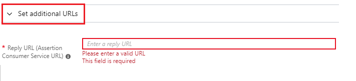

# Tutorial: Azure Active Directory integration with Workday

In this tutorial, you learn how to integrate Workday with Azure Active Directory (Azure AD).
Integrating Workday with Azure AD provides you with the following benefits:

* You can control in Azure AD who has access to Workday.
* You can enable your users to be automatically signed-in to Workday (Single Sign-On) with their Azure AD accounts.
* You can manage your accounts in one central location - the Azure portal.

If you want to know more details about SaaS app integration with Azure AD, see [What is application access and single sign-on with Azure Active Directory](https://docs.microsoft.com/azure/active-directory/active-directory-appssoaccess-whatis).
If you don't have an Azure subscription, [create a free account](https://azure.microsoft.com/free/) before you begin.

## Prerequisites

To configure Azure AD integration with Workday, you need the following items:

* An Azure AD subscription. If you don't have an Azure AD environment, you can get one-month trial [here](https://azure.microsoft.com/pricing/free-trial/)
* Workday single sign-on enabled subscription

## Scenario description

In this tutorial, you configure and test Azure AD single sign-on in a test environment.

* Workday supports **SP** and **IDP** initiated SSO

## Adding Workday from the gallery

To configure the integration of Workday into Azure AD, you need to add Workday from the gallery to your list of managed SaaS apps.

**To add Workday from the gallery, perform the following steps:**

1. In the **[Azure portal](https://portal.azure.com)**, on the left navigation panel, click **Azure Active Directory** icon.

	

2. Navigate to **Enterprise Applications** and then select the **All Applications** option.

	

3. To add new application, click **New application** button on the top of dialog.

	

4. In the search box, type **Workday**, select **Workday** from result panel then click **Add** button to add the application.

	 

## Configure and test Azure AD single sign-on

In this section, you configure and test Azure AD single sign-on with Workday based on a test user called **Britta Simon**.
For single sign-on to work, a link relationship between an Azure AD user and the related user in Workday needs to be established.

To configure and test Azure AD single sign-on with Workday, you need to complete the following building blocks:

1. **[Configure Azure AD Single Sign-On](#configure-azure-ad-single-sign-on)** - to enable your users to use this feature.
2. **[Configure Workday Single Sign-On](#configure-workday-single-sign-on)** - to configure the Single Sign-On settings on application side.
3. **[Create an Azure AD test user](#create-an-azure-ad-test-user)** - to test Azure AD single sign-on with Britta Simon.
4. **[Assign the Azure AD test user](#assign-the-azure-ad-test-user)** - to enable Britta Simon to use Azure AD single sign-on.
5. **[Create Workday test user](#create-workday-test-user)** - to have a counterpart of Britta Simon in Workday that is linked to the Azure AD representation of user.
6. **[Test single sign-on](#test-single-sign-on)** - to verify whether the configuration works.

### Configure Azure AD single sign-on

In this section, you enable Azure AD single sign-on in the Azure portal.

To configure Azure AD single sign-on with Workday, perform the following steps:

1. In the [Azure portal](https://portal.azure.com/), on the **Workday** application integration page, select **Single sign-on**.

    

2. On the **Select a Single sign-on method** dialog, select **SAML/WS-Fed** mode to enable single sign-on.

    

3. On the **Set up Single Sign-On with SAML** page, click **Edit** icon to open **Basic SAML Configuration** dialog.

	

4. On the **Basic SAML Configuration** section, perform the following steps:

    

	a. In the **Sign-on URL** text box, type a URL using the following pattern:
    `https:\//impl.workday.com/<tenant>/login-saml2.flex`

    b. In the **Identifier** text box, type a URL using the following pattern:
    `https://www.workday.com`

5. Click **Set additional URLs** and perform the following step:

    

	In the **Reply URL** text box, type a URL using the following pattern:
    `https:\//impl.workday.com/<tenant>/login-saml.htmld`

	> [!NOTE]
	> These values are not the real. Update these values with the actual Sign-on URL and Reply URL. Your reply URL must have a subdomain for example: www, wd2, wd3, wd3-impl, wd5, wd5-impl).
    > Using something like `http://www.myworkday.com` works but `http://myworkday.com` does not. Contact [Workday Client support team](https://www.workday.com/en-us/partners-services/services/support.html) to get these values. You can also refer to the patterns shown in the **Basic SAML Configuration** section in the Azure portal.

6. Your Workday application expects the SAML assertions in a specific format, which requires you to add custom attribute mappings to your SAML token attributes configuration. The following screenshot shows the list of default attributes, where as **nameidentifier** is mapped with **user.userprincipalname**. Workday application expects **nameidentifier** to be mapped with **user.mail**, **UPN** etc, so you need to edit the attribute mapping by clicking on **Edit** icon and change the attribute mapping.

	

	> [!NOTE]
    > Here we have mapped the Name ID with UPN (user.userprincipalname) as default. You need to map the Name ID with actual User ID in your Workday account (your email, UPN etc.) for successful working of SSO.

7. On the **Set up Single Sign-On with SAML** page, in the **SAML Signing Certificate** section, click **Download** to download the **Certificate (Base64)** from the given options as per your requirement and save it on your computer.

	

8. On the **Set up Workday** section, copy the appropriate URL(s) as per your requirement.

	

	a. Login URL

	b. Azure AD Identifier

	c. Logout URL

### Configure Workday Single Sign-On

1. In a different web browser window, log in to your Workday company site as an administrator.

2. In the **Search box** search with the name **Edit Tenant Setup – Security** on the top left side of the home page.

    

3. In the **Redirection URLs** section, perform the following steps:

    

    a. Click **Add Row**.

    b. In the **Login Redirect URL** textbox and the **Mobile Redirect URL** textbox, type the **Sign-on URL** you have entered on the **Basic SAML Configuration** section of the Azure portal.

    c. In the Azure portal, on the **Set up Workday** section, copy the **Logout URL**, and then paste it into the **Logout Redirect URL** textbox.

    d. In **Used for Environments** textbox, select the environment name.  

   > [!NOTE]
   > The value of the Environment attribute is tied to the value of the tenant URL:  
   > -If the domain name of the Workday tenant URL starts with impl for example: *https:\//impl.workday.com/\<tenant\>/login-saml2.flex*), the **Environment** attribute must be set to Implementation.  
   > -If the domain name starts with something else, you need to contact [Workday Client support team](https://www.workday.com/en-us/partners-services/services/support.html) to get the matching **Environment** value.

4. In the **SAML Setup** section, perform the following steps:

    

    a.  Select **Enable SAML Authentication**.

    b.  Click **Add Row**.

5. In the **SAML Identity Providers** section, perform the following steps:

    

    a. In the **Identity Provider Name** textbox, type a provider name (for example: *SPInitiatedSSO*).

    b. In the Azure portal, on the **Set up Workday** section, copy the **Azure AD Identifier** value, and then paste it into the **Issuer** textbox.

    

    c. In the Azure portal, on the **Set up Workday** section, copy the **Logout URL** value, and then paste it into the **Logout Response URL** textbox.

	d. In the Azure portal, on the **Set up Workday** section, copy the **Login URL** value, and then paste it into the **IdP SSO Service URL** textbox.

	e. In **Used for Environments** textbox, select the environment name.

    f. Click **Identity Provider Public Key Certificate**, and then click **Create**.

    

    g. Click **Create x509 Public Key**.

    

6. In the **View x509 Public Key** section, perform the following steps:

    

    a. In the **Name** textbox, type a name for your certificate (for example: *PPE\_SP*).

    b. In the **Valid From** textbox, type the valid from attribute value of your certificate.

    c.  In the **Valid To** textbox, type the valid to attribute value of your certificate.

    > [!NOTE]
    > You can get the valid from date and the valid to date from the downloaded certificate by double-clicking it.  The dates are listed under the **Details** tab.
    >
    >

    d.  Open your base-64 encoded certificate in notepad, and then copy the content of it.

    e.  In the **Certificate** textbox, paste the content of your clipboard.

    f.  Click **OK**.

7. Perform the following steps:

    

    a.  In the **Service Provider ID** textbox, type **https://www.workday.com**.

    b. Select **Do Not Deflate SP-initiated Authentication Request**.

    c. As **Authentication Request Signature Method**, select **SHA256**.

     

    d. Click **OK**.

    

    > [!NOTE]
    > Please ensure you set up single sign-on correctly. In case you enable single sign-on with incorrect setup, you may not be able to enter the application with your credentials and get locked out. In this situation, Workday provides a backup log-in url where users can sign-in using their normal username and password in the following format:[Your Workday URL]/login.flex?redirect=n

### Create an Azure AD test user 

The objective of this section is to create a test user in the Azure portal called Britta Simon.

1. In the Azure portal, in the left pane, select **Azure Active Directory**, select **Users**, and then select **All users**.

    

2. Select **New user** at the top of the screen.

    

3. In the User properties, perform the following steps.

    

    a. In the **Name** field enter **BrittaSimon**.
  
    b. In the **User name** field type **brittasimon\@yourcompanydomain.extension**  
    For example, BrittaSimon@contoso.com

    c. Select **Show password** check box, and then write down the value that's displayed in the Password box.

    d. Click **Create**.

### Assign the Azure AD test user

In this section, you enable Britta Simon to use Azure single sign-on by granting access to Workday.

1. In the Azure portal, select **Enterprise Applications**, select **All applications**, then select **Workday**.

	

2. In the applications list, select **Workday**.

	

3. In the menu on the left, select **Users and groups**.

    

4. Click the **Add user** button, then select **Users and groups** in the **Add Assignment** dialog.

    

5. In the **Users and groups** dialog select **Britta Simon** in the Users list, then click the **Select** button at the bottom of the screen.

6. If you are expecting any role value in the SAML assertion then in the **Select Role** dialog select the appropriate role for the user from the list, then click the **Select** button at the bottom of the screen.

7. In the **Add Assignment** dialog click the **Assign** button.

### Create Workday test user

In this section, you create a user called Britta Simon in Workday. Work with [Workday Client support team](https://www.workday.com/en-us/partners-services/services/support.html) to add the users in the Workday platform. Users must be created and activated before you use single sign-on.

### Test single sign-on 

In this section, you test your Azure AD single sign-on configuration using the Access Panel.

When you click the Workday tile in the Access Panel, you should be automatically signed in to the Workday for which you set up SSO. For more information about the Access Panel, see [Introduction to the Access Panel](https://docs.microsoft.com/azure/active-directory/active-directory-saas-access-panel-introduction).

## Additional Resources

- [ List of Tutorials on How to Integrate SaaS Apps with Azure Active Directory ](https://docs.microsoft.com/azure/active-directory/active-directory-saas-tutorial-list)

- [What is application access and single sign-on with Azure Active Directory? ](https://docs.microsoft.com/azure/active-directory/active-directory-appssoaccess-whatis)

- [What is conditional access in Azure Active Directory?](https://docs.microsoft.com/azure/active-directory/conditional-access/overview)

