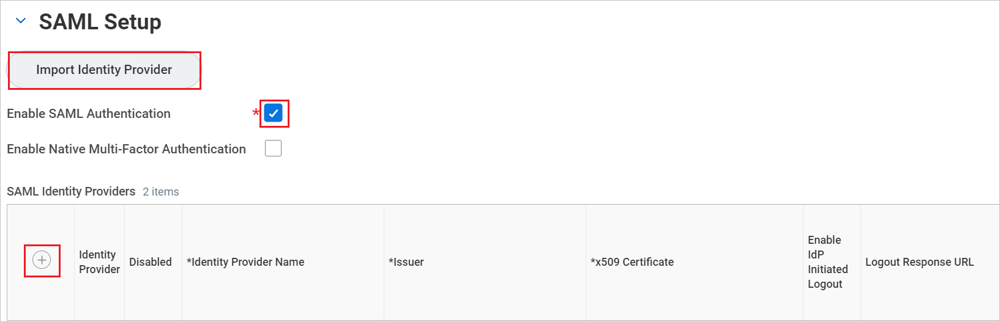
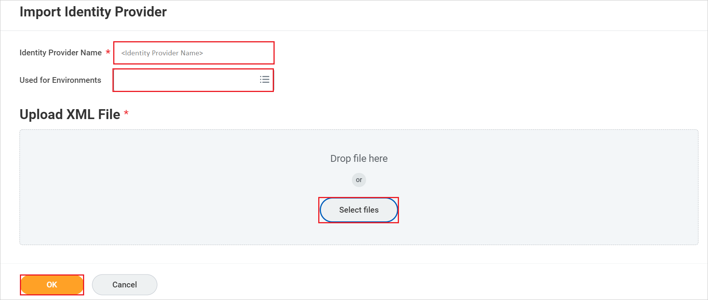
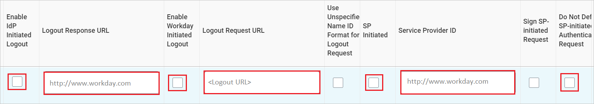
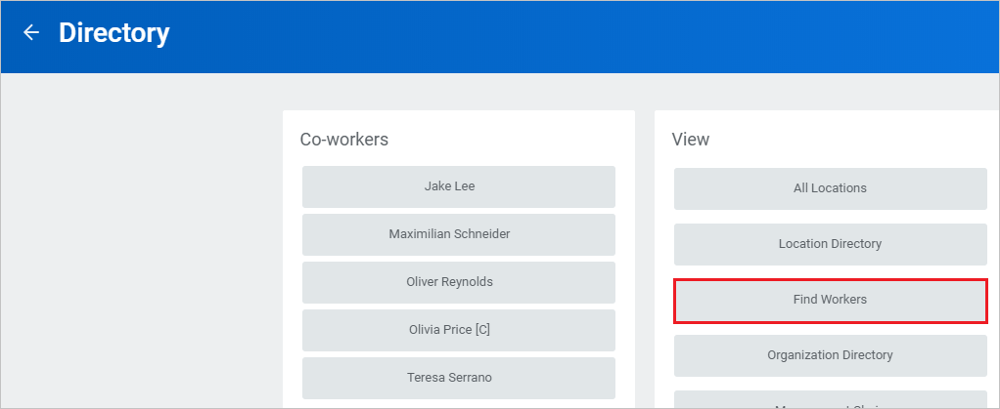
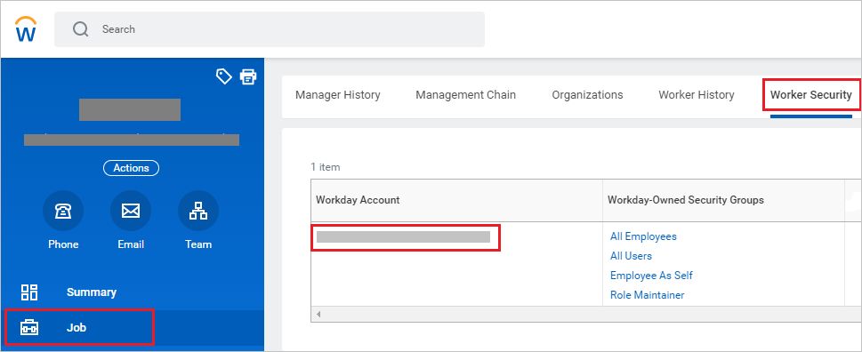

# Tutorial: Microsoft Entra single sign-on (SSO) integration with Workday

In this tutorial, you'll learn how to integrate Workday with Microsoft Entra ID. When you integrate Workday with Microsoft Entra ID, you can:

* Control in Microsoft Entra ID who has access to Workday.
* Enable your users to be automatically signed-in to Workday with their Microsoft Entra accounts.
* Manage your accounts in one central location.

## Prerequisites

To get started, you need the following items:

* A Microsoft Entra subscription. If you don't have a subscription, you can get a [free account](https://azure.microsoft.com/free/).
* Workday single sign-on (SSO) enabled subscription.

## Scenario description

In this tutorial, you configure and test Microsoft Entra SSO in a test environment.

* Workday supports **SP** initiated SSO.

* Workday Mobile application can now be configured with Microsoft Entra ID for enabling SSO. For more details on how to configure, please follow [this](workday-mobile-tutorial.md) link.

> [!NOTE]
> Identifier of this application is a fixed string value so only one instance can be configured in one tenant.

## Adding Workday from the gallery

To configure the integration of Workday into Microsoft Entra ID, you need to add Workday from the gallery to your list of managed SaaS apps.

1. Sign in to the [Microsoft Entra admin center](https://entra.microsoft.com) as at least a [Cloud Application Administrator](../roles/permissions-reference.md#cloud-application-administrator).
1. Browse to **Identity** > **Applications** > **Enterprise applications** > **New application**.
1. In the **Add from the gallery** section, type **Workday** in the search box.
1. Select **Workday** from results panel and then add the app. Wait a few seconds while the app is added to your tenant.

 Alternatively, you can also use the [Enterprise App Configuration Wizard](https://portal.office.com/AdminPortal/home?Q=Docs#/azureadappintegration). In this wizard, you can add an application to your tenant, add users/groups to the app, assign roles, as well as walk through the SSO configuration as well. [Learn more about Microsoft 365 wizards.](/microsoft-365/admin/misc/azure-ad-setup-guides)

## Configure and test Microsoft Entra SSO for Workday

Configure and test Microsoft Entra SSO with Workday using a test user called **B.Simon**. For SSO to work, you need to establish a link relationship between a Microsoft Entra user and the related user in Workday.

To configure and test Microsoft Entra SSO with Workday, perform the following steps:

1. **[Configure Microsoft Entra SSO](#configure-azure-ad-sso)** to enable your users to use this feature.
    1. **[Create a Microsoft Entra test user](#create-an-azure-ad-test-user)** to test Microsoft Entra single sign-on with B.Simon.
    1. **[Assign the Microsoft Entra test user](#assign-the-azure-ad-test-user)** to enable B.Simon to use Microsoft Entra single sign-on.
2. **[Configure Workday](#configure-workday)** to configure the SSO settings on application side.
    1. **[Create Workday test user](#create-workday-test-user)** to have a counterpart of B.Simon in Workday that is linked to the Microsoft Entra representation of user.
3. **[Test SSO](#test-sso)** to verify whether the configuration works.

## Configure Microsoft Entra SSO

Follow these steps to enable Microsoft Entra SSO.

1. Sign in to the [Microsoft Entra admin center](https://entra.microsoft.com) as at least a [Cloud Application Administrator](../roles/permissions-reference.md#cloud-application-administrator).
1. Browse to **Identity** > **Applications** > **Enterprise applications** > **Workday** application integration page, find the **Manage** section and select **Single sign-on**.
1. On the **Select a Single sign-on method** page, select **SAML**.
1. On the **Set up Single Sign-On with SAML** page, click the pencil icon for **Basic SAML Configuration** to edit the settings.

   

1. On the **Basic SAML Configuration** page, enter the values for the following fields:

	a. In the **Sign-on URL** text box, type a URL using the following pattern:
    `https://impl.workday.com/<tenant>/login-saml2.flex`

	b. In the **Reply URL** text box, type a URL using the following pattern:
    `https://impl.workday.com/<tenant>/login-saml.htmld`

    c. In the **Logout URL** text box, type a URL using the following pattern:
    `https://impl.workday.com/<tenant>/login-saml.htmld`

	> [!NOTE]
	> These values are not the real. Update these values with the actual Sign-on URL, Reply URL and Logout URL. Your reply URL must have a subdomain for example: www, wd2, wd3, wd3-impl, wd5, wd5-impl).
    > Using something like `http://www.myworkday.com` works but `http://myworkday.com` does not. Contact [Workday Client support team](https://www.workday.com/en-us/partners-services/services/support.html) to get these values. You can also refer to the patterns shown in the **Basic SAML Configuration** section.

1. Your Workday application expects the SAML assertions in a specific format, which requires you to add custom attribute mappings to your SAML token attributes configuration. The following screenshot shows the list of default attributes, whereas **nameidentifier** is mapped with **user.userprincipalname**. Workday application expects **nameidentifier** to be mapped with **user.mail**, **UPN**, etc., so you need to edit the attribute mapping by clicking on **Edit** icon and change the attribute mapping.

	

	> [!NOTE]
    > Here we have mapped the Name ID with UPN (user.userprincipalname) as default. You need to map the Name ID with actual User ID in your Workday account (your email, UPN, etc.) for successful working of SSO.

1. On the **Set up Single Sign-On with SAML** page, in the **SAML Signing Certificate** section, find **Federation Metadata XML** and select **Download** to download the certificate and save it on your computer.

   

1. To modify the **Signing** options as per your requirement, click **Edit** button to open **SAML Signing Certificate** dialog.

	 

	a. Select **Sign SAML response and assertion** for **Signing Option**.

    

	b. Click **Save**

1. On the **Set up Workday** section, copy the appropriate URL(s) based on your requirement.

   

### Create a Microsoft Entra test user

In this section, you'll create a test user called B.Simon.

1. Sign in to the [Microsoft Entra admin center](https://entra.microsoft.com) as at least a [User Administrator](../roles/permissions-reference.md#user-administrator).
1. Browse to **Identity** > **Users** > **All users**.
1. Select **New user** > **Create new user**, at the top of the screen.
1. In the **User** properties, follow these steps:
   1. In the **Display name** field, enter `B.Simon`.  
   1. In the **User principal name** field, enter the username@companydomain.extension. For example, `B.Simon@contoso.com`.
   1. Select the **Show password** check box, and then write down the value that's displayed in the **Password** box.
   1. Select **Review + create**.
1. Select **Create**.

### Assign the Microsoft Entra test user

In this section, you'll enable B.Simon to use single sign-on by granting access to Workday.

1. Sign in to the [Microsoft Entra admin center](https://entra.microsoft.com) as at least a [Cloud Application Administrator](../roles/permissions-reference.md#cloud-application-administrator).
1. Browse to **Identity** > **Applications** > **Enterprise applications** > **Workday**.
1. In the app's overview page, select **Users and groups**.
1. Select **Add user/group**, then select **Users and groups** in the **Add Assignment** dialog.
   1. In the **Users and groups** dialog, select **B.Simon** from the Users list, then click the **Select** button at the bottom of the screen.
   1. If you are expecting a role to be assigned to the users, you can select it from the **Select a role** dropdown. If no role has been set up for this app, you see "Default Access" role selected.
   1. In the **Add Assignment** dialog, click the **Assign** button.

## Configure Workday

1. In a different web browser window, sign in to your Workday company site as an administrator.

1. In the **Search box**, search with the name **Edit Tenant Setup – Security** on the top left side of the home page.

    

1. In the **SAML Setup** section, click on **Import Identity Provider**.

    

1. In **Import Identity Provider** section, perform the below steps:

    

    a. Give the **Identity Provider Name** like `AzureAD` in the textbox.

    b. In **Used for Environments** textbox, select the appropriate environment names from the dropdown.

    c. Click on **Select files** to upload the downloaded **Federation Metadata XML** file.

    d. Click on **OK**.

1. After clicking **OK**, a new row will be added in the **SAML Identity Providers** and then you can add the below steps for the newly created row.

    

    a. Click on **Enable IDP Initiated Logout** checkbox.

    b. In the **Logout Response URL** textbox, type **http://www.workday.com**.

    c. Click on **Enable Workday Initiated Logout** checkbox.

    d. In the **Logout Request URL** textbox, paste the **Logout URL** value.

    e. Click on **SP Initiated** checkbox.

    f. In the **Service Provider ID** textbox, type **http://www.workday.com**.

    g. Select **Do Not Deflate SP-initiated Authentication Request**.

    h. Click **Ok**.

    i. If the task was completed successfully, click **Done**.

    > [!NOTE]
    > Please ensure you set up single sign-on correctly. In case you enable single sign-on with incorrect setup, you may not be able to enter the application with your credentials and get locked out. In this situation, Workday provides a backup log-in URL where users can sign-in using their normal username and password in the following format:[Your Workday URL]/login.flex?redirect=n

### Create Workday test user

1. Sign in to your Workday company site as an administrator.

1. Click on **Profile** at top-right corner, select **Home** and Click on **Directory** in the **Applications** tab. 

1. In the **Directory** page, select **Find Workers** in view tab.

    

1.  In the **Find Workers** page, select the user from the results.

1. In the following page,select **Job > Worker Security** and the **Workday account** has to match with the Microsoft Entra ID as the **Name ID** value.

    

> [!NOTE]
> For more information on how to create a workday test user, please contact [Workday Client support team](https://www.workday.com/en-us/partners-services/services/support.html).

## Test SSO

In this section, you test your Microsoft Entra single sign-on configuration with following options. 

* Click on **Test this application**, this will redirect to Workday Sign-on URL where you can initiate the login flow. 

* Go to Workday Sign-on URL directly and initiate the login flow from there.

* You can use Microsoft My Apps. When you click the Workday tile in the My Apps, you should be automatically signed in to the Workday for which you set up the SSO. For more information about the My Apps, see [Introduction to the My Apps](https://support.microsoft.com/account-billing/sign-in-and-start-apps-from-the-my-apps-portal-2f3b1bae-0e5a-4a86-a33e-876fbd2a4510).

## Next steps

Once you configure Workday you can enforce Session Control, which protects exfiltration and infiltration of your organization’s sensitive data in real time. Session Control extends from Conditional Access. [Learn how to enforce session control with Microsoft Defender for Cloud Apps](/cloud-app-security/proxy-deployment-aad).
