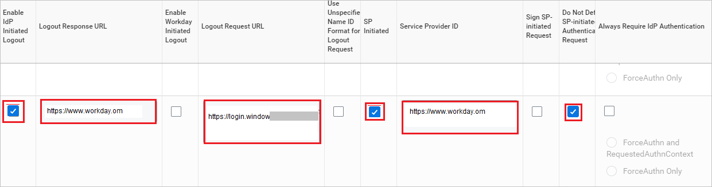
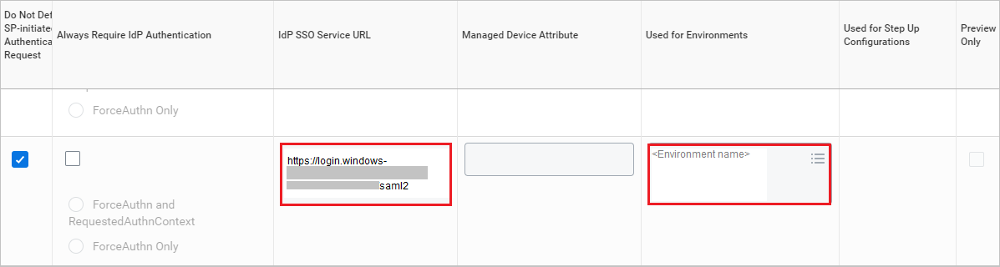
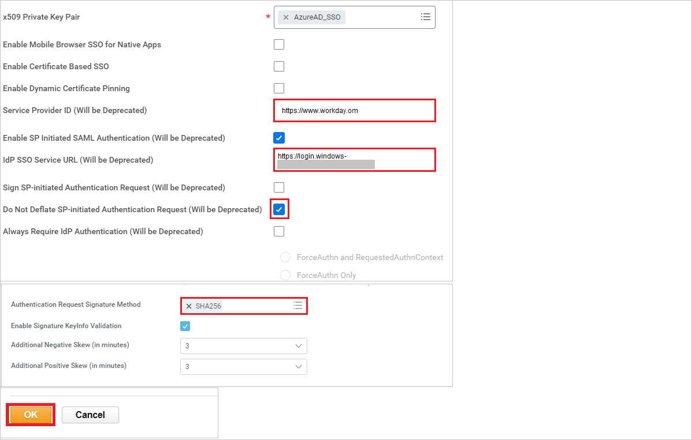

# Tutorial: Azure Active Directory single sign-on (SSO) integration with Workday

In this tutorial, you'll learn how to integrate Workday with Azure Active Directory (Azure AD). When you integrate Workday with Azure AD, you can:

* Control in Azure AD who has access to Workday.
* Enable your users to be automatically signed-in to Workday with their Azure AD accounts.
* Manage your accounts in one central location - the Azure portal.

## Prerequisites

To get started, you need the following items:

* An Azure AD subscription. If you don't have a subscription, you can get a [free account](https://azure.microsoft.com/free/).
* Workday single sign-on (SSO) enabled subscription.

## Scenario description

In this tutorial, you configure and test Azure AD SSO in a test environment.

* Workday supports **SP** initiated SSO.

* Workday Mobile application can now be configured with Azure AD for enabling SSO. For more details on how to configure, please follow [this](workday-mobile-tutorial.md) link.

> [!NOTE]
> Identifier of this application is a fixed string value so only one instance can be configured in one tenant.

## Adding Workday from the gallery

To configure the integration of Workday into Azure AD, you need to add Workday from the gallery to your list of managed SaaS apps.

1. Sign in to the Azure portal using either a work or school account, or a personal Microsoft account.
1. On the left navigation pane, select the **Azure Active Directory** service.
1. Navigate to **Enterprise Applications** and then select **All Applications**.
1. To add new application, select **New application**.
1. In the **Add from the gallery** section, type **Workday** in the search box.
1. Select **Workday** from results panel and then add the app. Wait a few seconds while the app is added to your tenant.

## Configure and test Azure AD SSO for Workday

Configure and test Azure AD SSO with Workday using a test user called **B.Simon**. For SSO to work, you need to establish a link relationship between an Azure AD user and the related user in Workday.

To configure and test Azure AD SSO with Workday, perform following steps:

1. **[Configure Azure AD SSO](#configure-azure-ad-sso)** to enable your users to use this feature.
    1. **[Create an Azure AD test user](#create-an-azure-ad-test-user)** to test Azure AD single sign-on with B.Simon.
    1. **[Assign the Azure AD test user](#assign-the-azure-ad-test-user)** to enable B.Simon to use Azure AD single sign-on.
2. **[Configure Workday](#configure-workday)** to configure the SSO settings on application side.
    1. **[Create Workday test user](#create-workday-test-user)** to have a counterpart of B.Simon in Workday that is linked to the Azure AD representation of user.
3. **[Test SSO](#test-sso)** to verify whether the configuration works.

## Configure Azure AD SSO

Follow these steps to enable Azure AD SSO in the Azure portal.

1. In the Azure portal, on the **Workday** application integration page, find the **Manage** section and select **Single sign-on**.
1. On the **Select a Single sign-on method** page, select **SAML**.
1. On the **Set up Single Sign-On with SAML** page, click the edit/pen icon for **Basic SAML Configuration** to edit the settings.

   

1. On the **Basic SAML Configuration** page, enter the values for the following fields:

	a. In the **Sign-on URL** text box, type a URL using the following pattern:
    `https://impl.workday.com/<tenant>/login-saml2.flex`

	b. In the **Reply URL** text box, type a URL using the following pattern:
    `https://impl.workday.com/<tenant>/login-saml.htmld`

    c. In the **Logout URL** text box, type a URL using the following pattern:
    `https://impl.workday.com/<tenant>/login-saml.htmld`

	> [!NOTE]
	> These values are not the real. Update these values with the actual Sign-on URL, Reply URL and Logout URL. Your reply URL must have a subdomain for example: www, wd2, wd3, wd3-impl, wd5, wd5-impl).
    > Using something like `http://www.myworkday.com` works but `http://myworkday.com` does not. Contact [Workday Client support team](https://www.workday.com/en-us/partners-services/services/support.html) to get these values. You can also refer to the patterns shown in the **Basic SAML Configuration** section in the Azure portal.

1. Your Workday application expects the SAML assertions in a specific format, which requires you to add custom attribute mappings to your SAML token attributes configuration. The following screenshot shows the list of default attributes, where as **nameidentifier** is mapped with **user.userprincipalname**. Workday application expects **nameidentifier** to be mapped with **user.mail**, **UPN**, etc., so you need to edit the attribute mapping by clicking on **Edit** icon and change the attribute mapping.

	

	> [!NOTE]
    > Here we have mapped the Name ID with UPN (user.userprincipalname) as default. You need to map the Name ID with actual User ID in your Workday account (your email, UPN, etc.) for successful working of SSO.

1. On the **Set up Single Sign-On with SAML** page, in the **SAML Signing Certificate** section, find **Certificate (Base64)** and select **Download** to download the certificate and save it on your computer.

   

1. To modify the **Signing** options as per your requirement, click **Edit** button to open **SAML Signing Certificate** dialog.

	 

	

	a. Select **Sign SAML response and assertion** for **Signing Option**.

	b. Click **Save**

1. On the **Set up Workday** section, copy the appropriate URL(s) based on your requirement.

   

### Create an Azure AD test user

In this section, you'll create a test user in the Azure portal called B.Simon.

1. From the left pane in the Azure portal, select **Azure Active Directory**, select **Users**, and then select **All users**.
1. Select **New user** at the top of the screen.
1. In the **User** properties, follow these steps:
   1. In the **Name** field, enter `B.Simon`.  
   1. In the **User name** field, enter the username@companydomain.extension. For example, `B.Simon@contoso.com`.
   1. Select the **Show password** check box, and then write down the value that's displayed in the **Password** box.
   1. Click **Create**.

### Assign the Azure AD test user

In this section, you'll enable B.Simon to use Azure single sign-on by granting access to Workday.

1. In the Azure portal, select **Enterprise Applications**, and then select **All applications**.
1. In the applications list, select **Workday**.
1. In the app's overview page, find the **Manage** section and select **Users and groups**.
1. Select **Add user**, then select **Users and groups** in the **Add Assignment** dialog.
1. In the **Users and groups** dialog, select **B.Simon** from the Users list, then click the **Select** button at the bottom of the screen.
1. If you are expecting a role to be assigned to the users, you can select it from the **Select a role** dropdown. If no role has been setup for this app, you see "Default Access" role selected.
1. In the **Add Assignment** dialog, click the **Assign** button.

## Configure Workday

1. In a different web browser window, sign in to your Workday company site as an administrator.

1. In the **Search box** search with the name **Edit Tenant Setup – Security** on the top left side of the home page.

    

1. In the **SAML Setup** section, perform the following steps:

    

    a.  Select **Enable SAML Authentication**.

    b.  Click **Add Row**.

1. In the **SAML Identity Providers** section, please perform the following actions for the newly created row.

    a. Perform following actions for the fields, that are shown below.

    

    * In the **Identity Provider Name** textbox, type a provider name (for example: *SPInitiatedSSO*).

    * In the Azure portal, on the **Set up Workday** section, copy the **Azure AD Identifier** value, and then paste it into the **Issuer** textbox.

    * Open the downloaded **Certificate** from the Azure portal into Notepad and paste the content into the **x.509 Certificate** textbox.

    b. Perform following actions for the fields, that are shown below.

    

    * Click on **Enable IDP Initiated Logout** checkbox.

    * In the **Logout Response URL** textbox, type **http://www.workday.com**.

    * In the **Logout Request URL** textbox, paste the **Logout URL** value, which you have copied from Azure portal.

    * Click on **SP Initiated** checkbox.

    * In the **Service Provider ID** textbox, type **http://www.workday.com**.

    * Select **Do Not Deflate SP-initiated Authentication Request**.

    c. Perform following actions for the fields, that are shown below.

    

	* In the Azure portal, on the **Set up Workday** section, copy the **Login URL** value, and then paste it into the **IdP SSO Service URL** textbox.

	* In **Used for Environments** textbox, select the appropriate environment names from the dropdown.

1. Perform the following steps in the below image.

    

    a. In the **Service Provider ID (Will be Deprecated)** textbox, type **http://www.workday.com**.

    b. In the **IDP SSO Service URL (Will be Deprecated)** textbox, type **Login URL** value.

    c. Select **Do Not Deflate SP-initiated Authentication Request (Will be Deprecated)**.

    d. For **Authentication Request Signature Method**, select **SHA256**.

    e. Click **OK**.

    > [!NOTE]
    > Please ensure you set up single sign-on correctly. In case you enable single sign-on with incorrect setup, you may not be able to enter the application with your credentials and get locked out. In this situation, Workday provides a backup log-in url where users can sign-in using their normal username and password in the following format:[Your Workday URL]/login.flex?redirect=n

### Create Workday test user

1. Sign in to your Workday company site as an administrator.

1. Click on **Profile** at top-right corner, select **Home** and Click on **Directory** in the **Applications** tab. 

1. In the **Directory** page, select **Find Workers** in view tab.

    

1.  In the **Find Workers** page, select the user from the results.

1. In the following page,select **Job > Worker Security** and the **Workday account** has to match with the Azure active directory as the **Name ID** value.

    

> [!NOTE]
> For more information on how to create a workday test user, please contact [Workday Client support team](https://www.workday.com/en-us/partners-services/services/support.html).

## Test SSO

In this section, you test your Azure AD single sign-on configuration with following options. 

1. Click on **Test this application** in Azure portal. This will redirect to Workday Sign-on URL where you can initiate the login flow. 

2. Go to Workday Sign-on URL directly and initiate the login flow from there.

3. You can use Microsoft Access Panel. When you click the Workday tile in the Access Panel, you should be automatically signed in to the Workday for which you set up the SSO. For more information about the Access Panel, see [Introduction to the Access Panel](../user-help/my-apps-portal-end-user-access.md).

## Next steps

Once you configure Workday you can enforce Session Control, which protects exfiltration and infiltration of your organization’s sensitive data in real time. Session Control extends from Conditional Access. [Learn how to enforce session control with Microsoft Cloud App Security](/cloud-app-security/proxy-deployment-aad)