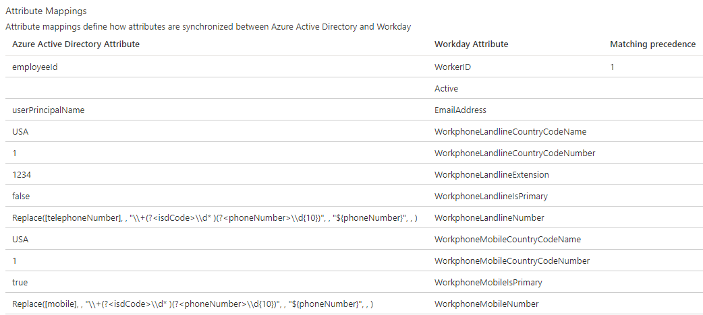

# Tutorial: Configure attribute writeback from Azure AD to Workday
The objective of this tutorial is to show the steps you need to perform to writeback attributes from Azure AD to Workday. The Workday writeback provisioning app supports assigning values to the following Workday attributes:
* Work Email 
* Workday username
* Work landline telephone number (including country code, area code, number and extension)
* Work landline telephone number primary flag
* Work mobile number (including country code, area code, number)
* Work mobile primary flag

## Overview

After you setup inbound provisioning integration using either [Workday to on-premises AD](workday-inbound-tutorial.md) provisioning app or [Workday to Azure AD](workday-inbound-cloud-only-tutorial.md) provisioning app, you can optionally configure the Workday Writeback app to write contact information such as work email and phone number to Workday. 

### Who is this user provisioning solution best suited for?

This Workday Writeback user provisioning solution is ideally suited for:

* Organizations using Office 365 that desire to writeback authoritative attributes managed by IT (such as email address, username and phone number) back to Workday

## Configure integration system user in Workday

Refer to the section [configure integration system user](workday-inbound-tutorial.md#configure-integration-system-user-in-workday) for creating a Workday integration system user account with permissions to retrieve worker data. 

## Configuring Azure AD attribute writeback to Workday

Follow these instructions to configure writeback of user email addresses and username from Azure Active Directory to Workday.

* [Adding the Writeback connector app and creating the connection to Workday](#part-1-adding-the-writeback-connector-app-and-creating-the-connection-to-workday)
* [Configure writeback attribute mappings](#part-2-configure-writeback-attribute-mappings)
* [Enable and launch user provisioning](#enable-and-launch-user-provisioning)

### Part 1: Adding the Writeback connector app and creating the connection to Workday

**To configure Workday Writeback connector:**

1. Go to <https://portal.azure.com>.

2. In the Azure portal, search for and select **Azure Active Directory**.

3. Select **Enterprise Applications**, then **All Applications**.

4. Select **Add an application**, then select the **All** category.

5. Search for **Workday Writeback**, and add that app from the gallery.

6. After the app is added and the app details screen is shown, select **Provisioning**.

7. Change the **Provisioning** **Mode** to **Automatic**.

8. Complete the **Admin Credentials** section as follows:

   * **Admin Username** – Enter the username of the Workday integration system account, with the tenant domain name
        appended. Should look something like: *username\@contoso4*

   * **Admin password –** Enter the password of the Workday integration system account

   * **Tenant URL –** Enter the URL to the Workday web services endpoint for your tenant. This value should look like:
        `https://wd3-impl-services1.workday.com/ccx/service/contoso4/Human_Resources`,
        where *contoso4* is replaced with your correct tenant name and *wd3-impl* is replaced with the correct environment string (if necessary).

   * **Notification Email –** Enter your email address, and check the  "send email if failure occurs" checkbox.

   * Click the **Test Connection** button. If the connection test succeeds, click the **Save** button at
        the top. If it fails, double-check that the Workday URL and credentials are valid in Workday.

### Part 2: Configure writeback attribute mappings

In this section, you will configure how writeback attributes flow from Azure AD to Workday. 

1. On the Provisioning tab under **Mappings**, click on the mapping name.

2. In the **Source Object Scope** field, you can optionally filter, which sets of users in Azure Active Directory should be part of the writeback. The default scope is "all users in Azure AD".

3. In the **Attribute mappings** section, update the matching ID to indicate the attribute in Azure Active Directory where the Workday worker ID or employee ID is stored. A popular matching method is to synchronize the Workday worker ID or employee ID to extensionAttribute1-15 in Azure AD, and then use this attribute in Azure AD to match users back in Workday.

4. Typically you map the Azure AD *userPrincipalName* attribute to Workday *UserID* attribute and map the Azure AD *mail* attribute to the Workday *EmailAddress* attribute. 

     >[!div class="mx-imgBorder"]
     >

5. Use the guidance shared below to map phone number attribute values from Azure AD to Workday. 

     | Workday phone attribute | Expected value | Mapping guidance |
     |-------------------------|----------------|------------------|
     | WorkphoneLandlineIsPrimary | true/false | Constant or expression mapping whose output is "true" or "false" string value. |
     | WorkphoneLandlineCountryCodeName | [Three-letter ISO 3166-1 country code](https://en.wikipedia.org/wiki/ISO_3166-1_alpha-3) | Constant or expression mapping whose output is a three letter country code. |
     | WorkphoneLandlineCountryCodeNumber | [International country calling code](https://en.wikipedia.org/wiki/List_of_country_calling_codes) | Constant or expression mapping whose output is a valid country code (without the + sign). |
     | WorkphoneLandlineNumber | Full phone number including the area code | Map to *telephoneNumber* attribute. Use regex to remove whitespace, brackets and country code. See example below. |
     | WorkphoneLandlineExtension | Extension number | If *telephoneNumber* contains extension, use regex to extract the value. |
     | WorkphoneMobileIsPrimary | true/false | Constant mapping or expression mapping whose output is "true" or "false" string value |
     | WorkphoneMobileCountryCodeName | [Three-letter ISO 3166-1 country code](https://en.wikipedia.org/wiki/ISO_3166-1_alpha-3) | Constant or expression mapping whose output is a three letter country code. |
     | WorkphoneMobileCountryCodeNumber | [International country calling code](https://en.wikipedia.org/wiki/List_of_country_calling_codes) | Constant or expression mapping whose output is a valid country code (without the + sign). |
     | WorkphoneMobileNumber | Full phone number including the area code | Map to *mobile* attribute. Use regex to remove whitespace, brackets and country code. See example below. |

     > [!NOTE]
     > When invoking the Change_Work_Contact Workday web service, Azure AD sends the following constant values: <br>
     > * **Communication_Usage_Type_ID** is set to the constant string "WORK" <br>
     > * **Phone_Device_Type_ID** is set to constant string "Mobile" for mobile phone numbers and "Landline" for landline phone numbers. <br>
     > 
     > You will encounter writeback failures if your Workday tenant uses different Type_IDs. To prevent such failures, you can use the Workday **Maintain Reference IDs** task and update the Type_IDs to match the values used by Azure AD. <br>
     >  

     **Reference regex expressions - Example 1**

     Use the below regular expression, if phone number in Azure AD is set using the format required for Self Service Password Reset (SSPR). <br>
     Example: if the phone number value is +1 1112223333 -> then the regex expression will output 1112223333

     ```C#
     Replace([telephoneNumber], , "\\+(?<isdCode>\\d* )(?<phoneNumber>\\d{10})", , "${phoneNumber}", , )
     ```

     **Reference regex expressions - Example 2**

     Use the below regular expression, if phone number in Azure AD is set using the format (XXX) XXX-XXXX. <br>
     Example: if the phone number value is (111) 222-3333 -> then the regex expression will output 1112223333

     ```C#
     Replace([mobile], , "[()\\s-]+", , "", , )
     ```

6. To save your mappings, click **Save** at the top of the Attribute-Mapping section.

## Enable and launch user provisioning

Once the Workday provisioning app configurations have been completed, you can turn on the provisioning service in the Azure portal.

> [!TIP]
> By default when you turn on the provisioning service, it will initiate provisioning operations for all users in scope. If there are errors in the mapping or Workday data issues, then the provisioning job might fail and go into the quarantine state. To avoid this, as a best practice, we recommend configuring **Source Object Scope** filter and testing  your attribute mappings with a few test users before launching the full sync for all users. Once you have verified that the mappings work and are giving you the desired results, then you can either remove the filter or gradually expand it to include more users.

1. In the **Provisioning** tab, set the **Provisioning Status** to **On**.

2. Click **Save**.

3. This operation will start the initial sync, which can take a variable number of hours depending on how many users are in the source directory. You can check the progress bar to the track the progress of the sync cycle. 

4. At any time, check the **Audit logs** tab in the Azure portal to see what actions the provisioning service has performed. The audit logs lists all individual sync events performed by the provisioning service, such as which users are imported from the source and exported to the target application.  

5. Once the initial sync is completed, it will write a summary report in the **Provisioning** tab, as shown below.

     > [!div class="mx-imgBorder"]
     > 

## Next steps

* [Learn how to review logs and get reports on provisioning activity](../app-provisioning/check-status-user-account-provisioning.md)
* [Learn how to configure single sign-on between Workday and Azure Active Directory](workday-tutorial.md)
* [Learn how to integrate other SaaS applications with Azure Active Directory](tutorial-list.md)
* [Learn how to export and import your provisioning configurations](../app-provisioning/export-import-provisioning-configuration.md)

