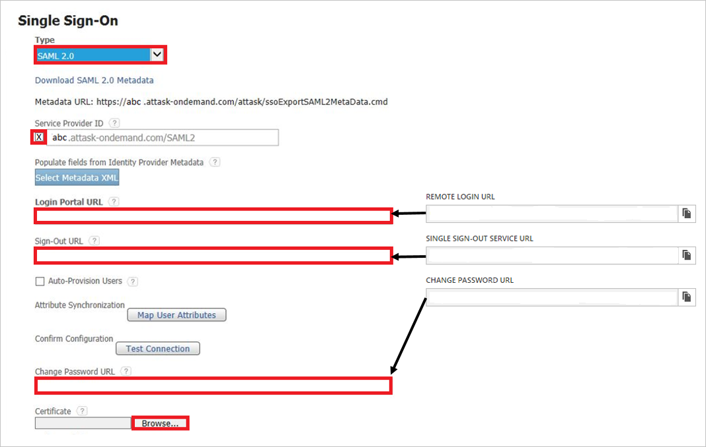
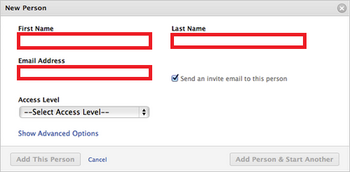

# Tutorial: Microsoft Entra integration with Workfront

In this tutorial, you'll learn how to integrate Workfront with Microsoft Entra ID. When you integrate Workfront with Microsoft Entra ID, you can:

* Control in Microsoft Entra ID who has access to Workfront.
* Enable your users to be automatically signed-in to Workfront with their Microsoft Entra accounts.
* Manage your accounts in one central location.

## Prerequisites

To configure Microsoft Entra integration with Workfront, you need the following items:

* A Microsoft Entra subscription. If you don't have a Microsoft Entra environment, you can get a [free account](https://azure.microsoft.com/free/).
* Workfront single sign-on enabled subscription.

## Scenario description

In this tutorial, you configure and test Microsoft Entra single sign-on in a test environment.

* Workfront supports **SP** initiated SSO.

## Add Workfront from the gallery

To configure the integration of Workfront into Microsoft Entra ID, you need to add Workfront from the gallery to your list of managed SaaS apps.

1. Sign in to the [Microsoft Entra admin center](https://entra.microsoft.com) as at least a [Cloud Application Administrator](../roles/permissions-reference.md#cloud-application-administrator).
1. Browse to **Identity** > **Applications** > **Enterprise applications** > **New application**.
1. In the **Add from the gallery** section, type **Workfront** in the search box.
1. Select **Workfront** from results panel and then add the app. Wait a few seconds while the app is added to your tenant.

 Alternatively, you can also use the [Enterprise App Configuration Wizard](https://portal.office.com/AdminPortal/home?Q=Docs#/azureadappintegration). In this wizard, you can add an application to your tenant, add users/groups to the app, assign roles, as well as walk through the SSO configuration as well. [Learn more about Microsoft 365 wizards.](/microsoft-365/admin/misc/azure-ad-setup-guides)

## Configure and test Microsoft Entra SSO for Workfront

Configure and test Microsoft Entra SSO with Workfront using a test user called **B.Simon**. For SSO to work, you need to establish a link relationship between a Microsoft Entra user and the related user in Workfront.

To configure and test Microsoft Entra SSO with Workfront, perform the following steps:

1. **[Configure Microsoft Entra SSO](#configure-azure-ad-sso)** - to enable your users to use this feature.
    1. **[Create a Microsoft Entra test user](#create-an-azure-ad-test-user)** - to test Microsoft Entra single sign-on with B.Simon.
    1. **[Assign the Microsoft Entra test user](#assign-the-azure-ad-test-user)** - to enable B.Simon to use Microsoft Entra single sign-on.
1. **[Configure Workfront SSO](#configure-workfront-sso)** - to configure the single sign-on settings on application side.
    1. **[Create Workfront test user](#create-workfront-test-user)** - to have a counterpart of B.Simon in Workfront that is linked to the Microsoft Entra representation of user.
1. **[Test SSO](#test-sso)** - to verify whether the configuration works.

## Configure Microsoft Entra SSO

Follow these steps to enable Microsoft Entra SSO.

1. Sign in to the [Microsoft Entra admin center](https://entra.microsoft.com) as at least a [Cloud Application Administrator](../roles/permissions-reference.md#cloud-application-administrator).
1. Browse to **Identity** > **Applications** > **Enterprise applications** > **Workfront** > **Single sign-on**.
1. On the **Select a single sign-on method** page, select **SAML**.
1. On the **Set up single sign-on with SAML** page, click the pencil icon for **Basic SAML Configuration** to edit the settings.

   

1. On the **Basic SAML Configuration** section, perform the following steps:

	a. In the **Sign on URL** text box, type a URL using the following pattern:
    `https://<companyname>.attask-ondemand.com`

    b. In the **Identifier (Entity ID)** text box, type a URL using the following pattern:
    `https://<companyname>.attasksandbox.com/SAML2`

	> [!NOTE]
	> These values are not real. Update these values with the actual Sign on URL and Identifier. Contact [Workfront Client support team](https://www.workfront.com/services-and-support) to get these values. You can also refer to the patterns shown in the **Basic SAML Configuration** section.

1. On the **Set up Single Sign-On with SAML** page, in the **SAML Signing Certificate** section, click **Download** to download the **Certificate (Base64)** from the given options as per your requirement and save it on your computer.

	

1. On the **Set up Workfront** section, copy the appropriate URL(s) as per your requirement.

	

### Create a Microsoft Entra test user 

In this section, you'll create a test user called B.Simon.

1. Sign in to the [Microsoft Entra admin center](https://entra.microsoft.com) as at least a [User Administrator](../roles/permissions-reference.md#user-administrator).
1. Browse to **Identity** > **Users** > **All users**.
1. Select **New user** > **Create new user**, at the top of the screen.
1. In the **User** properties, follow these steps:
   1. In the **Display name** field, enter `B.Simon`.  
   1. In the **User principal name** field, enter the username@companydomain.extension. For example, `B.Simon@contoso.com`.
   1. Select the **Show password** check box, and then write down the value that's displayed in the **Password** box.
   1. Select **Review + create**.
1. Select **Create**.

### Assign the Microsoft Entra test user

In this section, you'll enable B.Simon to use single sign-on by granting access to Workfront.

1. Sign in to the [Microsoft Entra admin center](https://entra.microsoft.com) as at least a [Cloud Application Administrator](../roles/permissions-reference.md#cloud-application-administrator).
1. Browse to **Identity** > **Applications** > **Enterprise applications** > **Workfront**.
1. In the app's overview page, select **Users and groups**.
1. Select **Add user/group**, then select **Users and groups** in the **Add Assignment** dialog.
   1. In the **Users and groups** dialog, select **B.Simon** from the Users list, then click the **Select** button at the bottom of the screen.
   1. If you are expecting a role to be assigned to the users, you can select it from the **Select a role** dropdown. If no role has been set up for this app, you see "Default Access" role selected.
   1. In the **Add Assignment** dialog, click the **Assign** button.

## Configure Workfront SSO

1. Sign-on to your Workfront company site as administrator.

2. Go to **Single Sign On Configuration**.

3. On the **Single Sign-On** dialog, perform the following steps
	
	
   
    a. As **Type**, select **SAML 2.0**.
   
    b. Select **Service Provider ID**.
   
    c. Paste the **Login URL** into the **Login Portal URL** textbox.
   
    d. Paste **Logout URL** into the **Sign-Out URL** textbox.
   
    e. Paste **Change Password URL** into the **Change Password URL** textbox.
   
    f. Click **Save**.

### Create Workfront test user

The objective of this section is to create a user called Britta Simon in Workfront.

**To create a user called Britta Simon in Workfront, perform the following steps:**

1. Sign on to your Workfront company site as administrator.
 
2. In the menu on the top, click **People**.
 
3. Click **New Person**. 

4. On the New Person dialog, perform the following steps:
   
    
   
    a. In the **First Name** textbox, type "Britta."
   
    b. In the **Last Name** textbox, type "Simon."
   
    c. In the **Email Address** textbox, type Britta Simon's email address in Microsoft Entra ID.
   
    d. Click **Add Person**.

## Test SSO

In this section, you test your Microsoft Entra single sign-on configuration with following options. 

* Click on **Test this application**, this will redirect to Workfront Sign-on URL where you can initiate the login flow. 

* Go to Workfront Sign-on URL directly and initiate the login flow from there.

* You can use Microsoft My Apps. When you click the Workfront tile in the My Apps, this will redirect to Workfront Sign-on URL. For more information about the My Apps, see [Introduction to the My Apps](https://support.microsoft.com/account-billing/sign-in-and-start-apps-from-the-my-apps-portal-2f3b1bae-0e5a-4a86-a33e-876fbd2a4510).

## Next steps

Once you configure Workfront you can enforce session control, which protects exfiltration and infiltration of your organization’s sensitive data in real time. Session control extends from Conditional Access. [Learn how to enforce session control with Microsoft Defender for Cloud Apps](/cloud-app-security/proxy-deployment-any-app).
