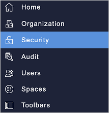
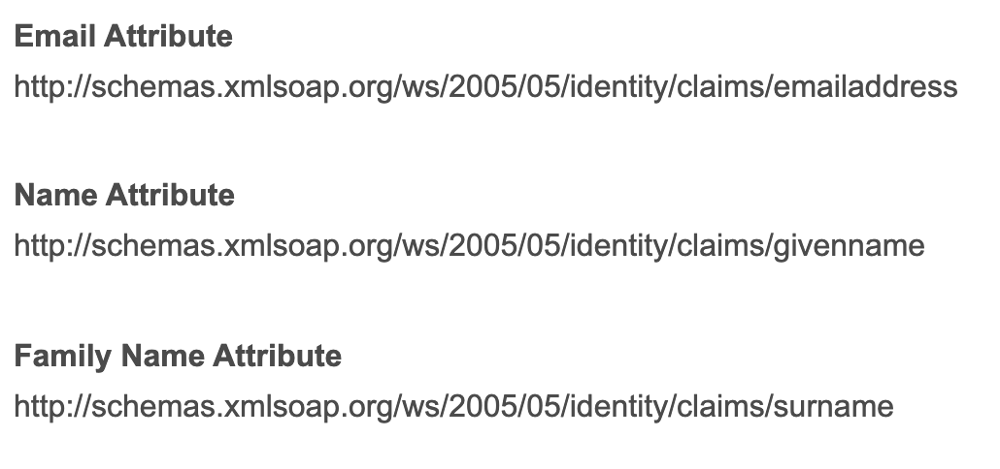

# Tutorial: Azure Active Directory integration with Workgrid

In this tutorial, you'll learn how to integrate Workgrid with Azure Active Directory (Azure AD). When you integrate Workgrid with Azure AD, you can:

* Control in Azure AD who has access to Workgrid.
* Enable your users to be automatically signed-in to Workgrid with their Azure AD accounts.
* Manage your accounts in one central location - the Azure portal.

## Prerequisites

To configure Azure AD integration with Workgrid, you need the following items:

* An Azure AD subscription. If you don't have an Azure AD environment, you can get a [free account](https://azure.microsoft.com/free/).
* Workgrid single sign-on enabled subscription.

## Scenario description

In this tutorial, you configure and test Azure AD single sign-on in a test environment.

* Workgrid supports **SP** initiated SSO.
* Workgrid supports **Just In Time** user provisioning.
* Workgrid supports [Automated user provisioning](workgrid-provisioning-tutorial.md).

## Add Workgrid from the gallery

To configure the integration of Workgrid into Azure AD, you need to add Workgrid from the gallery to your list of managed SaaS apps.

1. Sign in to the Azure portal using either a work or school account, or a personal Microsoft account.
1. On the left navigation pane, select the **Azure Active Directory** service.
1. Navigate to **Enterprise Applications** and then select **All Applications**.
1. To add new application, select **New application**.
1. In the **Add from the gallery** section, type **Workgrid** in the search box.
1. Select **Workgrid** from results panel and then add the app. Wait a few seconds while the app is added to your tenant.

 Alternatively, you can also use the [Enterprise App Configuration Wizard](https://portal.office.com/AdminPortal/home?Q=Docs#/azureadappintegration). In this wizard, you can add an application to your tenant, add users/groups to the app, assign roles, as well as walk through the SSO configuration as well. [Learn more about Microsoft 365 wizards.](/microsoft-365/admin/misc/azure-ad-setup-guides)

## Configure and test Azure AD SSO for Workgrid

Configure and test Azure AD SSO with Workgrid using a test user called **B.Simon**. For SSO to work, you need to establish a link relationship between an Azure AD user and the related user in Workgrid.

To configure and test Azure AD SSO with Workgrid, perform the following steps:

1. **[Configure Azure AD SSO](#configure-azure-ad-sso)** - to enable your users to use this feature.
    1. **[Create an Azure AD test user](#create-an-azure-ad-test-user)** - to test Azure AD single sign-on with B.Simon.
    1. **[Assign the Azure AD test user](#assign-the-azure-ad-test-user)** - to enable B.Simon to use Azure AD single sign-on.
1. **[Configure Workgrid SSO](#configure-workgrid-sso)** - to configure the single sign-on settings on application side.
    1. **[Create Workgrid test user](#create-workgrid-test-user)** - to have a counterpart of B.Simon in Workgrid that is linked to the Azure AD representation of user.
1. **[Test SSO](#test-sso)** - to verify whether the configuration works.

## Configure Azure AD SSO

Follow these steps to enable Azure AD SSO in the Azure portal.

1. In the Azure portal, on the **Workgrid** application integration page, find the **Manage** section and select **single sign-on**.
1. On the **Select a single sign-on method** page, select **SAML**.
1. On the **Set up single sign-on with SAML** page, click the pencil icon for **Basic SAML Configuration** to edit the settings.

   

4. On the **Basic SAML Configuration** section, perform the following steps:

   a. In the **Sign on URL** text box, type a URL using the following pattern:
   `https://<COMPANYCODE>.workgrid.com/console`

   b. In the **Identifier (Entity ID)** text box, type a value using the following pattern:
   `urn:amazon:cognito:sp:us-east-1_<poolid>`

   > [!NOTE]
   > These values are not real. Update these values with the actual Sign on URL and Identifier. Your Sign On URL is the same URL you use to sign in to the Workgrid console.  You can find the Entity ID in the Security Section of your Workgrid console.

5. Workgrid application expects the SAML assertions in a specific format. Configure the following claims for this application. You can manage the values of these attributes from the **User Attributes** section on application integration page. On the **Set up Single Sign-On with SAML** page, click **Edit** button to open **User Attributes** dialog.

   

6. On the **Set-up Single Sign-On with SAML** page, in the **SAML Signing Certificate** section, click **Download** to download the **Federation Metadata XML** from the given options as per your requirement and save it on your computer.

   

7. On the **Set-up Workgrid** section, copy the appropriate URL(s) as per your requirement.

   

### Create an Azure AD test user

In this section, you'll create a test user in the Azure portal called B.Simon.

1. From the left pane in the Azure portal, select **Azure Active Directory**, select **Users**, and then select **All users**.
1. Select **New user** at the top of the screen.
1. In the **User** properties, follow these steps:
    1. In the **Name** field, enter `B.Simon`.
    1. In the **User name** field, enter the username@companydomain.extension. For example, `B.Simon@contoso.com`.
    1. Select the **Show password** check box, and then write down the value that's displayed in the **Password** box.
    1. Click **Create**.

### Assign the Azure AD test user

In this section, you'll enable B.Simon to use Azure single sign-on by granting access to Workgrid.

1. In the Azure portal, select **Enterprise Applications**, and then select **All applications**.
1. In the applications list, select **Workgrid**.
1. In the app's overview page, find the **Manage** section and select **Users and groups**.
1. Select **Add user**, then select **Users and groups** in the **Add Assignment** dialog.
1. In the **Users and groups** dialog, select **B.Simon** from the Users list, then click the **Select** button at the bottom of the screen.
1. If you're expecting any role value in the SAML assertion, in the **Select Role** dialog, select the appropriate role for the user from the list and then click the **Select** button at the bottom of the screen.
1. In the **Add Assignment** dialog, click the **Assign** button.

## Configure Workgrid SSO

To configure single sign-on on **Workgrid** side, you need to add the downloaded **Federation Metadata XML** and appropriate copied URLs from Azure portal to your Workgrid console in the **Security section**.

   

   > [!NOTE]
   > You will need to use the full schema URI for the Email, Name and Family Name claims when mapping the attributes in Workgrid:
 >
 >  

### Create Workgrid test user

In this section, a user called Britta Simon is created in Workgrid. Workgrid supports just-in-time provisioning, which is enabled by default. There is no action item for you in this section. If a user doesn't already exist in Workgrid, a new one is created when you attempt to access Workgrid.

Workgrid also supports automatic user provisioning, you can find more details [here](./workgrid-provisioning-tutorial.md) on how to configure automatic user provisioning.

## Test SSO

In this section, you test your Azure AD single sign-on configuration with following options.

* Click on **Test this application** in Azure portal. This will redirect to Workgrid Sign-on URL where you can initiate the login flow.

* Go to Workgrid Sign-on URL directly and initiate the login flow from there.

* You can use Microsoft My Apps. When you click the Workgrid tile in the My Apps, this will redirect to Workgrid Sign-on URL. For more information about the My Apps, see [Introduction to the My Apps](../user-help/my-apps-portal-end-user-access.md).

## Next steps

Once you configure Workgrid you can enforce session control, which protects exfiltration and infiltration of your organization’s sensitive data in real time. Session control extends from Conditional Access. [Learn how to enforce session control with Microsoft Defender for Cloud Apps](/cloud-app-security/proxy-deployment-aad).
