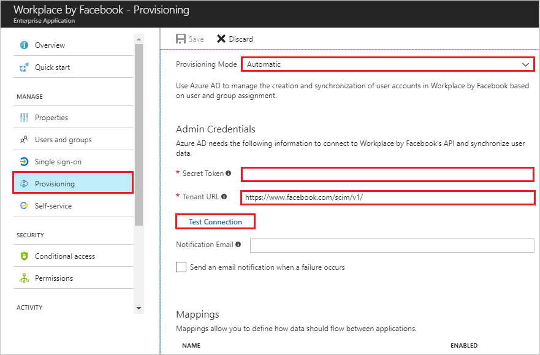

# Tutorial: Configure Workplace by Facebook for automatic user provisioning

The objective of this tutorial is to show you the steps you need to perform in Workplace by Facebook and Azure AD to automatically provision and de-provision user accounts from Azure AD to Workplace by Facebook.

## Prerequisites

To configure Azure AD integration with Workplace by Facebook, you need the following items:

- An Azure AD subscription
- A Workplace by Facebook single-sign on enabled subscription

> [!NOTE]
> To test the steps in this tutorial, we do not recommend using a production environment.

To test the steps in this tutorial, you should follow these recommendations:

- Do not use your production environment, unless it is necessary.
- If you don't have an Azure AD trial environment, you can get a one-month trial [here](https://azure.microsoft.com/pricing/free-trial/).

## Assigning users to Workplace by Facebook

Azure Active Directory uses a concept called "assignments" to determine which users should receive access to selected apps. In the context of automatic user account provisioning, only the users and groups that have been "assigned" to an application in Azure AD is synchronized.

Before configuring and enabling the provisioning service, you need to decide what users and/or groups in Azure AD represent the users who need access to your Workplace by Facebook app. Once decided, you can assign these users to your Workplace by Facebook app by following the instructions here:

[Assign a user or group to an enterprise app](https://docs.microsoft.com/azure/active-directory/active-directory-coreapps-assign-user-azure-portal)

### Important tips for assigning users to Workplace by Facebook

*   It is recommended that a single Azure AD user is assigned to Workplace by Facebook to test the provisioning configuration. Additional users and/or groups may be assigned later.

*   When assigning a user to Workplace by Facebook, you must select a valid user role. The "Default Access" role does not work for provisioning.

## Enable User Provisioning

This section guides you through connecting your Azure AD to Workplace by Facebook's user account provisioning API, and configuring the provisioning service to create, update, and disable assigned user accounts in Workplace by Facebook based on user and group assignment in Azure AD.

>[!Tip]
>You may also choose to enable SAML-based Single Sign-On for Workplace by Facebook, following the instructions provided in [Azure portal](https://portal.azure.com). Single sign-on can be configured independently of automatic provisioning, though these two features compliment each other.

### To configure user account provisioning to Workplace by Facebook in Azure AD:

The objective of this section is to outline how to enable provisioning of Active Directory user accounts to Workplace by Facebook.

Azure AD supports the ability to automatically synchronize the account details of assigned users to Workplace by Facebook. This automatic synchronization enables Workplace by Facebook to get the data it needs to authorize users for access, before them attempting to sign in for the first time. It also de-provisions users from Workplace by Facebook when access has been revoked in Azure AD.

1. In the [Azure portal](https://portal.azure.com), browse to the **Azure Active Directory** > **Enterprise Apps** > **All applications** section.

2. If you have already configured Workplace by Facebook for single sign-on, search for your instance of Workplace by Facebook using the search field. Otherwise, select **Add** and search for **Workplace by Facebook** in the application gallery. Select Workplace by Facebook from the search results, and add it to your list of applications.

3. Select your instance of Workplace by Facebook, then select the **Provisioning** tab.

4. Set the **Provisioning Mode** to **Automatic**. 

    

5. Under the **Admin Credentials** section, enter the Access Token from your Workplace by Facebook administrator and set the Tenant URL value to `https://www.facebook.com/scim/v1/` . See these [instructions](https://developers.facebook.com/docs/workplace/integrations/custom-integrations/apps) on creating an Access Token for Workplace. 

6. In the Azure portal, click **Test Connection** to ensure Azure AD can connect to your Workplace by Facebook app. If the connection fails, ensure your Workplace by Facebook account has Team Admin permissions.

7. Enter the email address of a person or group who should receive provisioning error notifications in the **Notification Email** field, and check the checkbox.

8. Click **Save.**

9. Under the Mappings section, select **Synchronize Azure Active Directory Users to Workplace by Facebook.**

10. In the **Attribute Mappings** section, review the user attributes that are synchronized from Azure AD to Workplace by Facebook. The attributes selected as **Matching** properties are used to match the user accounts in Workplace by Facebook for update operations. Select the Save button to commit any changes.

11. To enable the Azure AD provisioning service for Workplace by Facebook, change the **Provisioning Status** to **On** in the **Settings** section

12. Click **Save.**

For more information on how to configure automatic provisioning, see [https://developers.facebook.com/docs/facebook-at-work/provisioning/cloud-providers](https://developers.facebook.com/docs/facebook-at-work/provisioning/cloud-providers)

You can now create a test account. Wait for up to 20 minutes to verify that the account has been synchronized to Workplace by Facebook.

## Additional resources

* [Managing user account provisioning for Enterprise Apps](tutorial-list.md)
* [What is application access and single sign-on with Azure Active Directory?](../manage-apps/what-is-single-sign-on.md)
* [Configure Single Sign-on](workplacebyfacebook-tutorial.md)
