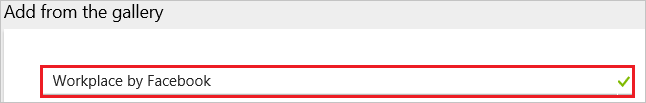
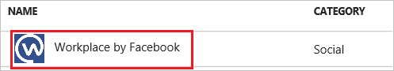
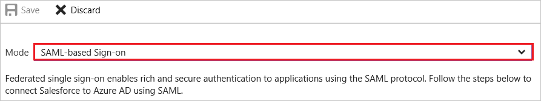
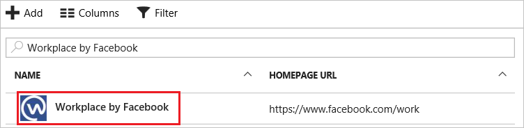

# Tutorial: Azure Active Directory integration with Workplace by Facebook

In this tutorial, you learn how to integrate Workplace by Facebook with Azure Active Directory (Azure AD).

Integrating Workplace by Facebook with Azure AD provides you with the following benefits:

- You can control in Azure AD who has access to Workplace by Facebook
- You can enable your users to automatically get signed-on to Workplace by Facebook (Single Sign-On) with their Azure AD accounts
- You can manage your accounts in one central location - the Azure portal

If you want to know more details about SaaS app integration with Azure AD, see [what is application access and single sign-on with Azure Active Directory](../manage-apps/what-is-single-sign-on.md).

## Prerequisites

To configure Azure AD integration with Workplace by Facebook, you need the following items:

- An Azure AD subscription
- A Workplace by Facebook single sign-on enabled subscription

> [!NOTE]
> To test the steps in this tutorial, we do not recommend using a production environment.

To test the steps in this tutorial, you should follow these recommendations:

- Do not use your production environment, unless it is necessary.
- If you don't have an Azure AD trial environment, you can get a one-month trial [here](https://azure.microsoft.com/pricing/free-trial/).

> [!NOTE]
> Facebook has two products, Workplace Standard (free) and Workplace Premium (paid). Any Workplace Premium tenant can configure SCIM and SSO integration with no other implications to cost or licenses required. SSO and SCIM are not available in Workplace Standard instances.

## Scenario description
In this tutorial, you test Azure AD single sign-on in a test environment. 
The scenario outlined in this tutorial consists of two main building blocks:

1. Adding Workplace by Facebook from the gallery
1. Configuring and testing Azure AD single sign-on

## Adding Workplace by Facebook from the gallery
To configure the integration of Workplace by Facebook into Azure AD, you need to add Workplace by Facebook from the gallery to your list of managed SaaS apps.

**To add Workplace by Facebook from the gallery, perform the following steps:**

1. In the **[Azure portal](https://portal.azure.com)**, on the left navigation panel, click **Azure Active Directory** icon. 

	![Active Directory][1]

1. Navigate to **Enterprise applications**. Then go to **All applications**.

	![Applications][2]
	
1. To add new application, click **New application** button on the top of dialog.

	![Applications][3]

1. In the search box, type **Workplace by Facebook**.

	

1. In the results panel, select **Workplace by Facebook**, and then click **Add** button to add the application.

	

##  Configuring and testing Azure AD single sign-on
In this section, you configure and test Azure AD single sign-on with Workplace by Facebook based on a test user called "Britta Simon."

For single sign-on to work, Azure AD needs to know what the counterpart user in Workplace by Facebook is to a user in Azure AD. In other words, a link relationship between an Azure AD user and the related user in Workplace by Facebook needs to be established.

This link relationship is established by assigning the value of the **user name** in Azure AD as the value of the **Username** in Workplace by Facebook.

To configure and test Azure AD single sign-on with Workplace by Facebook, you need to complete the following building blocks:

1. **[Configuring Azure AD Single Sign-On](#configuring-azure-ad-single-sign-on)** - to enable your users to use this feature.
1. **[Configuring Reauthentication Frequency](#configuring-reauthentication-frequency)** - to configure Workplace to prompt for a SAML check.
1. **[Creating an Azure AD test user](#creating-an-azure-ad-test-user)** - to test Azure AD single sign-on with Britta Simon.
1. **[Creating a Workplace by Facebook test user](#creating-a-workplace-by-facebook-test-user)** - to have a counterpart of Britta Simon in Workplace by Facebook that is linked to the Azure AD representation of user.
1. **[Assigning the Azure AD test user](#assigning-the-azure-ad-test-user)** - to enable Britta Simon to use Azure AD single sign-on.
1. **[Testing Single Sign-On](#testing-single-sign-on)** - to verify whether the configuration works.

### Configuring Azure AD single sign-on

In this section, you enable Azure AD single sign-on in the Azure portal and configure single sign-on in your Workplace by Facebook application.

**To configure Azure AD single sign-on with Workplace by Facebook, perform the following steps:**

1. In the Azure portal, on the **Workplace by Facebook** application integration page, click **Single sign-on**.

	![Configure Single Sign-On][4]

1. On the **Single sign-on** dialog, select **Mode** as	**SAML-based Sign-on** to enable single sign-on.
 
	

1. On the **Workplace by Facebook Domain and URLs** section, perform the following steps:

	

    a. In the **Sign-on URL** textbox, type a URL using the following pattern: `https://<instancename>.facebook.com`

	b. In the **Identifier** textbox, type a URL using the following pattern: `https://www.facebook.com/company/<instanceID>`

	> [!NOTE] 
	> These values are not the real. Update these values with the actual Sign-On URL and Identifier. See the Authentication page of the Workplace Company Dashboard for the correct values for your Workplace community. 

1. On the **SAML Signing Certificate** section, click **Certificate (Base64)** and then save the certificate file on your computer.

	 

1. Click **Save** button.

	

1. On the **Workplace by Facebook Configuration** section, click **Configure Workplace by Facebook** to open **Configure sign-on** window. Copy the **Sign-Out URL, SAML Entity ID, and SAML Single Sign-On Service URL** from the **Quick Reference section.**

	 

1. In a different web browser window, login to your Workplace by Facebook company site as an administrator.
  
   > [!NOTE] 
   > As part of the SAML authentication process, Workplace may utilize query strings of up to 2.5 kilobytes in size in order to pass parameters to Azure AD.

1. In the **Company Dashboard**, go to the **Authentication** tab.

1. Under **SAML Authentication**, select **SSO Only** from the drop-down list.

1. Input the values copied from **Workplace by Facebook Configuration** section of the Azure portal into the corresponding fields:

	*	In **SAML URL** textbox, paste the value of **Single Sign-On Service URL**, which you have copied from Azure portal.
	*	In **SAML Issuer URL textbox**, paste the value of **SAML Entity ID**, which you have copied from Azure portal.
	*	In **SAML Logout Redirect** (Optional), paste the value of **Sign-Out URL**, which you have copied from Azure portal.
	*	Open your **base-64 encoded certificate** in notepad downloaded from Azure portal, copy the content of it into your clipboard, and then paste it to the **SAML Certificate** textbox.

1. You may need to enter the Audience URL, Recipient URL, and ACS (Assertion Consumer Service) URL listed under the **SAML Configuration** section.

1. Scroll to the bottom of the section and click the **Test SSO** button. This results in a popup window appearing with Azure AD login page presented. Enter your credentials in as normal to authenticate. 

	**Troubleshooting:** Ensure the email address being returned back from Azure AD is the same as the Workplace account you are logged in with.

1. Once the test has been completed successfully, scroll to the bottom of the page and click the **Save** button.

1. All users using Workplace will now be presented with Azure AD login page for authentication.

1. **SAML Logout Redirect (optional)** - 

	You can choose to optionally configure a SAML Logout Url, which can be used to point at Azure AD's logout page. When this setting is enabled and configured, the user will no longer be directed to the Workplace logout page. Instead, the user will be redirected to the url that was added in the SAML Logout Redirect setting.

### Configuring Reauthentication Frequency

You can configure Workplace to prompt for a SAML check every day, three days, week, two weeks, month or never.

> [!NOTE] 
>The minimum value for the SAML check on mobile applications is set to one week.

You can also force a SAML reset for all users using the button: Require SAML authentication for all users now.

### Creating an Azure AD test user
The objective of this section is to create a test user in the Azure portal called Britta Simon.

![Create Azure AD User][100]

**To create a test user in Azure AD, perform the following steps:**

1. In the **Azure portal**, on the left navigation pane, click **Azure Active Directory** icon.

	 

1. To display the list of users, go to **Users and groups** and click **All users**.
	
	 

1. To open the **User** dialog, click **Add** on the top of the dialog.
 
	 

1. On the **User** dialog page, perform the following steps:
 
	 

    a. In the **Name** textbox, type **BrittaSimon**.

    b. In the **User name** textbox, type the **email address** of BrittaSimon.

	c. Select **Show Password** and write down the value of the **Password**.

    d. Click **Create**.
 
### Creating a Workplace by Facebook test user

In this section, a user called Britta Simon is created in Workplace by Facebook. Workplace by Facebook supports just-in-time provisioning, which is enabled by default.

There is no action for you in this section. If a user doesn't exist in Workplace by Facebook, a new one is created when you attempt to access Workplace by Facebook.

>[!Note]
>If you need to create a user manually, Contact [Workplace by Facebook Client support team](https://workplace.fb.com/faq/)

### Assigning the Azure AD test user

In this section, you enable Britta Simon to use Azure single sign-on by granting access to Workplace by Facebook.

![Assign User][200] 

**To assign Britta Simon to Workplace by Facebook, perform the following steps:**

1. In the Azure portal, open the applications view, and then navigate to the directory view and go to **Enterprise applications** then click **All applications**.

	![Assign User][201] 

1. In the applications list, select **Workplace by Facebook**.

	 

1. In the menu on the left, click **Users and groups**.

	![Assign User][202] 

1. Click **Add** button. Then select **Users and groups** on **Add Assignment** dialog.

	![Assign User][203]

1. On **Users and groups** dialog, select **Britta Simon** in the Users list.

1. Click **Select** button on **Users and groups** dialog.

1. Click **Assign** button on **Add Assignment** dialog.
	
### Testing single sign-on

If you want to test your single sign-on settings, open the Access Panel.
For more information about the Access Panel, see [Introduction to the Access Panel](../user-help/active-directory-saas-access-panel-introduction.md).

## Additional resources

* [List of Tutorials on How to Integrate SaaS Apps with Azure Active Directory](tutorial-list.md)
* [What is application access and single sign-on with Azure Active Directory?](../manage-apps/what-is-single-sign-on.md)
* [Configure User Provisioning](workplacebyfacebook-provisioning-tutorial.md)

<!--Image references-->

[1]: ./media/workplacebyfacebook-tutorial/tutorial_general_01.png
[2]: ./media/workplacebyfacebook-tutorial/tutorial_general_02.png
[3]: ./media/workplacebyfacebook-tutorial/tutorial_general_03.png
[4]: ./media/workplacebyfacebook-tutorial/tutorial_general_04.png

[100]: ./media/workplacebyfacebook-tutorial/tutorial_general_100.png

[200]: ./media/workplacebyfacebook-tutorial/tutorial_general_200.png
[201]: ./media/workplacebyfacebook-tutorial/tutorial_general_201.png
[202]: ./media/workplacebyfacebook-tutorial/tutorial_general_202.png
[203]: ./media/workplacebyfacebook-tutorial/tutorial_general_203.png
