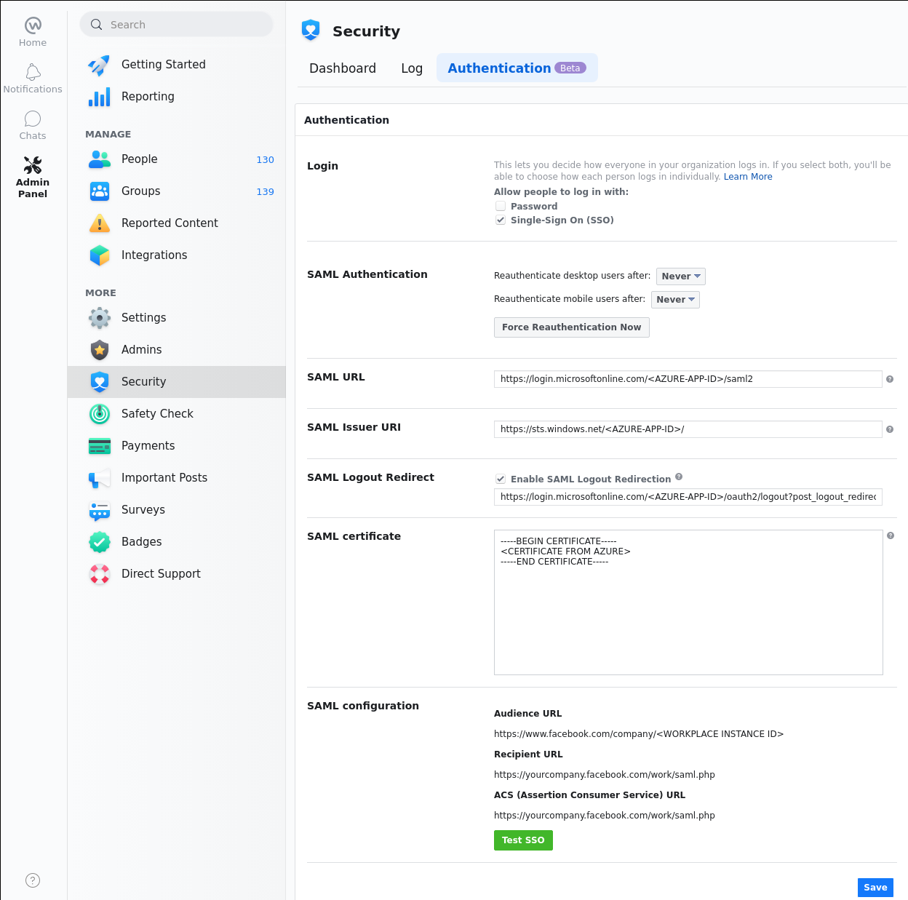
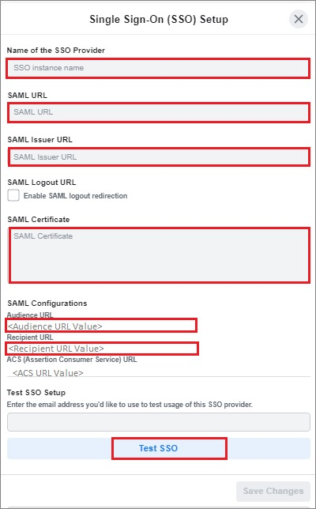
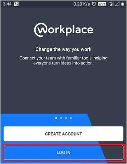
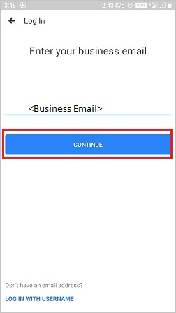
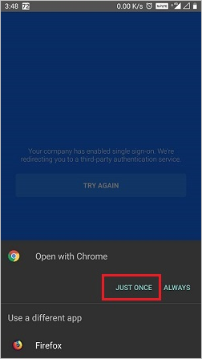
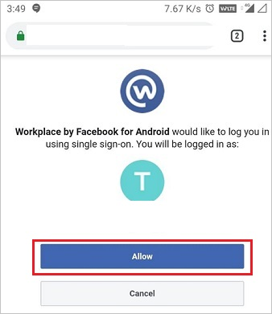

# Tutorial: Azure Active Directory single sign-on (SSO) integration with Workplace by Facebook

In this tutorial, you'll learn how to integrate Workplace by Facebook with Azure Active Directory (Azure AD). When you integrate Workplace by Facebook with Azure AD, you can:

* Control in Azure AD who has access to Workplace by Facebook.
* Enable your users to be automatically signed-in to Workplace by Facebook with their Azure AD accounts.
* Manage your accounts in one central location - the Azure portal.

To learn more about SaaS app integration with Azure AD, see [What is application access and single sign-on with Azure Active Directory](/azure/active-directory/manage-apps/what-is-single-sign-on).

## Prerequisites

To get started, you need the following items:

* An Azure AD subscription. If you don't have a subscription, you can get a [free account](https://azure.microsoft.com/free/).
* Workplace by Facebook single sign-on (SSO) enabled subscription.

> [!NOTE]
> Facebook has two products, Workplace Standard (free) and Workplace Premium (paid). Any Workplace Premium tenant can configure SCIM and SSO integration with no other implications to cost or licenses required. SSO and SCIM are not available in Workplace Standard instances.

## Scenario description

In this tutorial, you configure and test Azure AD SSO in a test environment.

* Workplace by Facebook supports **SP** initiated SSO
* Workplace by Facebook supports **just-in-time provisioning**
* Workplace by Facebook supports **[automatic User Provisioning](workplacebyfacebook-provisioning-tutorial.md)**
* Workplace by Facebook Mobile application can now be configured with Azure AD for enabling SSO. In this tutorial, you configure and test Azure AD SSO in a test environment.
* Once you configure Workplace by Facebook you can enforce Session control, which protect exfiltration and infiltration of your organization's sensitive data in real-time. Session control extend from Conditional Access. [Learn how to enforce session control with Microsoft Cloud App Security](https://docs.microsoft.com/cloud-app-security/proxy-deployment-aad)

## Adding Workplace by Facebook from the gallery

To configure the integration of Workplace by Facebook into Azure AD, you need to add Workplace by Facebook from the gallery to your list of managed SaaS apps.

1. Sign in to the [Azure portal](https://portal.azure.com) using either a work or school account, or a personal Microsoft account.
1. On the left navigation pane, select the **Azure Active Directory** service.
1. Navigate to **Enterprise Applications** and then select **All Applications**.
1. To add new application, select **New application**.
1. In the **Add from the gallery** section, type **Workplace by Facebook** in the search box.
1. Select **Workplace by Facebook** from results panel and then add the app. Wait a few seconds while the app is added to your tenant.

## Configure and test Azure AD SSO for Workplace by Facebook

Configure and test Azure AD SSO with Workplace by Facebook using a test user called **B.Simon**. For SSO to work, you need to establish a link relationship between an Azure AD user and the related user in Workplace by Facebook.

To configure and test Azure AD SSO with Workplace by Facebook, complete the following building blocks:

1. **[Configure Azure AD SSO](#configure-azure-ad-sso)** - to enable your users to use this feature.
    * **[Create an Azure AD test user](#create-an-azure-ad-test-user)** - to test Azure AD single sign-on with B.Simon.
    * **[Assign the Azure AD test user](#assign-the-azure-ad-test-user)** - to enable B.Simon to use Azure AD single sign-on.
2. **[Configure Workplace by Facebook SSO](#configure-workplace-by-facebook-sso)** - to configure the Single Sign-On settings on application side.
    * **[Create Workplace by Facebook test user](#create-workplace-by-facebook-test-user)** - to have a counterpart of B.Simon in Workplace by Facebook that is linked to the Azure AD representation of user.
3. **[Test SSO](#test-sso)** - to verify whether the configuration works.

## Configure Azure AD SSO

Follow these steps to enable Azure AD SSO in the Azure portal.

1. In the [Azure portal](https://portal.azure.com/), on the **Workplace by Facebook** application integration page, find the **Manage** section and select **Single sign-on**.
1. On the **Select a Single sign-on method** page, select **SAML**.
1. On the **Set up Single Sign-On with SAML** page, click the edit/pen icon for **Basic SAML Configuration** to edit the settings.

   

1. On the **Basic SAML Configuration** section, enter the values for the following fields:

    a. In the **Sign on URL** text box, type a URL using the following pattern:
    `https://<instancename>.facebook.com`

    b. In the **Identifier (Entity ID)** text box, type a URL using the following pattern:
    `https://www.facebook.com/company/<instanceID>`

    c. In the **Reply URL** text box, type a URL using the following pattern:
    `https://www.facebook.com/company/<instanceID>`

    > [!NOTE]
    > These values are not the real. Update these values with the actual Sign-On URL, Identifier and Reply URL. See the Authentication page of the Workplace Company Dashboard for the correct values for your Workplace community, this is explained later in the tutorial.

1. On the **Set up Single Sign-On with SAML** page, in the **SAML Signing Certificate** section,  find **Certificate (Base64)** and select **Download** to download the certificate and save it on your computer.

    

1. On the **Set up Workplace by Facebook** section, copy the appropriate URL(s) based on your requirement.

    

### Create an Azure AD test user

In this section, you'll create a test user in the Azure portal called B.Simon.

1. From the left pane in the Azure portal, select **Azure Active Directory**, select **Users**, and then select **All users**.
1. Select **New user** at the top of the screen.
1. In the **User** properties, follow these steps:
   1. In the **Name** field, enter `B.Simon`.  
   1. In the **User name** field, enter the username@companydomain.extension. For example, `B.Simon@contoso.com`.
   1. Select the **Show password** check box, and then write down the value that's displayed in the **Password** box.
   1. Click **Create**.

### Assign the Azure AD test user

In this section, you'll enable B.Simon to use Azure single sign-on by granting access to Workplace by Facebook.

1. In the Azure portal, select **Enterprise Applications**, and then select **All applications**.
1. In the applications list, select **Workplace by Facebook**.
1. In the app's overview page, find the **Manage** section and select **Users and groups**.

   

1. Select **Add user**, then select **Users and groups** in the **Add Assignment** dialog.

    

1. In the **Users and groups** dialog, select **B.Simon** from the Users list, then click the **Select** button at the bottom of the screen.
1. If you're expecting any role value in the SAML assertion, in the **Select Role** dialog, select the appropriate role for the user from the list and then click the **Select** button at the bottom of the screen.
1. In the **Add Assignment** dialog, click the **Assign** button.

## Configure Workplace by Facebook SSO

1. To automate the configuration within Workplace by Facebook, you need to install **My Apps Secure Sign-in browser extension** by clicking **Install the extension**.

    

1. After adding extension to the browser, click on **Set up Workplace by Facebook** will direct you to the Workplace by Facebook application. From there, provide the admin credentials to sign into Workplace by Facebook. The browser extension will automatically configure the application for you and automate steps 3-5.

    

1. If you want to setup Workplace by Facebook manually, open a new web browser window and sign into your Workplace by Facebook company site as an administrator and perform the following steps:

    > [!NOTE]
    > As part of the SAML authentication process, Workplace may utilize query strings of up to 2.5 kilobytes in size in order to pass parameters to Azure AD.

1. On the left navigation panel, navigate to **Security** > **Authentication** tab.

    

    a. Check the **Single-sign on(SSO)** option.
    
    b. Click on **+Add new SSO Provider**.
    > [!NOTE]
    > Make sure you check the Password login checkbox too. Admins may need this option for login while doing the certificate rollover in order to stop themselves getting locked out.

1. Under **Authentication** tab, select **Single-Sign On (SSO)** and perform the following steps:

    

    a. In the **Name of the SSO Provider**, enter the SSO instance name like Azureadsso.

    b. In **SAML URL** textbox, paste the value of **Login URL**, which you have copied from Azure portal.

    c. In **SAML Issuer URL** textbox, paste the value of **Azure AD Identifier**, which you have copied from Azure portal.

    d. Open your **base-64 encoded certificate** in notepad downloaded from Azure portal, copy the content of it into your clipboard, and then paste it to the **SAML Certificate** textbox.

    e. Copy the **Audience URL** for your instance and paste it in **Identifier (Entity ID)** textbox in **Basic SAML Configuration** section on Azure portal.

    f. Copy the **Recipient URL** for your instance and paste it in **Sign on URL** textbox in **Basic SAML Configuration** section on Azure portal.

    g. Copy the **ACS (Assertion Consumer Service) URL** for your instance and paste it in **Reply URL** textbox in **Basic SAML Configuration** section on Azure portal.

    h. Scroll to the bottom of the section and click the **Test SSO** button. This results in a popup window appearing with Azure AD login page presented. Enter your credentials in as normal to authenticate.

    **Troubleshooting:** Ensure the email address being returned back from Azure AD is the same as the Workplace account you are logged in with.

    i. Once the test has been completed successfully, scroll to the bottom of the page and click the **Save** button.

    j. All users using Workplace will now be presented with Azure AD login page for authentication.

1. **SAML Logout Redirect (optional)** -

    You can choose to optionally configure a SAML Logout Url, which can be used to point at Azure AD's logout page. When this setting is enabled and configured, the user will no longer be directed to the Workplace logout page. Instead, the user will be redirected to the url that was added in the SAML Logout Redirect setting.

### Configuring reauthentication frequency

You can configure Workplace to prompt for a SAML check every day, three days, week, two weeks, month or never.

> [!NOTE]
> The minimum value for the SAML check on mobile applications is set to one week.

You can also force a SAML reset for all users using the button: Require SAML authentication for all users now.

### Create Workplace by Facebook test user

In this section, a user called B.Simon is created in Workplace by Facebook. Workplace by Facebook supports just-in-time provisioning, which is enabled by default.

There is no action for you in this section. If a user doesn't exist in Workplace by Facebook, a new one is created when you attempt to access Workplace by Facebook.

>[!Note]
>If you need to create a user manually, Contact [Workplace by Facebook Client support team](https://www.workplace.com/help/work/)

## Test SSO 

In this section, you test your Azure AD single sign-on configuration using the Access Panel.

When you click the Workplace by Facebook tile in the Access Panel, you should be automatically signed in to the Workplace by Facebook for which you set up SSO. For more information about the Access Panel, see [Introduction to the Access Panel](https://docs.microsoft.com/azure/active-directory/active-directory-saas-access-panel-introduction).

## Test SSO for Workplace by Facebook (mobile)

1. Open Workplace by Facebook Mobile application. On the sign in page, click on **LOG IN**.

    

2. Enter your business email and click **CONTINUE**.

    

3. Click **JUST ONCE**.

    

4. Click **Allow**.

    

5. Finally after successful sign in, the application homepage will be displayed.    

    

## Additional resources

- [ List of Tutorials on How to Integrate SaaS Apps with Azure Active Directory ](https://docs.microsoft.com/azure/active-directory/active-directory-saas-tutorial-list)

- [What is application access and single sign-on with Azure Active Directory? ](/azure/active-directory/manage-apps/what-is-single-sign-on)

- [What is conditional access in Azure Active Directory?](https://docs.microsoft.com/azure/active-directory/conditional-access/overview)

- [Configure User Provisioning](workplacebyfacebook-provisioning-tutorial.md)

- [Try Workplace by Facebook with Azure AD](https://aad.portal.azure.com)

- [What is session control in Microsoft Cloud App Security?](https://docs.microsoft.com/cloud-app-security/proxy-intro-aad)
