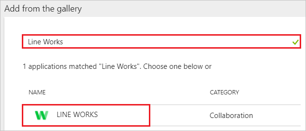
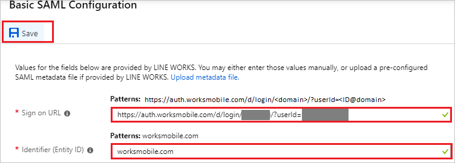

# Tutorial: Azure Active Directory integration with LINE WORKS

In this tutorial, you learn how to integrate LINE WORKS with Azure Active Directory (Azure AD).

Integrating LINE WORKS with Azure AD provides you with the following benefits:

- You can control in Azure AD who has access to LINE WORKS.
- You can enable your users to automatically get signed-on to LINE WORKS (Single Sign-On) with their Azure AD accounts.
- You can manage your accounts in one central location - the Azure portal.

If you want to know more details about SaaS app integration with Azure AD, see [what is application access and single sign-on with Azure Active Directory](../manage-apps/what-is-single-sign-on.md).

## Prerequisites

To configure Azure AD integration with LINE WORKS, you need the following items:

- An Azure AD subscription
- A LINE WORKS single sign-on enabled subscription

> [!NOTE]
> To test the steps in this tutorial, we do not recommend using a production environment.

To test the steps in this tutorial, you should follow these recommendations:

- Do not use your production environment, unless it is necessary.
- If you don't have an Azure AD trial environment, you can [get a one-month trial](https://azure.microsoft.com/pricing/free-trial/).

## Scenario description
In this tutorial, you test Azure AD single sign-on in a test environment. 
The scenario outlined in this tutorial consists of two main building blocks:

1. Adding LINE WORKS from the gallery
2. Configuring and testing Azure AD single sign-on

## Adding LINE WORKS from the gallery
To configure the integration of LINE WORKS into Azure AD, you need to add LINE WORKS from the gallery to your list of managed SaaS apps.

**To add LINE WORKS from the gallery, perform the following steps:**

1. In the **[Azure portal](https://portal.azure.com)**, on the left navigation panel, click **Azure Active Directory** icon. 

	

2. Navigate to **Enterprise applications**. Then go to **All applications**.

	
	
3. To add new application, click **New application** button on the top of dialog.

	

4. In the search box, type **LINE WORKS**, select **LINE WORKS** from result panel then click **Add** button to add the application.

	 

## Configure and test Azure AD single sign-on

In this section, you configure and test Azure AD single sign-on with LINE WORKS based on a test user called "Britta Simon".

For single sign-on to work, Azure AD needs to know what the counterpart user in LINE WORKS is to a user in Azure AD. In other words, a link relationship between an Azure AD user and the related user in LINE WORKS needs to be established.

To configure and test Azure AD single sign-on with LINE WORKS, you need to complete the following building blocks:

1. **[Configure Azure AD Single Sign-On](#configure-azure-ad-single-sign-on)** - to enable your users to use this feature.
2. **[Create an Azure AD test user](#create-an-azure-ad-test-user)** - to test Azure AD single sign-on with Britta Simon.
3. **[Create a LINE WORKS test user](#create-a-line-works-test-user)** - to have a counterpart of Britta Simon in LINE WORKS that is linked to the Azure AD representation of user.
4. **[Assign the Azure AD test user](#assign-the-azure-ad-test-user)** - to enable Britta Simon to use Azure AD single sign-on.
5. **[Test single sign-on](#test-single-sign-on)** - to verify whether the configuration works.

### Configure Azure AD single sign-on

In this section, you enable Azure AD single sign-on in the Azure portal and configure single sign-on in your LINE WORKS application.

**To configure Azure AD single sign-on with LINE WORKS, perform the following steps:**

1. In the [Azure portal](https://portal.azure.com/), on the **LINE WORKS** application integration page, select **Single sign-on**.

    

2. On the **Select a Single sign-on method** dialog, Click **Select** for **SAML** mode to enable single sign-on.

    

3. On the **Set up Single Sign-On with SAML** page, click **Edit** button to open **Basic SAML Configuration** dialog.

	

4. On the **Basic SAML Configuration** section, perform the following steps:

	a. In the **Sign-on URL** text box, type a URL using the following pattern:
    `https://auth.worksmobile.com/d/login/<domain>/?userId=<ID@domain>`

    b. In the **Identifier** text box, type a URL:
    `worksmobile.com`

    

5. On the **Set up Single Sign-On with SAML** page, in the **SAML Signing Certificate** section, click **Download** to download the **Certificate (Raw)** and save it on your computer.

	

6. On the **Set up LINE WORKS** section, copy the appropriate URL as per your requirement.

	a. Login URL

	b. Azure AD Identifier

	c. Logout URL

	 

7. To configure single sign-on on **LINE WORKS** side, please read the [LINE WORKS SSO documents](https://developers.worksmobile.com/jp/document/1001080101) and configure a LINE WORKS setting.

> [!NOTE]
> You need to convert the downloaded Certificate file from .cert to .pem

### Create an Azure AD test user

The objective of this section is to create a test user in the Azure portal called Britta Simon.

1. In the Azure portal, in the left pane, select **Azure Active Directory**, select **Users**, and then select **All users**.

    

2. Select **New user** at the top of the screen.

    

3. In the User properties, perform the following steps.

    

    a. In the **Name** field enter **BrittaSimon**.
  
    b. In the **User name** field type **brittasimon@yourcompanydomain.extension**  
    For example, BrittaSimon@contoso.com

    c. Select **Properties**, select the **Show password** check box, and then write down the value that's displayed in the Password box.

    d. Select **Create**.
 
### Create a LINE WORKS test user

In this section, you create a user called Britta Simon in LINE WORKS. Access [LINE WORKS admin page](https://admin.worksmobile.com) and add the users in the LINE WORKS platform.

### Assign the Azure AD test user

In this section, you enable Britta Simon to use Azure single sign-on by granting access to LINE WORKS.

1. In the Azure portal, select **Enterprise Applications**, select **All applications**.

	

2. In the applications list, select **LINE WORKS**.

	

3. In the menu on the left, select **Users and groups**.

    

4. Select the **Add** button, then select **Users and groups** in the **Add Assignment** dialog.

    

4. In the **Users and groups** dialog select **Britta Simon** in the Users list, then click the **Select** button at the bottom of the screen.

5. In the **Add Assignment** dialog select the **Assign** button.
	
### Test single sign-on

In this section, you test your Azure AD single sign-on configuration using the Access Panel.

When you click the LINE WORKS tile in the Access Panel, you should get automatically signed-on to your LINE WORKS application.
For more information about the Access Panel, see [Introduction to the Access Panel](../active-directory-saas-access-panel-introduction.md). 

## Additional resources

* [List of Tutorials on How to Integrate SaaS Apps with Azure Active Directory](tutorial-list.md)
* [What is application access and single sign-on with Azure Active Directory?](../manage-apps/what-is-single-sign-on.md)

