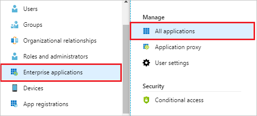
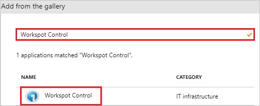
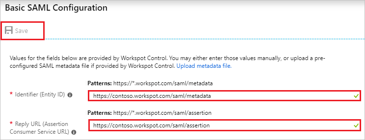
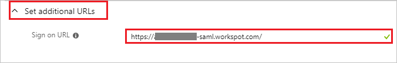
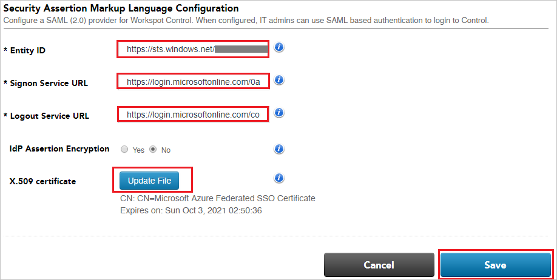
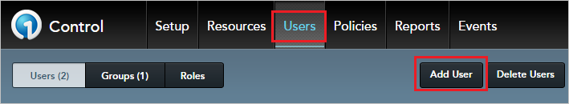
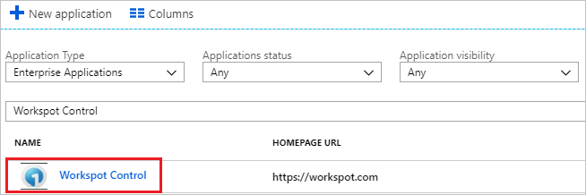

# Tutorial: Azure Active Directory integration with Workspot Control

In this tutorial, you learn how to integrate Workspot Control with Azure Active Directory (Azure AD).

Integrating Workspot Control with Azure AD provides you with the following benefits:

- You can control in Azure AD who has access to Workspot Control.
- You can enable your users to automatically get signed-on to Workspot Control (Single Sign-On) with their Azure AD accounts.
- You can manage your accounts in one central location - the Azure portal.

If you want to know more details about SaaS app integration with Azure AD, see [what is application access and single sign-on with Azure Active Directory](../manage-apps/what-is-single-sign-on.md).

## Prerequisites

To configure Azure AD integration with Workspot Control, you need the following items:

- An Azure AD subscription
- A Workspot Control single sign-on enabled subscription

> [!NOTE]
> To test the steps in this tutorial, we do not recommend using a production environment.

To test the steps in this tutorial, you should follow these recommendations:

- Do not use your production environment, unless it is necessary.
- If you don't have an Azure AD trial environment, you can [get a one-month trial](https://azure.microsoft.com/pricing/free-trial/).

## Scenario description
In this tutorial, you test Azure AD single sign-on in a test environment. 
The scenario outlined in this tutorial consists of two main building blocks:

1. Adding Workspot Control from the gallery
2. Configuring and testing Azure AD single sign-on

## Adding Workspot Control from the gallery
To configure the integration of Workspot Control into Azure AD, you need to add Workspot Control from the gallery to your list of managed SaaS apps.

**To add Workspot Control from the gallery, perform the following steps:**

1. In the **[Azure portal](https://portal.azure.com)**, on the left navigation panel, click **Azure Active Directory** icon. 

	

2. Navigate to **Enterprise applications**. Then go to **All applications**.

	
	
3. To add new application, click **New application** button on the top of dialog.

	

4. In the search box, type **Workspot Control**, select **Workspot Control** from result panel then click **Add** button to add the application.

	 

## Configure and test Azure AD single sign-on

In this section, you configure and test Azure AD single sign-on with Workspot Control based on a test user called "Britta Simon".

For single sign-on to work, Azure AD needs to know what the counterpart user in Workspot Control is to a user in Azure AD. In other words, a link relationship between an Azure AD user and the related user in Workspot Control needs to be established.

To configure and test Azure AD single sign-on with Workspot Control, you need to complete the following building blocks:

1. **[Configure Azure AD Single Sign-On](#configure-azure-ad-single-sign-on)** - to enable your users to use this feature.
2. **[Create an Azure AD test user](#create-an-azure-ad-test-user)** - to test Azure AD single sign-on with Britta Simon.
3. **[Create a Workspot Control test user](#create-a-workspot-control-test-user)** - to have a counterpart of Britta Simon in Workspot Control that is linked to the Azure AD representation of user.
4. **[Assign the Azure AD test user](#assign-the-azure-ad-test-user)** - to enable Britta Simon to use Azure AD single sign-on.
5. **[Test single sign-on](#test-single-sign-on)** - to verify whether the configuration works.

### Configure Azure AD single sign-on

In this section, you enable Azure AD single sign-on in the Azure portal and configure single sign-on in your Workspot Control application.

**To configure Azure AD single sign-on with Workspot Control, perform the following steps:**

1. In the [Azure portal](https://portal.azure.com/), on the **Workspot Control** application integration page, select **Single sign-on**.

    

2. On the **Select a Single sign-on method** dialog, select **SAML** mode to enable single sign-on.

    

3. On the **Set up Single Sign-On with SAML** page, click **Edit** button to open **Basic SAML Configuration** dialog.

	

4. On the **Basic SAML Configuration** section, perform the following steps if you wish to configure the application in **IDP** intiated mode:

    

    a. In the **Identifier** text box, type a URL using the following pattern:
    `https://<INSTANCENAME>-saml.workspot.com/saml/metadata`

    b. In the **Reply URL** text box, type a URL using the following pattern:
    `https://<INSTANCENAME>-saml.workspot.com/saml/assertion`

    c. Click **Set additional URLs** and perform the following step if you wish to configure the application in **SP** initiated mode:

	 

    In the **Sign-on URL** text box, type a URL using the following pattern:
    `https://<INSTANCENAME>-saml.workspot.com/`

    > [!NOTE]
	> These values are not real. Update these values with the actual Identifier, Reply URL and Sign-on URL. Contact [Workspot Control Client support team](mailto:support@workspot.com) to get these values. 

5. On the **Set up Single Sign-On with SAML** page, in the **SAML Signing Certificate** section, click **Download** to download the **Certificate (Base64)** and save it on your computer.

	 

6. On the **Set up Workspot Control** section, copy the appropriate URL as per your requirement.

	Note that the URL may say the following:

	a. Login URL

	b. Azure Ad Identifier

	c. Logout URL

	 

7. In a different web browser window, login to Workspot Control as a Security Administrator.

8. In the toolbar at the top of the page, click **Setup**, then navigate to **SAML**.

	

9. On the **Security Assertion Markup Language Configuration** page, perform the following steps:
 
	

	a. In the **Entity ID** textbox, paste the value of **Azure Ad Identifier** which you have copied from the Azure portal.   

	b.In the **Signon Service URL** textbox, paste the value of **Login URL** which you have copied from the Azure portal.

	c. In the **Logout Service URL** textbox, paste the value of **Logout URL** which you have copied from the Azure portal. 

	d. Click on **Update File** button to Upload the base-64 encoded certificate that you have downloaded from the Azure portal, into the X.509 certificate.

	e. Click **Save**.

### Create an Azure AD test user

The objective of this section is to create a test user in the Azure portal called Britta Simon.

1. In the Azure portal, in the left pane, select **Azure Active Directory**, select **Users**, and then select **All users**.

    

2. Select **New user** at the top of the screen.

    

3. In the User properties, perform the following steps.

    

    a. In the **Name** field enter **BrittaSimon**.
  
    b. In the **User name** field type **brittasimon@yourcompanydomain.extension**  
    For example, BrittaSimon@contoso.com

    c. Select **Properties**, select the **Show password** check box, and then write down the value that's displayed in the Password box.

    d. Select **Create**.
 
### Create a Workspot Control test user

To enable Azure AD users to log in to Workspot Control, they must be provisioned into Workspot Control. In Workspot Control, provisioning is a manual task.

**To provision a user account, perform the following steps:**

1. Log in to Workspot Control as a Security Administrator.

2. In the toolbar at the top of the page, click **Users**, then navigate to **Add User**.

	

3. On the **Add a New User** page, perform the following steps:

	

	a. In **First Name** text box, enter the first name of user like **Britta**.

	b. In **Last Name** text box, enter the last name of user like **simon**.

	c. In **Email** text box, enter the email of user like **Brittasimon@contoso.com**.

	d. Select the appropriate user role from the **Role** dropdown.

	e. Select the appropriate user group from the **Group** dropdown.

	f. Click **Add User**.

### Assign the Azure AD test user

In this section, you enable Britta Simon to use Azure single sign-on by granting access to Workspot Control.

1. In the Azure portal, select **Enterprise Applications**, select **All applications**.

	

2. In the applications list, select **Workspot Control**.

	

3. In the menu on the left, select **Users and groups**.

    

4. Select the **Add** button, then select **Users and groups** in the **Add Assignment** dialog.

    

4. In the **Users and groups** dialog select **Britta Simon** in the Users list, then click the **Select** button at the bottom of the screen.

5. In the **Add Assignment** dialog select the **Assign** button.
	
### Test single sign-on

In this section, you test your Azure AD single sign-on configuration using the Access Panel.

When you click the Workspot Control tile in the Access Panel, you should get automatically signed-on to your Workspot Control application.
For more information about the Access Panel, see [Introduction to the Access Panel](../active-directory-saas-access-panel-introduction.md). 

## Additional resources

* [List of Tutorials on How to Integrate SaaS Apps with Azure Active Directory](tutorial-list.md)
* [What is application access and single sign-on with Azure Active Directory?](../manage-apps/what-is-single-sign-on.md)
