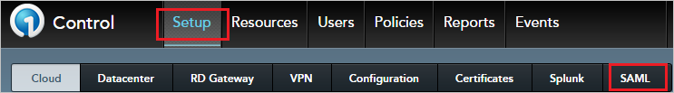
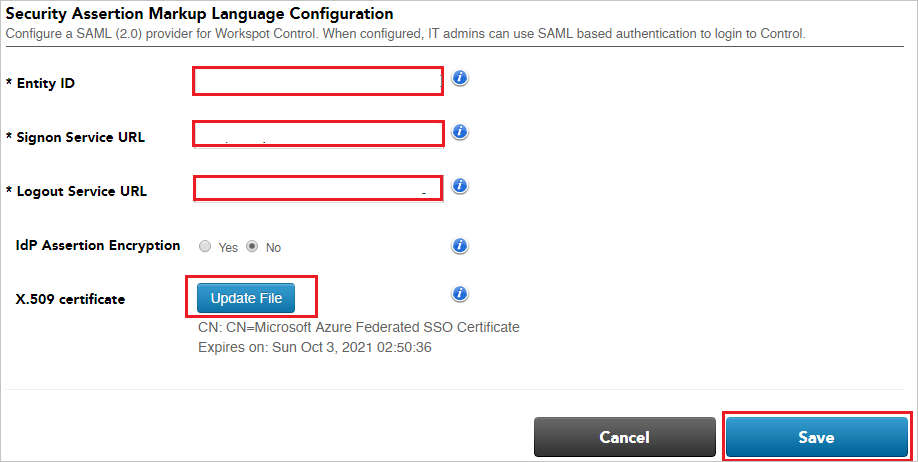
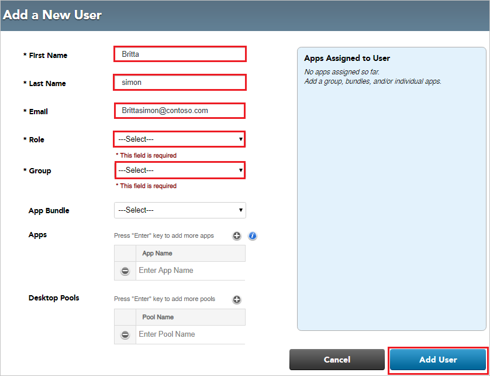

# Tutorial: Azure Active Directory integration with Workspot Control

In this tutorial, you'll learn how to integrate Workspot Control with Azure Active Directory (Azure AD). When you integrate Workspot Control with Azure AD, you can:

* Control in Azure AD who has access to Workspot Control.
* Enable your users to be automatically signed-in to Workspot Control with their Azure AD accounts.
* Manage your accounts in one central location - the Azure portal.

## Prerequisites

To configure Azure AD integration with Workspot Control, you need the following things:

* An Azure AD subscription. If you don't have an Azure AD environment, you can get a [free account](https://azure.microsoft.com/free/).

* A Workspot Control single sign-on-enabled subscription.

## Scenario description

In this tutorial, you configure and test Azure AD single sign-on in a test environment.

* Workspot Control supports SP-initiated and IDP-initiated SSO.

## Add Workspot Control from the gallery

To configure the integration of Workspot Control into Azure AD, you need to add Workspot Control from the gallery to your list of managed SaaS apps.

1. Sign in to the Azure portal using either a work or school account, or a personal Microsoft account.
1. On the left navigation pane, select the **Azure Active Directory** service.
1. Navigate to **Enterprise Applications** and then select **All Applications**.
1. To add new application, select **New application**.
1. In the **Add from the gallery** section, type **Workspot Control** in the search box.
1. Select **Workspot Control** from results panel and then add the app. Wait a few seconds while the app is added to your tenant.

## Configure and test Azure AD SSO for Workspot Control

Configure and test Azure AD SSO with Workspot Control using a test user called **B.Simon**. For SSO to work, you need to establish a link relationship between an Azure AD user and the related user in Workspot Control.

To configure and test Azure AD SSO with Workspot Control, perform the following steps:

1. **[Configure Azure AD SSO](#configure-azure-ad-sso)** - to enable your users to use this feature.
    1. **[Create an Azure AD test user](#create-an-azure-ad-test-user)** - to test Azure AD single sign-on with B.Simon.
    1. **[Assign the Azure AD test user](#assign-the-azure-ad-test-user)** - to enable B.Simon to use Azure AD single sign-on.
1. **[Configure Workspot Control SSO](#configure-workspot-control-sso)** - to configure the single sign-on settings on application side.
    1. **[Create Workspot Control test user](#create-workspot-control-test-user)** - to have a counterpart of B.Simon in Workspot Control that is linked to the Azure AD representation of user.
1. **[Test SSO](#test-sso)** - to verify whether the configuration works.

## Configure Azure AD SSO

Follow these steps to enable Azure AD SSO in the Azure portal.

1. In the Azure portal, on the **Workspot Control** application integration page, find the **Manage** section and select **single sign-on**.
1. On the **Select a single sign-on method** page, select **SAML**.
1. On the **Set up single sign-on with SAML** page, click the pencil icon for **Basic SAML Configuration** to edit the settings.

   

4. In the **Basic SAML Configuration** section, if you want to configure the application in IDP-initiated mode, follow these steps:

    1. In the **identifier** text box, type a URL using the following pattern: 
    `https://<<i></i>INSTANCENAME>-saml.workspot.com/saml/metadata`

    1. In the **reply URL** text box, type a URL using the following pattern: 
    `https://<<i></i>INSTANCENAME>-saml.workspot.com/saml/assertion`

5. If you want to configure the application in SP-initiated mode, select **Set additional URLs**.

    In the **Sign-on URL** text box, type a URL using the following pattern: 
    `https://<<i></i>INSTANCENAME>-saml.workspot.com/`

	> [!NOTE]
	> These values are not real. Replace these values with the actual identifier, reply URL, and sign-on URL. Contact the [Workspot Control Client support team](mailto:support@workspot.com) to get these values. Or you can also refer to the patterns in the **Basic SAML Configuration** section of the Azure portal.

6. On the **Set Up Single Sign-On with SAML** page, in the **SAML Signing Certificate** section, select **Download** to download **Certificate (Base64)** from the available options as per your requirements. Save it to your computer.

	

7. In the **Set up Workspot Control** section, copy the appropriate URLs as per your requirements:

	

### Create an Azure AD test user

In this section, you'll create a test user in the Azure portal called B.Simon.

1. From the left pane in the Azure portal, select **Azure Active Directory**, select **Users**, and then select **All users**.
1. Select **New user** at the top of the screen.
1. In the **User** properties, follow these steps:
   1. In the **Name** field, enter `B.Simon`.  
   1. In the **User name** field, enter the username@companydomain.extension. For example, `B.Simon@contoso.com`.
   1. Select the **Show password** check box, and then write down the value that's displayed in the **Password** box.
   1. Click **Create**.

### Assign the Azure AD test user

In this section, you'll enable B.Simon to use Azure single sign-on by granting access to Workspot Control.

1. In the Azure portal, select **Enterprise Applications**, and then select **All applications**.
1. In the applications list, select **Workspot Control**.
1. In the app's overview page, find the **Manage** section and select **Users and groups**.
1. Select **Add user**, then select **Users and groups** in the **Add Assignment** dialog.
1. In the **Users and groups** dialog, select **B.Simon** from the Users list, then click the **Select** button at the bottom of the screen.
1. If you are expecting a role to be assigned to the users, you can select it from the **Select a role** dropdown. If no role has been set up for this app, you see "Default Access" role selected.
1. In the **Add Assignment** dialog, click the **Assign** button.

## Configure Workspot Control SSO

1. In a different web browser window, sign in to Workspot Control as a Security Administrator.

2. In the toolbar at the top of the page, select **Setup** and then **SAML**.

	

3. In the **Security Assertion Markup Language Configuration** window, follow these steps:
 
	

	1. In the **Entity ID** box, paste the **Azure Ad Identifier** that you copied from the Azure portal.

	1. In the **Signon Service URL** box, paste the **Login URL** that you copied from the Azure portal.

	1. In the **Logout Service URL** box, paste the **Logout URL** that you copied from the Azure portal.

	1. Select **Update File** to upload into the X.509 certificate the base-64 encoded certificate that you downloaded from the Azure portal.

	1. Select **Save**.

### Create Workspot Control test user

To enable Azure AD users to sign in to Workspot Control, they must be provisioned into Workspot Control. Provisioning is a manual task.

**To provision a user account, follow these steps:**

1. Sign in to Workspot Control as a Security Administrator.

2. In the toolbar at the top of the page, select **Users** and then **Add User**.

	

3. In the **Add a New User** window, follow these steps:

	

	1. In **First Name** box, enter the first name of a user, such as **Britta**.

	1. In **Last Name** text box, enter the last name of the user, such as **Simon**.

	1. In **Email** box, enter the email address of the user, such as **Brittasimon@contoso.<i></i>com**.

	1. Select the appropriate user role from the **Role** drop-down list.

	1. Select the appropriate user group from the **Group** drop-down list.

	1. Select **Add User**.

## Test SSO

In this section, you test your Azure AD single sign-on configuration with following options. 

#### SP initiated:

* Click on **Test this application** in Azure portal. This will redirect to Workspot Control Sign on URL where you can initiate the login flow.  

* Go to Workspot Control Sign-on URL directly and initiate the login flow from there.

#### IDP initiated:

* Click on **Test this application** in Azure portal and you should be automatically signed in to the Workspot Control for which you set up the SSO. 

You can also use Microsoft My Apps to test the application in any mode. When you click the Workspot Control tile in the My Apps, if configured in SP mode you would be redirected to the application sign on page for initiating the login flow and if configured in IDP mode, you should be automatically signed in to the Workspot Control for which you set up the SSO. For more information about the My Apps, see [Introduction to the My Apps](../user-help/my-apps-portal-end-user-access.md).

## Next steps

Once you configure Workspot Control you can enforce session control, which protects exfiltration and infiltration of your organization’s sensitive data in real time. Session control extends from Conditional Access. [Learn how to enforce session control with Microsoft Cloud App Security](/cloud-app-security/proxy-deployment-aad).
