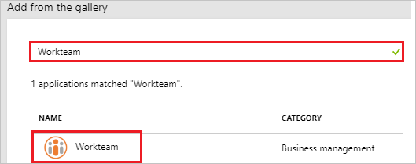
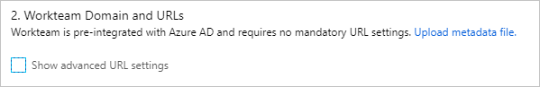
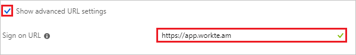
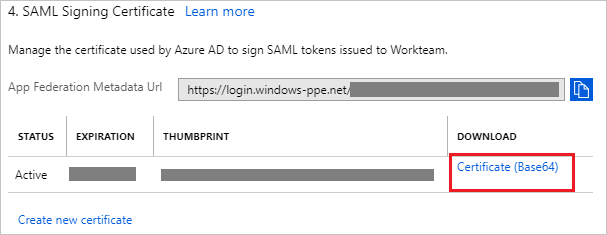
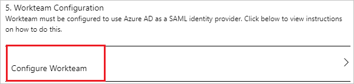
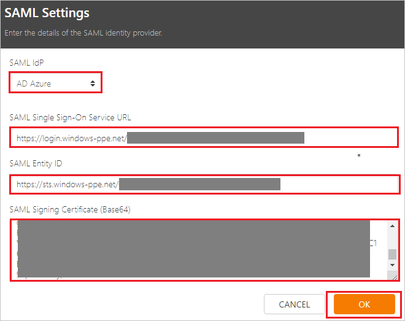
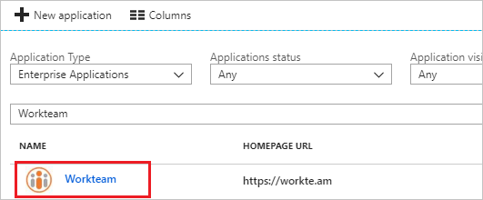

# Tutorial: Azure Active Directory integration with Workteam

In this tutorial, you learn how to integrate Workteam with Azure Active Directory (Azure AD).

Integrating Workteam with Azure AD provides you with the following benefits:

- You can control in Azure AD who has access to Workteam.
- You can enable your users to automatically get signed-on to Workteam (Single Sign-On) with their Azure AD accounts.
- You can manage your accounts in one central location - the Azure portal.

If you want to know more details about SaaS app integration with Azure AD, see [what is application access and single sign-on with Azure Active Directory](../manage-apps/what-is-single-sign-on.md).

## Prerequisites

To configure Azure AD integration with Workteam, you need the following items:

- An Azure AD subscription
- A Workteam single sign-on enabled subscription

> [!NOTE]
> To test the steps in this tutorial, we do not recommend using a production environment.

To test the steps in this tutorial, you should follow these recommendations:

- Do not use your production environment, unless it is necessary.
- If you don't have an Azure AD trial environment, you can [get a one-month trial](https://azure.microsoft.com/pricing/free-trial/).

## Scenario description
In this tutorial, you test Azure AD single sign-on in a test environment. 
The scenario outlined in this tutorial consists of two main building blocks:

1. Adding Workteam from the gallery
2. Configuring and testing Azure AD single sign-on

## Adding Workteam from the gallery
To configure the integration of Workteam into Azure AD, you need to add Workteam from the gallery to your list of managed SaaS apps.

**To add Workteam from the gallery, perform the following steps:**

1. In the **[Azure portal](https://portal.azure.com)**, on the left navigation panel, click **Azure Active Directory** icon. 

	![The Azure Active Directory button][1]

2. Navigate to **Enterprise applications**. Then go to **All applications**.

	![The Enterprise applications blade][2]
	
3. To add new application, click **New application** button on the top of dialog.

	![The New application button][3]

4. In the search box, type **Workteam**, select **Workteam** from result panel then click **Add** button to add the application.

	

## Configure and test Azure AD single sign-on

In this section, you configure and test Azure AD single sign-on with Workteam based on a test user called "Britta Simon".

For single sign-on to work, Azure AD needs to know what the counterpart user in Workteam is to a user in Azure AD. In other words, a link relationship between an Azure AD user and the related user in Workteam needs to be established.

To configure and test Azure AD single sign-on with Workteam, you need to complete the following building blocks:

1. **[Configure Azure AD Single Sign-On](#configure-azure-ad-single-sign-on)** - to enable your users to use this feature.
2. **[Create an Azure AD test user](#create-an-azure-ad-test-user)** - to test Azure AD single sign-on with Britta Simon.
3. **[Create a Workteam test user](#create-a-workteam-test-user)** - to have a counterpart of Britta Simon in Workteam that is linked to the Azure AD representation of user.
4. **[Assign the Azure AD test user](#assign-the-azure-ad-test-user)** - to enable Britta Simon to use Azure AD single sign-on.
5. **[Test single sign-on](#test-single-sign-on)** - to verify whether the configuration works.

### Configure Azure AD single sign-on

In this section, you enable Azure AD single sign-on in the Azure portal and configure single sign-on in your Workteam application.

**To configure Azure AD single sign-on with Workteam, perform the following steps:**

1. In the Azure portal, on the **Workteam** application integration page, click **Single sign-on**.

	![Configure single sign-on link][4]

2. On the **Single sign-on** dialog, select **Mode** as	**SAML-based Sign-on** to enable single sign-on.
 
	

3. On the **Workteam Domain and URLs** section, the user does not have to perform any steps as the application is already pre-integrated with Azure.

	

4. Check **Show advanced URL settings** and perform the following step if you wish to configure the application in **SP** initiated mode:

	

    In the **Sign-on URL** textbox, type a URL: `https://app.workte.am`
	 
5. On the **SAML Signing Certificate** section, click **Certificate (Base64)** and then save the certificate file on your computer.

	 

6. Click **Save** button.

	
	
7. On the **Workteam Configuration** section, click **Configure Workteam** to open **Configure sign-on** window. Copy the **SAML Entity ID, and SAML Single Sign-On Service URL** from the **Quick Reference section.**

	 

8. In a different web browser window, log in to Workteam as a Security Administrator.

9. In the top right corner click on **profile logo** and then click on **Organization settings**. 

	

10. Under **AUTHENTICATION** section, click on **Settings logo**.

     

11. On the **SAML Settings** page, perform the following steps:

	 

	a. Select **SAML IdP** as **AD Azure**.

	b. In the **SAML Single Sign-On Service URL** textbox, paste the value of **SAML Single Sign-On Service URL**, which you have copied from the Azure portal.

	c. In the **SAML Entity ID** textbox, paste the value of **SAML Entity ID**, which you have copied from the Azure portal.

	d. In Notepad, open the **base-64 encoded certificate** that you downloaded from the Azure portal, copy its content, and then paste it into the **SAML Signing Certificate (Base64)** box.

	e. Click **OK**.

### Create an Azure AD test user

The objective of this section is to create a test user in the Azure portal called Britta Simon.

   ![Create an Azure AD test user][100]

**To create a test user in Azure AD, perform the following steps:**

1. In the Azure portal, in the left pane, click the **Azure Active Directory** button.

    

2. To display the list of users, go to **Users and groups**, and then click **All users**.

    

3. To open the **User** dialog box, click **Add** at the top of the **All Users** dialog box.

    

4. In the **User** dialog box, perform the following steps:

    

    a. In the **Name** box, type **BrittaSimon**.

    b. In the **User name** box, type the email address of user Britta Simon.

    c. Select the **Show Password** check box, and then write down the value that's displayed in the **Password** box.

    d. Click **Create**.
 
### Create a Workteam test user

To enable Azure AD users to login to Workteam, they must be provisioned into Workteam. In Workteam, provisioning is a manual task.

**To provision a user account, perform the following steps:**

1. Login to Workteam as a Security Administrator.

2. On the top middle of the **Organization settings** page, click **USERS** and then click **NEW USER**.

	

3. On the **New employee** page, perform the following steps:

	

	a. In the **Name** text box, enter the first name of user like **Brittasimon**.

	b. In **Email** text box, enter the email of user like **Brittasimon@contoso.com**.

	c. Click **OK**.

### Assign the Azure AD test user

In this section, you enable Britta Simon to use Azure single sign-on by granting access to Workteam.

![Assign the user role][200] 

**To assign Britta Simon to Workteam, perform the following steps:**

1. In the Azure portal, open the applications view, and then navigate to the directory view and go to **Enterprise applications** then click **All applications**.

	![Assign User][201] 

2. In the applications list, select **Workteam**.

	  

3. In the menu on the left, click **Users and groups**.

	![The "Users and groups" link][202]

4. Click **Add** button. Then select **Users and groups** on **Add Assignment** dialog.

	![The Add Assignment pane][203]

5. On **Users and groups** dialog, select **Britta Simon** in the Users list.

6. Click **Select** button on **Users and groups** dialog.

7. Click **Assign** button on **Add Assignment** dialog.
	
### Test single sign-on

In this section, you test your Azure AD single sign-on configuration using the Access Panel.

When you click the Workteam tile in the Access Panel, you should get automatically signed-on to your Workteam application.
For more information about the Access Panel, see [Introduction to the Access Panel](../active-directory-saas-access-panel-introduction.md). 

## Additional resources

* [List of Tutorials on How to Integrate SaaS Apps with Azure Active Directory](tutorial-list.md)
* [What is application access and single sign-on with Azure Active Directory?](../manage-apps/what-is-single-sign-on.md)

<!--Image references-->

[1]: ./media/workteam-tutorial/tutorial_general_01.png
[2]: ./media/workteam-tutorial/tutorial_general_02.png
[3]: ./media/workteam-tutorial/tutorial_general_03.png
[4]: ./media/workteam-tutorial/tutorial_general_04.png

[100]: ./media/workteam-tutorial/tutorial_general_100.png

[200]: ./media/workteam-tutorial/tutorial_general_200.png
[201]: ./media/workteam-tutorial/tutorial_general_201.png
[202]: ./media/workteam-tutorial/tutorial_general_202.png
[203]: ./media/workteam-tutorial/tutorial_general_203.png

