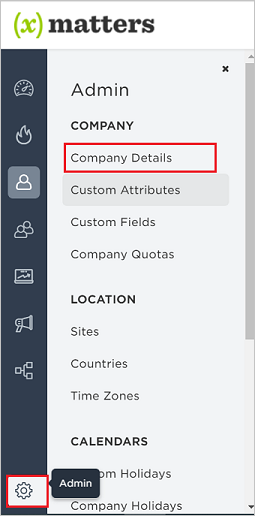
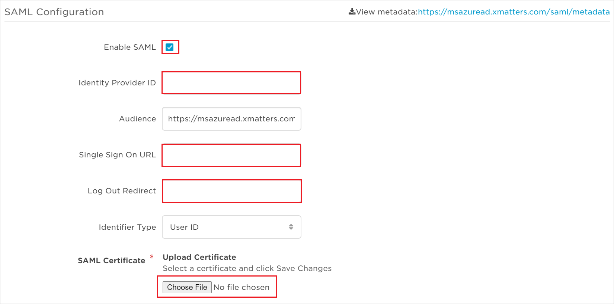
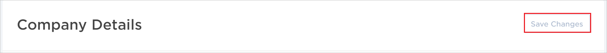
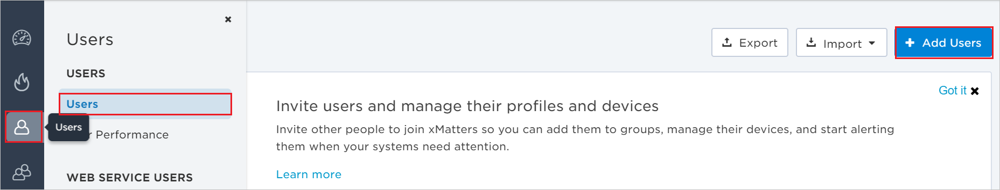
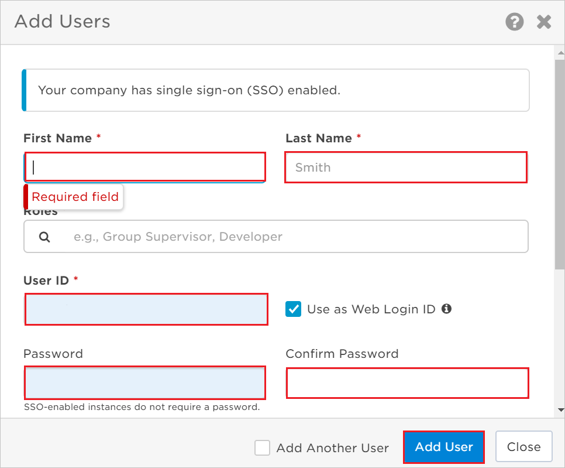

# Tutorial: Azure Active Directory integration with xMatters OnDemand

In this tutorial, you'll learn how to integrate xMatters OnDemand with Azure Active Directory (Azure AD). When you integrate xMatters OnDemand with Azure AD, you can:

* Control in Azure AD who has access to xMatters OnDemand.
* Enable your users to be automatically signed-in to xMatters OnDemand with their Azure AD accounts.
* Manage your accounts in one central location - the Azure portal.

## Prerequisites

To configure Azure AD integration with xMatters OnDemand, you need the following items:

* An Azure AD subscription. If you don't have an Azure AD environment, you can get a [free account](https://azure.microsoft.com/free/).
* xMatters OnDemand single sign-on enabled subscription.

## Scenario description

In this tutorial, you configure and test Azure AD single sign-on in a test environment.

* xMatters OnDemand supports **IDP** initiated SSO.

## Add xMatters OnDemand from the gallery

To configure the integration of xMatters OnDemand into Azure AD, you need to add xMatters OnDemand from the gallery to your list of managed SaaS apps.

1. Sign in to the Azure portal using either a work or school account, or a personal Microsoft account.
1. On the left navigation pane, select the **Azure Active Directory** service.
1. Navigate to **Enterprise Applications** and then select **All Applications**.
1. To add new application, select **New application**.
1. In the **Add from the gallery** section, type **xMatters OnDemand** in the search box.
1. Select **xMatters OnDemand** from results panel and then add the app. Wait a few seconds while the app is added to your tenant.

 Alternatively, you can also use the [Enterprise App Configuration Wizard](https://portal.office.com/AdminPortal/home?Q=Docs#/azureadappintegration). In this wizard, you can add an application to your tenant, add users/groups to the app, assign roles, as well as walk through the SSO configuration as well. [Learn more about Microsoft 365 wizards.](/microsoft-365/admin/misc/azure-ad-setup-guides)

## Configure and test Azure AD SSO for xMatters OnDemand

Configure and test Azure AD SSO with xMatters OnDemand using a test user called **B.Simon**. For SSO to work, you need to establish a link relationship between an Azure AD user and the related user in xMatters OnDemand.

To configure and test Azure AD SSO with xMatters OnDemand, perform the following steps:

1. **[Configure Azure AD SSO](#configure-azure-ad-sso)** - to enable your users to use this feature.
	1. **[Create an Azure AD test user](#create-an-azure-ad-test-user)** - to test Azure AD single sign-on with Britta Simon.
	2. **[Assign the Azure AD test user](#assign-the-azure-ad-test-user)** - to enable Britta Simon to use Azure AD single sign-on.
2. **[Configure xMatters OnDemand SSO](#configure-xmatters-ondemand-sso)** - to configure the Single Sign-On settings on application side.
	1. **[Create xMatters OnDemand test user](#create-xmatters-ondemand-test-user)** - to have a counterpart of Britta Simon in xMatters OnDemand that is linked to the Azure AD representation of user.
3. **[Test SSO](#test-sso)** - to verify whether the configuration works.

## Configure Azure AD SSO

Follow these steps to enable Azure AD SSO in the Azure portal.

1. In the Azure portal, on the **xMatters OnDemand** application integration page, find the **Manage** section and select **single sign-on**.
1. On the **Select a single sign-on method** page, select **SAML**.
1. On the **Set up single sign-on with SAML** page, click the pencil icon for **Basic SAML Configuration** to edit the settings.

   

1. On the **Basic SAML Configuration** section, perform the following steps:

    a. In the **Identifier** text box, type a URL using one of the following patterns:

	| Identifier |
	| ---------- |
	| `https://<COMPANY_NAME>.au1.xmatters.com.au/` |
	| `https://<COMPANY_NAME>.cs1.xmatters.com/` |
	| `https://<COMPANY_NAME>.xmatters.com/` |
	| `https://www.xmatters.com` |
	| `https://<COMPANY_NAME>.xmatters.com.au/` |

    b. In the **Reply URL** text box, type a URL using one of the following patterns:

	| Reply URL |
	| ---------- |
	| `https://<COMPANY_NAME>.au1.xmatters.com.au` |
	| `https://<COMPANY_NAME>.xmatters.com/sp/<INSTANCE_NAME>` |
	| `https://<COMPANY_NAME>.cs1.xmatters.com/sp/<INSTANCE_NAME>` |
	| `https://<COMPANY_NAME>.au1.xmatters.com.au/<INSTANCE_NAME>` |

	> [!NOTE]
	> These values are not real. Update these values with the actual Identifier and Reply URL. Contact [xMatters OnDemand Client support team](https://www.xmatters.com/company/contact-us/) to get these values. You can also refer to the patterns shown in the **Basic SAML Configuration** section in the Azure portal.

5. On the **Set up Single Sign-On with SAML** page, in the **SAML Signing Certificate** section, click **Download** to download the **Certificate (Base64)** from the given options as per your requirement and save it on your computer.

	

	> [!IMPORTANT]
    > You need to forward the certificate to the [xMatters OnDemand support team](https://www.xmatters.com/company/contact-us/). The certificate needs to be uploaded by the xMatters support team before you can finalize the single sign-on configuration.

6. On the **Set up xMatters OnDemand** section, copy the appropriate URL(s) as per your requirement.

	

### Create an Azure AD test user

In this section, you'll create a test user in the Azure portal called B.Simon.

1. From the left pane in the Azure portal, select **Azure Active Directory**, select **Users**, and then select **All users**.
1. Select **New user** at the top of the screen.
1. In the **User** properties, follow these steps:
   1. In the **Name** field, enter `B.Simon`.  
   1. In the **User name** field, enter the username@companydomain.extension. For example, `B.Simon@contoso.com`.
   1. Select the **Show password** check box, and then write down the value that's displayed in the **Password** box.
   1. Click **Create**.

### Assign the Azure AD test user

In this section, you'll enable B.Simon to use Azure single sign-on by granting access to xMatters OnDemand.

1. In the Azure portal, select **Enterprise Applications**, and then select **All applications**.
1. In the applications list, select **xMatters OnDemand**.
1. In the app's overview page, find the **Manage** section and select **Users and groups**.
1. Select **Add user**, then select **Users and groups** in the **Add Assignment** dialog.
1. In the **Users and groups** dialog, select **B.Simon** from the Users list, then click the **Select** button at the bottom of the screen.
1. If you are expecting a role to be assigned to the users, you can select it from the **Select a role** dropdown. If no role has been set up for this app, you see "Default Access" role selected.
1. In the **Add Assignment** dialog, click the **Assign** button.

## Configure xMatters OnDemand SSO

1. In a different web browser window, sign in to your xMatters OnDemand company site as an administrator.

2. Click on **Admin**, and then click **Company Details**.

    

3. On the **SAML Configuration** page, perform the following steps:

    

    a. Select **Enable SAML**.

    b. In the **Identity Provider ID** textbox, paste **Azure AD Identifier** value which you have copied from the Azure portal.

    c. In the **Single Sign On URL** textbox, paste **Login URL** value which you have copied from the Azure portal.

    d. In the **Logout URL Redirect** textbox, paste **Logout URL**, which you have copied from the Azure portal.

	e. Click on **Choose File** to upload the **Certificate (Base64)** which you have downloaded from the Azure portal. 

    f. On the Company Details page, at the top, click **Save Changes**.

    

### Create xMatters OnDemand test user

1. Sign in to your **xMatters OnDemand** tenant.

2. Go to the **Users Icon** > **Users** and then click **Add Users**.

	

3. In the **Add Users** section, fill the required fields and click on **Add User** button.

    

## Test SSO

In this section, you test your Azure AD single sign-on configuration with following options.

* Click on Test this application in Azure portal and you should be automatically signed in to the xMatters OnDemand for which you set up the SSO.

* You can use Microsoft My Apps. When you click the xMatters OnDemand tile in the My Apps, you should be automatically signed in to the xMatters OnDemand for which you set up the SSO. For more information about the My Apps, see [Introduction to the My Apps](https://support.microsoft.com/account-billing/sign-in-and-start-apps-from-the-my-apps-portal-2f3b1bae-0e5a-4a86-a33e-876fbd2a4510).

## Next steps

Once you configure xMatters OnDemand you can enforce session control, which protects exfiltration and infiltration of your organization’s sensitive data in real time. Session control extends from Conditional Access. [Learn how to enforce session control with Microsoft Defender for Cloud Apps](/cloud-app-security/proxy-deployment-any-app).
