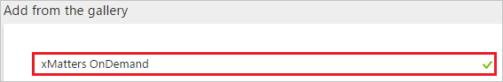
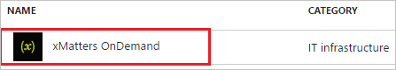
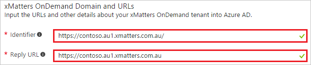
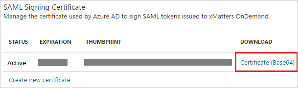
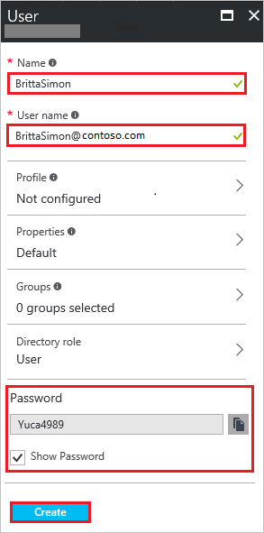

# Tutorial: Azure Active Directory integration with xMatters OnDemand

In this tutorial, you learn how to integrate xMatters OnDemand with Azure Active Directory (Azure AD).

Integrating xMatters OnDemand with Azure AD provides you with the following benefits:

- You can control in Azure AD who has access to xMatters OnDemand
- You can enable your users to automatically get signed-on to xMatters OnDemand (Single Sign-On) with their Azure AD accounts
- You can manage your accounts in one central location - the Azure portal

If you want to know more details about SaaS app integration with Azure AD, see [what is application access and single sign-on with Azure Active Directory](../manage-apps/what-is-single-sign-on.md).

## Prerequisites

To configure Azure AD integration with xMatters OnDemand, you need the following items:

- An Azure AD subscription
- A xMatters OnDemand single sign-on enabled subscription

> [!NOTE]
> To test the steps in this tutorial, we do not recommend using a production environment.

To test the steps in this tutorial, you should follow these recommendations:

- Do not use your production environment, unless it is necessary.
- If you don't have an Azure AD trial environment, you can get a one-month trial [here](https://azure.microsoft.com/pricing/free-trial/).

## Scenario description
In this tutorial, you test Azure AD single sign-on in a test environment. 
The scenario outlined in this tutorial consists of two main building blocks:

1. Adding xMatters OnDemand from the gallery
1. Configuring and testing Azure AD single sign-on

## Adding xMatters OnDemand from the gallery
To configure the integration of xMatters OnDemand into Azure AD, you need to add xMatters OnDemand from the gallery to your list of managed SaaS apps.

**To add xMatters OnDemand from the gallery, perform the following steps:**

1. In the **[Azure portal](https://portal.azure.com)**, on the left navigation panel, click **Azure Active Directory** icon. 

	![Active Directory][1]

1. Navigate to **Enterprise applications**. Then go to **All applications**.

	![Applications][2]
	
1. To add new application, click **New application** button on the top of dialog.

	![Applications][3]

1. In the search box, type **xMatters OnDemand**.

	

1. In the results panel, select **xMatters OnDemand**, and then click **Add** button to add the application.

	

##  Configuring and testing Azure AD single sign-on
In this section, you configure and test Azure AD single sign-on with xMatters OnDemand based on a test user called "Britta Simon".

For single sign-on to work, Azure AD needs to know what the counterpart user in xMatters OnDemand is to a user in Azure AD. In other words, a link relationship between an Azure AD user and the related user in xMatters OnDemand needs to be established.

In xMatters OnDemand, assign the value of the **user name** in Azure AD as the value of the **Username** to establish the link relationship.

To configure and test Azure AD single sign-on with xMatters OnDemand, you need to complete the following building blocks:

1. **[Configuring Azure AD Single Sign-On](#configuring-azure-ad-single-sign-on)** - to enable your users to use this feature.
1. **[Creating an Azure AD test user](#creating-an-azure-ad-test-user)** - to test Azure AD single sign-on with Britta Simon.
1. **[Creating a xMatters OnDemand test user](#creating-a-xmatters-ondemand-test-user)** - to have a counterpart of Britta Simon in xMatters OnDemand that is linked to the Azure AD representation of user.
1. **[Assigning the Azure AD test user](#assigning-the-azure-ad-test-user)** - to enable Britta Simon to use Azure AD single sign-on.
1. **[Testing Single Sign-On](#testing-single-sign-on)** - to verify whether the configuration works.

### Configuring Azure AD single sign-on

In this section, you enable Azure AD single sign-on in the Azure portal and configure single sign-on in your xMatters OnDemand application.

**To configure Azure AD single sign-on with xMatters OnDemand, perform the following steps:**

1. In the Azure portal, on the **xMatters OnDemand** application integration page, click **Single sign-on**.

	![Configure Single Sign-On][4]

1. On the **Single sign-on** dialog, select **Mode** as	**SAML-based Sign-on** to enable single sign-on.

	

1. On the **xMatters OnDemand Domain and URLs** section, perform the following steps:

	
	
	a. In the **Identifier** textbox, type a URL using the following pattern:
	| |
	|--|
	| `https://<companyname>.au1.xmatters.com.au/`|
	| `https://<companyname>.cs1.xmatters.com/`|
	| `https://<companyname>.xmatters.com/`|
	| `https://www.xmatters.com`|
	| `https://<companyname>.xmatters.com.au/`|

	b. In the **Reply URL** textbox, type a URL using the following pattern:
	| |
	|--|
	| `https://<companyname>.au1.xmatters.com.au`|
	| `https://<companyname>.xmatters.com/sp/<instancename>`|
	| `https://<companyname>.cs1.xmatters.com/sp/<instancename>`|
	| `https://<companyname>.au1.xmatters.com.au/<instancename>`|

	> [!NOTE] 
	> These values are not real. Update these values with the actual Identifier and Reply URL. Contact [xMatters OnDemand support team](https://www.xmatters.com/company/contact-us/) to get these values.

1. On the **SAML Signing Certificate** section, click **Certificate(Base64)** and then save the certificate file locally as **c:\\XMatters OnDemand.cer**.

	

	> [!IMPORTANT]
    > You need to forward the certificate to the [xMatters OnDemand support team](https://www.xmatters.com/company/contact-us/). The certificate needs to be uploaded by the xMatters support team before you can finalize the single sign-on configuration. 

1. Click **Save** button.

	

1. On the **xMatters OnDemand Configuration** section, click **Configure xMatters OnDemand** to open **Configure sign-on** window. Copy the **Sign-Out URL, SAML Entity ID, and SAML Single Sign-On Service URL** from the **Quick Reference section.**

	 

1. In a different web browser window, log in to your XMatters OnDemand company site as an administrator.

1. In the toolbar on the top, click **Admin**, and then click **Company Details** in the navigation bar on the left side.

    

1. On the **SAML Configuration** page, perform the following steps:

    

    a. Select **Enable SAML**.

    b. In the **Identity Provider ID** textbox, paste **SAML Entity ID** value which you have copied from the Azure portal.

    c. In the **Single Sign On URL** textbox, paste **SAML Single Sign-On Service URL** value which you have copied from the Azure portal.

    d. In the **Single Logout URL** textbox, paste **Sign-Out URL**, which you have copied from the Azure portal.

    e. On the Company Details page, at the top, click **Save Changes**.

    

### Creating an Azure AD test user
The objective of this section is to create a test user in the Azure portal called Britta Simon.

![Create Azure AD User][100]

**To create a test user in Azure AD, perform the following steps:**

1. In the **Azure portal**, on the left navigation pane, click **Azure Active Directory** icon.

	 

1. To display the list of users, go to **Users and groups** and click **All users**.

	 

1. To open the **User** dialog, click **Add** on the top of the dialog.

	 

1. On the **User** dialog page, perform the following steps:

	 

    a. In the **Name** textbox, type **BrittaSimon**.

    b. In the **User name** textbox, type the **email address** of BrittaSimon.

	c. Select **Show Password** and write down the value of the **Password**.

    d. Click **Create**.

### Creating a xMatters OnDemand test user

The objective of this section is to create a user called Britta Simon in xMatters OnDemand.

**If you need to create user manually, perform following steps:**

1. Log in to your **XMatters OnDemand** tenant.

1.  Click **Users** tab. and then click **Add User**.

    

1. In the **Add a User** section, perform the following steps:

    

	a. Select **Active**.

	b. In the **User ID** textbox, type the user id of user like Brittasimon@contoso.com.

    c. In the **First Name** textbox, type first name of the user like Britta.

	d. In the **Last Name** textbox, type last name of the user like Simon.

	e. In the **Site** textbox, Enter the valid site of a valid Azure AD account you want to provision.

    f. Click **Save**.

### Assigning the Azure AD test user

In this section, you enable Britta Simon to use Azure single sign-on by granting access to xMatters OnDemand.

![Assign User][200] 

**To assign Britta Simon to xMatters OnDemand, perform the following steps:**

1. In the Azure portal, open the applications view, and then navigate to the directory view and go to **Enterprise applications** then click **All applications**.

	![Assign User][201] 

1. In the applications list, select **xMatters OnDemand**.

	 

1. In the menu on the left, click **Users and groups**.

	![Assign User][202] 

1. Click **Add** button. Then select **Users and groups** on **Add Assignment** dialog.

	![Assign User][203]

1. On **Users and groups** dialog, select **Britta Simon** in the Users list.

1. Click **Select** button on **Users and groups** dialog.

1. Click **Assign** button on **Add Assignment** dialog.
	
### Testing single sign-on

In this section, you test your Azure AD single sign-on configuration using the Access Panel.

When you click the xMatters OnDemand tile in the Access Panel, you should get automatically signed-on to your xMatters OnDemand application.
For more information about the Access Panel, see [Introduction to the Access Panel](../user-help/active-directory-saas-access-panel-introduction.md).

## Additional resources

* [List of Tutorials on How to Integrate SaaS Apps with Azure Active Directory](tutorial-list.md)
* [What is application access and single sign-on with Azure Active Directory?](../manage-apps/what-is-single-sign-on.md)

<!--Image references-->

[1]: ./media/xmatters-ondemand-tutorial/tutorial_general_01.png
[2]: ./media/xmatters-ondemand-tutorial/tutorial_general_02.png
[3]: ./media/xmatters-ondemand-tutorial/tutorial_general_03.png
[4]: ./media/xmatters-ondemand-tutorial/tutorial_general_04.png

[100]: ./media/xmatters-ondemand-tutorial/tutorial_general_100.png

[200]: ./media/xmatters-ondemand-tutorial/tutorial_general_200.png
[201]: ./media/xmatters-ondemand-tutorial/tutorial_general_201.png
[202]: ./media/xmatters-ondemand-tutorial/tutorial_general_202.png
[203]: ./media/xmatters-ondemand-tutorial/tutorial_general_203.png
