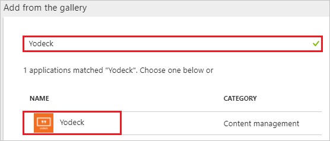
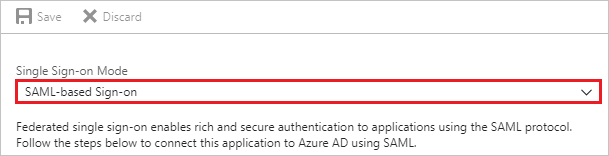
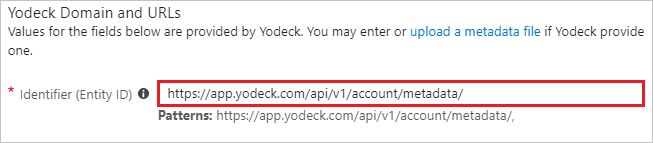
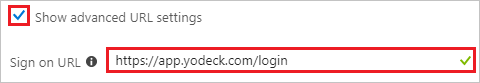
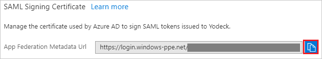
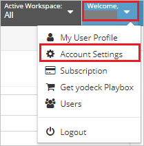
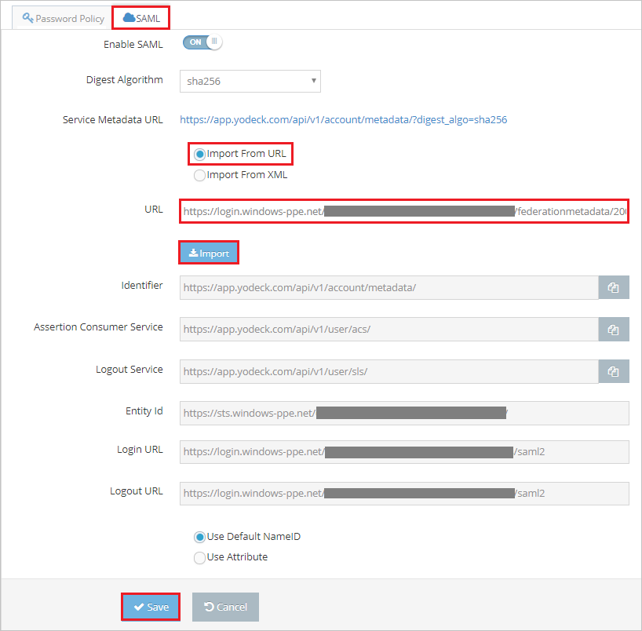
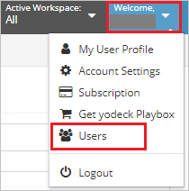
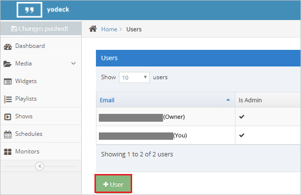

---
title: 'Tutorial: Azure Active Directory integration with Yodeck | Microsoft Docs'
description: Learn how to configure single sign-on between Azure Active Directory and Yodeck.
services: active-directory
documentationCenter: na
author: jeevansd
manager: femila
ms.reviewer: joflore

ms.assetid: b2c8dccb-eeb0-4f4d-a24d-8320631ce819
ms.service: active-directory
ms.component: saas-app-tutorial
ms.workload: identity
ms.tgt_pltfrm: na
ms.devlang: na
ms.topic: article
ms.date: 04/20/2018
ms.author: jeedes

---
# Tutorial: Azure Active Directory integration with Yodeck

In this tutorial, you learn how to integrate Yodeck with Azure Active Directory (Azure AD).

Integrating Yodeck with Azure AD provides you with the following benefits:

- You can control in Azure AD who has access to Yodeck.
- You can enable your users to automatically get signed-on to Yodeck (Single Sign-On) with their Azure AD accounts.
- You can manage your accounts in one central location - the Azure portal.

If you want to know more details about SaaS app integration with Azure AD, see [what is application access and single sign-on with Azure Active Directory](../manage-apps/what-is-single-sign-on.md).

## Prerequisites

To configure Azure AD integration with Yodeck, you need the following items:

- An Azure AD subscription
- A Yodeck single sign-on enabled subscription

> [!NOTE]
> To test the steps in this tutorial, we do not recommend using a production environment.

To test the steps in this tutorial, you should follow these recommendations:

- Do not use your production environment, unless it is necessary.
- If you don't have an Azure AD trial environment, you can [get a one-month trial](https://azure.microsoft.com/pricing/free-trial/).

## Scenario description
In this tutorial, you test Azure AD single sign-on in a test environment. 
The scenario outlined in this tutorial consists of two main building blocks:

1. Adding Yodeck from the gallery
1. Configuring and testing Azure AD single sign-on

## Adding Yodeck from the gallery
To configure the integration of Yodeck into Azure AD, you need to add Yodeck from the gallery to your list of managed SaaS apps.

**To add Yodeck from the gallery, perform the following steps:**

1. In the **[Azure portal](https://portal.azure.com)**, on the left navigation panel, click **Azure Active Directory** icon. 

	![The Azure Active Directory button][1]

1. Navigate to **Enterprise applications**. Then go to **All applications**.

	![The Enterprise applications blade][2]
	
1. To add new application, click **New application** button on the top of dialog.

	![The New application button][3]

1. In the search box, type **Yodeck**, select **Yodeck** from result panel then click **Add** button to add the application.

	

## Configure and test Azure AD single sign-on

In this section, you configure and test Azure AD single sign-on with Yodeck based on a test user called "Britta Simon".

For single sign-on to work, Azure AD needs to know what the counterpart user in Yodeck is to a user in Azure AD. In other words, a link relationship between an Azure AD user and the related user in Yodeck needs to be established.

To configure and test Azure AD single sign-on with Yodeck, you need to complete the following building blocks:

1. **[Configure Azure AD Single Sign-On](#configure-azure-ad-single-sign-on)** - to enable your users to use this feature.
1. **[Create an Azure AD test user](#create-an-azure-ad-test-user)** - to test Azure AD single sign-on with Britta Simon.
1. **[Create a Yodeck test user](#create-a-yodeck-test-user)** - to have a counterpart of Britta Simon in Yodeck that is linked to the Azure AD representation of user.
1. **[Assign the Azure AD test user](#assign-the-azure-ad-test-user)** - to enable Britta Simon to use Azure AD single sign-on.
1. **[Test single sign-on](#test-single-sign-on)** - to verify whether the configuration works.

### Configure Azure AD single sign-on

In this section, you enable Azure AD single sign-on in the Azure portal and configure single sign-on in your Yodeck application.

**To configure Azure AD single sign-on with Yodeck, perform the following steps:**

1. In the Azure portal, on the **Yodeck** application integration page, click **Single sign-on**.

	![Configure single sign-on link][4]

1. On the **Single sign-on** dialog, select **Mode** as **SAML-based Sign-on** to enable single sign-on.

	

1. On the **Yodeck Domain and URLs** section, perform the following steps if you wish to configure the application in **IDP** initiated mode:

	

    In the **Identifier (Entity ID)** textbox, type the URL: `https://app.yodeck.com/api/v1/account/metadata/`

1. Check **Show advanced URL settings** and perform the following step if you wish to configure the application in **SP** initiated mode:

	

    In the **Sign-on URL** textbox, type the URL: `https://app.yodeck.com/login`

1. On the **SAML Signing Certificate** section, click the copy button to copy **App Federation Metadata Url** and paste it into notepad.

	

1. Click **Save** button.

	
	
1. In a different web browser window, log in to your Yodeck company site as an administrator.

1. Click on **User Settings** option form the top right corner of the page and select **Account Settings**.

	

1. Select **SAML** and perform the following steps:

	

	a. Select **Import from URL**.

	b. In the **URL** textbox, paste the **App Federation Metadata Url** value, which you have copied from the Azure portal and click **Import**.
	
	c. After importing **App Federation Metadata Url**, the remaining fields populate automatically.

	d. Click **Save**.

### Create an Azure AD test user

The objective of this section is to create a test user in the Azure portal called Britta Simon.

   ![Create an Azure AD test user][100]

**To create a test user in Azure AD, perform the following steps:**

1. In the Azure portal, in the left pane, click the **Azure Active Directory** button.

    

1. To display the list of users, go to **Users and groups**, and then click **All users**.

    

1. To open the **User** dialog box, click **Add** at the top of the **All Users** dialog box.

    

1. In the **User** dialog box, perform the following steps:

    

    a. In the **Name** box, type **BrittaSimon**.

    b. In the **User name** box, type the email address of user Britta Simon.

    c. Select the **Show Password** check box, and then write down the value that's displayed in the **Password** box.

    d. Click **Create**.
 
### Create a Yodeck test user

To enable Azure AD users to log in to Yodeck, they must be provisioned into Yodeck.
In the case of Yodeck, provisioning is a manual task.

**To provision a user account, perform the following steps:**

1. Log in to your Yodeck company site as an administrator.

1. Click on **User Settings** option form the top right corner of the page and select **Users**.

	

1. Click on **+User** to open the **User Details** tab.

	

1. On the **User Details** dialog page, perform the following steps:

	

	a. In the **First Name** textbox, type the first name of the user like **Britta**.

	b. In the **Last Name** textbox, type the last name of user like **Simon**.

	c. In the **Email** textbox, type the email address of user like **brittasimon@contoso.com**.

	d. Select appropriate **Account Permissions** option as per your organizational requirement.
	
	e. Click **Save**.

### Assign the Azure AD test user

In this section, you enable Britta Simon to use Azure single sign-on by granting access to Yodeck.

![Assign the user role][200]

**To assign Britta Simon to Yodeck, perform the following steps:**

1. In the Azure portal, open the applications view, and then navigate to the directory view and go to **Enterprise applications** then click **All applications**.

	![Assign User][201]

1. In the applications list, select **Yodeck**.

	  

1. In the menu on the left, click **Users and groups**.

	![The "Users and groups" link][202]

1. Click **Add** button. Then select **Users and groups** on **Add Assignment** dialog.

	![The Add Assignment pane][203]

1. On **Users and groups** dialog, select **Britta Simon** in the Users list.

1. Click **Select** button on **Users and groups** dialog.

1. Click **Assign** button on **Add Assignment** dialog.
	
### Test single sign-on

In this section, you test your Azure AD single sign-on configuration using the Access Panel.

When you click the Yodeck tile in the Access Panel, you should get automatically signed-on to your Yodeck application.
For more information about the Access Panel, see [Introduction to the Access Panel](../user-help/active-directory-saas-access-panel-introduction.md). 

## Additional resources

* [List of Tutorials on How to Integrate SaaS Apps with Azure Active Directory](tutorial-list.md)
* [What is application access and single sign-on with Azure Active Directory?](../manage-apps/what-is-single-sign-on.md)

<!--Image references-->

[1]: ./media/yodeck-tutorial/tutorial_general_01.png
[2]: ./media/yodeck-tutorial/tutorial_general_02.png
[3]: ./media/yodeck-tutorial/tutorial_general_03.png
[4]: ./media/yodeck-tutorial/tutorial_general_04.png

[100]: ./media/yodeck-tutorial/tutorial_general_100.png

[200]: ./media/yodeck-tutorial/tutorial_general_200.png
[201]: ./media/yodeck-tutorial/tutorial_general_201.png
[202]: ./media/yodeck-tutorial/tutorial_general_202.png
[203]: ./media/yodeck-tutorial/tutorial_general_203.png

