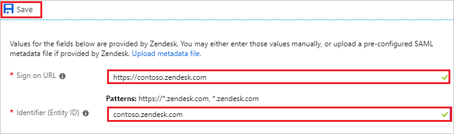
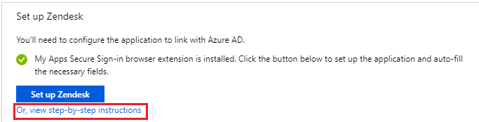
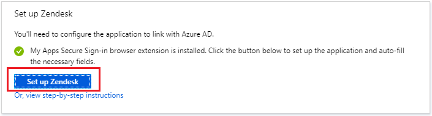

# Tutorial: Azure Active Directory integration with Zendesk

In this tutorial, you learn how to integrate Zendesk with Azure Active Directory (Azure AD).

Integrating Zendesk with Azure AD provides you with the following benefits:

- You can control in Azure AD who has access to Zendesk.
- You can enable your users to automatically get signed-on to Zendesk (Single Sign-On) with their Azure AD accounts.
- You can manage your accounts in one central location - the Azure portal.

If you want to know more details about SaaS app integration with Azure AD, see [what is application access and single sign-on with Azure Active Directory](../manage-apps/what-is-single-sign-on.md).

## Prerequisites

To configure Azure AD integration with Zendesk, you need the following items:

- An Azure AD subscription
- A Zendesk single sign-on enabled subscription

> [!NOTE]
> To test the steps in this tutorial, we do not recommend using a production environment.

To test the steps in this tutorial, you should follow these recommendations:

- Do not use your production environment, unless it is necessary.
- If you don't have an Azure AD trial environment, you can [get a one-month trial](https://azure.microsoft.com/pricing/free-trial/).

## Scenario description

In this tutorial, you test Azure AD single sign-on in a test environment.
The scenario outlined in this tutorial consists of two main building blocks:

1. Adding Zendesk from the gallery
2. Configuring and testing Azure AD single sign-on

## Adding Zendesk from the gallery

To configure the integration of Zendesk into Azure AD, you need to add Zendesk from the gallery to your list of managed SaaS apps.

**To add Zendesk from the gallery, perform the following steps:**

1. In the **[Azure portal](https://portal.azure.com)**, on the left navigation panel, click **Azure Active Directory** icon. 

	

2. Navigate to **Enterprise applications**. Then go to **All applications**.

	
	
3. To add new application, click **New application** button on the top of dialog.

	

4. In the search box, type **Zendesk**, select **Zendesk** from result panel then click **Add** button to add the application.

	 

## Configure and test Azure AD single sign-on

In this section, you configure and test Azure AD single sign-on with Zendesk based on a test user called "Britta Simon".

For single sign-on to work, Azure AD needs to know what the counterpart user in Zendesk is to a user in Azure AD. In other words, a link relationship between an Azure AD user and the related user in Zendesk needs to be established.

In Zendesk, assign the value of the **user name** in Azure AD as the value of the **Username** to establish the link relationship.

To configure and test Azure AD single sign-on with Zendesk, you need to complete the following building blocks:

1. **[Configure Azure AD Single Sign-On](#configure-azure-ad-single-sign-on)** - to enable your users to use this feature.
2. **[Create an Azure AD test user](#create-an-azure-ad-test-user)** - to test Azure AD single sign-on with Britta Simon.
3. **[Create a Zendesk test user](#create-a-zendesk-test-user)** - to have a counterpart of Britta Simon in Zendesk that is linked to the Azure AD representation of user.
4. **[Assign the Azure AD test user](#assign-the-azure-ad-test-user)** - to enable Britta Simon to use Azure AD single sign-on.
5. **[Test single sign-on](#test-single-sign-on)** - to verify whether the configuration works.

### Configure Azure AD single sign-on

In this section, you enable Azure AD single sign-on in the Azure portal and configure single sign-on in your Zendesk application.

**To configure Azure AD single sign-on with Zendesk, perform the following steps:**

1. In the [Azure portal](https://portal.azure.com/), on the **Zendesk** application integration page, select **Single sign-on**.

    

2. Click **Change Single sign-on mode** on top of the screen to select the **SAML** mode.

	  

3. On the **Select a Single sign-on method** dialog, Click **Select** for **SAML** mode to enable single sign-on.

    

4. On the **Set up Single Sign-On with SAML** page, click **Edit** button to open **Basic SAML Configuration** dialog.

	

5. On the **Basic SAML Configuration** section, perform the following steps:

	a. In the **Sign-on URL** text box, type a URL using the following pattern:
    `https://<subdomain>.zendesk.com`.

    b. In the **Identifier** text box, type a URL using the following pattern:
    `<subdomain>.zendesk.com`.

    

	> [!NOTE] 
	> These values are not real. Update these values with the actual Sign-On URL and Identifier. Contact [Zendesk Client support team](https://support.zendesk.com/hc/articles/203663676-Using-SAML-for-single-sign-on-Professional-and-Enterprise) to get these values.

6. Zendesk expects the SAML assertions in a specific format. There are no mandatory SAML attributes but optionally you can add an attribute from **User Attributes** section on application integration page. On the **Set up Single Sign-On with SAML** page, click **Edit** button to open **User Attributes** dialog.

	

7. In the **User Claims** section on the **User Attributes** dialog, configure SAML token attribute as shown in the image above and perform the following steps:

	a. Click **Add new claim** to open the **Manage user claims** dialog.

	

	
	
	b. In the **Name** textbox, type the attribute name shown for that row.

	c. Leave the **Namespace** blank.

	d. Select Source as **Attribute**.
	
	e. From the **Source attribute** list, type the attribute value shown for that row.
	
	f. Click **Ok**

	g. Click **Save**.

	> [!NOTE]
    > You use extension attributes to add attributes that are not in Azure AD by default. Click [User attributes that can be set in SAML](https://support.zendesk.com/hc/en-us/articles/203663676-Using-SAML-for-single-sign-on-Professional-and-Enterprise-) to get the complete list of SAML attributes that **Zendesk** accepts.

8. In the SAML Signing Certificate section, in the **SAML Signing Certificate** section, copy the **Thumbprint**, and save it on your computer.

    

	a. Select the appropriate option for **Signing Option** if needed.

	b. Select the appropriate option for **Signing Algorithm** if needed.

	c. Click **Save**

9. On the **Set up Zendesk** section, click **View step-by-step instructions** to open **Configure sign-on** window. Copy the below URLs, from the **Quick Reference section.**

	Note that the url may say the following:

	a. SAML Single Sign-On Service URL

	b. Entity ID

	c. Sign-Out URL

	 

10. There are two ways in which Zendesk can be configured - Automatic and Manual.
  
11. To automate the configuration within Zendesk, you need to install **My Apps Secure Sign-in browser extension** by clicking **Install the extension**.

	

12. After adding extension to the browser, click on **Setup Zendesk** will direct you to the Zendesk application. From there, provide the admin credentials to sign into Zendesk. The browser extension will automatically configure the application for you and automate step 13.

	  

13. If you want to setup Zendesk manually, open a new web browser window and log into your Zendesk company site as an administrator and perform the following steps:

    * Click **Admin**.

    * In the left navigation pane, click **Settings**, and then click **Security**.

    * On the **Security** page, perform the following steps:

      

      

      a. Click the **Admin & Agents** tab.

      b. Select **Single sign-on (SSO) and SAML**, and then select **SAML**.

      c. In **SAML SSO URL** textbox, paste the value of **SAML Single Sign-On Service URL** which you have copied from Azure portal.

      d. In **Remote Logout URL** textbox, paste the value of **Sign-Out URL** which you have copied from Azure portal.

      e. In **Certificate Fingerprint** textbox, paste the **Thumbprint** value of certificate which you have copied from Azure portal.

      f. Click **Save**.

### Create an Azure AD test user 

The objective of this section is to create a test user in the Azure portal called Britta Simon.

1. In the Azure portal, in the left pane, select **Azure Active Directory**, select **Users**, and then select **All users**.

    

2. Select **New user** at the top of the screen.

    

3. In the User properties, perform the following steps.

    

    a. In the **Name** field enter **BrittaSimon**.
  
    b. In the **User name** field type **brittasimon@yourcompanydomain.extension**  
    For example, BrittaSimon@contoso.com

    c. Select **Properties**, select the **Show password** check box, and then write down the value that's displayed in the Password box.

    d. Select **Create**.

### Create a Zendesk test user

The objective of this section is to create a user called Britta Simon in Zendesk. Zendesk supports automatic user provisioning, which is by default enabled. You can find more details [here](Zendesk-provisioning-tutorial.md) on how to configure automatic user provisioning.

**If you need to create user manually, please perform following steps:**

> [!NOTE]
> **End-user** accounts are automatically provisioned when signing in. **Agent** and **Admin** accounts need to be manually provisioned in **Zendesk** before signing in.

1. Log in to your **Zendesk** tenant.

2. Select the **Customer List** tab.

3. Select the **User** tab, and click **Add**.

    
4. Type the **Name** and **Email** of an existing Azure AD account you want to provision, and then click **Save**.

    

> [!NOTE]
> You can use any other Zendesk user account creation tools or APIs provided by Zendesk to provision AAD user accounts.

### Assign the Azure AD test user

In this section, you enable Britta Simon to use Azure single sign-on by granting access to Zendesk.

1. In the Azure portal, select **Enterprise Applications**, select **All applications**.

	

2. In the applications list, select **Zendesk**.

	

3. In the menu on the left, select **Users and groups**.

    

4. Select the **Add** button, then select **Users and groups** in the **Add Assignment** dialog.

    

4. In the **Users and groups** dialog select **Britta Simon** in the Users list, then click the **Select** button at the bottom of the screen.

5. In the **Add Assignment** dialog select the **Assign** button.

### Test single sign-on

In this section, you test your Azure AD single sign-on configuration using the Access Panel.

When you click the Zendesk tile in the Access Panel, you should get automatically signed-on to your Zendesk application.
For more information about the Access Panel, see [Introduction to the Access Panel](../user-help/active-directory-saas-access-panel-introduction.md).

## Additional resources

* [List of Tutorials on How to Integrate SaaS Apps with Azure Active Directory](tutorial-list.md)
* [What is application access and single sign-on with Azure Active Directory?](../manage-apps/what-is-single-sign-on.md)
* [Configure User Provisioning](zendesk-provisioning-tutorial.md)
