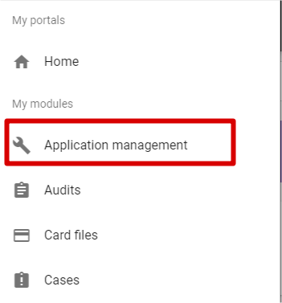
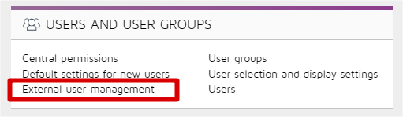
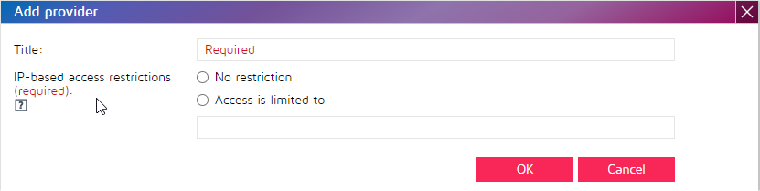
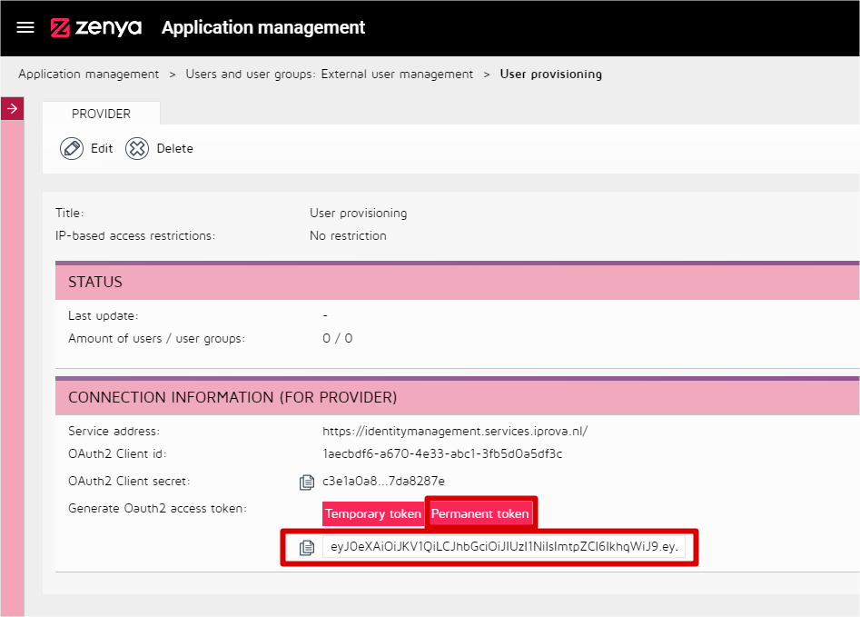
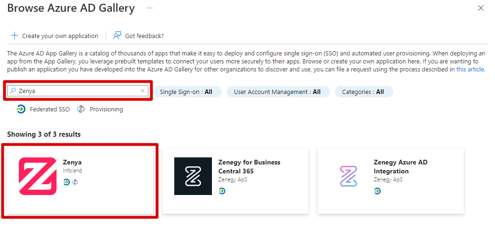

# Tutorial: Configure Zenya for automatic user provisioning

The objective of this tutorial is to demonstrate the steps to be performed in Zenya and Azure Active Directory (Azure AD) to configure Azure AD to automatically provision and de-provision users and/or groups to [Zenya](https://www.infoland.nl/). For important details on what this service does, how it works, and frequently asked questions, see [Automate user provisioning and deprovisioning to SaaS applications with Azure Active Directory](../app-provisioning/user-provisioning.md). Before you attempt to use this tutorial, be sure that you know and meet all requirements. If you have questions, contact Infoland.

> [!NOTE]
> This connector is currently in Public Preview. For more information on the general Microsoft Azure terms of use for Preview features, see [Supplemental Terms of Use for Microsoft Azure Previews](https://azure.microsoft.com/support/legal/preview-supplemental-terms/).

## Capabilities supported
> * Create users in Zenya
> * Remove/disable users in Zenya when they do not require access anymore
> * Keep user attributes synchronized between Azure AD and Zenya
> * Provision groups and group memberships in Zenya
> * [Single sign-on](./zenya-tutorial.md) to Zenya (recommended)

## Prerequisites

The scenario outlined in this tutorial assumes that you already have the following prerequisites:

* [An Azure AD tenant](../develop/quickstart-create-new-tenant.md).
* A user account in Azure AD with [permission](../roles/permissions-reference.md) to configure provisioning (for example, Application Administrator, Cloud Application administrator, Application Owner, or Global Administrator).
* [A Zenya tenant](https://www.infoland.nl/).
* A user account in Zenya with admin permissions.

## Step 1. Plan your provisioning deployment
1. Learn about [how the provisioning service works](../app-provisioning/user-provisioning.md).
2. Determine who will be in [scope for provisioning](../app-provisioning/define-conditional-rules-for-provisioning-user-accounts.md).
3. Determine what data to [map between Azure AD and Zenya](../app-provisioning/customize-application-attributes.md). 

## Step 2. Configure Zenya to support provisioning with Azure AD

1. Sign in to your [Zenya Admin Console](https://www.infoland.nl/). Navigate to **Go to > Application Management**.

	

2.	Select **External user management**.

	

3. To add a new provider, select the **plus** icon. In the new **Add provider** dialog box, provide a **Title**. You can choose to add **IP-based access restriction**. Select **OK**.

	

	

4.	Select the **Permanent token** button. Copy the **Permanent token** and save it. You won't be able to view it later. This value will be entered in the Secret Token field in the Provisioning tab of your Zenya application in the Azure portal.

	

## Step 3. Add Zenya from the Azure AD application gallery

Add Zenya from the Azure AD application gallery to start managing provisioning to Zenya. If you have previously setup Zenya for SSO, you can use the same application. However it's recommended that you create a separate app when testing out the integration initially. Learn more about adding an application from the gallery [here](../manage-apps/add-application-portal.md). 

## Step 4. Define who will be in scope for provisioning 

The Azure AD provisioning service allows you to scope who will be provisioned based on assignment to the application and or based on attributes of the user / group. If you choose to scope who will be provisioned to your app based on assignment, you can use the following [steps](../manage-apps/assign-user-or-group-access-portal.md) to assign users and groups to the application. If you choose to scope who will be provisioned based solely on attributes of the user or group, you can use a scoping filter as described [here](../app-provisioning/define-conditional-rules-for-provisioning-user-accounts.md). 

* Start small. Test with a small set of users and groups before rolling out to everyone. When scope for provisioning is set to assigned users and groups, maintain control by assigning one or two users or groups to the app. When scope is set to all users and groups, you can specify an [attribute based scoping filter](../app-provisioning/define-conditional-rules-for-provisioning-user-accounts.md).

* If you need additional roles, you can [update the application manifest](../develop/howto-add-app-roles-in-azure-ad-apps.md) to add new roles.

## Step 5. Configure automatic user provisioning to Zenya 

This section guides you through the steps to configure the Azure AD provisioning service to create, update, and disable users and/or groups in Zenya based on user and/or group assignments in Azure AD.

For more information (in dutch) also read: [`Implementatie SCIM koppeling`](https://webshare.iprova.nl/8my7yg8c1ofsmdj9/Document.aspx)

### To configure automatic user provisioning for Zenya in Azure AD:

1. Sign in to the [Azure portal](https://portal.azure.com). Select **Enterprise Applications**, then select **All applications**.

	

2. In the applications list, select **Zenya**.

	

3. Select the **Provisioning** tab.

	

4. Set the **Provisioning Mode** to **Automatic**.

	

5. In the **Admin Credentials** section, input the **SCIM 2.0 base URL and Permanent Token** values retrieved earlier in the **Tenant URL** and add /scim/ to it. Also add the  **Secret Token**. You can generate a secret token in Zenya by using the **permanent token** button. Select **Test Connection** to ensure Azure AD can connect to Zenya. If the connection fails, ensure your Zenya account has Admin permissions and try again. 

	

6. In the **Notification Email** field, enter the email address of a person or group who should receive the provisioning error notifications and check the checkbox - **Send an email notification when a failure occurs**.

	

7. Select **Save**.

8. Under the **Mappings** section, select **Synchronize Azure Active Directory Users to Zenya**.

9. Review the user attributes that are synchronized from Azure AD to Zenya in the **Attribute Mapping** section. The attributes selected as **Matching** properties are used to match the user accounts in Zenya for update operations. Select the **Save** button to commit any changes.

   |Attribute|Type|
   |---|---|
   |active|Boolean|
   |displayName|String|
   |emails[type eq "work"].value|String|
   |preferredLanguage|String|
   |userName|String|
   |phoneNumbers[type eq "work"].value|String|
   |externalId|String|

10. Under the **Mappings** section, select **Synchronize Azure Active Directory Groups to Zenya**.

11. Review the group attributes that are synchronized from Azure AD to Zenya in the **Attribute Mapping** section. The attributes selected as **Matching** properties are used to match the groups in Zenya for update operations. Select the **Save** button to commit any changes.

      |Attribute|Type|
      |---|---|
      |displayName|String|
      |members|Reference|
      |externalID|String|

12. To configure scoping filters, refer to the following instructions provided in the [Scoping filter tutorial](../app-provisioning/define-conditional-rules-for-provisioning-user-accounts.md).

13. To enable the Azure AD provisioning service for Zenya, change the **Provisioning Status** to **On** in the **Settings** section.

	

14. Define the users and/or groups that you would like to provision to Zenya by choosing the desired values in **Scope** in the **Settings** section. You'll need a P1 or P2 license in order to allow provisioning assigned users and groups. 

	

15. When you're ready to provision, select **Save**.

	

This operation starts the initial synchronization of all users and/or groups defined in **Scope** in the **Settings** section. The initial sync takes longer to perform than subsequent syncs, which occur approximately every 40 minutes as long as the Azure AD provisioning service is running. 

## Step 6. Monitor your deployment
Once you've configured provisioning, use the following resources to monitor your deployment:

1. Use the [provisioning logs](../reports-monitoring/concept-provisioning-logs.md) to determine which users have been provisioned successfully or unsuccessfully
2. Check the [progress bar](../app-provisioning/application-provisioning-when-will-provisioning-finish-specific-user.md) to see the status of the provisioning cycle and how close it is to completion
3. If the provisioning configuration seems to be in an unhealthy state, the application will go into quarantine. Learn more about quarantine states [here](../app-provisioning/application-provisioning-quarantine-status.md).  

## Change log

* 06/17/2020 - Enterprise extension attribute "Manager" has been removed.

## Additional resources

* [Managing user account provisioning for Enterprise Apps](../app-provisioning/configure-automatic-user-provisioning-portal.md)
* [What is application access and single sign-on with Azure Active Directory?](../manage-apps/what-is-single-sign-on.md)
* [`Implementatie SCIM koppeling`](https://webshare.iprova.nl/8my7yg8c1ofsmdj9/Document.aspx)

## Next steps

* [Learn how to review logs and get reports on provisioning activity](../app-provisioning/check-status-user-account-provisioning.md)
