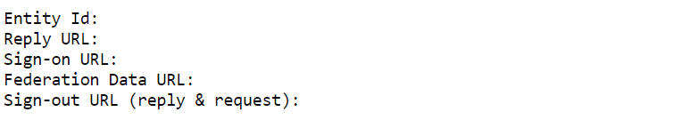
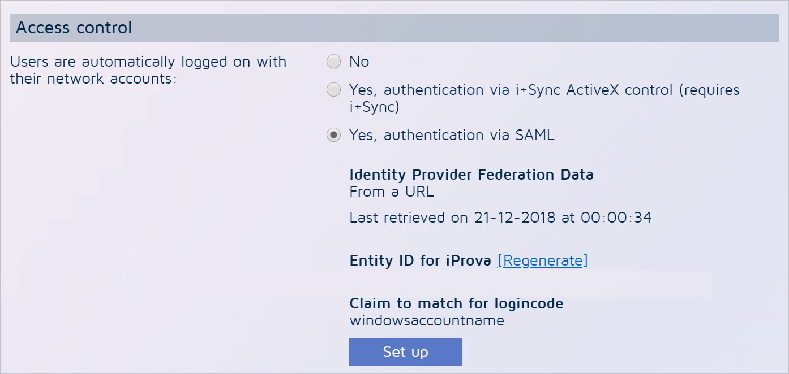

# Tutorial: Microsoft Entra single sign-on (SSO) integration with Zenya

In this tutorial, you'll learn how to integrate Zenya with Microsoft Entra ID. When you integrate Zenya with Microsoft Entra ID, you can:

* Control in Microsoft Entra ID who has access to Zenya.
* Enable your users to be automatically signed-in to Zenya with their Microsoft Entra accounts.
* Manage your accounts in one central location.

## Prerequisites

To get started, you need the following items:

* A Microsoft Entra subscription. If you don't have a subscription, you can get a [free account](https://azure.microsoft.com/free/).
* Zenya single sign-on (SSO) enabled subscription.

## Scenario description

In this tutorial, you configure and test Microsoft Entra SSO in a test environment.

* Zenya supports **SP** initiated SSO.
* Zenya supports [Automated user provisioning](zenya-provisioning-tutorial.md).

## Add Zenya from the gallery

To configure the integration of Zenya into Microsoft Entra ID, you need to add Zenya from the gallery to your list of managed SaaS apps.

1. Sign in to the [Microsoft Entra admin center](https://entra.microsoft.com) as at least a [Cloud Application Administrator](../roles/permissions-reference.md#cloud-application-administrator).
1. Browse to **Identity** > **Applications** > **Enterprise applications** > **New application**.
1. In the **Add from the gallery** section, type **Zenya** in the search box.
1. Select **Zenya** from results panel and then add the app. Wait a few seconds while the app is added to your tenant.

 Alternatively, you can also use the [Enterprise App Configuration Wizard](https://portal.office.com/AdminPortal/home?Q=Docs#/azureadappintegration). In this wizard, you can add an application to your tenant, add users/groups to the app, assign roles, as well as walk through the SSO configuration as well. [Learn more about Microsoft 365 wizards.](/microsoft-365/admin/misc/azure-ad-setup-guides)

## Configure and test Microsoft Entra SSO for Zenya

Configure and test Microsoft Entra SSO with Zenya using a test user called **B.Simon**. For SSO to work, you need to establish a link relationship between a Microsoft Entra user and the related user in Zenya.

To configure and test Microsoft Entra SSO with Zenya, perform the following steps:

1. **[Configure Microsoft Entra SSO](#configure-azure-ad-sso)** - to enable your users to use this feature.
    1. **[Create a Microsoft Entra test user](#create-an-azure-ad-test-user)** - to test Microsoft Entra single sign-on with B.Simon.
    1. **[Assign the Microsoft Entra test user](#assign-the-azure-ad-test-user)** - to enable B.Simon to use Microsoft Entra single sign-on.
1. **[Configure Zenya SSO](#configure-zenya-sso)** - to configure the single sign-on settings on application side.
    1. **[Create Zenya test user](#create-zenya-test-user)** - to have a counterpart of B.Simon in Zenya that is linked to the Microsoft Entra representation of user.
1. **[Test SSO](#test-sso)** - to verify whether the configuration works.

## Retrieve configuration information from Zenya

In this section, you retrieve information from Zenya to configure Microsoft Entra single sign-on.

1. Open a web browser and go to the **SAML2 info** page in Zenya by using the following URL patterns:
	
     `https://<SUBDOMAIN>.zenya.work/saml2info`   
     `https://<SUBDOMAIN>.iprova.nl/saml2info`  
     `https://<SUBDOMAIN>.iprova.be/saml2info`  
     `https://<SUBDOMAIN>.iprova.eu/saml2info` 

	

1. Leave the browser tab open while you proceed with the next steps in another browser tab.

## Configure Microsoft Entra SSO

Follow these steps to enable Microsoft Entra SSO.

1. Sign in to the [Microsoft Entra admin center](https://entra.microsoft.com) as at least a [Cloud Application Administrator](../roles/permissions-reference.md#cloud-application-administrator).
1. Browse to **Identity** > **Applications** > **Enterprise applications** > **Zenya** > **Single sign-on**.
1. On the **Select a single sign-on method** page, select **SAML**.
1. On the **Set up single sign-on with SAML** page, click the pencil icon for **Basic SAML Configuration** to edit the settings.

   

1. On the **Basic SAML Configuration** section, perform the following steps:

	a. Fill the **Sign-on URL** box with the value that's displayed behind the label **Sign-on URL** on the **Zenya SAML2 info** page. This page is still open in your other browser tab.

	b. Fill the **Identifier** box with the value that's displayed behind the label **EntityID** on the **Zenya SAML2 info** page. This page is still open in your other browser tab.

	c. Fill the **Reply-URL** box with the value that's displayed behind the label **Reply URL** on the **Zenya SAML2 info** page. This page is still open in your other browser tab.
	
	d. Fill the **Logout-URL** box with the value that's displayed behind the label **Logout URL** on the **Zenya SAML2 info** page. This page is still open in your other browser tab.

1. Zenya application expects the SAML assertions in a specific format, which requires you to add custom attribute mappings to your SAML token attributes configuration. The following screenshot shows the list of default attributes.

	

1. In addition to above, Zenya application expects few more attributes to be passed back in SAML response which are shown below. These attributes are also pre populated but you can review them as per your requirements.

	| Name | Source Attribute| Namespace  |
	| ---------------| -------- | -----|
	| `samaccountname` | `user.onpremisessamaccountname`| `http://schemas.xmlsoap.org/ws/2005/05/identity/claims`|

1. On the **Set up single sign-on with SAML** page, In the **SAML Signing Certificate** section, click copy button to copy **App Federation Metadata Url** and save it on your computer.

	

## Create a Microsoft Entra test user

In this section, you'll create a test user called B.Simon.

1. Sign in to the [Microsoft Entra admin center](https://entra.microsoft.com) as at least a [User Administrator](../roles/permissions-reference.md#user-administrator).
1. Browse to **Identity** > **Users** > **All users**.
1. Select **New user** > **Create new user**, at the top of the screen.
1. In the **User** properties, follow these steps:
   1. In the **Display name** field, enter `B.Simon`.  
   1. In the **User principal name** field, enter the username@companydomain.extension. For example, `B.Simon@contoso.com`.
   1. Select the **Show password** check box, and then write down the value that's displayed in the **Password** box.
   1. Select **Review + create**.
1. Select **Create**.

## Assign the Microsoft Entra test user

In this section, you'll enable B.Simon to use single sign-on by granting access to Zenya.

1. Sign in to the [Microsoft Entra admin center](https://entra.microsoft.com) as at least a [Cloud Application Administrator](../roles/permissions-reference.md#cloud-application-administrator).
1. Browse to **Identity** > **Applications** > **Enterprise applications** > **Zenya**.
1. In the app's overview page, select **Users and groups**.
1. Select **Add user/group**, then select **Users and groups** in the **Add Assignment** dialog.
   1. In the **Users and groups** dialog, select **B.Simon** from the Users list, then click the **Select** button at the bottom of the screen.
   1. If you are expecting a role to be assigned to the users, you can select it from the **Select a role** dropdown. If no role has been set up for this app, you see "Default Access" role selected.
   1. In the **Add Assignment** dialog, click the **Assign** button.

## Configure Zenya SSO

1. Sign in to Zenya by using the **Administrator** account.

2. Open the **Go to** menu.

3. Select **Application management**.

4. Select **General** in the **System settings** panel.

5. Select **Edit**.

6. Scroll down to **Access control**.

	

7. Find the setting **Users are automatically logged on with their network accounts**, and change it to **Yes, authentication via SAML**. Additional options now appear.

8. Select **Set up**.

9. Select **Next**.

10. Zenya asks if you want to download federation data from a URL or upload it from a file. Select the **From URL** option.

	

11. Paste the metadata URL you saved in the last step of the "Configure Microsoft Entra single sign-on" section.

12. Select the arrow-shaped button to download the metadata from Microsoft Entra ID.

13. When the download is complete, the confirmation message **Valid Federation Data file downloaded** appears.

14. Select **Next**.

15. Skip the **Test login** option for now, and select **Next**.

16. In the **Claim to use** drop-down box, select **windowsaccountname**.

17. Select **Finish**.

18. You now return to the **Edit general settings** screen. Scroll down to the bottom of the page, and select **OK** to save your configuration.

## Create Zenya test user

1. Sign in to Zenya by using the **Administrator** account.

2. Open the **Go to** menu.

3. Select **Application management**.

4. Select **Users** in the **Users and user groups** panel.

5. Select **Add**.

6. In the **Username** box, enter the username of user like `B.Simon@contoso.com`.

7. In the **Full name** box, enter a full name of user like **B.Simon**.

8. Select the **No password (use single sign-on)** option.

9. In the **E-mail address** box, enter the email address of user like `B.Simon@contoso.com`.

10. Scroll down to the end of the page, and select **Finish**.

> [!NOTE]
> Zenya also supports automatic user provisioning, you can find more details [here](./zenya-provisioning-tutorial.md) on how to configure automatic user provisioning.

## Test SSO

In this section, you test your Microsoft Entra single sign-on configuration with following options. 

* Click on **Test this application**, this will redirect to Zenya Sign-on URL where you can initiate the login flow. 

* Go to Zenya Sign-on URL directly and initiate the login flow from there.

* You can use Microsoft My Apps. When you click the Zenya tile in the My Apps, this will redirect to Zenya Sign-on URL. For more information about the My Apps, see [Introduction to the My Apps](https://support.microsoft.com/account-billing/sign-in-and-start-apps-from-the-my-apps-portal-2f3b1bae-0e5a-4a86-a33e-876fbd2a4510).

## Next steps

Once you configure Zenya you can enforce session control, which protects exfiltration and infiltration of your organization’s sensitive data in real time. Session control extends from Conditional Access. [Learn how to enforce session control with Microsoft Defender for Cloud Apps](/cloud-app-security/proxy-deployment-aad).
