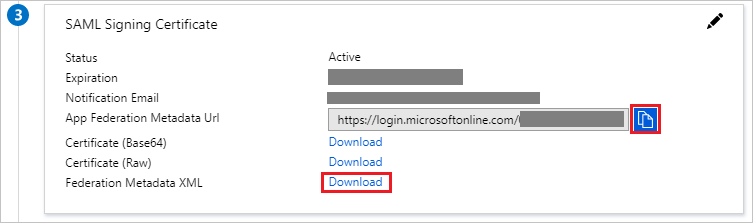

# Tutorial: Azure Active Directory integration with ZIVVER

In this tutorial, you learn how to integrate ZIVVER with Azure Active Directory (Azure AD).
Integrating ZIVVER with Azure AD provides you with the following benefits:

* You can control in Azure AD who has access to ZIVVER.
* You can enable your users to be automatically signed-in to ZIVVER (Single Sign-On) with their Azure AD accounts.
* You can manage your accounts in one central location - the Azure portal.

If you want to know more details about SaaS app integration with Azure AD, see [What is application access and single sign-on with Azure Active Directory](https://docs.microsoft.com/azure/active-directory/active-directory-appssoaccess-whatis).
If you don't have an Azure subscription, [create a free account](https://azure.microsoft.com/free/) before you begin.

## Prerequisites

To configure Azure AD integration with ZIVVER, you need the following items:

* An Azure AD subscription. If you don't have an Azure AD environment, you can get a [free account](https://azure.microsoft.com/free/)
* ZIVVER single sign-on enabled subscription

## Scenario description

In this tutorial, you configure and test Azure AD single sign-on in a test environment.

* ZIVVER supports **IDP** initiated SSO

## Adding ZIVVER from the gallery

To configure the integration of ZIVVER into Azure AD, you need to add ZIVVER from the gallery to your list of managed SaaS apps.

**To add ZIVVER from the gallery, perform the following steps:**

1. In the **[Azure portal](https://portal.azure.com)**, on the left navigation panel, click **Azure Active Directory** icon.

	

2. Navigate to **Enterprise Applications** and then select the **All Applications** option.

	

3. To add new application, click **New application** button on the top of dialog.

	

4. In the search box, type **ZIVVER**, select **ZIVVER** from result panel then click **Add** button to add the application.

	 

## Configure and test Azure AD single sign-on

In this section, you configure and test Azure AD single sign-on with ZIVVER based on a test user called **Britta Simon**.
For single sign-on to work, a link relationship between an Azure AD user and the related user in ZIVVER needs to be established.

To configure and test Azure AD single sign-on with ZIVVER, you need to complete the following building blocks:

1. **[Configure Azure AD Single Sign-On](#configure-azure-ad-single-sign-on)** - to enable your users to use this feature.
2. **[Configure ZIVVER Single Sign-On](#configure-zivver-single-sign-on)** - to configure the Single Sign-On settings on application side.
3. **[Create an Azure AD test user](#create-an-azure-ad-test-user)** - to test Azure AD single sign-on with Britta Simon.
4. **[Assign the Azure AD test user](#assign-the-azure-ad-test-user)** - to enable Britta Simon to use Azure AD single sign-on.
5. **[Create ZIVVER test user](#create-zivver-test-user)** - to have a counterpart of Britta Simon in ZIVVER that is linked to the Azure AD representation of user.
6. **[Test single sign-on](#test-single-sign-on)** - to verify whether the configuration works.

### Configure Azure AD single sign-on

In this section, you enable Azure AD single sign-on in the Azure portal.

To configure Azure AD single sign-on with ZIVVER, perform the following steps:

1. In the [Azure portal](https://portal.azure.com/), on the **ZIVVER** application integration page, select **Single sign-on**.

    

2. On the **Select a Single sign-on method** dialog, select **SAML/WS-Fed** mode to enable single sign-on.

    

3. On the **Set up Single Sign-On with SAML** page, click **Edit** icon to open **Basic SAML Configuration** dialog.

	

4. On the **Basic SAML Configuration** section, perform the following steps:

    

    In the **Identifier** text box, type a URL:
    `https://app.zivver.com/SAML/Zivver`

5. ZIVVER application expects the SAML assertions in a specific format, which requires you to add custom attribute mappings to your SAML token attributes configuration. The following screenshot shows the list of default attributes, where as **nameidentifier** is mapped with **user.userprincipalname**. ZIVVER application expects **nameidentifier** to be mapped with **user.mail**, so you need to edit the attribute mapping by clicking on **Edit** icon and change the attribute mapping.

	

6. In addition to above, ZIVVER application expects few more attributes to be passed back in SAML response. In the **User Claims** section on the **User Attributes** dialog, perform the following steps to add SAML token attribute as shown in the below table:

	| Name | Namespace | Source Attribute|
	| ---------------| --------------- |
	| ZivverAccountKey | https:\//zivver.com/SAML/Attributes | user.objectid |

	>[!NOTE]
	>If you are using a hybrid setup with Active Directory on-premise and Azure AD Connect Tool, VALUE should be set to `user.objectGUID`

	a. Click **Add new claim** to open the **Manage user claims** dialog.

	

	

	b. In the **Name** textbox, type the attribute name shown for that row.

	c. Leave the **Namespace** blank.

	d. Select Source as **Attribute**.

	e. From the **Source attribute** list, type the attribute value shown for that row.

	f. Click **Save**.

7. On the **Set up Single Sign-On with SAML** page, in the **SAML Signing Certificate** section, click **Download** to download the **Federation Metadata XML** and click **Copy** icon to copy the **App Federation Metadata url** from the given options as per your requirement and save it on your computer.

	

8. On the **Set up ZIVVER** section, copy the appropriate URL(s) as per your requirement.

	

	a. Login URL

	b. Azure AD Identifier

	c. Logout URL

### Configure ZIVVER Single Sign-On

1. In a different web browser window, sign in to your ZIVVER company [site](https://app.zivver.com/login) as an administrator.

2. Click the **Organization settings** icon at the bottom left of your browser window.

3. Go to **Single sign-on**.

4. Open the Federation Metadata XML file that you downloaded from Azure portal.

5. In the **Identity Provider metadata URL** text box, paste the **App Federation Metadata URL** you have saved previously from the Azure portal.

6. Check the checkbox **Turn on SSO**.

7. Click **SAVE**.

### Create an Azure AD test user 

The objective of this section is to create a test user in the Azure portal called Britta Simon.

1. In the Azure portal, in the left pane, select **Azure Active Directory**, select **Users**, and then select **All users**.

    

2. Select **New user** at the top of the screen.

    

3. In the User properties, perform the following steps.

    

    a. In the **Name** field enter **BrittaSimon**.
  
    b. In the **User name** field type `brittasimon@yourcompanydomain.extension`. For example, BrittaSimon@contoso.com

    c. Select **Show password** check box, and then write down the value that's displayed in the Password box.

    d. Click **Create**.

### Assign the Azure AD test user

In this section, you enable Britta Simon to use Azure single sign-on by granting access to ZIVVER.

1. In the Azure portal, select **Enterprise Applications**, select **All applications**, then select **ZIVVER**.

	

2. In the applications list, select **ZIVVER**.

	

3. In the menu on the left, select **Users and groups**.

    

4. Click the **Add user** button, then select **Users and groups** in the **Add Assignment** dialog.

    

5. In the **Users and groups** dialog select **Britta Simon** in the Users list, then click the **Select** button at the bottom of the screen.

6. If you are expecting any role value in the SAML assertion then in the **Select Role** dialog select the appropriate role for the user from the list, then click the **Select** button at the bottom of the screen.

7. In the **Add Assignment** dialog click the **Assign** button.

### Create ZIVVER test user

In this section, you create a user called Britta Simon in ZIVVER. Work with [ZIVVER support team](https://support.zivver.com/) to add the users in the ZIVVER platform. Users must be created and activated before you use single sign-on.

### Test single sign-on 

In this section, you test your Azure AD single sign-on configuration using the Access Panel.

When you click the ZIVVER tile in the Access Panel, you should be automatically signed in to the ZIVVER for which you set up SSO. For more information about the Access Panel, see [Introduction to the Access Panel](https://docs.microsoft.com/azure/active-directory/active-directory-saas-access-panel-introduction).

## Additional Resources

- [List of Tutorials on How to Integrate SaaS Apps with Azure Active Directory](https://docs.microsoft.com/azure/active-directory/active-directory-saas-tutorial-list)

- [What is application access and single sign-on with Azure Active Directory?](https://docs.microsoft.com/azure/active-directory/active-directory-appssoaccess-whatis)

- [What is Conditional Access in Azure Active Directory?](https://docs.microsoft.com/azure/active-directory/conditional-access/overview)

