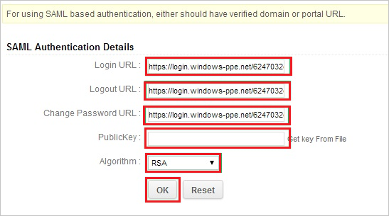
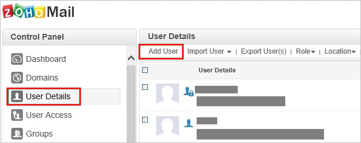

# Tutorial: Azure Active Directory integration with Zoho

In this tutorial, you learn how to integrate Zoho with Azure Active Directory (Azure AD).
Integrating Zoho with Azure AD provides you with the following benefits:

* You can control in Azure AD who has access to Zoho.
* You can enable your users to be automatically signed-in to Zoho (Single Sign-On) with their Azure AD accounts.
* You can manage your accounts in one central location - the Azure portal.

If you want to know more details about SaaS app integration with Azure AD, see [What is application access and single sign-on with Azure Active Directory](https://docs.microsoft.com/azure/active-directory/active-directory-appssoaccess-whatis).
If you don't have an Azure subscription, [create a free account](https://azure.microsoft.com/free/) before you begin.

## Prerequisites

To configure Azure AD integration with Zoho, you need the following items:

* An Azure AD subscription. If you don't have an Azure AD environment, you can get one-month trial [here](https://azure.microsoft.com/pricing/free-trial/)
* Zoho single sign-on enabled subscription

## Scenario description

In this tutorial, you configure and test Azure AD single sign-on in a test environment.

* Zoho supports **SP** initiated SSO

## Adding Zoho from the gallery

To configure the integration of Zoho into Azure AD, you need to add Zoho from the gallery to your list of managed SaaS apps.

**To add Zoho from the gallery, perform the following steps:**

1. In the **[Azure portal](https://portal.azure.com)**, on the left navigation panel, click **Azure Active Directory** icon.

	

2. Navigate to **Enterprise Applications** and then select the **All Applications** option.

	

3. To add new application, click **New application** button on the top of dialog.

	

4. In the search box, type **Zoho**, select **Zoho** from result panel then click **Add** button to add the application.

	 

## Configure and test Azure AD single sign-on

In this section, you configure and test Azure AD single sign-on with Zoho based on a test user called **Britta Simon**.
For single sign-on to work, a link relationship between an Azure AD user and the related user in Zoho needs to be established.

To configure and test Azure AD single sign-on with Zoho, you need to complete the following building blocks:

1. **[Configure Azure AD Single Sign-On](#configure-azure-ad-single-sign-on)** - to enable your users to use this feature.
2. **[Configure Zoho Single Sign-On](#configure-zoho-single-sign-on)** - to configure the Single Sign-On settings on application side.
3. **[Create an Azure AD test user](#create-an-azure-ad-test-user)** - to test Azure AD single sign-on with Britta Simon.
4. **[Assign the Azure AD test user](#assign-the-azure-ad-test-user)** - to enable Britta Simon to use Azure AD single sign-on.
5. **[Create Zoho test user](#create-zoho-test-user)** - to have a counterpart of Britta Simon in Zoho that is linked to the Azure AD representation of user.
6. **[Test single sign-on](#test-single-sign-on)** - to verify whether the configuration works.

### Configure Azure AD single sign-on

In this section, you enable Azure AD single sign-on in the Azure portal.

To configure Azure AD single sign-on with Zoho, perform the following steps:

1. In the [Azure portal](https://portal.azure.com/), on the **Zoho** application integration page, select **Single sign-on**.

    

2. On the **Select a Single sign-on method** dialog, select **SAML/WS-Fed** mode to enable single sign-on.

    

3. On the **Set up Single Sign-On with SAML** page, click **Edit** icon to open **Basic SAML Configuration** dialog.

	

4. On the **Basic SAML Configuration** section, perform the following steps:

    

    In the **Sign-on URL** text box, type a URL using the following pattern:
    `https://<company name>.zohomail.com`

	> [!NOTE]
	> The value is not real. Update the value with the actual Sign-On URL. Contact [Zoho Client support team](https://www.zoho.com/mail/contact.html) to get the value. You can also refer to the patterns shown in the **Basic SAML Configuration** section in the Azure portal.

4. On the **Set up Single Sign-On with SAML** page, in the **SAML Signing Certificate** section, click **Download** to download the **Certificate (Base64)** from the given options as per your requirement and save it on your computer.

	

6. On the **Set up Zoho** section, copy the appropriate URL(s) as per your requirement.

	

	a. Login URL

	b. Azure Ad Identifier

	c. Logout URL

### Configure Zoho Single Sign-On

1. In a different web browser window, log into your Zoho Mail company site as an administrator.

2. Go to the **Control panel**.
   
    

3. Click the **SAML Authentication** tab.
   
    

4. In the **SAML Authentication Details** section, perform the following steps:
   
    
   
    a. In the **Login URL** textbox, paste **Login URL** which you have copied from Azure portal.
   
    b. In the **Logout URL** textbox, paste **Logout URL** which you have copied from Azure portal.
   
    c. In the **Change Password URL** textbox, paste **Change Password URL** which you have copied from Azure portal.
       
    d. Open your base-64 encoded certificate downloaded from Azure portal in notepad, copy the content of it into your clipboard, and then paste it to the **PublicKey** textbox.
   
    e. As **Algorithm**, select **RSA**.
   
    f. Click **OK**.

### Create an Azure AD test user 

The objective of this section is to create a test user in the Azure portal called Britta Simon.

1. In the Azure portal, in the left pane, select **Azure Active Directory**, select **Users**, and then select **All users**.

    

2. Select **New user** at the top of the screen.

    

3. In the User properties, perform the following steps.

    

    a. In the **Name** field enter **BrittaSimon**.
  
    b. In the **User name** field type **brittasimon\@yourcompanydomain.extension**  
    For example, BrittaSimon@contoso.com

    c. Select **Show password** check box, and then write down the value that's displayed in the Password box.

    d. Click **Create**.

### Assign the Azure AD test user

In this section, you enable Britta Simon to use Azure single sign-on by granting access to Zoho.

1. In the Azure portal, select **Enterprise Applications**, select **All applications**, then select **Zoho**.

	

2. In the applications list, type and select **Zoho**.

	

3. In the menu on the left, select **Users and groups**.

    

4. Click the **Add user** button, then select **Users and groups** in the **Add Assignment** dialog.

    

5. In the **Users and groups** dialog select **Britta Simon** in the Users list, then click the **Select** button at the bottom of the screen.

6. If you are expecting any role value in the SAML assertion then in the **Select Role** dialog select the appropriate role for the user from the list, then click the **Select** button at the bottom of the screen.

7. In the **Add Assignment** dialog click the **Assign** button.

### Create Zoho test user

In order to enable Azure AD users to log into Zoho Mail, they must be provisioned into Zoho Mail. In the case of Zoho Mail, provisioning is a manual task.

> [!NOTE]
> You can use any other Zoho Mail user account creation tools or APIs provided by Zoho Mail to provision Azure AD user accounts.

### To provision a user account, perform the following steps:

1. Log in to your **Zoho Mail** company site as an administrator.

1. Go to **Control Panel \> Mail & Docs**.

1. Go to **User Details \> Add User**.
   
    

1. On the **Add users** dialog, perform the following steps:
   
    
   
    a. In the **First Name** textbox, type the first name of user like **Britta**.

    b. In the **Last Name** textbox, type the last name of user like **Simon**.

    c. In the **Email ID** textbox, type the email id of user like **brittasimon\@contoso.com**.

    d. In the **Password** textbox, enter password of user.
   
    e. Click **OK**.  
      
    > [!NOTE]
    > The Azure Active Directory account holder will receive an email with a link to confirm the account before it becomes active.

### Test single sign-on 

In this section, you test your Azure AD single sign-on configuration using the Access Panel.

When you click the Zoho tile in the Access Panel, you should be automatically signed in to the Zoho for which you set up SSO. For more information about the Access Panel, see [Introduction to the Access Panel](https://docs.microsoft.com/azure/active-directory/active-directory-saas-access-panel-introduction).

## Additional Resources

- [List of Tutorials on How to Integrate SaaS Apps with Azure Active Directory](https://docs.microsoft.com/azure/active-directory/active-directory-saas-tutorial-list)

- [What is application access and single sign-on with Azure Active Directory?](https://docs.microsoft.com/azure/active-directory/active-directory-appssoaccess-whatis)

- [What is Conditional Access in Azure Active Directory?](https://docs.microsoft.com/azure/active-directory/conditional-access/overview)

