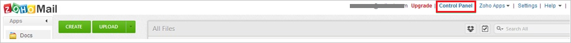
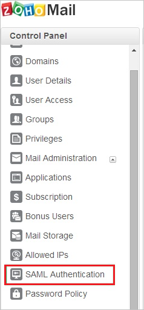
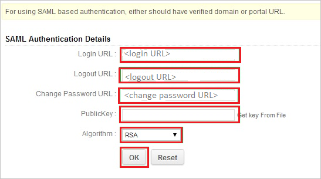
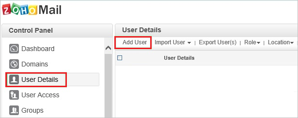
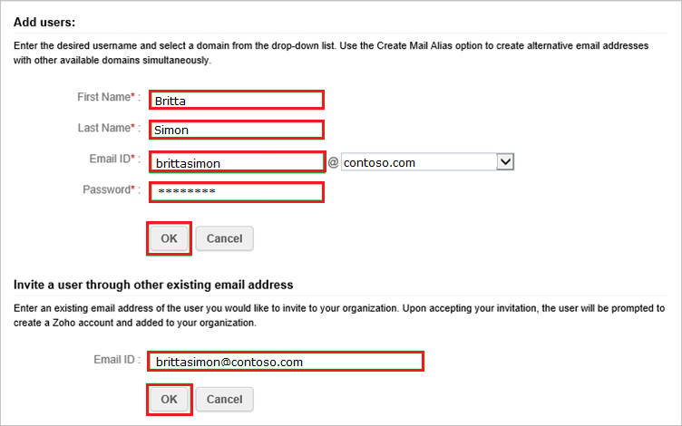

# Tutorial: Microsoft Entra integration with Zoho

In this tutorial, you'll learn how to integrate Zoho with Microsoft Entra ID. When you integrate Zoho with Microsoft Entra ID, you can:

* Control in Microsoft Entra ID who has access to Zoho.
* Enable your users to be automatically signed-in to Zoho with their Microsoft Entra accounts.
* Manage your accounts in one central location.

## Prerequisites

To configure Microsoft Entra integration with Zoho One, you need the following items:

* A Microsoft Entra subscription. If you don't have a Microsoft Entra environment, you can get a [free account](https://azure.microsoft.com/free/).
* Zoho single sign-on enabled subscription.

## Scenario description

In this tutorial, you configure and test Microsoft Entra single sign-on in a test environment.

* Zoho supports **SP** initiated SSO

## Add Zoho from the gallery

To configure the integration of Zoho into Microsoft Entra ID, you need to add Zoho from the gallery to your list of managed SaaS apps.

1. Sign in to the [Microsoft Entra admin center](https://entra.microsoft.com) as at least a [Cloud Application Administrator](../roles/permissions-reference.md#cloud-application-administrator).
1. Browse to **Identity** > **Applications** > **Enterprise applications** > **New application**.
1. In the **Add from the gallery** section, type **Zoho** in the search box.
1. Select **Zoho** from results panel and then add the app. Wait a few seconds while the app is added to your tenant.

 Alternatively, you can also use the [Enterprise App Configuration Wizard](https://portal.office.com/AdminPortal/home?Q=Docs#/azureadappintegration). In this wizard, you can add an application to your tenant, add users/groups to the app, assign roles, as well as walk through the SSO configuration as well. [Learn more about Microsoft 365 wizards.](/microsoft-365/admin/misc/azure-ad-setup-guides)

## Configure and test Microsoft Entra SSO for Zoho

Configure and test Microsoft Entra SSO with Zoho using a test user called **B.Simon**. For SSO to work, you need to establish a link relationship between a Microsoft Entra user and the related user in Zoho.

To configure and test Microsoft Entra SSO with Zoho, perform the following steps:

1. **[Configure Microsoft Entra SSO](#configure-azure-ad-sso)** - to enable your users to use this feature.
    1. **[Create a Microsoft Entra test user](#create-an-azure-ad-test-user)** - to test Microsoft Entra single sign-on with B.Simon.
    1. **[Assign the Microsoft Entra test user](#assign-the-azure-ad-test-user)** - to enable B.Simon to use Microsoft Entra single sign-on.
1. **[Configure Zoho SSO](#configure-zoho-sso)** - to configure the single sign-on settings on application side.
    1. **[Create Zoho test user](#create-zoho-test-user)** - to have a counterpart of B.Simon in Zoho that is linked to the Microsoft Entra representation of user.
1. **[Test SSO](#test-sso)** - to verify whether the configuration works.

### Configure Microsoft Entra SSO

Follow these steps to enable Microsoft Entra SSO.

1. Sign in to the [Microsoft Entra admin center](https://entra.microsoft.com) as at least a [Cloud Application Administrator](../roles/permissions-reference.md#cloud-application-administrator).
1. Browse to **Identity** > **Applications** > **Enterprise applications** > **Zoho** > **Single sign-on**.
1. On the **Select a single sign-on method** page, select **SAML**.
1. On the **Set up single sign-on with SAML** page, click the pencil icon for **Basic SAML Configuration** to edit the settings.

   

1. On the **Basic SAML Configuration** section, perform the following steps:

    In the **Sign-on URL** text box, type a URL using the following pattern:
    `https://<company name>.zohomail.com`

	> [!NOTE]
	> The value is not real. Update the value with the actual Sign-On URL. Contact [Zoho Client support team](https://www.zoho.com/mail/contact.html) to get the value. You can also refer to the patterns shown in the **Basic SAML Configuration** section.

1. On the **Set up Single Sign-On with SAML** page, in the **SAML Signing Certificate** section, click **Download** to download the **Certificate (Base64)** from the given options as per your requirement and save it on your computer.

	

1. On the **Set up Zoho** section, copy the appropriate URL(s) as per your requirement.

	

### Create a Microsoft Entra test user 

In this section, you'll create a test user called B.Simon.

1. Sign in to the [Microsoft Entra admin center](https://entra.microsoft.com) as at least a [User Administrator](../roles/permissions-reference.md#user-administrator).
1. Browse to **Identity** > **Users** > **All users**.
1. Select **New user** > **Create new user**, at the top of the screen.
1. In the **User** properties, follow these steps:
   1. In the **Display name** field, enter `B.Simon`.  
   1. In the **User principal name** field, enter the username@companydomain.extension. For example, `B.Simon@contoso.com`.
   1. Select the **Show password** check box, and then write down the value that's displayed in the **Password** box.
   1. Select **Review + create**.
1. Select **Create**.

### Assign the Microsoft Entra test user

In this section, you'll enable B.Simon to use single sign-on by granting access to Zoho.

1. Sign in to the [Microsoft Entra admin center](https://entra.microsoft.com) as at least a [Cloud Application Administrator](../roles/permissions-reference.md#cloud-application-administrator).
1. Browse to **Identity** > **Applications** > **Enterprise applications** > **Zoho**.
1. In the app's overview page, select **Users and groups**.
1. Select **Add user/group**, then select **Users and groups** in the **Add Assignment** dialog.
   1. In the **Users and groups** dialog, select **B.Simon** from the Users list, then click the **Select** button at the bottom of the screen.
   1. If you are expecting a role to be assigned to the users, you can select it from the **Select a role** dropdown. If no role has been set up for this app, you see "Default Access" role selected.
   1. In the **Add Assignment** dialog, click the **Assign** button.

### Configure Zoho SSO

1. In a different web browser window, log into your Zoho Mail company site as an administrator.

2. Go to the **Control panel**.
   
    

3. Click the **SAML Authentication** tab.
   
    

4. In the **SAML Authentication Details** section, perform the following steps:
   
    
   
    a. In the **Login URL** textbox, paste **Login URL**..
   
    b. In the **Logout URL** textbox, paste **Logout URL**..
   
    c. In the **Change Password URL** textbox, paste **Change Password URL**..
       
    d. Open your base-64 encoded certificate downloaded from Azure portal in notepad, copy the content of it into your clipboard, and then paste it to the **PublicKey** textbox.
   
    e. As **Algorithm**, select **RSA**.
   
    f. Click **OK**.

### Create Zoho test user

In order to enable Microsoft Entra users to log into Zoho Mail, they must be provisioned into Zoho Mail. In the case of Zoho Mail, provisioning is a manual task.

> [!NOTE]
> You can use any other Zoho Mail user account creation tools or APIs provided by Zoho Mail to provision Microsoft Entra user accounts.

### To provision a user account, perform the following steps:

1. Log in to your **Zoho Mail** company site as an administrator.

1. Go to **Control Panel** > **Mail & Docs**.

1. Go to **User Details** > **Add User**.
   
    

1. On the **Add users** dialog, perform the following steps:
   
    
   
    a. In the **First Name** textbox, type the first name of user like **Britta**.

    b. In the **Last Name** textbox, type the last name of user like **Simon**.

    c. In the **Email ID** textbox, type the email ID of user like **brittasimon\@contoso.com**.

    d. In the **Password** textbox, enter password of user.
   
    e. Click **OK**.  
      
    > [!NOTE]
    > The Microsoft Entra account holder will receive an email with a link to confirm the account before it becomes active.

### Test SSO 

In this section, you test your Microsoft Entra single sign-on configuration with following options. 

* Click on **Test this application**, this will redirect to Zoho Sign-on URL where you can initiate the login flow. 

* Go to Zoho Sign-on URL directly and initiate the login flow from there.

* You can use Microsoft My Apps. When you click the Zoho tile in the My Apps, you should be automatically signed in to the Zoho for which you set up the SSO. For more information about the My Apps, see [Introduction to the My Apps](https://support.microsoft.com/account-billing/sign-in-and-start-apps-from-the-my-apps-portal-2f3b1bae-0e5a-4a86-a33e-876fbd2a4510).

## Next steps

Once you configure Zoho you can enforce session control, which protects exfiltration and infiltration of your organization’s sensitive data in real time. Session control extends from Conditional Access. [Learn how to enforce session control with Microsoft Defender for Cloud Apps](/cloud-app-security/proxy-deployment-any-app).
