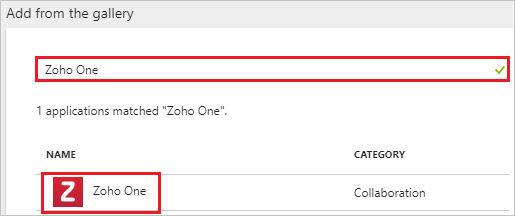
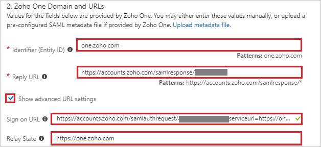
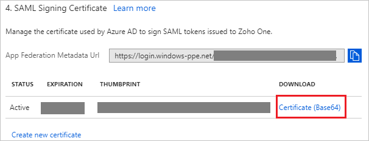
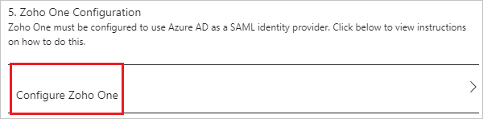
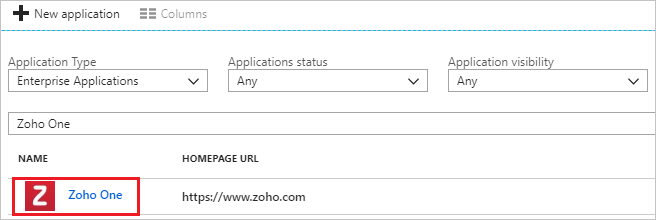

---
title: 'Tutorial: Azure Active Directory integration with Zoho One | Microsoft Docs'
description: Learn how to configure single sign-on between Azure Active Directory and Zoho One.
services: active-directory
documentationCenter: na
author: jeevansd
manager: femila
ms.reviewer: joflore

ms.assetid: bbc3038c-0d8b-45dd-9645-368bd3d01a0f
ms.service: active-directory
ms.component: saas-app-tutorial
ms.workload: identity
ms.tgt_pltfrm: na
ms.devlang: na
ms.topic: article
ms.date: 05/25/2018
ms.author: jeedes

---
# Tutorial: Azure Active Directory integration with Zoho One

In this tutorial, you learn how to integrate Zoho One with Azure Active Directory (Azure AD).

Integrating Zoho One with Azure AD provides you with the following benefits:

- You can control in Azure AD who has access to Zoho One.
- You can enable your users to automatically get signed-on to Zoho One (Single Sign-On) with their Azure AD accounts.
- You can manage your accounts in one central location - the Azure portal.

If you want to know more details about SaaS app integration with Azure AD, see [what is application access and single sign-on with Azure Active Directory](../manage-apps/what-is-single-sign-on.md).

## Prerequisites

To configure Azure AD integration with Zoho One, you need the following items:

- An Azure AD subscription
- A Zoho One single sign-on enabled subscription

> [!NOTE]
> To test the steps in this tutorial, we do not recommend using a production environment.

To test the steps in this tutorial, you should follow these recommendations:

- Do not use your production environment, unless it is necessary.
- If you don't have an Azure AD trial environment, you can [get a one-month trial](https://azure.microsoft.com/pricing/free-trial/).

## Scenario description
In this tutorial, you test Azure AD single sign-on in a test environment. 
The scenario outlined in this tutorial consists of two main building blocks:

1. Adding Zoho One from the gallery
1. Configuring and testing Azure AD single sign-on

## Adding Zoho One from the gallery
To configure the integration of Zoho One into Azure AD, you need to add Zoho One from the gallery to your list of managed SaaS apps.

**To add Zoho One from the gallery, perform the following steps:**

1. In the **[Azure portal](https://portal.azure.com)**, on the left navigation panel, click **Azure Active Directory** icon. 

	![The Azure Active Directory button][1]

1. Navigate to **Enterprise applications**. Then go to **All applications**.

	![The Enterprise applications blade][2]
	
1. To add new application, click **New application** button on the top of dialog.

	![The New application button][3]

1. In the search box, type **Zoho One**, select **Zoho One** from result panel then click **Add** button to add the application.

	

## Configure and test Azure AD single sign-on

In this section, you configure and test Azure AD single sign-on with Zoho One based on a test user called "Britta Simon".

For single sign-on to work, Azure AD needs to know what the counterpart user in Zoho One is to a user in Azure AD. In other words, a link relationship between an Azure AD user and the related user in Zoho One needs to be established.

To configure and test Azure AD single sign-on with Zoho One, you need to complete the following building blocks:

1. **[Configure Azure AD Single Sign-On](#configure-azure-ad-single-sign-on)** - to enable your users to use this feature.
1. **[Create an Azure AD test user](#create-an-azure-ad-test-user)** - to test Azure AD single sign-on with Britta Simon.
1. **[Create a Zoho One test user](#create-a-zoho-one-test-user)** - to have a counterpart of Britta Simon in Zoho One that is linked to the Azure AD representation of user.
1. **[Assign the Azure AD test user](#assign-the-azure-ad-test-user)** - to enable Britta Simon to use Azure AD single sign-on.
1. **[Test single sign-on](#test-single-sign-on)** - to verify whether the configuration works.

### Configure Azure AD single sign-on

In this section, you enable Azure AD single sign-on in the Azure portal and configure single sign-on in your Zoho One application.

**To configure Azure AD single sign-on with Zoho One, perform the following steps:**

1. In the Azure portal, on the **Zoho One** application integration page, click **Single sign-on**.

	![Configure single sign-on link][4]

1. On the **Single sign-on** dialog, select **Mode** as	**SAML-based Sign-on** to enable single sign-on.
 
	

1. On the **Zoho One Domain and URLs** section, perform the following steps if you wish to configure the application in **IDP** initiated mode:

	

    a. In the **Identifier (Entity ID)** textbox, type a URL: `one.zoho.com`

	b. In the **Reply URL** textbox, type a URL using the following pattern: `https://accounts.zoho.com/samlresponse/<saml-identifier>`

	c. Check **Show advanced URL settings**.

	d. In the **Relay State** textbox, type a URL:`https://one.zoho.com`

1. If you wish to configure the application in **SP** initiated mode perform the following step:

    In the **Sign-on URL** textbox, type a URL using the following pattern: `https://accounts.zoho.com/samlauthrequest/<domain_name>?serviceurl=https://one.zoho.com`
	 
	> [!NOTE] 
	> The preceding **Reply URL** and **Sign-on URL** value is not real. You will update the value with the actual Reply URL and Sign-On URL which is explained later in the tutorial. 

1. On the **SAML Signing Certificate** section, click **Certificate (Base64)** and then save the certificate file on your computer.

	 

1. Click **Save** button.

	
	
1. On the **Zoho One Configuration** section, click **Configure Zoho One** to open **Configure sign-on** window. Copy the **Sign-Out URL and SAML Single Sign-On Service URL** from the **Quick Reference section.**

	 

1. In a different web browser window, log in to your Zoho One company site as an administrator.

1. On the **Organization** tab, Click **Setup** under **SAML Authentication**.

	

1. On the Pop-up page perform the following steps:

	

	a. In the **Sign-in URL** textbox, paste the value of **SAML Single Sign-On Service URL**, which you have copied from Azure portal.

	b. In the **Sign-out URL** textbox, paste the value of **Sign-Out URL**, which you have copied from Azure portal.

	c. Click **Browse** to upload the **Certificate (Base64)** which you have downloaded from Azure portal.

	d. Click **Save**.

1. After saving the SAML Authentication setup, copy the **SAML-Identfier** value and use this value in the **Reply URL** in the Azure portal, under **Zoho One Domain and URLs** section.

	

1. Go to the **Domains** tab and then click **Add Domain**.

	

1. On the **Add Domain** page, perform the following steps:

	

	a. In the **Domain Name** textbox, type domain like **contoso.com**.

	b. Click **Add**.

	>[!Note]
	>After adding the domain follow [these](https://www.zoho.com/one/help/admin-guide/domain-verification.html) steps to verify your domain. Once the domain is verfified, use your domain name in **Sign-on URL** in **Zoho One Domain and URLs** section in Azure portal.

### Create an Azure AD test user

The objective of this section is to create a test user in the Azure portal called Britta Simon.

   ![Create an Azure AD test user][100]

**To create a test user in Azure AD, perform the following steps:**

1. In the Azure portal, in the left pane, click the **Azure Active Directory** button.

    

1. To display the list of users, go to **Users and groups**, and then click **All users**.

    

1. To open the **User** dialog box, click **Add** at the top of the **All Users** dialog box.

    

1. In the **User** dialog box, perform the following steps:

    

    a. In the **Name** box, type **BrittaSimon**.

    b. In the **User name** box, type the email address of user Britta Simon.

    c. Select the **Show Password** check box, and then write down the value that's displayed in the **Password** box.

    d. Click **Create**.
 
### Create a Zoho One test user

To enable Azure AD users to log in to Zoho One, they must be provisioned into Zoho One. In Zoho One, provisioning is a manual task.

**To provision a user account, perform the following steps:**

1. Log in to Zoho One as a Security Administrator.

1. On the **Users** tab, Click on **user logo**.

	

1. On the **Add User** page, perform the following steps:

	
	
	a. In **Name** text box, enter the name of user like **Britta simon**.
	
	b. In **Email Address** text box, enter the email of user like **brittasimon@contoso.com**.

	>[!Note]
	>Select your verified domain from the domain list.

	c. Click **Add**.

### Assign the Azure AD test user

In this section, you enable Britta Simon to use Azure single sign-on by granting access to Zoho One.

![Assign the user role][200] 

**To assign Britta Simon to Zoho One, perform the following steps:**

1. In the Azure portal, open the applications view, and then navigate to the directory view and go to **Enterprise applications** then click **All applications**.

	![Assign User][201] 

1. In the applications list, select **Zoho One**.

	  

1. In the menu on the left, click **Users and groups**.

	![The "Users and groups" link][202]

1. Click **Add** button. Then select **Users and groups** on **Add Assignment** dialog.

	![The Add Assignment pane][203]

1. On **Users and groups** dialog, select **Britta Simon** in the Users list.

1. Click **Select** button on **Users and groups** dialog.

1. Click **Assign** button on **Add Assignment** dialog.
	
### Test single sign-on

In this section, you test your Azure AD single sign-on configuration using the Access Panel.

When you click the Zoho One tile in the Access Panel, you should get automatically signed-on to your Zoho One application.
For more information about the Access Panel, see [Introduction to the Access Panel](../user-help/active-directory-saas-access-panel-introduction.md). 

## Additional resources

* [List of Tutorials on How to Integrate SaaS Apps with Azure Active Directory](tutorial-list.md)
* [What is application access and single sign-on with Azure Active Directory?](../manage-apps/what-is-single-sign-on.md)

<!--Image references-->

[1]: ./media/zohoone-tutorial/tutorial_general_01.png
[2]: ./media/zohoone-tutorial/tutorial_general_02.png
[3]: ./media/zohoone-tutorial/tutorial_general_03.png
[4]: ./media/zohoone-tutorial/tutorial_general_04.png

[100]: ./media/zohoone-tutorial/tutorial_general_100.png

[200]: ./media/zohoone-tutorial/tutorial_general_200.png
[201]: ./media/zohoone-tutorial/tutorial_general_201.png
[202]: ./media/zohoone-tutorial/tutorial_general_202.png
[203]: ./media/zohoone-tutorial/tutorial_general_203.png

