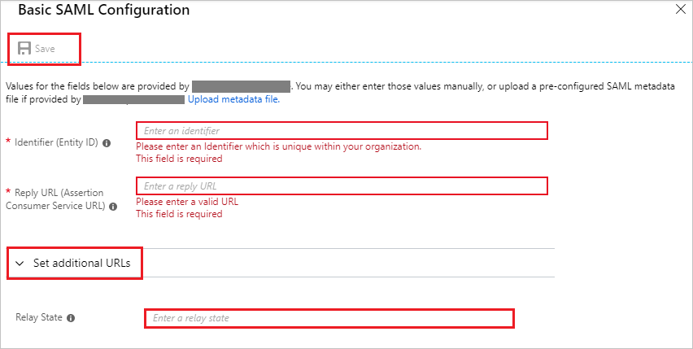
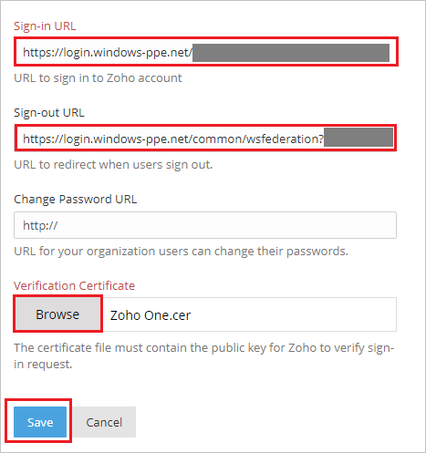
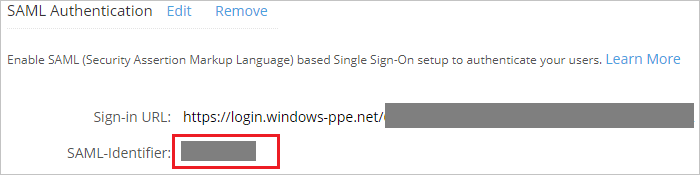
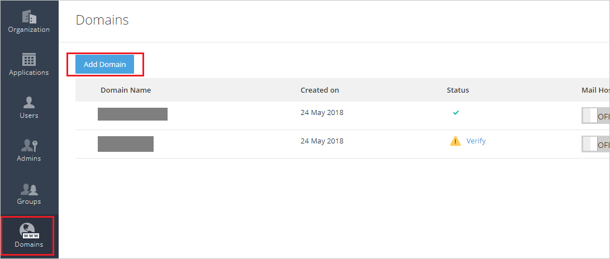
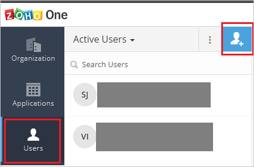

# Tutorial: Azure Active Directory integration with Zoho One

In this tutorial, you learn how to integrate Zoho One with Azure Active Directory (Azure AD).
Integrating Zoho One with Azure AD provides you with the following benefits:

* You can control in Azure AD who has access to Zoho One.
* You can enable your users to be automatically signed-in to Zoho One (Single Sign-On) with their Azure AD accounts.
* You can manage your accounts in one central location - the Azure portal.

If you want to know more details about SaaS app integration with Azure AD, see [What is application access and single sign-on with Azure Active Directory](https://docs.microsoft.com/azure/active-directory/active-directory-appssoaccess-whatis).
If you don't have an Azure subscription, [create a free account](https://azure.microsoft.com/free/) before you begin.

## Prerequisites

To configure Azure AD integration with Zoho One, you need the following items:

* An Azure AD subscription. If you don't have an Azure AD environment, you can get a [free account](https://azure.microsoft.com/free/)
* Zoho One single sign-on enabled subscription

## Scenario description

In this tutorial, you configure and test Azure AD single sign-on in a test environment.

* Zoho One supports **SP** and **IDP** initiated SSO

## Adding Zoho One from the gallery

To configure the integration of Zoho One into Azure AD, you need to add Zoho One from the gallery to your list of managed SaaS apps.

**To add Zoho One from the gallery, perform the following steps:**

1. In the **[Azure portal](https://portal.azure.com)**, on the left navigation panel, click **Azure Active Directory** icon.

	

2. Navigate to **Enterprise Applications** and then select the **All Applications** option.

	

3. To add new application, click **New application** button on the top of dialog.

	

4. In the search box, type **Zoho One**, select **Zoho One** from result panel then click **Add** button to add the application.

	 

## Configure and test Azure AD single sign-on

In this section, you configure and test Azure AD single sign-on with Zoho One based on a test user called **Britta Simon**.
For single sign-on to work, a link relationship between an Azure AD user and the related user in Zoho One needs to be established.

To configure and test Azure AD single sign-on with Zoho One, you need to complete the following building blocks:

1. **[Configure Azure AD Single Sign-On](#configure-azure-ad-single-sign-on)** - to enable your users to use this feature.
2. **[Configure Zoho One Single Sign-On](#configure-zoho-one-single-sign-on)** - to configure the Single Sign-On settings on application side.
3. **[Create an Azure AD test user](#create-an-azure-ad-test-user)** - to test Azure AD single sign-on with Britta Simon.
4. **[Assign the Azure AD test user](#assign-the-azure-ad-test-user)** - to enable Britta Simon to use Azure AD single sign-on.
5. **[Create Zoho One test user](#create-zoho-one-test-user)** - to have a counterpart of Britta Simon in Zoho One that is linked to the Azure AD representation of user.
6. **[Test single sign-on](#test-single-sign-on)** - to verify whether the configuration works.

### Configure Azure AD single sign-on

In this section, you enable Azure AD single sign-on in the Azure portal.

To configure Azure AD single sign-on with Zoho One, perform the following steps:

1. In the [Azure portal](https://portal.azure.com/), on the **Zoho One** application integration page, select **Single sign-on**.

    

2. On the **Select a Single sign-on method** dialog, select **SAML/WS-Fed** mode to enable single sign-on.

    

3. On the **Set up Single Sign-On with SAML** page, click **Edit** icon to open **Basic SAML Configuration** dialog.

	

4. On the **Basic SAML Configuration** section, if you wish to configure the application in **IDP** initiated mode, perform the following steps:

    

    a. In the **Identifier** text box, type a URL:
    `one.zoho.com`

    b. In the **Reply URL** text box, type a URL using the following pattern:
    `https://accounts.zoho.com/samlresponse/<saml-identifier>`

	> [!NOTE]
	> The preceding **Reply URL** value is not real. You will get the `<saml-identifier>` value from #step4 of **Configure Zoho One Single Sign-On** section , which is explained later in the tutorial.

	c. Click **Set additional URLs**.

	d. In the **Relay State** text box, type a URL:
    `https://one.zoho.com`

5. If you wish to configure the application in **SP** initiated mode, perform the following step:

    

    In the **Sign-on URL** text box, type a URL using the following pattern:
    `https://accounts.zoho.com/samlauthrequest/<domain_name>?serviceurl=https://one.zoho.com` 

    > [!NOTE] 
	> The preceding **Sign-on URL** value is not real. You will update the value with the actual Sign-On URL from the **Configure Zoho One Single Sign-On** section, which is explained later in the tutorial. 

6. On the **Set up Single Sign-On with SAML** page, in the **SAML Signing Certificate** section, click **Download** to download the **Certificate (Base64)** from the given options as per your requirement and save it on your computer.

	

7. On the **Set up Zoho One** section, copy the appropriate URL(s) as per your requirement.

	

	a. Login URL

	b. Azure AD Identifier

	c. Logout URL

### Configure Zoho One Single Sign-On

1. In a different web browser window, sign in to your Zoho One company site as an administrator.

2. On the **Organization** tab, Click **Setup** under **SAML Authentication**.

	

3. On the Pop-up page perform the following steps:

	

	a. In the **Sign-in URL** textbox, paste the value of **Login URL**, which you have copied from Azure portal.

	b. In the **Sign-out URL** textbox, paste the value of **Logout URL**, which you have copied from Azure portal.

	c. Click **Browse** to upload the **Certificate (Base64)** which you have downloaded from Azure portal.

	d. Click **Save**.

4. After saving the SAML Authentication setup, copy the **SAML-Identifier** value and append it with the **Reply URL** in place of `<saml-identifier>`, like `https://accounts.zoho.com/samlresponse/one.zoho.com` and paste the generated value in the **Reply URL** textbox under **Basic SAML Configuration** section.

	

5. Go to the **Domains** tab and then click **Add Domain**.

	

6. On the **Add Domain** page, perform the following steps:

	

	a. In the **Domain Name** textbox, type domain like contoso.com.

	b. Click **Add**.

	>[!Note]
	>After adding the domain follow [these](https://www.zoho.com/one/help/admin-guide/domain-verification.html) steps to verify your domain. Once the domain is verified, use your domain name in **Sign-on URL** in **Basic SAML Configuration** section in Azure portal.

### Create an Azure AD test user 

The objective of this section is to create a test user in the Azure portal called Britta Simon.

1. In the Azure portal, in the left pane, select **Azure Active Directory**, select **Users**, and then select **All users**.

    

2. Select **New user** at the top of the screen.

    

3. In the User properties, perform the following steps.

    

    a. In the **Name** field enter **BrittaSimon**.
  
    b. In the **User name** field type `brittasimon@yourcompanydomain.extension`. For example, BrittaSimon@contoso.com

    c. Select **Show password** check box, and then write down the value that's displayed in the Password box.

    d. Click **Create**.

### Assign the Azure AD test user

In this section, you enable Britta Simon to use Azure single sign-on by granting access to Zoho One.

1. In the Azure portal, select **Enterprise Applications**, select **All applications**, then select **Zoho One**.

	

2. In the applications list, select **Zoho One**.

	

3. In the menu on the left, select **Users and groups**.

    

4. Click the **Add user** button, then select **Users and groups** in the **Add Assignment** dialog.

    

5. In the **Users and groups** dialog select **Britta Simon** in the Users list, then click the **Select** button at the bottom of the screen.

6. If you are expecting any role value in the SAML assertion then in the **Select Role** dialog select the appropriate role for the user from the list, then click the **Select** button at the bottom of the screen.

7. In the **Add Assignment** dialog click the **Assign** button.

### Create Zoho One test user

To enable Azure AD users to sign in to Zoho One, they must be provisioned into Zoho One. In Zoho One, provisioning is a manual task.

**To provision a user account, perform the following steps:**

1. Sign in to Zoho One as a Security Administrator.

2. On the **Users** tab, Click on **user logo**.

	

3. On the **Add User** page, perform the following steps:

	
	
	a. In **Name** text box, enter the name of user like **Britta simon**.
	
	b. In **Email Address** text box, enter the email of user like brittasimon@contoso.com.

	>[!Note]
	>Select your verified domain from the domain list.

	c. Click **Add**.

### Test single sign-on 

In this section, you test your Azure AD single sign-on configuration using the Access Panel.

When you click the Zoho One tile in the Access Panel, you should be automatically signed in to the Zoho One for which you set up SSO. For more information about the Access Panel, see [Introduction to the Access Panel](https://docs.microsoft.com/azure/active-directory/active-directory-saas-access-panel-introduction).

## Additional Resources

- [List of Tutorials on How to Integrate SaaS Apps with Azure Active Directory](https://docs.microsoft.com/azure/active-directory/active-directory-saas-tutorial-list)

- [What is application access and single sign-on with Azure Active Directory?](https://docs.microsoft.com/azure/active-directory/active-directory-appssoaccess-whatis)

- [What is Conditional Access in Azure Active Directory?](https://docs.microsoft.com/azure/active-directory/conditional-access/overview)

