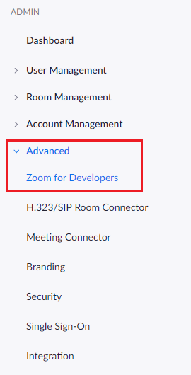
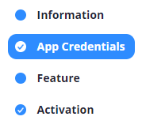
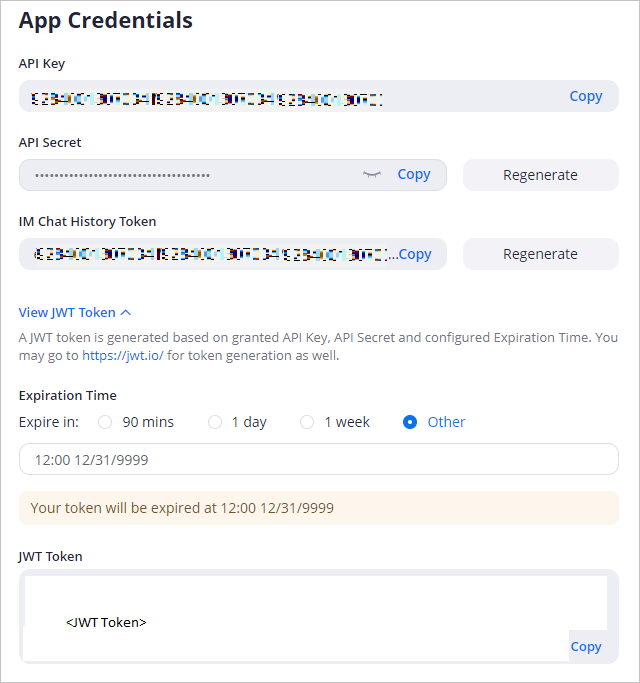
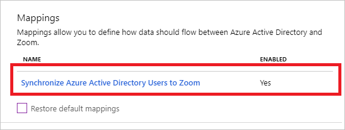
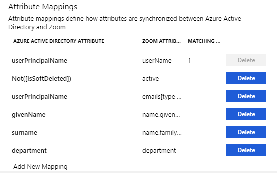

# Tutorial: Configure Zoom for automatic user provisioning

The objective of this tutorial is to demonstrate the steps to be performed in Zoom and Azure Active Directory (Azure AD) to configure Azure AD to automatically provision and de-provision users and/or groups to Zoom.

> [!NOTE]
> This tutorial describes a connector built on top of the Azure AD User Provisioning Service. For important details on what this service does, how it works, and frequently asked questions, see [Automate user provisioning and deprovisioning to SaaS applications with Azure Active Directory](../manage-apps/user-provisioning.md).
>
> This connector is currently in Public Preview. For more information on the general Microsoft Azure terms of use for Preview features, see [Supplemental Terms of Use for Microsoft Azure Previews](https://azure.microsoft.com/support/legal/preview-supplemental-terms/).

## Prerequisites

The scenario outlined in this tutorial assumes that you already have the following prerequisites:

* An Azure AD tenant
* [A Zoom tenant](https://zoom.us/pricing)
* A user account in Zoom with Admin permissions

## Add Zoom from the gallery

Before configuring Zoom for automatic user provisioning with Azure AD, you need to add Zoom from the Azure AD application gallery to your list of managed SaaS applications.

**To add Zoom from the Azure AD application gallery, perform the following steps:**

1. In the **[Azure portal](https://portal.azure.com)**, in the left navigation panel, select **Azure Active Directory**.

	

2. Go to **Enterprise applications**, and then select **All applications**.

	

3. To add a new application, select the **New application** button at the top of the pane.

	

4. In the search box, enter **Zoom**, select **Zoom** in the results panel, and then click the **Add** button to add the application.

	

## Assign users to Zoom

Azure Active Directory uses a concept called *assignments* to determine which users should receive access to selected apps. In the context of automatic user provisioning, only the users and/or groups that have been assigned to an application in Azure AD are synchronized.

Before configuring and enabling automatic user provisioning, you should decide which users and/or groups in Azure AD need access to Zoom. Once decided, you can assign these users and/or groups to Zoom by following the instructions here:

* [Assign a user or group to an enterprise app](../manage-apps/assign-user-or-group-access-portal.md)

### Important tips for assigning users to Zoom

* It is recommended that a single Azure AD user is assigned to Zoom to test the automatic user provisioning configuration. Additional users and/or groups may be assigned later.

* When assigning a user to Zoom, you must select any valid application-specific role (if available) in the assignment dialog. Users with the **Default Access** role are excluded from provisioning.

## Configure automatic user provisioning to Zoom 

This section guides you through the steps to configure the Azure AD provisioning service to create, update, and disable users or groups in Zoom based on user and/or group assignments in Azure AD.

> [!TIP]
> You may also choose to enable SAML-based single sign-on for Zoom, following the instructions provided in the [Zoom single sign-on tutorial](zoom-tutorial.md). Single sign-on can be configured independently of automatic user provisioning, though these two features compliment each other.

### Configure automatic user provisioning for Zoom in Azure AD

1. Sign in to the [Azure portal](https://portal.azure.com). Select **Enterprise Applications**, then select **All applications**.

	

2. In the applications list, select **Zoom**.

	

3. Select the **Provisioning** tab.

	

4. Set the **Provisioning Mode** to **Automatic**.

	

5. Under the **Admin Credentials** section, enter `https://api.zoom.us/scim` in **Tenant URL**. To retrieve the **Secret Token** of your Zoom account, follow the walkthrough as described in Step 6.

6. Sign in to your [Zoom Admin Console](https://zoom.us/signin). Navigate to **Advanced > Zoom for Developers** in the left navigation pane.

	

	Navigate to **Manage** in the top-right corner of the page. 

	

	Navigate to your created Azure AD app. 
	
	

	Select **App Credentials** in the left navigation pane.

	

	Retrieve the JWT Token value shown below and input this into the **Secret Token** field in Azure AD. If you need a new non-expiring token, you will need to reconfigure the expiration time which will auto generate a new token. 

	

7. Upon populating the fields shown in Step 5, click **Test Connection** to ensure Azure AD can connect to Zoom. If the connection fails, ensure your Zoom account has Admin permissions and try again.

	

8. In the **Notification Email** field, enter the email address of a person or group who should receive the provisioning error notifications and check the checkbox - **Send an email notification when a failure occurs**.

	

9. Click **Save**.

10. Under the **Mappings** section, select **Synchronize Azure Active Directory Users to Zoom**.

	

11. Review the user attributes that are synchronized from Azure AD to Zoom in the **Attribute Mapping** section. The attributes selected as **Matching** properties are used to match the user accounts in Zoom for update operations. Select the **Save** button to commit any changes.
 	
	 

12. To configure scoping filters, refer to the following instructions provided in the [Scoping filter tutorial](../manage-apps/define-conditional-rules-for-provisioning-user-accounts.md).

13. To enable the Azure AD provisioning service for Zoom, change the **Provisioning Status** to **On** in the **Settings** section.
	
	

14. Define the users and/or groups that you would like to provision to Zoom by choosing the desired values in **Scope** in the **Settings** section.

	

15. When you are ready to provision, click **Save**.

	

This operation starts the initial synchronization of all users and/or groups defined in **Scope** in the **Settings** section. The initial sync takes longer to perform than subsequent syncs, which occur approximately every 40 minutes as long as the Azure AD provisioning service is running. You can use the **Synchronization Details** section to monitor progress and follow links to provisioning activity report, which describes all actions performed by the Azure AD provisioning service on Zoom.

For more information on how to read the Azure AD provisioning logs, see [Reporting on automatic user account provisioning](../manage-apps/check-status-user-account-provisioning.md).

## Connector limitations

* Zoom does not support provisioning for groups.

## Additional resources

* [Managing user account provisioning for Enterprise Apps](../manage-apps/configure-automatic-user-provisioning-portal.md)
* [What is application access and single sign-on with Azure Active Directory?](../manage-apps/what-is-single-sign-on.md)

## Next steps

* [Learn how to review logs and get reports on provisioning activity](../manage-apps/check-status-user-account-provisioning.md)
