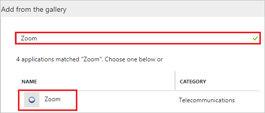
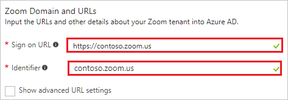
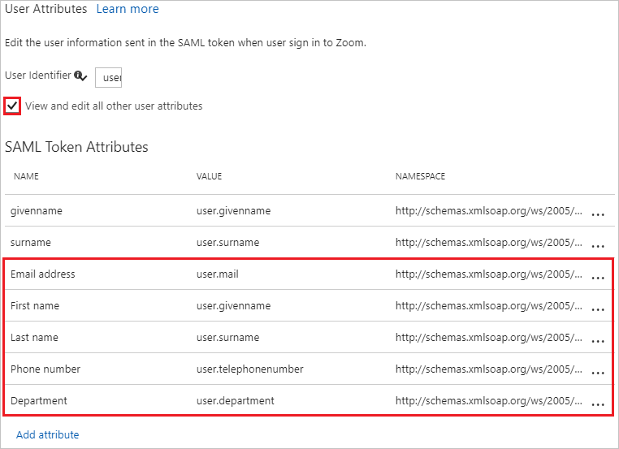
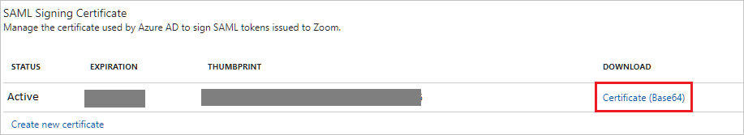
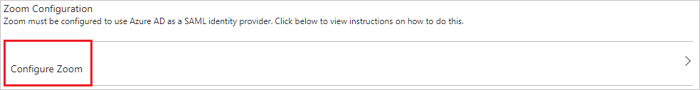

# Tutorial: Azure Active Directory integration with Zoom

In this tutorial, you learn how to integrate Zoom with Azure Active Directory (Azure AD).

Integrating Zoom with Azure AD provides you with the following benefits:

- You can control in Azure AD who has access to Zoom.
- You can enable your users to automatically get signed-on to Zoom (Single Sign-On) with their Azure AD accounts.
- You can manage your accounts in one central location - the Azure portal.

If you want to know more details about SaaS app integration with Azure AD, see [what is application access and single sign-on with Azure Active Directory](../manage-apps/what-is-single-sign-on.md).

## Prerequisites

To configure Azure AD integration with Zoom, you need the following items:

- An Azure AD subscription
- A Zoom single sign-on enabled subscription

> [!NOTE]
> To test the steps in this tutorial, we do not recommend using a production environment.

To test the steps in this tutorial, you should follow these recommendations:

- Do not use your production environment, unless it is necessary.
- If you don't have an Azure AD trial environment, you can [get a one-month trial](https://azure.microsoft.com/pricing/free-trial/).

## Scenario description
In this tutorial, you test Azure AD single sign-on in a test environment. 
The scenario outlined in this tutorial consists of two main building blocks:

1. Adding Zoom from the gallery
1. Configuring and testing Azure AD single sign-on

## Adding Zoom from the gallery
To configure the integration of Zoom into Azure AD, you need to add Zoom from the gallery to your list of managed SaaS apps.

**To add Zoom from the gallery, perform the following steps:**

1. In the **[Azure portal](https://portal.azure.com)**, on the left navigation panel, click **Azure Active Directory** icon. 

	![The Azure Active Directory button][1]

1. Navigate to **Enterprise applications**. Then go to **All applications**.

	![The Enterprise applications blade][2]
	
1. To add new application, click **New application** button on the top of dialog.

	![The New application button][3]

1. In the search box, type **Zoom**, select **Zoom** from result panel then click **Add** button to add the application.

	

## Configure and test Azure AD single sign-on

In this section, you configure and test Azure AD single sign-on with Zoom based on a test user called "Britta Simon".

For single sign-on to work, Azure AD needs to know what the counterpart user in Zoom is to a user in Azure AD. In other words, a link relationship between an Azure AD user and the related user in Zoom needs to be established.

In Zoom, assign the value of the **user name** in Azure AD as the value of the **Username** to establish the link relationship.

To configure and test Azure AD single sign-on with Zoom, you need to complete the following building blocks:

1. **[Configure Azure AD Single Sign-On](#configure-azure-ad-single-sign-on)** - to enable your users to use this feature.
1. **[Create an Azure AD test user](#create-an-azure-ad-test-user)** - to test Azure AD single sign-on with Britta Simon.
1. **[Create a Zoom test user](#create-a-zoom-test-user)** - to have a counterpart of Britta Simon in Zoom that is linked to the Azure AD representation of user.
1. **[Assign the Azure AD test user](#assign-the-azure-ad-test-user)** - to enable Britta Simon to use Azure AD single sign-on.
1. **[Test single sign-on](#test-single-sign-on)** - to verify whether the configuration works.

### Configure Azure AD single sign-on

In this section, you enable Azure AD single sign-on in the Azure portal and configure single sign-on in your Zoom application.

**To configure Azure AD single sign-on with Zoom, perform the following steps:**

1. In the Azure portal, on the **Zoom** application integration page, click **Single sign-on**.

	![Configure single sign-on link][4]

1. On the **Single sign-on** dialog, select **Mode** as	**SAML-based Sign-on** to enable single sign-on.
 
	

1. On the **Zoom Domain and URLs** section, perform the following steps:

	

    a. In the **Sign-on URL** textbox, type a URL using the following pattern: `https://<companyname>.zoom.us`

	b. In the **Identifier** textbox, type a URL using the following pattern: `<companyname>.zoom.us`

	> [!NOTE] 
	> These values are not real. Update these values with the actual Sign-On URL and Identifier. Contact [Zoom Client support team](https://support.zoom.us/hc) to get these values.

1. The Zoom application expects the SAML assertions in a specific format, which requires you to add custom attribute mappings to your SAML token attributes configuration. Configure the following claims for this application. You can manage the values of these attributes from the "**User Attributes**" section on application integration page. 

	

1. In the **User Attributes** section on the **Single sign-on** dialog, configure SAML token attribute as shown in the preceding image and perform the following steps:
	
	| Attribute Name | Attribute Value | Namespace Value |
	| ------------------- | -----------|--------- |    
	| Email address | user.mail | `http://schemas.xmlsoap.org/ws/2005/05/identity/claims/mail`|
    | First name | user.givenname | `http://schemas.xmlsoap.org/ws/2005/05/identity/claims/givenname`|
    | Last name | user.surname | `http://schemas.xmlsoap.org/ws/2005/05/identity/claims/surname `|
    | Phone number | user.telephonenumber | `http://schemas.xmlsoap.org/ws/2005/05/identity/claims/phone`|
    | Department | user.department | `http://schemas.xmlsoap.org/ws/2005/05/identity/claims/department`|

	a. Click **Add attribute** to open the **Add Attribute** dialog.

	

	

    b. In the **Name** textbox, type the attribute name shown for that row.

	c. From the **Value** list, type the attribute value shown for that row.

    d. In the **Namespace** textbox, type the namespace value shown for that row.
	
	e. Click **Ok**. 
 
1. On the **SAML Signing Certificate** section, click **Certificate (Base64)** and then save the certificate file on your computer.

	

1. Click **Save** button.

	

1. On the **Zoom Configuration** section, click **Configure Zoom** to open **Configure sign-on** window. Copy the **Sign-Out URL, SAML Entity ID, and SAML Single Sign-On Service URL** from the **Quick Reference section.**

	

1. In a different web browser window, log in to your Zoom company site as an administrator.

1. Click the **Single Sign-On** tab.
   
    

1. Click the **Security Control** tab, and then go to the **Single Sign-On** settings.

1. In the Single Sign-On section, perform the following steps:
   
    
   
    a. In the **Sign-in page URL** textbox, paste the value of **SAML Single Sign-On Service URL** which you have copied from Azure portal.
   
    b. In the **Sign-out page URL** textbox, paste the value of **Sign-Out URL** which you have copied from Azure portal.
     
    c. Open your base-64 encoded certificate in notepad, copy the content of it into your clipboard, and then paste it to the **Identity provider certificate** textbox.

    d. In the **Issuer** textbox, paste the value of **SAML Entity ID** which you have copied from Azure portal. 

    e. Click **Save**.

    > [!NOTE] 
	> For more information, visit the zoom documentation [https://zoomus.zendesk.com/hc/en-us/articles/115005887566](https://zoomus.zendesk.com/hc/en-us/articles/115005887566)

> [!TIP]
> You can now read a concise version of these instructions inside the [Azure portal](https://portal.azure.com), while you are setting up the app!  After adding this app from the **Active Directory > Enterprise Applications** section, simply click the **Single Sign-On** tab and access the embedded documentation through the **Configuration** section at the bottom. You can read more about the embedded documentation feature here: [Azure AD embedded documentation]( https://go.microsoft.com/fwlink/?linkid=845985)
> 

### Create an Azure AD test user

The objective of this section is to create a test user in the Azure portal called Britta Simon.

   ![Create an Azure AD test user][100]

**To create a test user in Azure AD, perform the following steps:**

1. In the Azure portal, in the left pane, click the **Azure Active Directory** button.

    

1. To display the list of users, go to **Users and groups**, and then click **All users**.

    

1. To open the **User** dialog box, click **Add** at the top of the **All Users** dialog box.

    

1. In the **User** dialog box, perform the following steps:

    

    a. In the **Name** box, type **BrittaSimon**.

    b. In the **User name** box, type the email address of user Britta Simon.

    c. Select the **Show Password** check box, and then write down the value that's displayed in the **Password** box.

    d. Click **Create**.
 
### Create a Zoom test user

In order to enable Azure AD users to log in to Zoom, they must be provisioned into Zoom. In the case of Zoom, provisioning is a manual task.

### To provision a user account, perform the following steps:

1. Log in to your **Zoom** company site as an administrator.
 
1. Click the **Account Management** tab, and then click **User Management**.

1. In the User Management section, click **Add users**.
   
    

1. On the **Add users** page, perform the following steps:
   
    
   
    a. As **User Type**, select **Basic**.

    b. In the **Emails** textbox, type the email address of a valid Azure AD account you want to provision.

    c. Click **Add**.

> [!NOTE]
> You can use any other Zoom user account creation tools or APIs provided by Zoom to provision Azure Active Directory user accounts.

### Assign the Azure AD test user

In this section, you enable Britta Simon to use Azure single sign-on by granting access to Zoom.

![Assign the user role][200] 

**To assign Britta Simon to Zoom, perform the following steps:**

1. In the Azure portal, open the applications view, and then navigate to the directory view and go to **Enterprise applications** then click **All applications**.

	![Assign User][201] 

1. In the applications list, select **Zoom**.

	  

1. In the menu on the left, click **Users and groups**.

	![The "Users and groups" link][202]

1. Click **Add** button. Then select **Users and groups** on **Add Assignment** dialog.

	![The Add Assignment pane][203]

1. On **Users and groups** dialog, select **Britta Simon** in the Users list.

1. Click **Select** button on **Users and groups** dialog.

1. Click **Assign** button on **Add Assignment** dialog.
	
### Test single sign-on

The objective of this section is to test your Azure AD single sign-on configuration using the Access Panel.

When you click the Zoom tile in the Access Panel, you should get automatically signed-on to your Zoom application.

## Additional resources

* [List of Tutorials on How to Integrate SaaS Apps with Azure Active Directory](tutorial-list.md)
* [What is application access and single sign-on with Azure Active Directory?](../manage-apps/what-is-single-sign-on.md)

<!--Image references-->

[1]: ./media/zoom-tutorial/tutorial_general_01.png
[2]: ./media/zoom-tutorial/tutorial_general_02.png
[3]: ./media/zoom-tutorial/tutorial_general_03.png
[4]: ./media/zoom-tutorial/tutorial_general_04.png

[100]: ./media/zoom-tutorial/tutorial_general_100.png

[200]: ./media/zoom-tutorial/tutorial_general_200.png
[201]: ./media/zoom-tutorial/tutorial_general_201.png
[202]: ./media/zoom-tutorial/tutorial_general_202.png
[203]: ./media/zoom-tutorial/tutorial_general_203.png

