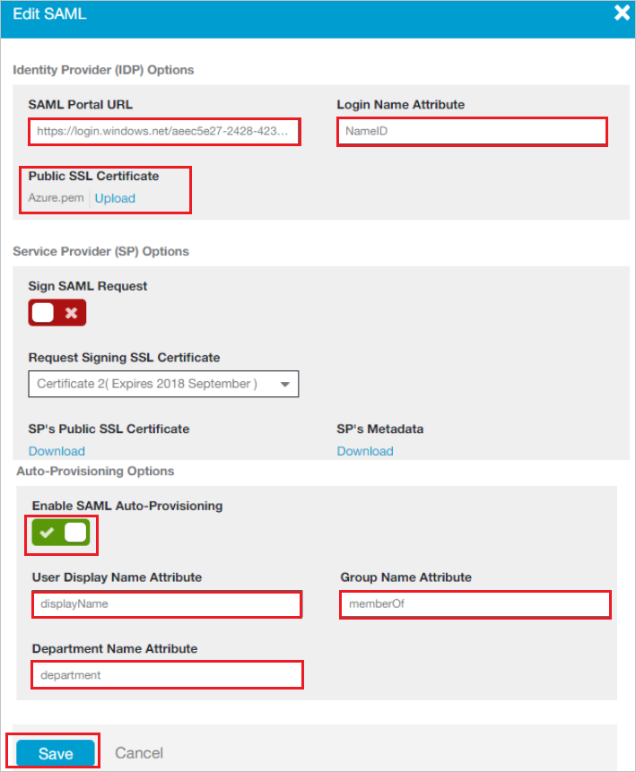

# Tutorial: Microsoft Entra integration with Zscaler Beta

In this tutorial, you learn how to integrate Zscaler Beta with Microsoft Entra ID.
When you integrate Zscaler Beta with Microsoft Entra ID, you can:

* Control in Microsoft Entra ID who has access to Zscaler Beta.
* Allow your users to be automatically signed in to Zscaler Beta with their Microsoft Entra accounts. This access control is called single sign-on (SSO).
* Manage your accounts in one central location by using the Azure portal.

## Prerequisites

To configure Microsoft Entra integration with Zscaler Beta, you need the following items:

* A Microsoft Entra subscription. If you don't have a Microsoft Entra environment, you can get a [free account](https://azure.microsoft.com/free/).
* A Zscaler Beta subscription that uses single sign-on.

## Scenario description

In this tutorial, you configure and test Microsoft Entra single sign-on in a test environment.

* Zscaler Beta supports **SP** initiated SSO.
* Zscaler Beta supports **Just In Time** user provisioning.
* Zscaler Beta supports [Automated user provisioning](zscaler-beta-provisioning-tutorial.md).

## Adding Zscaler Beta from the gallery

To configure the integration of Zscaler Beta into Microsoft Entra ID, you need to add Zscaler Beta from the gallery to your list of managed SaaS apps.

1. Sign in to the [Microsoft Entra admin center](https://entra.microsoft.com) as at least a [Cloud Application Administrator](../roles/permissions-reference.md#cloud-application-administrator).
1. Browse to **Identity** > **Applications** > **Enterprise applications** > **New application**.
1. In the **Add from the gallery** section, type **Zscaler Beta** in the search box.
1. Select **Zscaler Beta** from results panel and then add the app. Wait a few seconds while the app is added to your tenant.

 Alternatively, you can also use the [Enterprise App Configuration Wizard](https://portal.office.com/AdminPortal/home?Q=Docs#/azureadappintegration). In this wizard, you can add an application to your tenant, add users/groups to the app, assign roles, as well as walk through the SSO configuration as well. [Learn more about Microsoft 365 wizards.](/microsoft-365/admin/misc/azure-ad-setup-guides)

## Configure and test Microsoft Entra SSO for Zscaler Beta

Configure and test Microsoft Entra SSO with Zscaler Beta using a test user called **B.Simon**. For SSO to work, you need to establish a link relationship between a Microsoft Entra user and the related user in Zscaler Beta.

To configure and test Microsoft Entra SSO with Zscaler Beta, perform the following steps:

1. **[Configure Microsoft Entra SSO](#configure-azure-ad-sso)** - to enable your users to use this feature.
   1. **[Create a Microsoft Entra test user](#create-an-azure-ad-test-user)** - to test Microsoft Entra single sign-on with B.Simon.
   1. **[Assign the Microsoft Entra test user](#assign-the-azure-ad-test-user)** - to enable B.Simon to use Microsoft Entra single sign-on.
1. **[Configure Zscaler Beta SSO](#configure-zscaler-beta-sso)** - to configure the Single Sign-On settings on application side.
   1. **[Create Zscaler Beta test user](#create-zscaler-beta-test-user)** - to have a counterpart of B.Simon in Zscaler Beta that is linked to the Microsoft Entra representation of user.
1. **[Test SSO](#test-sso)** - to verify whether the configuration works.

## Configure Microsoft Entra SSO

Follow these steps to enable Microsoft Entra SSO.

1. Sign in to the [Microsoft Entra admin center](https://entra.microsoft.com) as at least a [Cloud Application Administrator](../roles/permissions-reference.md#cloud-application-administrator).
1. Browse to **Identity** > **Applications** > **Enterprise applications** > **Zscaler Beta** application integration page, find the **Manage** section and select **Single sign-on**.
1. On the **Select a Single sign-on method** page, select **SAML**.
1. On the **Set up Single Sign-On with SAML** page, click the pencil icon for **Basic SAML Configuration** to edit the settings.

   

1. On the **Basic SAML Configuration** section, enter the values for the following fields:

   In the **Sign on URL** box, enter the URL used by your users to sign in to your Zscaler Beta Beta application.

   > [!NOTE]
   > The value isn't real. Update the value with the actual Sign on URL value. To get the value, contact the [Zscaler Beta client support team](https://www.zscaler.com/company/contact).

1. The Zscaler Beta application expects the SAML assertions in a specific format. You must add custom attribute mappings to your SAML token attributes configuration. The following screenshot shows the list of default attributes. Select **Edit** to open the **User Attributes** dialog box.

   

1. The Zscaler Beta application expects a few more attributes to be passed back in SAML response. In the **User claims** section in the **User Attributes** dialog box, follow these steps to add the SAML token attribute, as shown in the following table.

   | Name     | Source attribute   |
   | -------- | ------------------ |
   | memberOf | user.assignedroles |

   a. Select **Add new claim** to open the **Manage user claims** dialog box.

   b. In the **Name** box, enter the attribute name shown for that row.

   c. Leave the **Namespace** box blank.

   d. For **Source**, select **Attribute**.

   e. From the **Source attribute** list, enter the attribute value shown for that row.

   f. Select **OK**.

   g. Select **Save**.

   > [!NOTE]
   > Please click [here](../develop/howto-add-app-roles-in-azure-ad-apps.md#app-roles-ui) to know how to configure Role in Microsoft Entra ID.

1. On the **Set up Single Sign-On with SAML** page, in the **SAML Signing Certificate** section, select **Download** to download the **Certificate (Base64)**. Save it on your computer.

   

1. In the **Set up Zscaler Beta** section, copy the URLs you need for your requirements:

   

### Create a Microsoft Entra test user

In this section, you'll create a test user called B.Simon.

1. Sign in to the [Microsoft Entra admin center](https://entra.microsoft.com) as at least a [User Administrator](../roles/permissions-reference.md#user-administrator).
1. Browse to **Identity** > **Users** > **All users**.
1. Select **New user** > **Create new user**, at the top of the screen.
1. In the **User** properties, follow these steps:
   1. In the **Display name** field, enter `B.Simon`.  
   1. In the **User principal name** field, enter the username@companydomain.extension. For example, `B.Simon@contoso.com`.
   1. Select the **Show password** check box, and then write down the value that's displayed in the **Password** box.
   1. Select **Review + create**.
1. Select **Create**.

### Assign the Microsoft Entra test user

In this section, you'll enable B.Simon to use single sign-on by granting access to Zscaler Beta.

1. Sign in to the [Microsoft Entra admin center](https://entra.microsoft.com) as at least a [Cloud Application Administrator](../roles/permissions-reference.md#cloud-application-administrator).
1. Browse to **Identity** > **Applications** > **Enterprise applications** > **Zscaler Beta**.
1. In the app's overview page, find the **Manage** section and select **Users and groups**.
1. Select **Add user**, then select **Users and groups** in the **Add Assignment** dialog.
1. In the **Users and groups** dialog, select **B.Simon** from the Users list, then click the **Select** button at the bottom of the screen.
1. If you have setup the roles as explained in the above, you can select it from the **Select a role** dropdown.
1. In the **Add Assignment** dialog, click the **Assign** button.

## Configure Zscaler Beta SSO

1. To automate the configuration within Zscaler Beta, install **My Apps Secure Sign-in browser extension** by selecting **Install the extension**.

   

2. After you add the extension to the browser, selecting **Set up Zscaler Beta** directs you to the Zscaler Beta application. From there, provide the admin credentials to sign in to Zscaler Beta. The browser extension automatically configures the application for you and automates steps 3 through 6.

   

3. To set up Zscaler Beta manually, open a new web browser window. Sign in to your Zscaler Beta company site as an administrator, and follow these steps.

4. Go to **Administration** > **Authentication** > **Authentication Settings**, and follow these steps.

   

   a. Under **Authentication Type**, select **SAML**.

   b. Select **Configure SAML**.

5. In the **Edit SAML** window, follow these steps:
   

   a. In the **SAML Portal URL** box, paste in the **Login URL** that you copied.

   b. In the **Login Name Attribute** box, enter **NameID**.

   c. In the **Public SSL Certificate** box, select **Upload** to upload the Azure SAML signing certificate that you downloaded.

   d. Toggle **Enable SAML Auto-Provisioning**.

   e. In the **User Display Name Attribute** box, enter **displayName** if you want to enable SAML autoprovisioning for displayName attributes.

   f. In the **Group Name Attribute** box, enter **memberOf** if you want to enable SAML autoprovisioning for memberOf attributes.

   g. In the **Department Name Attribute** box, enter **department** if you want to enable SAML autoprovisioning for department attributes.

   h. Select **Save**.

6. On the **Configure User Authentication** dialog page, follow these steps:

   

   a. Hover over the **Activation** menu at the bottom left.

   b. Select **Activate**.

## Configure proxy settings

To configure the proxy settings in Internet Explorer, follow these steps.

1. Start **Internet Explorer**.

2. Select **Internet options** from the **Tools** menu to open the **Internet Options** dialog box.

   

3. Select the **Connections** tab.

   

4. Select **LAN settings** to open the **Local Area Network (LAN) Settings** dialog box.

5. In the **Proxy server** section, follow these steps:

   

   a. Select the **Use a proxy server for your LAN** check box.

   b. In the **Address** box, enter **gateway.Zscaler Beta.net**.

   c. In the **Port** box, enter **80**.

   d. Select the **Bypass proxy server for local addresses** check box.

   e. Select **OK** to close the **Local Area Network (LAN) Settings** dialog box.

6. Select **OK** to close the **Internet Options** dialog box.

### Create Zscaler Beta test user

In this section, the user Britta Simon is created in Zscaler Beta. Zscaler Beta supports **just-in-time user provisioning**, which is enabled by default. There's nothing for you to do in this section. If a user doesn't already exist in Zscaler Beta, a new one is created after authentication.

> [!Note]
> To create a user manually, contact the [Zscaler Beta support team](https://www.zscaler.com/company/contact).

> [!NOTE]
> Zscaler Beta also supports automatic user provisioning, you can find more details [here](./zscaler-beta-provisioning-tutorial.md) on how to configure automatic user provisioning.

## Test SSO

In this section, you test your Microsoft Entra single sign-on configuration with following options.

* Click on **Test this application**, this will redirect to Zscaler Beta Sign-on URL where you can initiate the login flow.

* Go to Zscaler Beta Sign-on URL directly and initiate the login flow from there.

* You can use Microsoft My Apps. When you click the Zscaler Beta tile in the My Apps, this will redirect to Zscaler Beta Sign-on URL. For more information, see [Microsoft Entra My Apps](/azure/active-directory/manage-apps/end-user-experiences#azure-ad-my-apps).

## Next steps

Once you configure Zscaler Beta you can enforce session control, which protects exfiltration and infiltration of your organization’s sensitive data in real time. Session control extends from Conditional Access. [Learn how to enforce session control with Microsoft Defender for Cloud Apps](/cloud-app-security/proxy-deployment-any-app).
