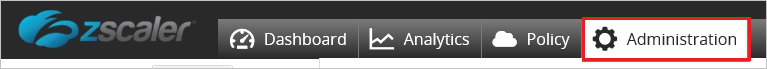

# Tutorial: Azure Active Directory integration with Zscaler Beta

In this tutorial, you learn how to integrate Zscaler Beta with Azure Active Directory (Azure AD).
When you integrate Zscaler Beta with Azure AD, you can:

* Control in Azure AD who has access to Zscaler Beta.
* Allow your users to be automatically signed in to Zscaler Beta with their Azure AD accounts. This access control is called single sign-on (SSO).
* Manage your accounts in one central location by using the Azure portal.

For more information about software as a service (SaaS) app integration with Azure AD, see [What is application access and single sign-on with Azure Active Directory?](https://docs.microsoft.com/azure/active-directory/active-directory-appssoaccess-whatis).
If you don't have an Azure subscription, [create a free account](https://azure.microsoft.com/free/) before you begin.

## Prerequisites

To configure Azure AD integration with Zscaler Beta, you need the following items:

* An Azure AD subscription. If you don't have an Azure AD environment, you can get a [free account](https://azure.microsoft.com/free/).
* A Zscaler Beta subscription that uses single sign-on.

## Scenario description

In this tutorial, you configure and test Azure AD single sign-on in a test environment.

* Zscaler Beta supports SP-initiated SSO.
* Zscaler Beta supports just-in-time user provisioning.

## Add Zscaler Beta from the Azure Marketplace

To configure the integration of Zscaler Beta into Azure AD, add Zscaler Beta from the Azure Marketplace to your list of managed SaaS apps.

To add Zscaler Beta from the Azure Marketplace, follow these steps.

1. In the [Azure portal](https://portal.azure.com), on the left navigation pane, select **Azure Active Directory**.

	

2. Go to **Enterprise applications**, and then select **All applications**.

	

3. To add a new application, select **New application** at the top of the dialog box.

	

4. In the search box, enter **Zscaler Beta**. Select **Zscaler Beta** from the result panel, and then select **Add**.

	 

## Configure and test Azure AD single sign-on

In this section, you configure and test Azure AD single sign-on with Zscaler Beta based on the test user Britta Simon.
For single sign-on to work, establish a link relationship between an Azure AD user and the related user in Zscaler Beta.

To configure and test Azure AD single sign-on with Zscaler Beta, complete the following building blocks:

- [Configure Azure AD single sign-on](#configure-azure-ad-single-sign-on) to enable your users to use this feature.
- [Configure Zscaler Beta single sign-on](#configure-zscaler-beta-single-sign-on) to configure the single sign-on settings on the application side.
- [Create an Azure AD test user](#create-an-azure-ad-test-user) to test Azure AD single sign-on with Britta Simon.
- [Assign the Azure AD test user](#assign-the-azure-ad-test-user) to enable Britta Simon to use Azure AD single sign-on.
- [Create a Zscaler Beta test user](#create-a-zscaler-beta-test-user) to have a counterpart of Britta Simon in Zscaler Beta that's linked to the Azure AD representation of the user.
- [Test single sign-on](#test-single-sign-on) to verify whether the configuration works.

### Configure Azure AD single sign-on

In this section, you enable Azure AD single sign-on in the Azure portal.

To configure Azure AD single sign-on with Zscaler Beta, follow these steps.

1. In the [Azure portal](https://portal.azure.com/), on the **Zscaler Beta** application integration page, select **Single sign-on**.

    

2. In the **Select a single sign-on method** dialog box, select the **SAML/WS-Fed** mode to enable single sign-on.

    

3. On the **Set up Single Sign-On with SAML** page, select **Edit** to open the **Basic SAML Configuration** dialog box.

	

4. In the **Basic SAML Configuration** section, follow this step:

    

    - In the **Sign on URL** box, enter the URL used by your users to sign in to your Zscaler Beta application.

	> [!NOTE]
	> The value isn't real. Update the value with the actual Sign on URL value. To get the value, contact the [Zscaler Beta client support team](https://www.zscaler.com/company/contact).

5. The Zscaler Beta application expects the SAML assertions in a specific format. You must add custom attribute mappings to your SAML token attributes configuration. The following screenshot shows the list of default attributes. Select **Edit** to open the **User Attributes** dialog box.

	

6. The Zscaler Beta application expects a few more attributes to be passed back in SAML response. In the **User claims** section in the **User Attributes** dialog box, follow these steps to add the SAML token attribute, as shown in the following table.
    
	| Name | Source attribute | 
	| ---------------| --------------- |
	| memberOf  | user.assignedroles |

	a. Select **Add new claim** to open the **Manage user claims** dialog box.

	

	

	b. In the **Name** box, enter the attribute name shown for that row.

	c. Leave the **Namespace** box blank.

	d. For **Source**, select **Attribute**.

	e. From the **Source attribute** list, enter the attribute value shown for that row.

	f. Select **OK**.

	g. Select **Save**.

	> [!NOTE]
	> To learn how to configure roles in Azure AD, see [Configure the role claim](https://docs.microsoft.com/azure/active-directory/active-directory-enterprise-app-role-management).

7. On the **Set up Single Sign-On with SAML** page, in the **SAML Signing Certificate** section, select **Download** to download the **Certificate (Base64)**. Save it on your computer.

	

8. In the **Set up Zscaler Beta** section, copy the URLs you need for your requirements:

	

	- Login URL
	- Azure AD Identifier
	- Logout URL

### Configure Zscaler Beta single sign-on

1. To automate the configuration within Zscaler Beta, install **My Apps Secure Sign-in browser extension** by selecting **Install the extension**.

	

2. After you add the extension to the browser, selecting **Set up Zscaler Beta** directs you to the Zscaler Beta application. From there, provide the admin credentials to sign in to Zscaler Beta. The browser extension automatically configures the application for you and automates steps 3 through 6.

	

3. To set up Zscaler Beta manually, open a new web browser window. Sign in to your Zscaler Beta company site as an administrator, and follow these steps.

4. Go to **Administration** > **Authentication** > **Authentication Settings**, and follow these steps.
   
	

	a. Under **Authentication Type**, select **SAML**.

	b. Select **Configure SAML**.

5. In the **Edit SAML** window, follow these steps: 
   			
	
	
	a. In the **SAML Portal URL** box, paste in the **Login URL** that you copied from the Azure portal.

	b. In the **Login Name Attribute** box, enter **NameID**.

	c. In the **Public SSL Certificate** box, select **Upload** to upload the Azure SAML signing certificate that you downloaded from the Azure portal.

	d. Toggle **Enable SAML Auto-Provisioning**.

	e. In the **User Display Name Attribute** box, enter **displayName** if you want to enable SAML autoprovisioning for displayName attributes.

	f. In the **Group Name Attribute** box, enter **memberOf** if you want to enable SAML autoprovisioning for memberOf attributes.

	g. In the **Department Name Attribute** box, enter **department** if you want to enable SAML autoprovisioning for department attributes.

	h. Select **Save**.

6. On the **Configure User Authentication** dialog page, follow these steps:

    

	a. Hover over the **Activation** menu at the bottom left.

    b. Select **Activate**.

## Configure proxy settings
To configure the proxy settings in Internet Explorer, follow these steps.

1. Start **Internet Explorer**.

2. Select **Internet options** from the **Tools** menu to open the **Internet Options** dialog box. 
  	
	 

3. Select the **Connections** tab. 
  
	 

4. Select **LAN settings** to open the **Local Area Network (LAN) Settings** dialog box.

5. In the **Proxy server** section, follow these steps: 
   
	

    a. Select the **Use a proxy server for your LAN** check box.

    b. In the **Address** box, enter **gateway.Zscaler Beta.net**.

    c. In the **Port** box, enter **80**.

    d. Select the **Bypass proxy server for local addresses** check box.

    e. Select **OK** to close the **Local Area Network (LAN) Settings** dialog box.

6. Select **OK** to close the **Internet Options** dialog box.

### Create an Azure AD test user 

Create a test user in the Azure portal called Britta Simon.

1. In the Azure portal, in the left pane, select **Azure Active Directory** > **Users** > **All users**.

    

2. Select **New user** at the top of the screen.

    

3. In the **User** dialog box, follow these steps:

    

    a. In the **Name** box, enter **BrittaSimon**.
  
    b. In the **User name** box, enter `brittasimon@yourcompanydomain.extension`. An example is BrittaSimon@contoso.com.

    c. Select the **Show password** check box. Write down the value that displays in the **Password** box.

    d. Select **Create**.

### Assign the Azure AD test user

Enable Britta Simon to use Azure single sign-on by granting access to Zscaler Beta.

1. In the Azure portal, select **Enterprise applications** > **All applications** > **Zscaler Beta**.

	

2. In the applications list, enter and select **Zscaler Beta**.

	

3. In the menu on the left, select **Users and groups**.

    

4. Select **Add user**. In the **Add Assignment** dialog box, select **Users and groups**.

    

5. In the **Users and groups** dialog box, select the user like **Britta Simon** from the list. Then choose **Select** at the bottom of the screen.

	

6. In the **Select Role** dialog box, select the appropriate user role in the list. Then choose **Select** at the bottom of the screen.

	

7. In the **Add Assignment** dialog box, select **Assign**.

	

### Create a Zscaler Beta test user

In this section, the user Britta Simon is created in Zscaler Beta. Zscaler Beta supports **just-in-time user provisioning**, which is enabled by default. There's nothing for you to do in this section. If a user doesn't already exist in Zscaler Beta, a new one is created after authentication.

>[!Note]
>To create a user manually, contact the [Zscaler Beta support team](https://www.zscaler.com/company/contact).

### Test single sign-on 

Test your Azure AD single sign-on configuration by using the Access Panel.

When you select the Zscaler Beta tile in the Access Panel, you should be automatically signed in to the Zscaler Beta for which you set up SSO. For more information about the Access Panel, see [Introduction to the Access Panel](https://docs.microsoft.com/azure/active-directory/active-directory-saas-access-panel-introduction).

## Additional resources

- [List of tutorials on how to integrate SaaS apps with Azure Active Directory](https://docs.microsoft.com/azure/active-directory/active-directory-saas-tutorial-list)
- [What is application access and single sign-on with Azure Active Directory?](https://docs.microsoft.com/azure/active-directory/active-directory-appssoaccess-whatis)
- [What is Conditional Access in Azure Active Directory?](https://docs.microsoft.com/azure/active-directory/conditional-access/overview)

