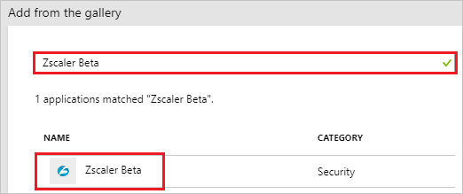
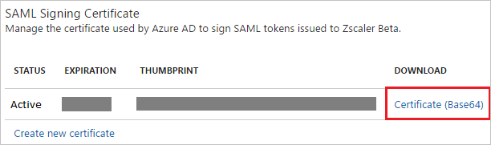

# Tutorial: Azure Active Directory integration with Zscaler Beta

In this tutorial, you learn how to integrate Zscaler Beta with Azure Active Directory (Azure AD).

Integrating Zscaler Beta with Azure AD provides you with the following benefits:

- You can control in Azure AD who has access to Zscaler Beta.
- You can enable your users to automatically get signed-on to Zscaler Beta (Single Sign-On) with their Azure AD accounts.
- You can manage your accounts in one central location - the Azure portal.

If you want to know more details about SaaS app integration with Azure AD, see [what is application access and single sign-on with Azure Active Directory](../manage-apps/what-is-single-sign-on.md)

## Prerequisites

To configure Azure AD integration with Zscaler Beta, you need the following items:

- An Azure AD subscription
- A Zscaler Beta single sign-on enabled subscription

> [!NOTE]
> To test the steps in this tutorial, we do not recommend using a production environment.

To test the steps in this tutorial, you should follow these recommendations:

- Do not use your production environment, unless it is necessary.
- If you don't have an Azure AD trial environment, you can [get a one-month trial](https://azure.microsoft.com/pricing/free-trial/).

## Scenario description

In this tutorial, you test Azure AD single sign-on in a test environment. 
The scenario outlined in this tutorial consists of two main building blocks:

1. Adding Zscaler Beta from the gallery
2. Configuring and testing Azure AD single sign-on

## Adding Zscaler Beta from the gallery

To configure the integration of Zscaler Beta into Azure AD, you need to add Zscaler Beta from the gallery to your list of managed SaaS apps.

**To add Zscaler Beta from the gallery, perform the following steps:**

1. In the **[Azure portal](https://portal.azure.com)**, on the left navigation panel, click **Azure Active Directory** icon. 

	![The Azure Active Directory button][1]

2. Navigate to **Enterprise applications**. Then go to **All applications**.

	![The Enterprise applications blade][2]

3. To add new application, click **New application** button on the top of dialog.

	![The New application button][3]

4. In the search box, type **Zscaler Beta**, select **Zscaler Beta** from result panel then click **Add** button to add the application.

	

## Configure and test Azure AD single sign-on

In this section, you configure and test Azure AD single sign-on with Zscaler Beta based on a test user called "Britta Simon".

For single sign-on to work, Azure AD needs to know what the counterpart user in Zscaler Beta is to a user in Azure AD. In other words, a link relationship between an Azure AD user and the related user in Zscaler Beta needs to be established.

To configure and test Azure AD single sign-on with Zscaler Beta, you need to complete the following building blocks:

1. **[Configuring Azure AD Single Sign-On](#configuring-azure-ad-single-sign-on)** - to enable your users to use this feature.
2. **[Creating an Azure AD test user](#creating-an-azure-ad-test-user)** - to test Azure AD single sign-on with Britta Simon.
3. **[Creating a Zscaler Beta test user](#creating-a-zscaler-beta-test-user)** - to have a counterpart of Britta Simon in Zscaler Beta that is linked to the Azure AD representation of user.
4. **[Assigning the Azure AD test user](#assigning-the-azure-ad-test-user)** - to enable Britta Simon to use Azure AD single sign-on.
5. **[Testing single sign-on](#testing-single-sign-on)** - to verify whether the configuration works.

### Configuring Azure AD single sign-on

In this section, you enable Azure AD single sign-on in the Azure portal and configure single sign-on in your Zscaler Beta application.

**To configure Azure AD single sign-on with Zscaler Beta, perform the following steps:**

1. In the Azure portal, on the **Zscaler Beta** application integration page, click **Single sign-on**.

	![Configure single sign-on link][4]

2. On the **Select a Single sign-on method** dialog, Click **Select** for **SAML** mode to enable single sign-on.

    

3. On the **Set up Single Sign-On with SAML** page, click **Edit** icon to open **Basic SAML Configuration** dialog.

	

4. On the **Basic SAML Configuration** section, perform the following steps:

	

	In the Sign-on URL textbox, type the URL used by your users to sign-on to your Zscaler Beta application.

	> [!NOTE] 
	> You have to update this value with the actual Sign-On URL. Contact [Zscaler Beta Client support team](https://www.zscaler.com/company/contact) to get this value. 

5. Zscaler Beta application expects the SAML assertions in a specific format. Configure the following claims for this application. You can manage the values of these attributes from the **User Attributes & Claims** section on application integration page. On the **Set up Single Sign-On with SAML page**, click **Edit** button to open **User Attributes & Claims** dialog.

	

6. In the **User Claims** section on the **User Attributes** dialog, configure SAML token attribute as shown in the image above and perform the following steps:

	| Name  | Source Attribute  |
	| ---------| ------------ |
	| Role 	   | user.assignedroles |

	a. Click **Add new claim** to open the **Manage user claims** dialog.

	
	
	

	b. From the **Source attribute** list, selelct the attribute value.

	c. Click **Ok**.

	d. Click **Save**.

	> [!NOTE]
	> Please click [here](https://docs.microsoft.com/azure/active-directory/active-directory-enterprise-app-role-management) to know how to configure Role in Azure AD

7. On the **SAML Signing Certificate** page, in the **SAML Signing Certificate** section, click **Download** to download **Certificate (Base64)** and then save certificate file on your computer.

	 

8. On the **Set up Zscaler Beta** section, copy the appropriate URL as per your requirement.

	a. Login URL

	b. Azure AD Identifier

	c. Logout URL

	

9. In a different web browser window, log in to your Zscaler Beta company site as an administrator.

10. Go to **Administration > Authentication > Authentication Settings** and perform the following steps:
   
	

	a. Under Authentication Type, choose **SAML**.

	b. Click **Configure SAML**.

11. On the **Edit SAML** window, perform the following steps: and click Save.  
   			
	
	
	a. In the **SAML Portal URL** textbox, Paste the **Login URL** which you have copied from Azure portal.

	b. In the **Login Name Attribute** textbox, enter **NameID**.

	c. Click **Upload**, to  upload the Azure SAML signing certificate that you  have downloaded from Azure portal in the **Public SSL Certificate**.

	d. Toggle the **Enable SAML Auto-Provisioning**.

	e. In the **User Display Name Attribute** textbox, enter **displayName** if you want to enable SAML auto-provisioning for displayName attributes.

	f. In the **Group Name Attribute** textbox, enter **memberOf** if you want to enable SAML auto-provisioning for memberOf attributes.

	g. In the **Department Name Attribute** Enter **department** if you want to enable SAML auto-provisioning for department attributes.

	i. Click **Save**.

12. On the **Configure User Authentication** dialog page, perform the following steps:

    

	a. Hover over the **Activation** menu near the bottom left.

    b. Click **Activate**.

## Configuring proxy settings
### To configure the proxy settings in Internet Explorer

1. Start **Internet Explorer**.

1. Select **Internet options** from the **Tools** menu for open the **Internet Options** dialog.   
  	
	 

1. Click the **Connections** tab.   
  
	 

1. Click **LAN settings** to open the **LAN Settings** dialog.

1. In the Proxy server section, perform the following steps:   
   
	

    a. Select **Use a proxy server for your LAN**.

    b. In the Address textbox, type **gateway.Zscaler Beta.net**.

    c. In the Port textbox, type **80**.

    d. Select **Bypass proxy server for local addresses**.

    e. Click **OK** to close the **Local Area Network (LAN) Settings** dialog.

1. Click **OK** to close the **Internet Options** dialog.

### Creating an Azure AD test user

The objective of this section is to create a test user in the Azure portal called Britta Simon.

1. In the Azure portal, in the left pane, select **Azure Active Directory**, select **Users**, and then select **All users**.

	![Create Azure AD User][100]

2. Select **New user** at the top of the screen.

	 

3. In the User properties, perform the following steps.

	

    a. In the **Name** field, enter **BrittaSimon**.
  
    b. In the **User name** field, type **brittasimon@yourcompanydomain.extension**  
    For example, BrittaSimon@contoso.com

    c. Select **Properties**, select the **Show password** check box, and then write down the value that's displayed in the Password box.

    d. Select **Create**.

### Creating a Zscaler Beta test user

The objective of this section is to create a user called Britta Simon in Zscaler Beta. Zscaler Beta supports just-in-time provisioning, which is by default enabled. There is no action item for you in this section. A new user is created during an attempt to access Zscaler Beta if it doesn't exist yet.
>[!Note]
>If you need to create a user manually, contact [Zscaler Beta support team](https://www.zscaler.com/company/contact).

### Assigning the Azure AD test user

In this section, you enable Britta Simon to use Azure single sign-on by granting access to Zscaler Beta.

1. In the Azure portal, select **Enterprise Applications**, select **All applications**.

	![Assign User][201]

2. In the applications list, select **Zscaler Beta**.

	

3. In the menu on the left, click **Users and groups**.

	![Assign User][202]

4. Click **Add** button. Then select **Users and groups** on **Add Assignment** dialog.

	![Assign User][203]

5. In the **Users and groups** dialog select **Britta Simon** in the Users list, then click the **Select** button at the bottom of the screen.

6. In the **Add Assignment** dialog, select the **Assign** button.

### Testing single sign-on

In this section, you test your Azure AD single sign-on configuration using the Access Panel.

When you click the Zscaler Beta tile in the Access Panel, you should get automatically signed-on to your Zscaler Beta application.
For more information about the Access Panel, see [Introduction to the Access Panel](../user-help/active-directory-saas-access-panel-introduction.md).

## Additional resources

* [List of Tutorials on How to Integrate SaaS Apps with Azure Active Directory](tutorial-list.md)
* [What is application access and single sign-on with Azure Active Directory?](../manage-apps/what-is-single-sign-on.md)

<!--Image references-->

[1]: common/tutorial_general_01.png
[2]: common/tutorial_general_02.png
[3]: common/tutorial_general_03.png
[4]: common/tutorial_general_04.png

[100]: common/tutorial_general_100.png

[201]: common/tutorial_general_201.png
[202]: common/tutorial_general_202.png
[203]: common/tutorial_general_203.png
