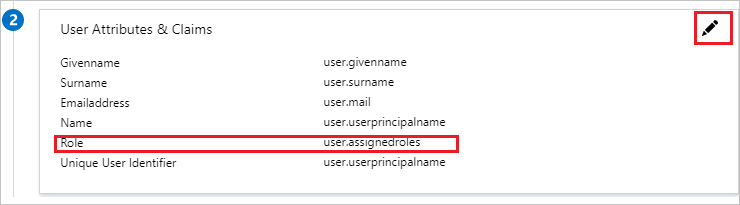

# Tutorial: Microsoft Entra integration with Zscaler Internet Access Administrator

In this tutorial, you'll learn how to integrate Zscaler Internet Access Administrator with Microsoft Entra ID. When you integrate Zscaler Internet Access Administrator with Microsoft Entra ID, you can:

- Control in Microsoft Entra ID who has access to Zscaler Internet Access Administrator.
- Enable your users to be automatically signed-in to Zscaler Internet Access Administrator with their Microsoft Entra accounts.
- Manage your accounts in one central location.

## Prerequisites

To get started, you need the following items:

- A Microsoft Entra subscription. If you don't have a subscription, you can get a [free account](https://azure.microsoft.com/free/).
- Zscaler Internet Access Administrator single sign-on (SSO) enabled subscription.

> [!NOTE]
> This integration is also available to use from Microsoft Entra US Government Cloud environment. You can find this application in the Microsoft Entra US Government Cloud Application Gallery and configure it in the same way as you do from public cloud.

## Scenario description

In this tutorial, you configure and test Microsoft Entra single sign-on in a test environment.

- Zscaler Internet Access Administrator supports **IDP** initiated SSO.

## Add Zscaler Internet Access Administrator from the gallery

To configure the integration of Zscaler Internet Access Administrator into Microsoft Entra ID, you need to add Zscaler Internet Access Administrator from the gallery to your list of managed SaaS apps.

1. Sign in to the [Microsoft Entra admin center](https://entra.microsoft.com) as at least a [Cloud Application Administrator](../roles/permissions-reference.md#cloud-application-administrator).
1. Browse to **Identity** > **Applications** > **Enterprise applications** > **New application**.
1. In the **Add from the gallery** section, type **Zscaler Internet Access Administrator** in the search box.
1. Select **Zscaler Internet Access Administrator** from results panel and then add the app. Wait a few seconds while the app is added to your tenant.

 Alternatively, you can also use the [Enterprise App Configuration Wizard](https://portal.office.com/AdminPortal/home?Q=Docs#/azureadappintegration). In this wizard, you can add an application to your tenant, add users/groups to the app, assign roles, as well as walk through the SSO configuration as well. [Learn more about Microsoft 365 wizards.](/microsoft-365/admin/misc/azure-ad-setup-guides)

## Configure and test Microsoft Entra SSO for Zscaler Internet Access Administrator

Configure and test Microsoft Entra SSO with Zscaler Internet Access Administrator using a test user called **B.Simon**. For SSO to work, you need to establish a link relationship between a Microsoft Entra user and the related user in Zscaler Internet Access Administrator.

To configure and test Microsoft Entra SSO with Zscaler Internet Access Administrator, perform the following steps:

1. **[Configure Microsoft Entra SSO](#configure-azure-ad-sso)** - to enable your users to use this feature.
   1. **[Create a Microsoft Entra test user](#create-an-azure-ad-test-user)** - to test Microsoft Entra single sign-on with Britta Simon.
   1. **[Assign the Microsoft Entra test user](#assign-the-azure-ad-test-user)** - to enable Britta Simon to use Microsoft Entra single sign-on.
2. **[Configure Zscaler Internet Access Administrator SSO](#configure-zscaler-internet-access-administrator-sso)** - to configure the Single Sign-On settings on application side.
   1. **[Create Zscaler Internet Access Administrator test user](#create-zscaler-internet-access-administrator-test-user)** - to have a counterpart of Britta Simon in Zscaler Internet Access Administrator that is linked to the Microsoft Entra representation of user.
3. **[Test SSO](#test-sso)** - to verify whether the configuration works.

## Configure Microsoft Entra SSO

Follow these steps to enable Microsoft Entra SSO.

1. Sign in to the [Microsoft Entra admin center](https://entra.microsoft.com) as at least a [Cloud Application Administrator](../roles/permissions-reference.md#cloud-application-administrator).
1. Browse to **Identity** > **Applications** > **Enterprise applications** > **Zscaler Internet Access Administrator** application integration page, find the **Manage** section and select **Single sign-on**.
1. On the **Select a Single sign-on method** page, select **SAML**.
1. On the **Set up Single Sign-On with SAML** page, click the pencil icon for **Basic SAML Configuration** to edit the settings.

   

1. On the **Basic SAML Configuration** section, enter the values for the following fields:

   a. In the **Identifier** text box, type one of the following URLs as per your requirement:

   | Identifier                       |
   | -------------------------------- |
   | `https://admin.zscaler.net`      |
   | `https://admin.zscalerone.net`   |
   | `https://admin.zscalertwo.net`   |
   | `https://admin.zscalerthree.net` |
   | `https://admin.zscloud.net`      |
   | `https://admin.zscalerbeta.net`  |

   b. In the **Reply URL** text box, type one of the following URLs as per your requirement:

   | Reply URL                                    |
   | -------------------------------------------- |
   | `https://admin.zscaler.net/adminsso.do`      |
   | `https://admin.zscalerone.net/adminsso.do`   |
   | `https://admin.zscalertwo.net/adminsso.do`   |
   | `https://admin.zscalerthree.net/adminsso.do` |
   | `https://admin.zscloud.net/adminsso.do`      |
   | `https://admin.zscalerbeta.net/adminsso.do`  |

1. Zscaler Internet Access Administrator application expects the SAML assertions in a specific format. Configure the following claims for this application. You can manage the values of these attributes from the **User Attributes & Claims** section on application integration page. On the **Set up Single Sign-On with SAML page**, click **Edit** button to open **User Attributes & Claims** dialog.

   

1. In the **User Claims** section on the **User Attributes** dialog, configure SAML token attribute as shown in the image above and perform the following steps:

   | Name | Source Attribute   |
   | ---- | ------------------ |
   | Role | user.assignedroles |

   a. Click **Add new claim** to open the **Manage user claims** dialog.

   b. From the **Source attribute** list, select the attribute value.

   c. Click **Ok**.

   d. Click **Save**.

   > [!NOTE]
   > Please click [here](../develop/howto-add-app-roles-in-azure-ad-apps.md#app-roles-ui) to know how to configure Role in Microsoft Entra ID.

1. On the **Set up Single Sign-On with SAML** page, in the **SAML Signing Certificate** section, click **Download** to download the **Certificate (Base64)** from the given options as per your requirement and save it on your computer.

   

1. On the **Set up Zscaler Internet Access Administrator** section, copy the appropriate URL(s) as per your requirement.

   

### Create a Microsoft Entra test user

In this section, you'll create a test user called B.Simon.

1. Sign in to the [Microsoft Entra admin center](https://entra.microsoft.com) as at least a [User Administrator](../roles/permissions-reference.md#user-administrator).
1. Browse to **Identity** > **Users** > **All users**.
1. Select **New user** > **Create new user**, at the top of the screen.
1. In the **User** properties, follow these steps:
   1. In the **Display name** field, enter `B.Simon`.  
   1. In the **User principal name** field, enter the username@companydomain.extension. For example, `B.Simon@contoso.com`.
   1. Select the **Show password** check box, and then write down the value that's displayed in the **Password** box.
   1. Select **Review + create**.
1. Select **Create**.

### Assign the Microsoft Entra test user

In this section, you'll enable B.Simon to use single sign-on by granting access to Zscaler Internet Access Administrator.

1. Sign in to the [Microsoft Entra admin center](https://entra.microsoft.com) as at least a [Cloud Application Administrator](../roles/permissions-reference.md#cloud-application-administrator).
1. Browse to **Identity** > **Applications** > **Enterprise applications** > **Zscaler Internet Access Administrator**.
1. In the app's overview page, find the **Manage** section and select **Users and groups**.
1. Select **Add user**, then select **Users and groups** in the **Add Assignment** dialog.
1. In the **Users and groups** dialog, select **B.Simon** from the Users list, then click the **Select** button at the bottom of the screen.
1. If you have setup the roles as explained in the above, you can select it from the **Select a role** dropdown.
1. In the **Add Assignment** dialog, click the **Assign** button.

## Configure Zscaler Internet Access Administrator SSO

1. In a different web browser window, log in to your Zscaler Internet Access Admin UI.

2. Go to **Administration > Administrator Management** and perform the following steps and click Save:

   

   a. Check **Enable SAML Authentication**.

   b. Click **Upload**, to upload the Azure SAML signing certificate that you have downloaded from Azure portal in the **Public SSL Certificate**.

   c. Optionally, for additional security, add the **Issuer** details to verify the Issuer of the SAML response.

3. On the Admin UI, perform the following steps:

   

   a. Hover over the **Activation** menu near the bottom left.

   b. Click **Activate**.

### Create Zscaler Internet Access Administrator test user

The objective of this section is to create a user called Britta Simon in Zscaler Internet Access Administrator. Zscaler Internet Access does not support Just-In-Time provisioning for Administrator SSO. You are required to manually create an Administrator account.
For steps on how to create an Administrator account, refer to Zscaler documentation:

https://help.zscaler.com/zia/adding-admins

## Test SSO

In this section, you test your Microsoft Entra single sign-on configuration with following options.

- Click on **Test this application**, and you should be automatically signed in to the Zscaler Internet Access Administrator for which you set up the SSO

- You can use Microsoft My Apps. When you click the Zscaler Internet Access Administrator tile in the My Apps, you should be automatically signed in to the Zscaler Internet Access Administrator for which you set up the SSO. For more information about the My Apps, see [Introduction to the My Apps](https://support.microsoft.com/account-billing/sign-in-and-start-apps-from-the-my-apps-portal-2f3b1bae-0e5a-4a86-a33e-876fbd2a4510).

## Next steps

Once you configure Zscaler Internet Access Administrator you can enforce session control, which protects exfiltration and infiltration of your organization’s sensitive data in real time. Session control extends from Conditional Access. [Learn how to enforce session control with Microsoft Defender for Cloud Apps](/cloud-app-security/proxy-deployment-any-app).
