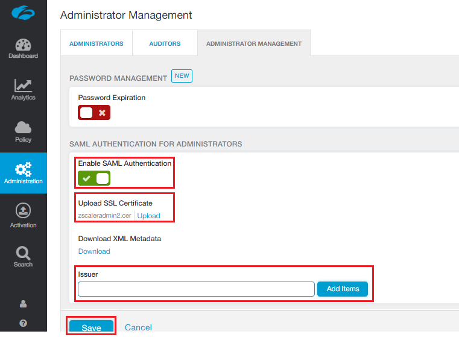
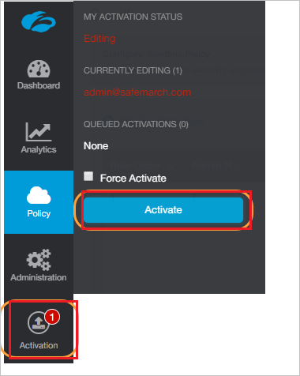

# Tutorial: Azure Active Directory integration with Zscaler Internet Access Administrator

In this tutorial, you learn how to integrate Zscaler Internet Access Administrator with Azure Active Directory (Azure AD).
Integrating Zscaler Internet Access Administrator with Azure AD provides you with the following benefits:

* You can control in Azure AD who has access to Zscaler Internet Access Administrator.
* You can enable your users to be automatically signed-in to Zscaler Internet Access Administrator (Single Sign-On) with their Azure AD accounts.
* You can manage your accounts in one central location - the Azure portal.

If you want to know more details about SaaS app integration with Azure AD, see [What is application access and single sign-on with Azure Active Directory](https://docs.microsoft.com/azure/active-directory/active-directory-appssoaccess-whatis).
If you don't have an Azure subscription, [create a free account](https://azure.microsoft.com/free/) before you begin.

## Prerequisites

To configure Azure AD integration with Zscaler Internet Access Administrator, you need the following items:

* An Azure AD subscription. If you don't have an Azure AD environment, you can get one-month trial [here](https://azure.microsoft.com/pricing/free-trial/)
* Zscaler Internet Access Administrator subscription

## Scenario description

In this tutorial, you configure and test Azure AD single sign-on in a test environment.

* Zscaler Internet Access Administrator supports **IDP** initiated SSO

## Adding Zscaler Internet Access Administrator from the gallery

To configure the integration of Zscaler Internet Access Administrator into Azure AD, you need to add Zscaler Internet Access Administrator from the gallery to your list of managed SaaS apps.

**To add Zscaler Internet Access Administrator from the gallery, perform the following steps:**

1. In the **[Azure portal](https://portal.azure.com)**, on the left navigation panel, click **Azure Active Directory** icon.

	

2. Navigate to **Enterprise Applications** and then select the **All Applications** option.

	

3. To add new application, click **New application** button on the top of dialog.

	

4. In the search box, type **Zscaler Internet Access Administrator**, select **Zscaler Internet Access Administrator** from result panel then click **Add** button to add the application.

	 

## Configure and test Azure AD single sign-on

In this section, you configure and test Azure AD single sign-on with Zscaler Internet Access Administrator based on a test user called **Britta Simon**.
For single sign-on to work, a link relationship between an Azure AD user and the related user in Zscaler Internet Access Administrator needs to be established.

To configure and test Azure AD single sign-on with Zscaler Internet Access Administrator, you need to complete the following building blocks:

1. **[Configure Azure AD Single Sign-On](#configure-azure-ad-single-sign-on)** - to enable your users to use this feature.
2. **[Configure Zscaler Internet Access Administrator Single Sign-On](#configure-zscaler-internet-access-administrator-single-sign-on)** - to configure the Single Sign-On settings on application side.
3. **[Create an Azure AD test user](#create-an-azure-ad-test-user)** - to test Azure AD single sign-on with Britta Simon.
4. **[Assign the Azure AD test user](#assign-the-azure-ad-test-user)** - to enable Britta Simon to use Azure AD single sign-on.
5. **[Create Zscaler Internet Access Administrator test user](#create-zscaler-internet-access-administrator-test-user)** - to have a counterpart of Britta Simon in Zscaler Internet Access Administrator that is linked to the Azure AD representation of user.
6. **[Test single sign-on](#test-single-sign-on)** - to verify whether the configuration works.

### Configure Azure AD single sign-on

In this section, you enable Azure AD single sign-on in the Azure portal.

To configure Azure AD single sign-on with Zscaler Internet Access Administrator, perform the following steps:

1. In the [Azure portal](https://portal.azure.com/), on the **Zscaler Internet Access Administrator** application integration page, select **Single sign-on**.

    

2. On the **Select a Single sign-on method** dialog, select **SAML/WS-Fed** mode to enable single sign-on.

    

3. On the **Set up Single Sign-On with SAML** page, click **Edit** icon to open **Basic SAML Configuration** dialog.

	

4. On the **Set up Single Sign-On with SAML** page, click **Edit** button to open **Basic SAML Configuration** dialog.

    

    a. In the **Identifier** text box, type a URL as per your requirement:

	| |
	|--|
	| `https://admin.zscaler.net` |
	| `https://admin.zscalerone.net` |
	| `https://admin.zscalertwo.net` |
	| `https://admin.zscalerthree.net` |
	| `https://admin.zscloud.net` |
	| `https://admin.zscalerbeta.net` |

    b. In the **Reply URL** text box, type a URL as per your requirement:

	| |
	|--|
	| `https://admin.zscaler.net/adminsso.do` |
	| `https://admin.zscalerone.net/adminsso.do` |
	| `https://admin.zscalertwo.net/adminsso.do` |
	| `https://admin.zscalerthree.net/adminsso.do` |
	| `https://admin.zscloud.net/adminsso.do` |
	| `https://admin.zscalerbeta.net/adminsso.do` |

5. Zscaler Internet Access Administrator application expects the SAML assertions in a specific format. Configure the following claims for this application. You can manage the values of these attributes from the **User Attributes & Claims** section on application integration page. On the **Set up Single Sign-On with SAML page**, click **Edit** button to open **User Attributes & Claims** dialog.

	

6. In the **User Claims** section on the **User Attributes** dialog, configure SAML token attribute as shown in the image above and perform the following steps:

	| Name  | Source Attribute  |
	| ---------| ------------ |
	| Role 	   | user.assignedroles |

	a. Click **Add new claim** to open the **Manage user claims** dialog.

	
	
	

	b. From the **Source attribute** list, selelct the attribute value.

	c. Click **Ok**.

	d. Click **Save**.

	> [!NOTE]
	> Please click [here](https://docs.microsoft.com/azure/active-directory/active-directory-enterprise-app-role-management) to know how to configure Role in Azure AD

7. On the **Set up Single Sign-On with SAML** page, in the **SAML Signing Certificate** section, click **Download** to download the **Certificate (Base64)** from the given options as per your requirement and save it on your computer.

	

8. On the **Set up Zscaler Internet Access Administrator** section, copy the appropriate URL(s) as per your requirement.

	

	a. Login URL

	b. Azure Ad Identifier

	c. Logout URL

### Configure Zscaler Internet Access Administrator Single Sign-On

1. In a different web browser window, log in to your Zscaler Internet Access Admin UI.

2. Go to **Administration > Administrator Management** and perform the following steps and click Save:

	

	a. Check **Enable SAML Authentication**.

	b. Click **Upload**, to  upload the Azure SAML signing certificate that you  have downloaded from Azure portal in the **Public SSL Certificate**.

	c. Optionally, for additional security, add the **Issuer** details to verify the Issuer of the SAML response.

3. On the Admin UI, perform the following steps:

    

	a. Hover over the **Activation** menu near the bottom left.

    b. Click **Activate**.

### Create an Azure AD test user 

The objective of this section is to create a test user in the Azure portal called Britta Simon.

1. In the Azure portal, in the left pane, select **Azure Active Directory**, select **Users**, and then select **All users**.

    

2. Select **New user** at the top of the screen.

    

3. In the User properties, perform the following steps.

    

    a. In the **Name** field enter **BrittaSimon**.
  
    b. In the **User name** field type **brittasimon\@yourcompanydomain.extension**  
    For example, BrittaSimon@contoso.com

    c. Select **Show password** check box, and then write down the value that's displayed in the Password box.

    d. Click **Create**.

### Assign the Azure AD test user

In this section, you enable Britta Simon to use Azure single sign-on by granting access to Zscaler Internet Access Administrator.

1. In the Azure portal, select **Enterprise Applications**, select **All applications**, then select **Zscaler Internet Access Administrator**.

	

2. In the applications list, type and select **Zscaler Internet Access Administrator**.

	

3. In the menu on the left, select **Users and groups**.

    

4. Click the **Add user** button, then select **Users and groups** in the **Add Assignment** dialog.

    

5. In the **Users and groups** dialog select **Britta Simon** in the Users list, then click the **Select** button at the bottom of the screen.

6. If you are expecting any role value in the SAML assertion then in the **Select Role** dialog select the appropriate role for the user from the list, then click the **Select** button at the bottom of the screen.

7. In the **Add Assignment** dialog click the **Assign** button.

### Create Zscaler Internet Access Administrator test user

The objective of this section is to create a user called Britta Simon in Zscaler Internet Access Administrator. Zscaler Internet Access does not support Just-In-Time provisioning for Administrator SSO. You are required to manually create an Administrator account.
For steps on how to create an Administrator account, refer to Zscaler documentation:

https://help.zscaler.com/zia/adding-admins

### Test single sign-on

In this section, you test your Azure AD single sign-on configuration using the Access Panel.

When you click the Zscaler Internet Access Administrator tile in the Access Panel, you should be automatically signed in to the Zscaler Internet Access Admin UI for which you set up SSO. For more information about the Access Panel, see [Introduction to the Access Panel](https://docs.microsoft.com/azure/active-directory/active-directory-saas-access-panel-introduction).

## Additional Resources

- [List of Tutorials on How to Integrate SaaS Apps with Azure Active Directory](https://docs.microsoft.com/azure/active-directory/active-directory-saas-tutorial-list)

- [What is application access and single sign-on with Azure Active Directory?](https://docs.microsoft.com/azure/active-directory/active-directory-appssoaccess-whatis)

- [What is Conditional Access in Azure Active Directory?](https://docs.microsoft.com/azure/active-directory/conditional-access/overview)
