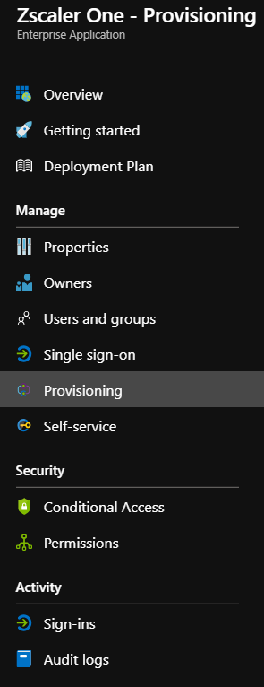
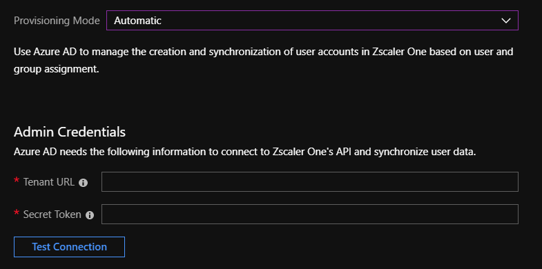
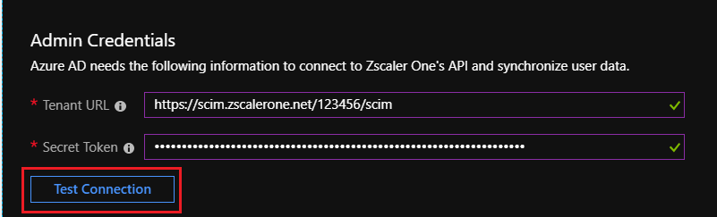
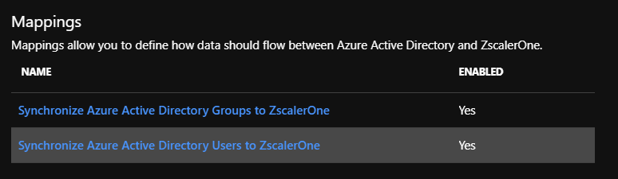
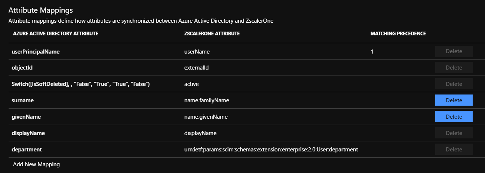
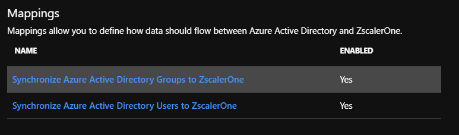
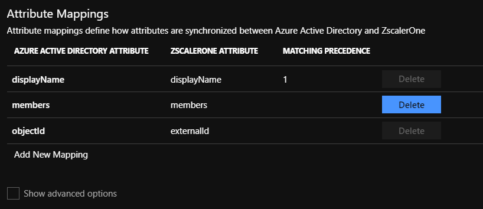
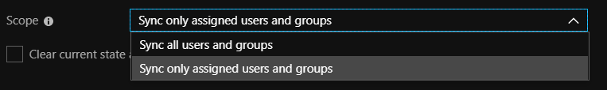
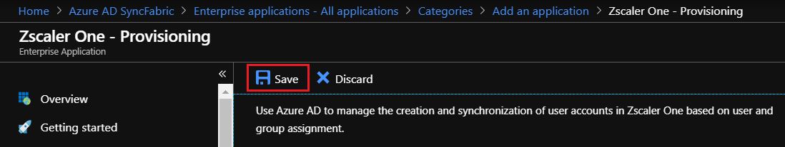

# Tutorial: Configure Zscaler One for automatic user provisioning

This tutorial demonstrates the steps to perform in Zscaler One and Azure Active Directory (Azure AD) to configure Azure AD to automatically provision and deprovision users and groups to Zscaler One.

> [!NOTE]
> This tutorial describes a connector that's built on top of the Azure AD user provisioning service. For information on what this service does, how it works, and frequently asked questions, see [Automate user provisioning and deprovisioning to software-as-a-service (SaaS) applications with Azure Active Directory](../active-directory-saas-app-provisioning.md).
>
> This connector is currently available as a preview. For more information on the general Microsoft Azure terms of use for preview features, see [Supplemental terms of use for Microsoft Azure previews](https://azure.microsoft.com/support/legal/preview-supplemental-terms/).

## Prerequisites

The scenario outlined in this tutorial assumes that you have:

* An Azure AD tenant.
* A Zscaler One tenant.
* A user account in Zscaler One with admin permissions.

> [!NOTE]
> The Azure AD provisioning integration relies on the Zscaler One SCIM API. This API is available to Zscaler One developers for accounts with the Enterprise package.

## Add Zscaler One from the Azure Marketplace

Before you configure Zscaler One for automatic user provisioning with Azure AD, add Zscaler One from the Azure Marketplace to your list of managed SaaS applications.

To add Zscaler One from the Marketplace, follow these steps.

1. In the [Azure portal](https://portal.azure.com), in the navigation pane on the left, select **Azure Active Directory**.

	

2. Go to **Enterprise applications**, and then select **All applications**.

	

3. To add a new application, select **New application** at the top of the dialog box.

	

4. In the search box, enter **Zscaler One** and select **Zscaler One** from the result panel. To add the application, select **Add**.

	

## Assign users to Zscaler One

Azure Active Directory uses a concept called *assignments* to determine which users should receive access to selected apps. In the context of automatic user provisioning, only the users or groups that were assigned to an application in Azure AD are synchronized.

Before you configure and enable automatic user provisioning, decide which users or groups in Azure AD need access to Zscaler One. To assign these users or groups to Zscaler One, follow the instructions in [Assign a user or group to an enterprise app](https://docs.microsoft.com/azure/active-directory/active-directory-coreapps-assign-user-azure-portal).

### Important tips for assigning users to Zscaler One

* We recommend that you assign a single Azure AD user to Zscaler One to test the automatic user provisioning configuration. You can assign additional users or groups later.

* When you assign a user to Zscaler One, select any valid application-specific role, if available, in the assignment dialog box. Users with the **Default Access** role are excluded from provisioning.

## Configure automatic user provisioning to Zscaler One

This section guides you through the steps to configure the Azure AD provisioning service. Use it to create, update, and disable users or groups in Zscaler One based on user or group assignments in Azure AD.

> [!TIP]
> You also can enable SAML-based single sign-on for Zscaler One. Follow the instructions in the [Zscaler One single sign-on tutorial](zscaler-One-tutorial.md). Single sign-on can be configured independently of automatic user provisioning, although these two features complement each other.

### Configure automatic user provisioning for Zscaler One in Azure AD

1. Sign in to the [Azure portal](https://portal.azure.com). Select **Enterprise applications** > **All applications** > **Zscaler One**.

	

2. In the applications list, select **Zscaler One**.

	

3. Select the **Provisioning** tab.

	

4. Set the **Provisioning Mode** to **Automatic**.

	

5. Under the **Admin Credentials** section, fill in the **Tenant URL** and **Secret Token** boxes with the settings for your Zscaler One account as described in Step 6.

6. To obtain the tenant URL and secret token, go to **Administration** > **Authentication Settings** in the Zscaler One portal UI. Under **Authentication Type**, select **SAML**.

	

	a. Select **Configure SAML** to open the **Configure SAML** options.

	

	b. Select **Enable SCIM-Based Provisioning** to get the settings in **Base URL** and **Bearer Token**. Then save the settings. Copy the **Base URL** setting to **Tenant URL** in the Azure portal. Copy the **Bearer Token** setting to **Secret Token** in the Azure portal.

7. After you fill in the boxes shown in Step 5, select **Test Connection** to make sure that Azure AD can connect to Zscaler One. If the connection fails, make sure your Zscaler One account has admin permissions and try again.

	

8. In the **Notification Email** box, enter the email address of the person or group to receive the provisioning error notifications. Select the **Send an email notification when a failure occurs** check box.

	

9. Select **Save**.

10. Under the **Mappings** section, select **Synchronize Azure Active Directory Users to Zscaler One**.

	

11. Review the user attributes that are synchronized from Azure AD to Zscaler One in the **Attribute Mappings** section. The attributes selected as **Matching** properties are used to match the user accounts in Zscaler One for update operations. To save any changes, select **Save**.

	

12. Under the **Mappings** section, select **Synchronize Azure Active Directory Groups to Zscaler One**.

	

13. Review the group attributes that are synchronized from Azure AD to Zscaler One in the **Attribute Mappings** section. The attributes selected as **Matching** properties are used to match the groups in Zscaler One for update operations. To save any changes, select **Save**.

	

14. To configure scoping filters, follow the instructions in the [scoping filter tutorial](./../active-directory-saas-scoping-filters.md).

15. To enable the Azure AD provisioning service for Zscaler One, in the **Settings** section, change **Provisioning Status** to **On**.

	

16. Define the users or groups that you want to provision to Zscaler One. In the **Settings** section, select the values you want in **Scope**.

	

17. When you're ready to provision, select **Save**.

	

This operation starts the initial synchronization of all users or groups defined in **Scope** in the **Settings** section. The initial sync takes longer to perform than later syncs. They occur approximately every 40 minutes as long as the Azure AD provisioning service runs. 

You can use the **Synchronization Details** section to monitor progress and follow links to the provisioning activity report. The report describes all the actions performed by the Azure AD provisioning service on Zscaler One.

For information on how to read the Azure AD provisioning logs, see [Reporting on automatic user account provisioning](../active-directory-saas-provisioning-reporting.md).

## Additional resources

* [Manage user account provisioning for enterprise apps](../manage-apps/configure-automatic-user-provisioning-portal.md)
* [What is application access and single sign-on with Azure Active Directory?](../manage-apps/what-is-single-sign-on.md)

## Next steps

* [Learn how to review logs and get reports on provisioning activity](../active-directory-saas-provisioning-reporting.md)

<!--Image references-->
[1]: ./media/zscaler-one-provisioning-tutorial/tutorial-general-01.png
[2]: ./media/zscaler-one-provisioning-tutorial/tutorial-general-02.png
[3]: ./media/zscaler-one-provisioning-tutorial/tutorial-general-03.png
