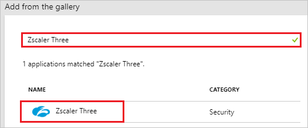
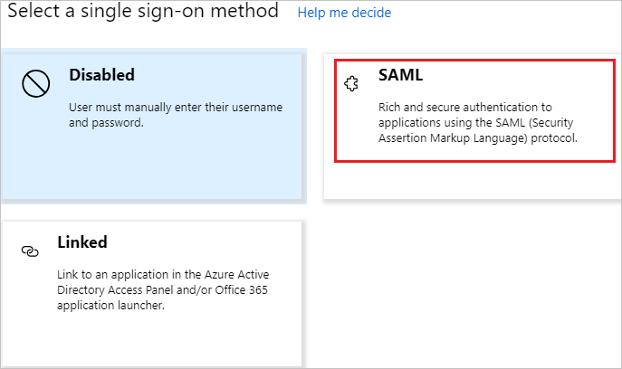
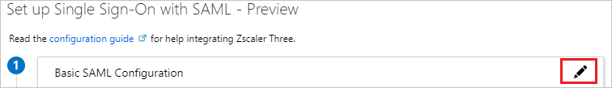
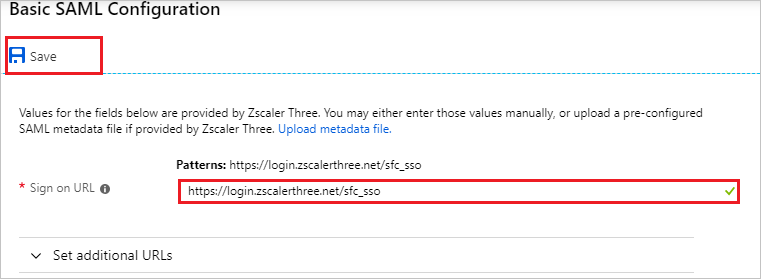
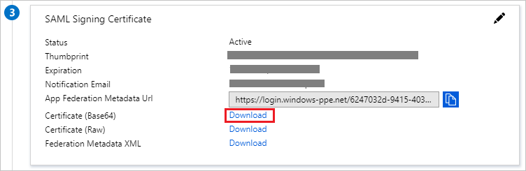
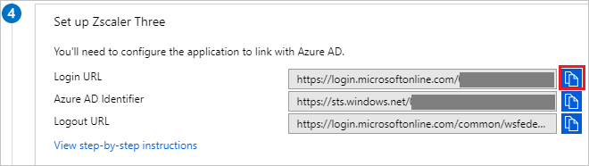
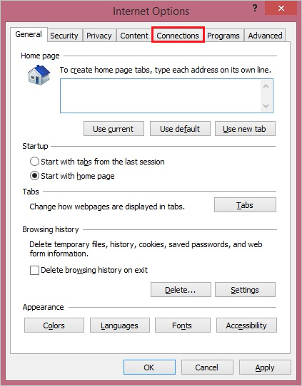
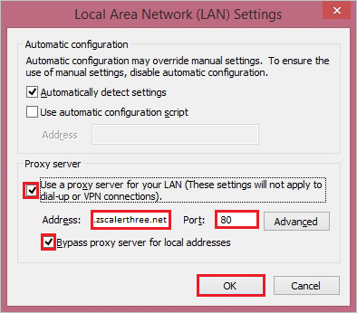
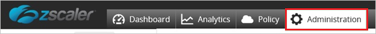
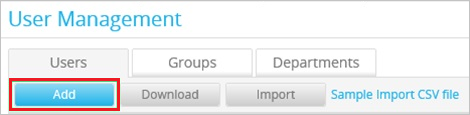

# Tutorial: Azure Active Directory integration with Zscaler Three

In this tutorial, you learn how to integrate Zscaler Three with Azure Active Directory (Azure AD).

Integrating Zscaler Three with Azure AD provides you with the following benefits:

- You can control in Azure AD who has access to Zscaler Three
- You can enable your users to automatically get signed-on to Zscaler Three (Single Sign-On) with their Azure AD accounts
- You can manage your accounts in one central location - the Azure portal

If you want to know more details about SaaS app integration with Azure AD, see [what is application access and single sign-on with Azure Active Directory](../manage-apps/what-is-single-sign-on.md).

## Prerequisites

To configure Azure AD integration with Zscaler Three, you need the following items:

- An Azure AD subscription
- A Zscaler Three single sign-on enabled subscription

> [!NOTE]
> To test the steps in this tutorial, we do not recommend using a production environment.

To test the steps in this tutorial, you should follow these recommendations:

- Do not use your production environment, unless it is necessary.
- If you don't have an Azure AD trial environment, you can get a one-month trial here: [Trial offer](https://azure.microsoft.com/pricing/free-trial/).

## Scenario description

In this tutorial, you test Azure AD single sign-on in a test environment.
The scenario outlined in this tutorial consists of two main building blocks:

1. Adding Zscaler Three from the gallery
2. Configuring and testing Azure AD single sign-on

## Adding Zscaler Three from the gallery

To configure the integration of Zscaler Three into Azure AD, you need to add Zscaler Three from the gallery to your list of managed SaaS apps.

**To add Zscaler Three from the gallery, perform the following steps:**

1. In the **[Azure portal](https://portal.azure.com)**, on the left navigation panel, click **Azure Active Directory** icon.

	![Active Directory][1]

2. Navigate to **Enterprise Applications** and then select the **All Applications** option.

	![Applications][2]

3. Click **New application** button on the top of dialog.

	![Applications][3]

4. In the results panel, select **Zscaler Three**, and then click **Add** button to add the application.

	

## Configuring and testing Azure AD single sign-on

In this section, you configure and test Azure AD single sign-on with Zscaler Three based on a test user called "Britta Simon".

For single sign-on to work, Azure AD needs to know what the counterpart user in Zscaler Three is to a user in Azure AD. In other words, a link relationship between an Azure AD user and the related user in Zscaler Three needs to be established.

To configure and test Azure AD single sign-on with Zscaler Three, you need to complete the following building blocks:

1. **[Configuring Azure AD Single Sign-On](#configuring-azure-ad-single-sign-on)** - to enable your users to use this feature.
2. **[Configuring proxy settings](#configuring-proxy-settings)** - to configure the proxy settings in Internet Explorer
3. **[Creating an Azure AD test user](#creating-an-azure-ad-test-user)** - to test Azure AD single sign-on with Britta Simon.
4. **[Creating a Zscaler Three test user](#creating-a-zscaler-three-test-user)** - to have a counterpart of Britta Simon in Zscaler Three that is linked to the Azure AD representation of user.
5. **[Assigning the Azure AD test user](#assigning-the-azure-ad-test-user)** - to enable Britta Simon to use Azure AD single sign-on.
6. **[Testing Single Sign-On](#testing-single-sign-on)** - to verify whether the configuration works.

### Configuring Azure AD single sign-on

In this section, you enable Azure AD single sign-on in the Azure portal and configure single sign-on in your Zscaler Three application.

**To configure Azure AD single sign-on with Zscaler Three, perform the following steps:**

1. In the Azure portal, on the **Zscaler Three** application integration page, click **Single sign-on**.

	![Configure Single Sign-On][4]

2. On the **Select a Single sign-on method** dialog, select **SAML/WS-Fed** mode to enable single sign-on.

	

3. If you need to change to **SAML** mode from any another mode, click **Change single sign-on mode** on top of the screen.

    

4. On the **Set up Single Sign-On with SAML** page, click **Edit** icon to open **Basic SAML Configuration** dialog.

	

5. On the **Basic SAML Configuration** section, perform the following steps:

	

    In the Reply URL textbox, enter the URL: `https://login.zscalerthree.net/sfc_sso`

	> [!NOTE]
	> You have to update this value with the actual Sign-On URL. Contact [Zscaler Three Client support team](https://www.zscaler.com/company/contact) to get these values.

6. On the **SAML Signing Certificate** section, Click on **Download** to download **Certificate(Base64)** and then save the certificate file on your computer.

	

8. On the **Set up Zscaler Three** section, copy the **Login URL**.

	

9. In a different web browser window, log in to your Zscaler Three company site as an administrator.

10. In the menu on the top, click **Administration**.

	

9. Under **Manage Administrators & Roles**, click **Manage Users & Authentication**.

	

10. In the **Choose Authentication Options for your Organization** section, perform the following steps:

	

    a. Select **Authenticate using SAML Single Sign-On**.

    b. Click **Configure SAML Single Sign-On Parameters**.

11. On the **Configure SAML Single Sign-On Parameters** dialog page, perform the following steps, and then click **Done**

	

	a. Paste the **Login URL** value, which you have copied from the Azure portal into the **URL of the SAML Portal to which users are sent for authentication** textbox.

	b. In the **Attribute containing Login Name** textbox, type **NameID**.

	c. To upload your downloaded certificate, click **Zscaler pem**.

	d. Select **Enable SAML Auto-Provisioning**.

12. On the **Configure User Authentication** dialog page, perform the following steps:

    

    a. Click **Save**.

    b. Click **Activate Now**.

## Configuring proxy settings

### To configure the proxy settings in Internet Explorer

1. Start **Internet Explorer**.

2. Select **Internet options** from the **Tools** menu for open the **Internet Options** dialog.

	 

3. Click the **Connections** tab.
  
	 

4. Click **LAN settings** to open the **LAN Settings** dialog.

5. In the Proxy server section, perform the following steps:

	

    a. Select **Use a proxy server for your LAN**.

    b. In the Address textbox, type **gateway.zscalerthree.net**.

    c. In the Port textbox, type **80**.

    d. Select **Bypass proxy server for local addresses**.

    e. Click **OK** to close the **Local Area Network (LAN) Settings** dialog.

6. Click **OK** to close the **Internet Options** dialog.

### Creating an Azure AD test user

The objective of this section is to create a test user in the Azure portal called Britta Simon.

1. In the Azure portal, in the left pane, select **Azure Active Directory**, select **Users**, and then select **All users**.

	![Create Azure AD User][100]

2. Select **New user** at the top of the screen.

	 

3. In the User properties, perform the following steps.

	

	a. In the **Name** field enter **BrittaSimon**.
  
    b. In the **User name** field type **brittasimon@yourcompanydomain.extension**  
    For example, BrittaSimon@contoso.com

    c. Select **Properties**, select the **Show password** check box, and then write down the value that's displayed in the Password box.

    d. Click **Create**.

### Creating a Zscaler Three test user

To enable Azure AD users to log in to Zscaler Three, they must be provisioned to Zscaler Three. In the case of Zscaler Three, provisioning is a manual task.

### To configure user provisioning, perform the following steps:

1. Log in to your **Zscaler Three** tenant.

2. Click **Administration**.

	

3. Click **User Management**.

	 

4. In the **Users** tab, click **Add**.

	

5. In the Add User section, perform the following steps:

	

    a. Type the **UserID**, **User Display Name**, **Password**, **Confirm Password**, and then select **Groups** and the **Department** of a valid Azure AD account you want to provision.

    b. Click **Save**.

> [!NOTE]
> You can use any other Zscaler Three user account creation tools or APIs provided by Zscaler Three to provision Azure AD user accounts.

### Assigning the Azure AD test user

In this section, you enable Britta Simon to use Azure single sign-on by granting access to Zscaler Three.

1. In the Azure portal, select **Enterprise Applications**, select **All applications**.

	![Assign User][201]

2. In the applications list, select **Zscaler Three**.

	

3. In the menu on the left, click **Users and groups**.

	![Assign User][202]

4. Click **Add user** button and then select **Users and groups** on **Add Assignment** dialog.

	![Assign User][203]

5. In the **Users and groups** dialog select **Britta Simon** in the Users list, then click the **Select** button at the bottom of the screen.

6. In the **Add Assignment** dialog click the **Assign** button.

### Testing single sign-on

In this section, you test your Azure AD single sign-on configuration using the Access Panel.

When you click the Zscaler Three tile in the Access Panel, you should get automatically signed-on to your Zscaler Three application.
For more information about the Access Panel, see [Introduction to the Access Panel](../user-help/active-directory-saas-access-panel-introduction.md).

## Additional resources

* [List of Tutorials on How to Integrate SaaS Apps with Azure Active Directory](tutorial-list.md)
* [What is application access and single sign-on with Azure Active Directory?](../manage-apps/what-is-single-sign-on.md)

<!--Image references-->

[1]: ./media/zscaler-three-tutorial/tutorial_general_01.png
[2]: ./media/zscaler-three-tutorial/tutorial_general_02.png
[3]: ./media/zscaler-three-tutorial/tutorial_general_03.png
[4]: ./media/zscaler-three-tutorial/tutorial_general_04.png

[100]: ./media/zscaler-three-tutorial/tutorial_general_100.png

[200]: ./media/zscaler-three-tutorial/tutorial_general_200.png
[201]: ./media/zscaler-three-tutorial/tutorial_general_201.png
[202]: ./media/zscaler-three-tutorial/tutorial_general_202.png
[203]: ./media/zscaler-three-tutorial/tutorial_general_203.png