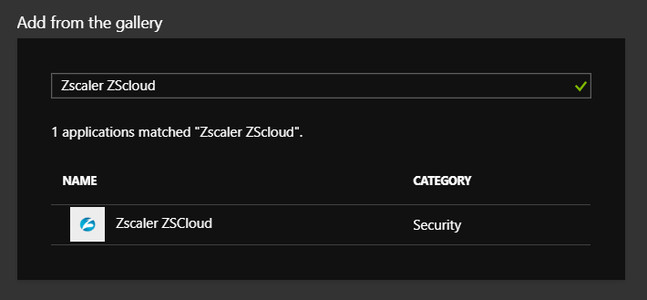
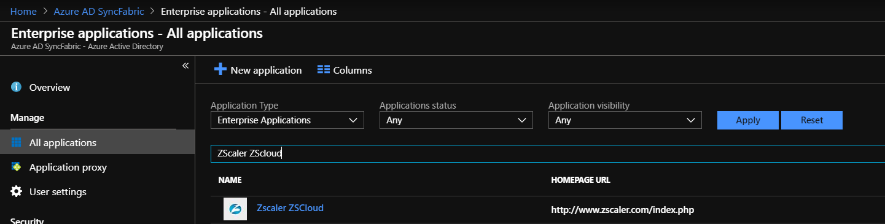

# Tutorial: Configure Zscaler ZSCloud for automatic user provisioning

The objective of this tutorial is to demonstrate the steps to be performed in Zscaler ZSCloud and Azure Active Directory (Azure AD) to configure Azure AD to automatically provision and de-provision users and/or groups to Zscaler ZSCloud.

> [!NOTE]
> This tutorial describes a connector built on top of the Azure AD User Provisioning Service. For important details on what this service does, how it works, and frequently asked questions, see [Automate user provisioning and deprovisioning to SaaS applications with Azure Active Directory](../active-directory-saas-app-provisioning.md).
> 
> This connector is currently in Public Preview. For more information on the general Microsoft Azure terms of use for Preview features, see [Supplemental Terms of Use for Microsoft Azure Previews](https://azure.microsoft.com/support/legal/preview-supplemental-terms/).

## Prerequisites

The scenario outlined in this tutorial assumes that you already have the following:

*   An Azure AD tenant
*   A Zscaler ZSCloud tenant
*   A user account in Zscaler ZSCloud with Admin permissions

> [!NOTE]
> The Azure AD provisioning integration relies on the Zscaler ZSCloud SCIM API, which is available to Zscaler ZSCloud developers for accounts with the Enterprise package.

## Adding Zscaler ZSCloud from the gallery
Before configuring Zscaler ZSCloud for automatic user provisioning with Azure AD, you need to add Zscaler ZSCloud from the Azure AD application gallery to your list of managed SaaS applications.

**To add Zscaler ZSCloud from the Azure AD application gallery, perform the following steps:**

1. In the **[Azure portal](https://portal.azure.com)**, on the left navigation panel, click on the **Azure Active Directory** icon.

	![The Azure Active Directory button][1]

2. Navigate to **Enterprise applications** > **All applications**.

	![The Enterprise applications Section][2]

3. To add Zscaler ZSCloud, click the **New application** button on the top of the dialog.

	![The New application button][3]

4. In the search box, type **Zscaler ZSCloud**.

	

5. In the results panel, select **Zscaler ZSCloud**, and then click the **Add** button to add Zscaler ZSCloud to your list of SaaS applications.

	

	

## Assigning users to Zscaler ZSCloud

Azure Active Directory uses a concept called "assignments" to determine which users should receive access to selected apps. In the context of automatic user provisioning, only the users and/or groups that have been "assigned" to an application in Azure AD are synchronized.

Before configuring and enabling automatic user provisioning, you should decide which users and/or groups in Azure AD need access to Zscaler ZSCloud. Once decided, you can assign these users and/or groups to Zscaler ZSCloud by following the instructions here:

*   [Assign a user or group to an enterprise app](https://docs.microsoft.com/azure/active-directory/active-directory-coreapps-assign-user-azure-portal)

### Important tips for assigning users to Zscaler ZSCloud

*	It is recommended that a single Azure AD user is assigned to Zscaler ZSCloud to test the automatic user provisioning configuration. Additional users and/or groups may be assigned later.

*	When assigning a user to Zscaler ZSCloud, you must select any valid application-specific role (if available) in the assignment dialog. Users with the **Default Access** role are excluded from provisioning.

## Configuring automatic user provisioning to Zscaler ZSCloud

This section guides you through the steps to configure the Azure AD provisioning service to create, update, and disable users and/or groups in Zscaler ZSCloud based on user and/or group assignments in Azure AD.

> [!TIP]
> You may also choose to enable SAML-based single sign-on for Zscaler ZSCloud, following the instructions provided in the [Zscaler ZSCloud single sign-on tutorial](zscaler-zsCloud-tutorial.md). Single sign-on can be configured independently of automatic user provisioning, though these two features compliment each other.

### To configure automatic user provisioning for Zscaler ZSCloud in Azure AD:

1. Sign in to the [Azure portal](https://portal.azure.com) and browse to **Azure Active Directory > Enterprise applications > All applications**.

2. Select Zscaler ZSCloud from your list of SaaS applications.

	

3. Select the **Provisioning** tab.

	

4. Set the **Provisioning Mode** to **Automatic**.

	

5. Under the **Admin Credentials** section, input the **Tenant URL** and **Secret Token** of your Zscaler ZSCloud account as described in Step 6.

6. To obtain the **Tenant URL** and **Secret Token**, navigate to **Administration > Authentication Settings** in the Zscaler ZSCloud portal user interface and click on **SAML** under **Authentication Type**. 

	

	Click on **Configure SAML** to open **Configuration SAML** options. 

	
	
	Select **Enable SCIM-Based Provisioning** to retrieve **Base URL** and **Bearer Token**, then save the settings. Copy the **Base URL** to **Tenant URL** and **Bearer Token**  to **Secret Token** in the Azure portal.

7. Upon populating the fields shown in Step 5, click **Test Connection** to ensure Azure AD can connect to Zscaler ZSCloud. If the connection fails, ensure your Zscaler ZSCloud account has Admin permissions and try again.

	
	
8. In the **Notification Email** field, enter the email address of a person or group who should receive the provisioning error notifications and check the checkbox **Send an email notification when a failure occurs**.

	

9. Click **Save**.

10. Under the **Mappings** section, select **Synchronize Azure Active Directory Users to Zscaler ZSCloud**.

	

11. Review the user attributes that are synchronized from Azure AD to Zscaler ZSCloud in the **Attribute Mapping** section. The attributes selected as **Matching** properties are used to match the user accounts in Zscaler ZSCloud for update operations. Select the **Save** button to commit any changes.

	

12. Under the **Mappings** section, select **Synchronize Azure Active Directory Groups to Zscaler ZSCloud**.

	

13. Review the group attributes that are synchronized from Azure AD to Zscaler ZSCloud in the **Attribute Mapping** section. The attributes selected as **Matching** properties are used to match the groups in Zscaler ZSCloud for update operations. Select the **Save** button to commit any changes.

	

14. To configure scoping filters, refer to the following instructions provided in the [Scoping filter tutorial](./../active-directory-saas-scoping-filters.md).

15. To enable the Azure AD provisioning service for Zscaler ZSCloud, change the **Provisioning Status** to **On** in the **Settings** section.

	

16. Define the users and/or groups that you would like to provision to Zscaler ZSCloud by choosing the desired values in **Scope** in the **Settings** section.

	

17. When you are ready to provision, click **Save**.

	

This operation starts the initial synchronization of all users and/or groups defined in **Scope** in the **Settings** section. The initial sync takes longer to perform than subsequent syncs, which occur approximately every 40 minutes as long as the Azure AD provisioning service is running. You can use the **Synchronization Details** section to monitor progress and follow links to provisioning activity report, which describes all actions performed by the Azure AD provisioning service on Zscaler ZSCloud.

For more information on how to read the Azure AD provisioning logs, see [Reporting on automatic user account provisioning](../active-directory-saas-provisioning-reporting.md).

## Additional resources

* [Managing user account provisioning for Enterprise Apps](../manage-apps/configure-automatic-user-provisioning-portal.md)
* [What is application access and single sign-on with Azure Active Directory?](../manage-apps/what-is-single-sign-on.md)

## Next steps

* [Learn how to review logs and get reports on provisioning activity](../active-directory-saas-provisioning-reporting.md)

<!--Image references-->
[1]: ./media/zscaler-zscloud-provisioning-tutorial/tutorial-general-01.png
[2]: ./media/zscaler-zscloud-provisioning-tutorial/tutorial-general-02.png
[3]: ./media/zscaler-zscloud-provisioning-tutorial/tutorial-general-03.png
