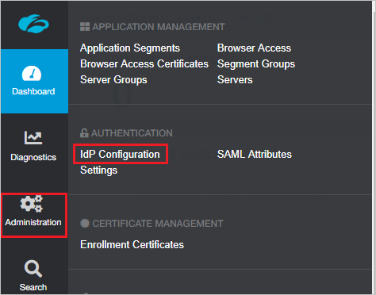
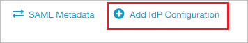
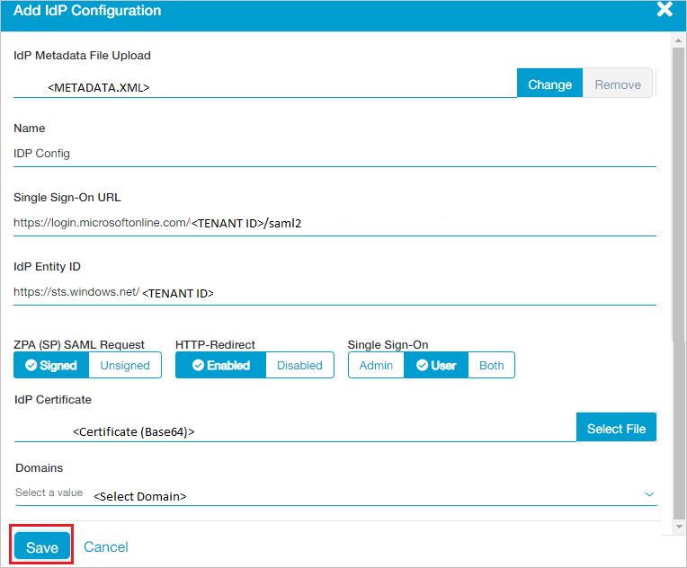

# Tutorial: Integrate Zscaler Private Access (ZPA) with Azure Active Directory

In this tutorial, you'll learn how to integrate Zscaler Private Access (ZPA) with Azure Active Directory (Azure AD). When you integrate Zscaler Private Access (ZPA) with Azure AD, you can:

* Control in Azure AD who has access to Zscaler Private Access (ZPA).
* Enable your users to be automatically signed-in to Zscaler Private Access (ZPA) with their Azure AD accounts.
* Manage your accounts in one central location - the Azure portal.

To learn more about SaaS app integration with Azure AD, see [What is application access and single sign-on with Azure Active Directory](https://docs.microsoft.com/azure/active-directory/active-directory-appssoaccess-whatis).

## Prerequisites

To get started, you need the following items:

* An Azure AD subscription. If you don't have a subscription, you can get a [free account](https://azure.microsoft.com/free/).
* Zscaler Private Access (ZPA) single sign-on (SSO) enabled subscription.

## Scenario description

In this tutorial, you configure and test Azure AD SSO in a test environment. Zscaler Private Access (ZPA) supports **SP** initiated SSO.

## Adding Zscaler Private Access (ZPA) from the gallery

To configure the integration of Zscaler Private Access (ZPA) into Azure AD, you need to add Zscaler Private Access (ZPA) from the gallery to your list of managed SaaS apps.

1. Sign in to the [Azure portal](https://portal.azure.com) using either a work or school account, or a personal Microsoft account.
1. On the left navigation pane, select the **Azure Active Directory** service.
1. Navigate to **Enterprise Applications** and then select **All Applications**.
1. To add new application, select **New application**.
1. In the **Add from the gallery** section, type **Zscaler Private Access (ZPA)** in the search box.
1. Select **Zscaler Private Access (ZPA)** from results panel and then add the app. Wait a few seconds while the app is added to your tenant.

## Configure and test Azure AD single sign-on

Configure and test Azure AD SSO with Zscaler Private Access (ZPA) using a test user called **Britta Simon**. For SSO to work, you need to establish a link relationship between an Azure AD user and the related user in Zscaler Private Access (ZPA).

To configure and test Azure AD SSO with Zscaler Private Access (ZPA), complete the following building blocks:

1. **[Configure Azure AD SSO](#configure-azure-ad-sso)** to enable your users to use this feature.
2. **[Configure Zscaler Private Access (ZPA)](#configure-zscaler-private-access-zpa)** to configure the SSO settings on application side.
3. **[Create an Azure AD test user](#create-an-azure-ad-test-user)** to test Azure AD single sign-on with Britta Simon.
4. **[Assign the Azure AD test user](#assign-the-azure-ad-test-user)** to enable Britta Simon to use Azure AD single sign-on.
5. **[Create Zscaler Private Access (ZPA) test user](#create-zscaler-private-access-zpa-test-user)** to have a counterpart of Britta Simon in Zscaler Private Access (ZPA) that is linked to the Azure AD representation of user.
6. **[Test SSO](#test-sso)** to verify whether the configuration works.

### Configure Azure AD SSO

Follow these steps to enable Azure AD SSO in the Azure portal.

1. In the [Azure portal](https://portal.azure.com/), on the **Zscaler Private Access (ZPA)** application integration page, find the **Manage** section and select **Single sign-on**.
1. On the **Select a Single sign-on method** page, select **SAML**.
1. On the **Set up Single Sign-On with SAML** page, click the edit/pen icon for **Basic SAML Configuration** to edit the settings.

   

1. On the **Basic SAML Configuration** page, enter the values for the following fields:

    1. In the **Sign on URL** text box, type a URL using the following pattern:
    `https://samlsp.private.zscaler.com/auth/login?domain=<your-domain-name>`

    1. In the **Identifier (Entity ID)** text box, type a URL:
    `https://samlsp.private.zscaler.com/auth/metadata`

	> [!NOTE]
	> The **Sign on URL** value is not real. Update the value with the actual Sign on URL. Contact [Zscaler Private Access (ZPA) Client support team](https://help.zscaler.com/zpa-submit-ticket) to get the value. You can also refer to the patterns shown in the **Basic SAML Configuration** section in the Azure portal.

1. On the **Set up Single Sign-On with SAML** page, in the **SAML Signing Certificate** section, find **Federation Metadata XML** and select **Download** to download the certificate and save it on your computer.

   

1. On the **Set up Zscaler Private Access (ZPA)** section, copy the appropriate URL(s) based on your requirement.

   

### Configure Zscaler Private Access (ZPA)

1. To automate the configuration within Zscaler Private Access (ZPA), you need to install **My Apps Secure Sign-in browser extension** by clicking **Install the extension**.

	

2. After adding extension to the browser, click on **Setup Zscaler Private Access (ZPA)** will direct you to the Zscaler Private Access (ZPA) application. From there, provide the admin credentials to sign into Zscaler Private Access (ZPA). The browser extension will automatically configure the application for you and automate steps 3-6.

	

3. If you want to setup Zscaler Private Access (ZPA) manually, open a new web browser window and sign into your Zscaler Private Access (ZPA) company site as an administrator and perform the following steps:

4. From the left side of menu, click **Administration** and navigate to **AUTHENTICATION** section click **IdP Configuration**.

	

5. In the top right corner, click **Add IdP Configuration**. 

	

6. On the **Add IdP Configuration** page perform the following steps:
 
	

	a. Click **Select File** to upload the downloaded Metadata file from Azure AD in the **IdP Metadata File Upload** field.

	b. It reads the **IdP metadata** from Azure AD and populates all the fields information as shown below.

	

	c. Select your domain from **Domains** field.
	
	d. Click **Save**.

### Create an Azure AD test user

In this section, you'll create a test user in the Azure portal called Britta Simon.

1. From the left pane in the Azure portal, select **Azure Active Directory**, select **Users**, and then select **All users**.
1. Select **New user** at the top of the screen.
1. In the **User** properties, follow these steps:
   1. In the **Name** field, enter `Britta Simon`.  
   1. In the **User name** field, enter the username@companydomain.extension. For example, `BrittaSimon@contoso.com`.
   1. Select the **Show password** check box, and then write down the value that's displayed in the **Password** box.
   1. Click **Create**.

### Assign the Azure AD test user

In this section, you'll enable Britta Simon to use Azure single sign-on by granting access to Zscaler Private Access (ZPA).

1. In the Azure portal, select **Enterprise Applications**, and then select **All applications**.
1. In the applications list, select **Zscaler Private Access (ZPA)**.
1. In the app's overview page, find the **Manage** section and select **Users and groups**.

   

1. Select **Add user**, then select **Users and groups** in the **Add Assignment** dialog.

	

1. In the **Users and groups** dialog, select **Britta Simon** from the Users list, then click the **Select** button at the bottom of the screen.
1. If you're expecting any role value in the SAML assertion, in the **Select Role** dialog, select the appropriate role for the user from the list and then click the **Select** button at the bottom of the screen.
1. In the **Add Assignment** dialog, click the **Assign** button.

### Create Zscaler Private Access (ZPA) test user

In this section, you create a user called Britta Simon in Zscaler Private Access (ZPA). Please work with [Zscaler Private Access (ZPA) support team](https://help.zscaler.com/zpa-submit-ticket) to add the users in the Zscaler Private Access (ZPA) platform.

### Test SSO

When you select the Zscaler Private Access (ZPA) tile in the Access Panel, you should be automatically signed in to the Zscaler Private Access (ZPA) for which you set up SSO. For more information about the Access Panel, see [Introduction to the Access Panel](https://docs.microsoft.com/azure/active-directory/active-directory-saas-access-panel-introduction).

## Additional Resources

- [List of Tutorials on How to Integrate SaaS Apps with Azure Active Directory](https://docs.microsoft.com/azure/active-directory/active-directory-saas-tutorial-list)

- [What is application access and single sign-on with Azure Active Directory?](https://docs.microsoft.com/azure/active-directory/active-directory-appssoaccess-whatis)

- [What is Conditional Access in Azure Active Directory?](https://docs.microsoft.com/azure/active-directory/conditional-access/overview)