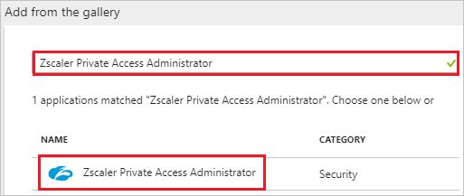
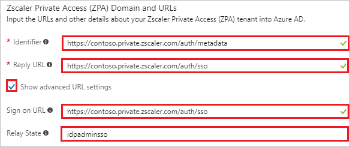
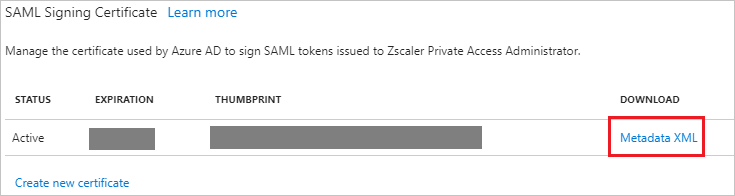
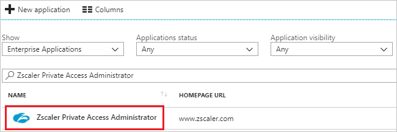

---
title: 'Tutorial: Azure Active Directory integration with Zscaler Private Access Administrator | Microsoft Docs'
description: Learn how to configure single sign-on between Azure Active Directory and Zscaler Private Access Administrator.
services: active-directory
documentationCenter: na
author: jeevansd
manager: femila
ms.reviewer: joflore

ms.assetid: c87392a7-e7fe-4cdc-a8e6-afe1ed975172
ms.service: active-directory
ms.component: saas-app-tutorial
ms.workload: identity
ms.tgt_pltfrm: na
ms.devlang: na
ms.topic: article
ms.date: 02/08/2018
ms.author: jeedes

---
# Tutorial: Azure Active Directory integration with Zscaler Private Access Administrator

In this tutorial, you learn how to integrate Zscaler Private Access Administrator with Azure Active Directory (Azure AD).

Integrating Zscaler Private Access Administrator with Azure AD provides you with the following benefits:

- You can control in Azure AD who has access to Zscaler Private Access Administrator.
- You can enable your users to automatically get signed-on to Zscaler Private Access Administrator (Single Sign-On) with their Azure AD accounts.
- You can manage your accounts in one central location - the Azure portal.

If you want to know more details about SaaS app integration with Azure AD, see [what is application access and single sign-on with Azure Active Directory](../manage-apps/what-is-single-sign-on.md).

## Prerequisites

To configure Azure AD integration with Zscaler Private Access Administrator, you need the following items:

- An Azure AD subscription
- A Zscaler Private Access Administrator single sign-on enabled subscription

> [!NOTE]
> To test the steps in this tutorial, we do not recommend using a production environment.

To test the steps in this tutorial, you should follow these recommendations:

- Do not use your production environment, unless it is necessary.
- If you don't have an Azure AD trial environment, you can [get a one-month trial](https://azure.microsoft.com/pricing/free-trial/).

## Scenario description
In this tutorial, you test Azure AD single sign-on in a test environment. 
The scenario outlined in this tutorial consists of two main building blocks:

1. Adding Zscaler Private Access Administrator from the gallery
1. Configuring and testing Azure AD single sign-on

## Adding Zscaler Private Access Administrator from the gallery
To configure the integration of Zscaler Private Access Administrator into Azure AD, you need to add Zscaler Private Access Administrator from the gallery to your list of managed SaaS apps.

**To add Zscaler Private Access Administrator from the gallery, perform the following steps:**

1. In the **[Azure portal](https://portal.azure.com)**, on the left navigation panel, click **Azure Active Directory** icon. 

	![The Azure Active Directory button][1]

1. Navigate to **Enterprise applications**. Then go to **All applications**.

	![The Enterprise applications blade][2]
	
1. To add new application, click **New application** button on the top of dialog.

	![The New application button][3]

1. In the search box, type **Zscaler Private Access Administrator**, select **Zscaler Private Access Administrator** from result panel then click **Add** button to add the application.

	

## Configure and test Azure AD single sign-on

In this section, you configure and test Azure AD single sign-on with Zscaler Private Access Administrator based on a test user called "Britta Simon".

For single sign-on to work, Azure AD needs to know what the counterpart user in Zscaler Private Access Administrator is to a user in Azure AD. In other words, a link relationship between an Azure AD user and the related user in Zscaler Private Access Administrator needs to be established.

To configure and test Azure AD single sign-on with Zscaler Private Access Administrator, you need to complete the following building blocks:

1. **[Configure Azure AD Single Sign-On](#configure-azure-ad-single-sign-on)** - to enable your users to use this feature.
1. **[Create an Azure AD test user](#create-an-azure-ad-test-user)** - to test Azure AD single sign-on with Britta Simon.
1. **[Create a Zscaler Private Access Administrator test user](#create-a-zscaler-private-access-administrator-test-user)** - to have a counterpart of Britta Simon in Zscaler Private Access Administrator that is linked to the Azure AD representation of user.
1. **[Assign the Azure AD test user](#assign-the-azure-ad-test-user)** - to enable Britta Simon to use Azure AD single sign-on.
1. **[Test single sign-on](#test-single-sign-on)** - to verify whether the configuration works.

### Configure Azure AD single sign-on

In this section, you enable Azure AD single sign-on in the Azure portal and configure single sign-on in your Zscaler Private Access Administrator application.

**To configure Azure AD single sign-on with Zscaler Private Access Administrator, perform the following steps:**

1. In the Azure portal, on the **Zscaler Private Access Administrator** application integration page, click **Single sign-on**.

	![Configure single sign-on link][4]

1. On the **Single sign-on** dialog, select **Mode** as	**SAML-based Sign-on** to enable single sign-on.
 
	

1. On the **Zscaler Private Access Administrator Domain and URLs** section if you wish to configure the application in **IDP** initiated mode:

	

    a. In the **Identifier** textbox, type a URL using the following pattern: `https://<subdomain>.private.zscaler.com/auth/metadata`

	b. In the **Reply URL** textbox, type a URL using the following pattern: `https://<subdomain>.private.zscaler.com/auth/sso`

	c. Check **Show advanced URL settings**

	d. In the **RelayState** textbox, type a value: `idpadminsso`

1.  If you wish to configure the application in **SP** initiated mode perform the following steps:

	In the **Sign-on URL** textbox, type a URL using the following pattern: `https://<subdomain>.private.zscaler.com/auth/sso`

	> [!NOTE] 
	> These values are not real. Update these values with the actual Identifier, Reply URL and Sign-on URL. Contact [Zscaler Private Access Administrator support team](https://help.zscaler.com/zpa-submit-ticket) to get these values.
 
1. On the **SAML Signing Certificate** section, click **Metadata XML** and then save the metadata file on your computer.

	 

1. Click **Save** button.

	

1. In a different web browser window, login to Zscaler Private Access Administrator as an Administrator.

1. On the top, click **Administration** and navigate to **AUTHENTICATION** section click **IdP Configuration**.

	

1. In the top right corner, click **Add IdP Configuration**. 

	

1. On the **Add IdP Configuration** page perform the following steps:
 
	

	a. Click **Select File** to upload the downloaded Metadata file from Azure AD in the **IdP Metadata File Upload** field.

	b. It reads the **IdP metadata** from Azure AD and populates all the fields information as shown below.

	

	c. Select **Single Sign On** as **Administrator**.

	d. Select your domain from **Domains** field.
	
	e. Click **Save**.

> [!TIP]
> You can now read a concise version of these instructions inside the [Azure portal](https://portal.azure.com), while you are setting up the app!  After adding this app from the **Active Directory > Enterprise Applications** section, simply click the **Single Sign-On** tab and access the embedded documentation through the **Configuration** section at the bottom. You can read more about the embedded documentation feature here: [Azure AD embedded documentation]( https://go.microsoft.com/fwlink/?linkid=845985)

### Create an Azure AD test user

The objective of this section is to create a test user in the Azure portal called Britta Simon.

   ![Create an Azure AD test user][100]

**To create a test user in Azure AD, perform the following steps:**

1. In the Azure portal, in the left pane, click the **Azure Active Directory** button.

    

1. To display the list of users, go to **Users and groups**, and then click **All users**.

    

1. To open the **User** dialog box, click **Add** at the top of the **All Users** dialog box.

    

1. In the **User** dialog box, perform the following steps:

    

    a. In the **Name** box, type **BrittaSimon**.

    b. In the **User name** box, type the email address of user Britta Simon.

    c. Select the **Show Password** check box, and then write down the value that's displayed in the **Password** box.

    d. Click **Create**.
  
### Create a Zscaler Private Access Administrator test user

To enable Azure AD users to log in to Zscaler Private Access Administrator, they must be provisioned into Zscaler Private Access Administrator. In the case of Zscaler Private Access Administrator, provisioning is a manual task.

**To provision a user account, perform the following steps:**

1. Log in to your Zscaler Private Access Administrator company site as an administrator.

1. On the top, click **Administration** and navigate to **AUTHENTICATION** section click **IdP Configuration**.

	

1. Click **Administrators** from left side of the menu.

    

1. In the top right corner, click **Add Administrator**:

	

1. In the **Add Administrator** page, perform the following steps:

	

	a. In the **Username** textbox, enter the email of user like **BrittaSimon@contoso.com**.

	b. In the **Password** textbox, type the Password.

	c. In the **Confirm Password** textbox, type the Password.

	d. Select **Role** as **Zscaler Private Access Administrator**.

	e. In the **Email** textbox, enter the email of user like **BrittaSimon@contoso.com**.

	f. In the **Phone** textbox, type the Phone number.

	g. In the **Timezone** textbox, select the Timezone.

    h. Click **Save**.	

### Assign the Azure AD test user

In this section, you enable Britta Simon to use Azure single sign-on by granting access to Zscaler Private Access Administrator.

![Assign the user role][200] 

**To assign Britta Simon to Zscaler Private Access Administrator, perform the following steps:**

1. In the Azure portal, open the applications view, and then navigate to the directory view and go to **Enterprise applications** then click **All applications**.

	![Assign User][201] 

1. In the applications list, select **Zscaler Private Access Administrator**.

	  

1. In the menu on the left, click **Users and groups**.

	![The "Users and groups" link][202]

1. Click **Add** button. Then select **Users and groups** on **Add Assignment** dialog.

	![The Add Assignment pane][203]

1. On **Users and groups** dialog, select **Britta Simon** in the Users list.

1. Click **Select** button on **Users and groups** dialog.

1. Click **Assign** button on **Add Assignment** dialog.
	
### Test single sign-on

In this section, you test your Azure AD single sign-on configuration using the Access Panel.

When you click the Zscaler Private Access Administrator tile in the Access Panel, you should get automatically signed-on to your Zscaler Private Access Administrator application.
For more information about the Access Panel, see [Introduction to the Access Panel](../user-help/active-directory-saas-access-panel-introduction.md). 

## Additional resources

* [List of Tutorials on How to Integrate SaaS Apps with Azure Active Directory](tutorial-list.md)
* [What is application access and single sign-on with Azure Active Directory?](../manage-apps/what-is-single-sign-on.md)

<!--Image references-->

[1]: ./media/zscalerprivateaccessadministrator-tutorial/tutorial_general_01.png
[2]: ./media/zscalerprivateaccessadministrator-tutorial/tutorial_general_02.png
[3]: ./media/zscalerprivateaccessadministrator-tutorial/tutorial_general_03.png
[4]: ./media/zscalerprivateaccessadministrator-tutorial/tutorial_general_04.png

[100]: ./media/zscalerprivateaccessadministrator-tutorial/tutorial_general_100.png

[200]: ./media/zscalerprivateaccessadministrator-tutorial/tutorial_general_200.png
[201]: ./media/zscalerprivateaccessadministrator-tutorial/tutorial_general_201.png
[202]: ./media/zscalerprivateaccessadministrator-tutorial/tutorial_general_202.png
[203]: ./media/zscalerprivateaccessadministrator-tutorial/tutorial_general_203.png

