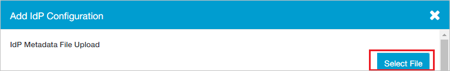
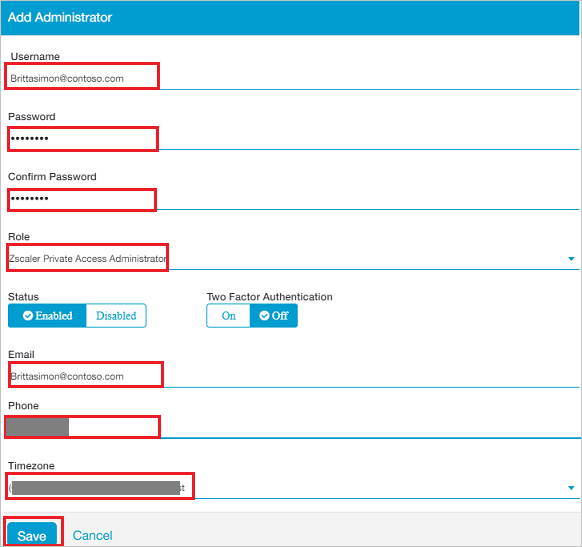

# Tutorial: Azure Active Directory integration with Zscaler Private Access Administrator

In this tutorial, you learn how to integrate Zscaler Private Access Administrator with Azure Active Directory (Azure AD).
Integrating Zscaler Private Access Administrator with Azure AD provides you with the following benefits:

* You can control in Azure AD who has access to Zscaler Private Access Administrator.
* You can enable your users to be automatically signed-in to Zscaler Private Access Administrator (Single Sign-On) with their Azure AD accounts.
* You can manage your accounts in one central location - the Azure portal.

If you want to know more details about SaaS app integration with Azure AD, see [What is application access and single sign-on with Azure Active Directory](https://docs.microsoft.com/azure/active-directory/active-directory-appssoaccess-whatis).
If you don't have an Azure subscription, [create a free account](https://azure.microsoft.com/free/) before you begin.

## Prerequisites

To configure Azure AD integration with Zscaler Private Access Administrator, you need the following items:

* An Azure AD subscription. If you don't have an Azure AD environment, you can get a [free account](https://azure.microsoft.com/free/)
* Zscaler Private Access Administrator single sign-on enabled subscription

## Scenario description

In this tutorial, you configure and test Azure AD single sign-on in a test environment.

* Zscaler Private Access Administrator supports **SP** and **IDP** initiated SSO

## Adding Zscaler Private Access Administrator from the gallery

To configure the integration of Zscaler Private Access Administrator into Azure AD, you need to add Zscaler Private Access Administrator from the gallery to your list of managed SaaS apps.

**To add Zscaler Private Access Administrator from the gallery, perform the following steps:**

1. In the **[Azure portal](https://portal.azure.com)**, on the left navigation panel, click **Azure Active Directory** icon.

	

2. Navigate to **Enterprise Applications** and then select the **All Applications** option.

	

3. To add new application, click **New application** button on the top of dialog.

	

4. In the search box, type **Zscaler Private Access Administrator**, select **Zscaler Private Access Administrator** from result panel then click **Add** button to add the application.

	

## Configure and test Azure AD single sign-on

In this section, you configure and test Azure AD single sign-on with Zscaler Private Access Administrator based on a test user called **Britta Simon**.
For single sign-on to work, a link relationship between an Azure AD user and the related user in Zscaler Private Access Administrator needs to be established.

To configure and test Azure AD single sign-on with Zscaler Private Access Administrator, you need to complete the following building blocks:

1. **[Configure Azure AD Single Sign-On](#configure-azure-ad-single-sign-on)** - to enable your users to use this feature.
2. **[Configure Zscaler Private Access Administrator Single Sign-On](#configure-zscaler-private-access-administrator-single-sign-on)** - to configure the Single Sign-On settings on application side.
3. **[Create an Azure AD test user](#create-an-azure-ad-test-user)** - to test Azure AD single sign-on with Britta Simon.
4. **[Assign the Azure AD test user](#assign-the-azure-ad-test-user)** - to enable Britta Simon to use Azure AD single sign-on.
5. **[Create Zscaler Private Access Administrator test user](#create-zscaler-private-access-administrator-test-user)** - to have a counterpart of Britta Simon in Zscaler Private Access Administrator that is linked to the Azure AD representation of user.
6. **[Test single sign-on](#test-single-sign-on)** - to verify whether the configuration works.

### Configure Azure AD single sign-on

In this section, you enable Azure AD single sign-on in the Azure portal.

To configure Azure AD single sign-on with Zscaler Private Access Administrator, perform the following steps:

1. In the [Azure portal](https://portal.azure.com/), on the **Zscaler Private Access Administrator** application integration page, select **Single sign-on**.

    

2. On the **Select a Single sign-on method** dialog, select **SAML/WS-Fed** mode to enable single sign-on.

    

3. On the **Set up Single Sign-On with SAML** page, click **Edit** icon to open **Basic SAML Configuration** dialog.

	

4. On the **Basic SAML Configuration** section, if you wish to configure the application in **IDP** initiated mode, perform the following steps:

    

    a. In the **Identifier** text box, type a URL using the following pattern:
    `https://<subdomain>.private.zscaler.com/auth/metadata`

    b. In the **Reply URL** text box, type a URL using the following pattern:
    `https://<subdomain>.private.zscaler.com/auth/sso`

	c. Click **Set additional URLs**.

	d. In the **Relay State** text box, type a URL:
    `idpadminsso`

5.  If you wish to configure the application in **SP** initiated mode, perform the following step:

    

    In the **Sign-on URL** text box, type a URL using the following pattern:
    `https://<subdomain>.private.zscaler.com/auth/sso`   

    > [!NOTE]
    > These values are not real. Update these values with the actual Identifier, Reply URL and Sign-on URL. Contact [Zscaler Private Access Administrator Client support team](https://help.zscaler.com/zpa-submit-ticket) to get these values. You can also refer to the patterns shown in the **Basic SAML Configuration** section in the Azure portal.

6. On the **Set up Single Sign-On with SAML** page, in the **SAML Signing Certificate** section, click **Download** to download the **Federation Metadata XML** from the given options as per your requirement and save it on your computer.

	

7. On the **Set up Zscaler Private Access Administrator** section, copy the appropriate URL(s) as per your requirement.

	

	a. Login URL

	b. Azure AD Identifier

	c. Logout URL

### Configure Zscaler Private Access Administrator Single Sign-On

1. In a different web browser window, sign to Zscaler Private Access Administrator as an Administrator.

2. On the top, click **Administration** and navigate to **AUTHENTICATION** section click **IdP Configuration**.

	

3. In the top right corner, click **Add IdP Configuration**. 

	

4. On the **Add IdP Configuration** page perform the following steps:
 
	

	a. Click **Select File** to upload the downloaded Metadata file from Azure AD in the **IdP Metadata File Upload** field.

	b. It reads the **IdP metadata** from Azure AD and populates all the fields information as shown below.

	

	c. Select **Single Sign On** as **Administrator**.

	d. Select your domain from **Domains** field.
	
	e. Click **Save**.

### Create an Azure AD test user 

The objective of this section is to create a test user in the Azure portal called Britta Simon.

1. In the Azure portal, in the left pane, select **Azure Active Directory**, select **Users**, and then select **All users**.

    

2. Select **New user** at the top of the screen.

    

3. In the User properties, perform the following steps.

    

    a. In the **Name** field enter **BrittaSimon**.
  
    b. In the **User name** field type `brittasimon@yourcompanydomain.extension`. For example, BrittaSimon@contoso.com

    c. Select **Show password** check box, and then write down the value that's displayed in the Password box.

    d. Click **Create**.

### Assign the Azure AD test user

In this section, you enable Britta Simon to use Azure single sign-on by granting access to Zscaler Private Access Administrator.

1. In the Azure portal, select **Enterprise Applications**, select **All applications**, then select **Zscaler Private Access Administrator**.

	

2. In the applications list, select **Zscaler Private Access Administrator**.

	

3. In the menu on the left, select **Users and groups**.

    

4. Click the **Add user** button, then select **Users and groups** in the **Add Assignment** dialog.

    

5. In the **Users and groups** dialog select **Britta Simon** in the Users list, then click the **Select** button at the bottom of the screen.

6. If you are expecting any role value in the SAML assertion then in the **Select Role** dialog select the appropriate role for the user from the list, then click the **Select** button at the bottom of the screen.

7. In the **Add Assignment** dialog click the **Assign** button.

### Create Zscaler Private Access Administrator test user

To enable Azure AD users to sign in to Zscaler Private Access Administrator, they must be provisioned into Zscaler Private Access Administrator. In the case of Zscaler Private Access Administrator, provisioning is a manual task.

**To provision a user account, perform the following steps:**

1. Sign in to your Zscaler Private Access Administrator company site as an administrator.

2. On the top, click **Administration** and navigate to **AUTHENTICATION** section click **IdP Configuration**.

	

3. Click **Administrators** from left side of the menu.

    

4. In the top right corner, click **Add Administrator**:

	

5. In the **Add Administrator** page, perform the following steps:

	

	a. In the **Username** textbox, enter the email of user like BrittaSimon@contoso.com.

	b. In the **Password** textbox, type the Password.

	c. In the **Confirm Password** textbox, type the Password.

	d. Select **Role** as **Zscaler Private Access Administrator**.

	e. In the **Email** textbox, enter the email of user like BrittaSimon@contoso.com.

	f. In the **Phone** textbox, type the Phone number.

	g. In the **Timezone** textbox, select the Timezone.

    h. Click **Save**.

### Test single sign-on 

In this section, you test your Azure AD single sign-on configuration using the Access Panel.

When you click the Zscaler Private Access Administrator tile in the Access Panel, you should be automatically signed in to the Zscaler Private Access Administrator for which you set up SSO. For more information about the Access Panel, see [Introduction to the Access Panel](https://docs.microsoft.com/azure/active-directory/active-directory-saas-access-panel-introduction).

## Additional Resources

- [List of Tutorials on How to Integrate SaaS Apps with Azure Active Directory](https://docs.microsoft.com/azure/active-directory/active-directory-saas-tutorial-list)

- [What is application access and single sign-on with Azure Active Directory?](https://docs.microsoft.com/azure/active-directory/active-directory-appssoaccess-whatis)

- [What is Conditional Access in Azure Active Directory?](https://docs.microsoft.com/azure/active-directory/conditional-access/overview)

