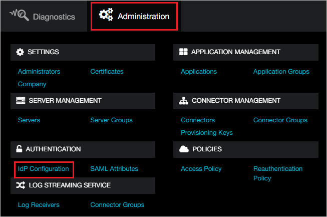
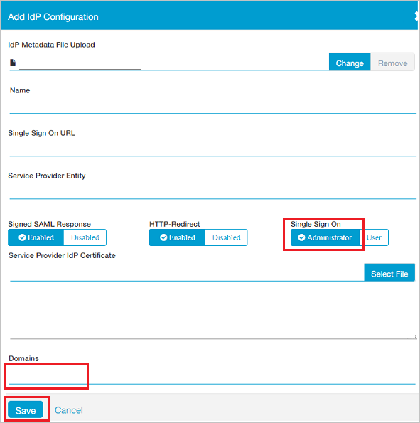
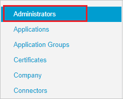
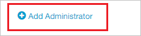
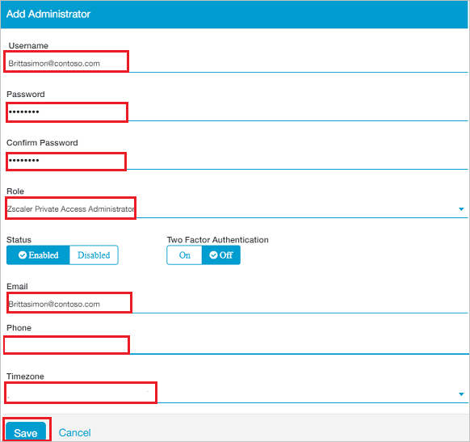

# Tutorial: Azure Active Directory integration with Zscaler Private Access Administrator

In this tutorial, you'll learn how to integrate Zscaler Private Access Administrator with Azure Active Directory (Azure AD). When you integrate Zscaler Private Access Administrator with Azure AD, you can:

* Control in Azure AD who has access to Zscaler Private Access Administrator.
* Enable your users to be automatically signed-in to Zscaler Private Access Administrator with their Azure AD accounts.
* Manage your accounts in one central location - the Azure portal.

## Prerequisites

To configure Azure AD integration with Zscaler Private Access Administrator, you need the following items:

* An Azure AD subscription. If you don't have an Azure AD environment, you can get a [free account](https://azure.microsoft.com/free/).
* Zscaler Private Access Administrator single sign-on enabled subscription.

> [!NOTE]
> This integration is also available to use from Azure AD US Government Cloud environment. You can find this application in the Azure AD US Government Cloud Application Gallery and configure it in the same way as you do from public cloud.

## Scenario description

In this tutorial, you configure and test Azure AD single sign-on in a test environment.

* Zscaler Private Access Administrator supports **SP** and **IDP** initiated SSO.

## Add Zscaler Private Access Administrator from the gallery

To configure the integration of Zscaler Private Access Administrator into Azure AD, you need to add Zscaler Private Access Administrator from the gallery to your list of managed SaaS apps.

1. Sign in to the Azure portal using either a work or school account, or a personal Microsoft account.
1. On the left navigation pane, select the **Azure Active Directory** service.
1. Navigate to **Enterprise Applications** and then select **All Applications**.
1. To add new application, select **New application**.
1. In the **Add from the gallery** section, type **Zscaler Private Access Administrator** in the search box.
1. Select **Zscaler Private Access Administrator** from results panel and then add the app. Wait a few seconds while the app is added to your tenant.

 Alternatively, you can also use the [Enterprise App Configuration Wizard](https://portal.office.com/AdminPortal/home?Q=Docs#/azureadappintegration). In this wizard, you can add an application to your tenant, add users/groups to the app, assign roles, as well as walk through the SSO configuration as well. [Learn more about Microsoft 365 wizards.](/microsoft-365/admin/misc/azure-ad-setup-guides)

## Configure and test Azure AD SSO for Zscaler Private Access Administrator

Configure and test Azure AD SSO with Zscaler Private Access Administrator using a test user called **B.Simon**. For SSO to work, you need to establish a link relationship between an Azure AD user and the related user in Zscaler Private Access Administrator.

To configure and test Azure AD SSO with Zscaler Private Access Administrator, perform the following steps:

1. **[Configure Azure AD SSO](#configure-azure-ad-sso)** - to enable your users to use this feature.
    1. **[Create an Azure AD test user](#create-an-azure-ad-test-user)** - to test Azure AD single sign-on with B.Simon.
    1. **[Assign the Azure AD test user](#assign-the-azure-ad-test-user)** - to enable B.Simon to use Azure AD single sign-on.
1. **[Configure Zscaler Private Access Administrator SSO](#configure-zscaler-private-access-administrator-sso)** - to configure the single sign-on settings on application side.
    1. **[Create Zscaler Private Access Administrator test user](#create-zscaler-private-access-administrator-test-user)** - to have a counterpart of B.Simon in Zscaler Private Access Administrator that is linked to the Azure AD representation of user.
1. **[Test SSO](#test-sso)** - to verify whether the configuration works.

## Configure Azure AD SSO

Follow these steps to enable Azure AD SSO in the Azure portal.

1. In the Azure portal, on the **Zscaler Private Access Administrator** application integration page, find the **Manage** section and select **single sign-on**.
1. On the **Select a single sign-on method** page, select **SAML**.
1. On the **Set up single sign-on with SAML** page, click the pencil icon for **Basic SAML Configuration** to edit the settings.

   

4. On the **Basic SAML Configuration** section, if you wish to configure the application in **IDP** initiated mode, perform the following steps:

    a. In the **Identifier** text box, type a URL using the following pattern:
    `https://<SUBDOMAIN>.private.zscaler.com/auth/metadata`

    b. In the **Reply URL** text box, type a URL using the following pattern:
    `https://<SUBDOMAIN>.private.zscaler.com/auth/sso`

	c. Click **Set additional URLs**.

	d. In the **Relay State** text box, type a value:
    `idpadminsso`

5.  If you wish to configure the application in **SP** initiated mode, perform the following step:

    In the **Sign-on URL** text box, type a URL using the following pattern:
    `https://<SUBDOMAIN>.private.zscaler.com/auth/sso`   

    > [!NOTE]
    > These values are not real. Update these values with the actual Identifier, Reply URL and Sign-on URL. Contact [Zscaler Private Access Administrator Client support team](https://help.zscaler.com/zpa-submit-ticket) to get these values. You can also refer to the patterns shown in the **Basic SAML Configuration** section in the Azure portal.

6. On the **Set up Single Sign-On with SAML** page, in the **SAML Signing Certificate** section, click **Download** to download the **Federation Metadata XML** from the given options as per your requirement and save it on your computer.

	

7. On the **Set up Zscaler Private Access Administrator** section, copy the appropriate URL(s) as per your requirement.

	

### Create an Azure AD test user 

In this section, you'll create a test user in the Azure portal called B.Simon.

1. From the left pane in the Azure portal, select **Azure Active Directory**, select **Users**, and then select **All users**.
1. Select **New user** at the top of the screen.
1. In the **User** properties, follow these steps:
   1. In the **Name** field, enter `B.Simon`.  
   1. In the **User name** field, enter the username@companydomain.extension. For example, `B.Simon@contoso.com`.
   1. Select the **Show password** check box, and then write down the value that's displayed in the **Password** box.
   1. Click **Create**.

### Assign the Azure AD test user

In this section, you'll enable B.Simon to use Azure single sign-on by granting access to Zscaler Private Access Administrator.

1. In the Azure portal, select **Enterprise Applications**, and then select **All applications**.
1. In the applications list, select **Zscaler Private Access Administrator**.
1. In the app's overview page, find the **Manage** section and select **Users and groups**.
1. Select **Add user**, then select **Users and groups** in the **Add Assignment** dialog.
1. In the **Users and groups** dialog, select **B.Simon** from the Users list, then click the **Select** button at the bottom of the screen.
1. If you are expecting a role to be assigned to the users, you can select it from the **Select a role** dropdown. If no role has been set up for this app, you see "Default Access" role selected.
1. In the **Add Assignment** dialog, click the **Assign** button.

## Configure Zscaler Private Access Administrator SSO

1. In a different web browser window, sign to Zscaler Private Access Administrator as an Administrator.

2. On the top, click **Administration** and navigate to **AUTHENTICATION** section click **IdP Configuration**.

	

3. In the top right corner, click **Add IdP Configuration**. 

	

4. On the **Add IdP Configuration** page perform the following steps:
 
	

	a. Click **Select File** to upload the downloaded Metadata file from Azure AD in the **IdP Metadata File Upload** field.

	b. It reads the **IdP metadata** from Azure AD and populates all the fields information as shown below.

	

	c. Select **Single Sign On** as **Administrator**.

	d. Select your domain from **Domains** field.
	
	e. Click **Save**.

### Create Zscaler Private Access Administrator test user

To enable Azure AD users to sign in to Zscaler Private Access Administrator, they must be provisioned into Zscaler Private Access Administrator. In the case of Zscaler Private Access Administrator, provisioning is a manual task.

**To provision a user account, perform the following steps:**

1. Sign in to your Zscaler Private Access Administrator company site as an administrator.

2. On the top, click **Administration** and navigate to **AUTHENTICATION** section click **IdP Configuration**.

	

3. Click **Administrators** from left side of the menu.

    

4. In the top right corner, click **Add Administrator**:

	

5. In the **Add Administrator** page, perform the following steps:

	

	a. In the **Username** textbox, enter the email of user like BrittaSimon@contoso.com.

	b. In the **Password** textbox, type the Password.

	c. In the **Confirm Password** textbox, type the Password.

	d. Select **Role** as **Zscaler Private Access Administrator**.

	e. In the **Email** textbox, enter the email of user like BrittaSimon@contoso.com.

	f. In the **Phone** textbox, type the Phone number.

	g. In the **Timezone** textbox, select the Timezone.

    h. Click **Save**.

## Test SSO 

In this section, you test your Azure AD single sign-on configuration with following options. 

#### SP initiated:

* Click on **Test this application** in Azure portal. This will redirect to Zscaler Private Access Administrator Sign on URL where you can initiate the login flow.  

* Go to Zscaler Private Access Administrator Sign-on URL directly and initiate the login flow from there.

#### IDP initiated:

* Click on **Test this application** in Azure portal and you should be automatically signed in to the Zscaler Private Access Administrator for which you set up the SSO. 

You can also use Microsoft My Apps to test the application in any mode. When you click the Zscaler Private Access Administrator tile in the My Apps, if configured in SP mode you would be redirected to the application sign on page for initiating the login flow and if configured in IDP mode, you should be automatically signed in to the Zscaler Private Access Administrator for which you set up the SSO. For more information about the My Apps, see [Introduction to the My Apps](https://support.microsoft.com/account-billing/sign-in-and-start-apps-from-the-my-apps-portal-2f3b1bae-0e5a-4a86-a33e-876fbd2a4510).

## Next steps

Once you configure Zscaler Private Access Administrator you can enforce session control, which protects exfiltration and infiltration of your organization’s sensitive data in real time. Session control extends from Conditional Access. [Learn how to enforce session control with Microsoft Defender for Cloud Apps](/cloud-app-security/proxy-deployment-aad).
