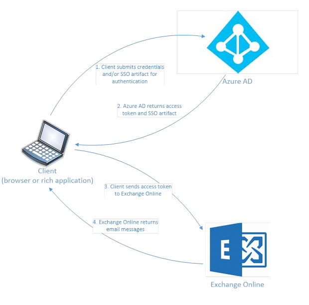

# Recommended security policies and configurations
 
## Introduction

The provided recommendations describe general Microsoft guidelines for applying security policies and configurations throughout the enterprise. These recommendations ensure that your employees are both secure and productive. 

### Intended audience

The intended audience for these recommendations are enterprise infrastructure architects and IT Pros familiar with [Exchange Online](https://technet.microsoft.com/library/jj200580.aspx) (Office 365), and [Microsoft Enterprise Mobility + Security](http://microsoft.com/ems) products. These products include, but are not limited to, Azure Active Directory (identity), Microsoft Intune (device management), and Azure Information Protection (data protection). 

### Customer environment

The recommended policies are applicable to enterprise organizations operating both entirely within the Microsoft cloud and for customers with infrastructure deployed across on-premises and the Microsoft cloud. 

### Assumptions

Many of the provided recommendations rely on services available only with Enterprise Mobility + Security (EMS) E5 subscriptions. Recommendations presented assume full EMS E5 subscription capabilities. 

### Caveats

Your organization may be subject to regulatory or other compliance requirements, including specific recommendations that may require you to apply policies that diverge from these recommended configurations.  These configurations recommend usage controls that have not historically been available.  We recommend these controls, because we believe they represent a balance between security and productivity.  

We have done our best to account for a wide variety of organizational protection requirements. But, we cannot account for all possible requirements or for all the unique aspects of your organization. Use this document as a guide for how Microsoft and the secure productive enterprise team is thinking about how to correctly apply policy in your organization. 

>[!NOTE]
>For an overview of the core concepts necessary to understand the protection capabilities described in these recommendations, see [EMS and Office 365 services overview](secure-email-ems-office365-service-descriptions.md).
>

## Core concepts

All the security measures in the world do not matter when users, who experience unnecessary friction when trying to get their work done, bypass your organizational security policies. Azure AD single-sign on (SSO) attempts to minimize the burden on users. This way users can remain productive while still conforming to the access control policies of the organization. 

### Single sign-on authentication

The following diagram illustrates a typical SSO authentication flow:

To begin authentication, the client submits credentials (such as username and password) and/or any SSO artifacts obtained in the past to Azure AD. An SSO artifact can be a session token for a browser or a refresh token for rich applications. 

Azure AD verifies the credentials and/or SSO artifact and evaluates all applicable policies. Then it issues an access token for the resource provider (Exchange Online in the diagram). Azure AD also issues an SSO artifact, as part of the response to allow the client to achieve SSO in future requests. 

The client stores the SSO artifact and submits the access token as a proof of identity to the resource provider. After Exchange Online verifies the access token and performs necessary checks, it grants the client access to the email messages.

#### Single sign-on (SSO) refresh tokens

SSO can be achieved in various ways. For example, cookies from an identity provider can be used as the SSO artifact to store the sign-in state for a user within a browser. Then future attempts to sign in silently (without any prompts for credentials) to applications using the same identity provider are possible. 

When a user authenticates with Azure AD, an SSO session is established with the user’s browser and Azure AD. The SSO token, in the form of a cookie, represents this session. Azure AD uses two kinds of SSO session tokens: persistent and non-persistent. Persistent session tokens are stored as persistent cookies by browsers when the "Keep me signed in" checkbox is selected during sign in. Non-persistent session tokens are stored as session cookies, and are destroyed when the browser is closed. 

For robust applications capable of using modern authentication protocols, such as [OpenId Connect](http://openid.net/specs/openid-connect-core-1_0.html) and [OAuth 2.0](https://tools.ietf.org/html/rfc6749), SSO is enabled using refresh tokens as the SSO artifacts (in addition to earlier described SSO cookies). Refresh tokens are presented to an authorization server when an application requests a new access token. 

The refresh token contains claims and attributes about the kind of authentication methods used when authenticating users. For example, if a user has successfully authenticated using multiple methods (username & password and phone-based authentication), then a multi-factor authentication (MFA) claim is present in the refresh token. Also, there may be additional claims that contain data such as MFA validity duration, etc. 

Refresh tokens allow the client to obtain a new access token, without needing to do a fresh interactive authentication. Refresh tokens have a much longer lifetime than access tokens and can be redeemed to obtain a new access and refresh token pair. The new obtained refresh tokens can then be continually used to fetch another set of access and refresh tokens. 

The client continues this SSO process until either the refresh token maximum inactive time setting expires, the refresh token max age expires, or the authentication and authorization policy requirements change. This change occurs during the time when the original refresh token was issued. Significant user attribute changes, for example a password reset, also requires a new authentication token to be generated. The client must do a fresh interactive authentication to continue further. Essentially it signifies a break in the SSO process that the client has not experienced until now. 

#### Conditional access

Azure AD, as an authorization server for your applications, determines whether to issue access tokens based on an evaluation of any conditional access policies applied to the resource that you’re trying to access. If policy requirements are met, then an access token and updated refresh token are issued. If the policy is not met, the user receives instructions on how to meet the policy and/or is required to complete additional steps including multi-factor authentication (MFA).  Once MFA has been completed, the MFA claim is added to the resulting refresh token.  

Claims in the refresh token get accumulated over time. Some of the claims have expiration timelines, after which they are no longer considered during authorization checks. This can sometimes cause unexpected results. For example, if a conditional access policy is configured so that MFA is required for authentication attempts coming from extranet locations. In this case, users might sometimes not receive the expected MFA prompt when accessing a resource from extranet. A possible reason for this is that the user could have previously performed MFA shortly before leaving the intranet. Therefore, they have a valid MFA claim in their access token. This MFA claim satisfies the policy requirement and thus Azure AD does not prompt the user with an additional MFA request.

#### Token lifetime policy

Beyond the expiration of individual claims in a token, tokens themselves have expiration times. As noted before, expired tokens are one reason why the SSO experience can be broken. You can set the lifetime of a token issued by Azure AD by using [token lifetime policies](https://docs.microsoft.com/azure/active-directory/active-directory-configurable-token-lifetimes). As can be inferred from above, defining the contours of an SSO session is harder to capture. For example, when rich apps as various factors that are seemingly disconnected can impact the lifetime of an SSO session.

>[!NOTE]
>Azure AD Global Administrators can control the validity and inactivity periods of refresh tokens. Information about access token and claims using the settings described in the article [Configurable token lifetimes in Azure Active Directory](https://docs.microsoft.com/azure/active-directory/active-directory-configurable-token-lifetimes).
>

#### Primary refresh tokens

So far, this article discusses how SSO works within the context of a single client. But this is not enough to experience SSO within a single app. These days, users experience interactive workflows spanning multiple applications within the same suite of applications, such as Microsoft Office. Users need access across unrelated applications, including internally developed LOB applications. 

Traditionally domain joined Windows devices, using Windows Integrated Authentication (Kerberos), achieve a high degree of SSO experience across multiple applications and resources. These apps include supported browsers such as Internet Explorer or Edge. There is an analog for the Azure AD realm, in the form of a primary refresh token (PRT). 

This privileged PRT token is only available to a select set of client entities (such as platform system components). The entities can then allow brokered authentication access to other client applications, so that they can also offer a seamless SSO experience. 

For Office 365 users on [iOS](https://docs.microsoft.com/azure/active-directory/develop/active-directory-sso-ios) and [Android](https://docs.microsoft.com/azure/active-directory/develop/active-directory-sso-android) devices, additional work has been done to reduce the number of required authentications by applying authentication broker functionality. This functionality is built into the Microsoft Authenticator and Intune Company Portal apps.

>[!NOTE]
>The recommendations described in this document assume that one of the apps has been deployed to your users' iOS or Android devices. For example, an app such as an authentication broker (Microsoft Authenticator or Intune Company Portal).
>

### Multi-factor authentication

Multi-factor Authentication (MFA) provides a high level of trust about the subject of authentication, because the subject provides multiple proofs or pieces of evidence about its identity. The proofs can be pre-established secrets that only the subject and the authority are aware of or a physical entity that only the subject is expected to possess. MFA is typically performed in stages. First it establishes the identity using passwords, and then it require a different (less prone to malicious attacks) authentication method as the second factor, or vice versa.

Different authorities may have a slightly different interpretation of MFA, or strong authentication. For example, some authorities (or more specifically the admins configuring policy on those authorities) may choose to interpret the physical smartcard-based authentication as MFA. It can happen even though strictly speaking smartcard authentication is a single stage authentication. 

The combination of requiring a physical smartcard and the requirement to enter a PIN (secret) to use smartcard can be interpreted as MFA. Yet some others may choose to be more lenient in terms of how often more onerous authentication methods are required to be performed. So it considers normal authentications, that take place between stronger authentications, to be valid for resources that typically require strong authentication. For example, in some organizations it may be acceptable to require a user to do MFA every few hours or days. The time depends on the sensitivity of resources they are protecting and as long as the physical location of the user attempting to access a resource, does not change.

Azure AD and AD FS use the MFA claim to indicate whether the authentication is performed with MFA. By default, Azure AD issues tokens with MFA claim when authentication is done with [Azure MFA](https://docs.microsoft.com/azure/multi-factor-authentication/multi-factor-authentication-get-started-cloud) or [Windows Hello for Business](https://docs.microsoft.com/windows/access-protection/hello-for-business/hello-identity-verification). In federation scenarios, Azure AD honors the MFA claim from federated identity providers such as AD FS and carries over the MFA claim in the tokens. 

## Recommended client configuration for SSO and conditional access
This section describes the default platform client configurations we recommend to provide the best SSO experience to your users, as well as the technical pre-requisites for conditional access.

### Windows devices
We recommend the Windows 10 (version 1703 or later), as Azure is designed to provide the smoothest SSO experience possible for both on-premises and Azure AD. Work or school issued devices should be configured to join Azure AD directly or if the organization uses on-premises AD domain join, those devices should be [configured to automatically and silently register with Azure AD](https://docs.microsoft.com/azure/active-directory/active-directory-conditional-access-automatic-device-registration-setup). 

For BYOD Windows devices, users can use "Add work or school account". For BYOD Windows devices, users can use "Add work or school account". Note that Chrome browser users on Windows 10 need to [install an extension](https://chrome.google.com/webstore/detail/windows-10-accounts/ppnbnpeolgkicgegkbkbjmhlideopiji?utm_source=chrome-app-launcher-info-dialog) so those users can get the same smooth sign-in experience as Edge/IE. Also, if your organization has domain joined Windows 7 devices, you can install Microsoft Workplace Join for non-Windows 10 computers [package to register](https://www.microsoft.com/download/details.aspx?id=53554) the devices with Azure AD.

### iOS devices

We recommend installing the [Microsoft Authenticator app](https://docs.microsoft.com/azure/multi-factor-authentication/end-user/microsoft-authenticator-app-how-to) on user devices before deploying conditional access or MFA policies. At a minimum, the app should be installed when users are [asked to register their device](https://docs.microsoft.com/azure/multi-factor-authentication/end-user/multi-factor-authentication-end-user-first-time) with Azure AD by adding a work or school account or when they install the Intune company portal app to enroll their device into management. This depends on the configured conditional access policy.

### Android devices

We recommend users install the [Intune Company Portal app](https://play.google.com/store/apps/details?id=com.microsoft.windowsintune.companyportal&hl=en
) and [Microsoft Authenticator app](https://docs.microsoft.com/azure/multi-factor-authentication/end-user/microsoft-authenticator-app-how-to) before conditional access policies are deployed or when required during certain authentication attempts. After app installation, users may be asked to register with Azure AD or enroll their device with Intune. This depends on the configured conditional access policy. 

We also recommend that corporate-owned devices (COD) are standardized on OEMs and versions that support Android for Work or Samsung Knox to allow mail accounts to be managed and protected by Intune MDM policy.

### Recommended email clients
The following email clients support Modern Authentication and Conditional Access. Azure Information Protection is not yet available for all clients.

|Platform|Client|Version/Notes|Azure Information Protection|
|:-------|:-----|:------------|:--------------------|
|**Windows**|Outlook|2016, 2013 ([Enable Modern Auth]((https://support.office.com/article/Enable-Modern-Authentication-for-Office-2013-on-Windows-devices-7dc1c01a-090f-4971-9677-f1b192d6c910))|Yes|
|**iOS**|Outlook|[Latest](https://itunes.apple.com/us/app/microsoft-outlook-email-and-calendar/id951937596?mt=8)|No|
|**Android**|Outlook|[Latest](https://play.google.com/store/apps/details?id=com.microsoft.office.outlook&hl=en)|No|
|**macOS**|Support coming soon||No|
|**Linux**|Not supported||No|

#### Additional client software
To access Azure Information Protection protected documents, additional software may be required. Be sure that you are using [supported software and document formats](https://docs.microsoft.com/information-protection/get-started/requirements-applications) to create and view protected documents with Azure Information Protection.

### Security guidelines

This section contains general security guidelines that should be followed when implementing any of the recommendations provided in later sections.

#### Security and productivity trade-offs

There is a trade-off to be made between security and productivity. To help understand these trade-offs, the Security-Functionality-Usability/Ease of Use (SFU) security triad is widely used:

Based on the SFU triad model, the recommendations in this document are based on the following principles: 

* Know the audience - Be flexible by job function/security bar
* Apply security policy just in time and ensure it is meaningful

#### Administrators versus users

We recommend creating security groups that contain all the users who have administrative accounts or are eligible to receive an administrative account privileges on a temporary basis. These security groups are used to define conditional access policies specific to Azure AD and Office 365 administrators.  

Policy recommendations consider the privileges associated with an account. [Office 365 administrator](https://support.office.com/article/About-Office-365-admin-roles-da585eea-f576-4f55-a1e0-87090b6aaa9d) roles have substantially more privileges relative to Exchange Online and Office 365. Thus, our policy recommendations for these accounts are more stringent than for regular user accounts. All the policies that refer to Administrators indicate the recommended policy for Office 365 administrative accounts.

#### Reduce the number of accounts with persistent admin access

Use Azure AD Privileged Identity Management to reduce the number of persistent administrative accounts. In addition, we recommend that Office 365 administrators have a separate user account for regular non-administrative use and only use their administrative account when necessary to complete a task associated with their job function.

## Tiers of security and protection
Most organizations have specific requirements regarding security and data protection. These requirements vary by industry segment and by job functions within organizations. For example, your legal department and Office 365 administrators might require additional security and information protection controls around their email correspondence that are not required for other business unit users. 

Each industry also has their own set of specialized regulations. Rather than providing a list of all possible security options or a recommendation per industry segment or job function, recommendations have been provided for three different tiers of security and protection that can be applied based on the granularity of your needs: [baseline, sensitive, and highly regulated](https://go.microsoft.com/fwlink/p/?linkid=841656).  

**Baseline**. We recommend that you establish a minimum standard for protecting data, as well as the identities and devices that access your data. Baseline recommendations can be followed to provide strong default protection that meets the needs of many organizations. 

**Sensitive**. Some customers have a subset of data that must be protected at higher levels or require all data to be protected at these higher levels. You can apply increased protection to all or specific data sets in your Office 365 environment. We recommend protecting identities and devices that access sensitive data with comparable levels of security. 

**Highly regulated**. Some organizations may have a very small amount of data that is highly classified, trade secret, or regulated data. Microsoft provides capabilities to help organizations meet these requirements, including added protection for identities and devices. 

### Default protection mechanism recommendations
The following table contains default protection mechanism recommendations for each of the previously defined security and protection tiers:

|Protection mechanism|Baseline|Sensitive|Highly regulated|
|:-------------------|:-------|:--------|:---------------|
|**Enforce MFA**|On medium or above sign-in risk|On low or above sign-in risk|On all new sessions|
|**Enforce Password Change**|For high risk users|For high risk users|For high risk users|
|**Enforce Intune Application Protection**|Yes|Yes|Yes|
|**Enforce Intune Enrollment (COD)**|Require a compliant or domain joined device|Require a compliant or domain joined device|Require a compliant or domain joined device|

### Device ownership
The above table reflects the trend for many organizations to support a mix of corporate-owned devices (COD) as well as personal or bring-your-own devices (BYOD) to enable mobile productivity across their workforces. Intune App Protection Policies ensure that email is protected from exfiltrating out of the Outlook mobile app and other Office mobile apps, on both COD and BYOD.  

Corporate-owned devices are required to be managed by Intune or domain-joined to apply additional protections and control.  Depending on data sensitivity, your organization may choose to not allow BYOD for specific user populations or specific apps.

## Next steps
[Secure email policies and configurations](secure-email-recommended-policies.md)
