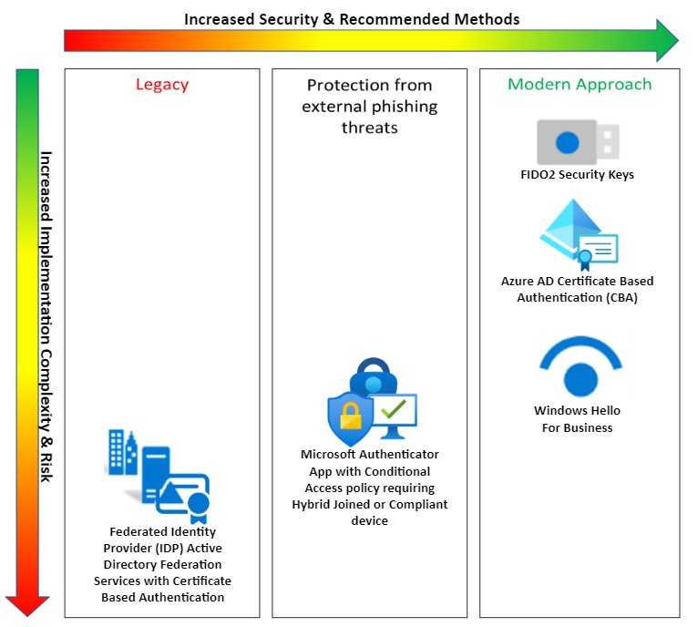

# Meet multifactor authentication requirements of memorandum 22-09

This series of articles offers guidance for using Azure Active Directory (Azure AD) as a centralized identity management system for implementing Zero Trust principles, as described in the US federal government's Office of Management and Budget (OMB) [memorandum 22-09](https://www.whitehouse.gov/wp-content/uploads/2022/01/M-22-09.pdf).

The memo requires that all employees use enterprise-managed identities to access applications, and that phishing-resistant multifactor authentication (MFA) protect those personnel from sophisticated online attacks. Phishing is the attempt to obtain and compromise credentials, such as by sending a spoofed email that leads to an inauthentic site.

Adoption of MFA is critical for preventing unauthorized access to accounts and data. The memo requires MFA usage with phishing-resistant methods, defined as "authentication processes designed to detect and prevent disclosure of authentication secrets and outputs to a website or application masquerading as a legitimate system." The first step is to establish what MFA methods qualify as phishing resistant.

## Phishing-resistant methods

* **[FIDO2 security keys](../authentication/concept-authentication-passwordless.md#fido2-security-keys)**
  * "gold standard of multi-factor authentication" per [CISA](https://www.cisa.gov/mfa)

* **[Azure AD certificate-based authentication](../authentication/concept-certificate-based-authentication.md)**
  * Native support for Common Access Card (CAC) & Personal Identity Verification (PIV) widely used in US Department of Defense (DoD) & US Federal Civilian agencies
* **[Windows Hello for Business](.../windows/security/identity-protection/hello-for-business/hello-overview)**

  * Windows Hello for Business [Deployment Overview](.../windows/security/identity-protection/hello-for-business/hello-deployment-guide)
* **[Microsoft Authenticator](../authentication/concept-authentication-authenticator-app.md) and conditional access policies that enforce Hybrid join or compliant devices to access the application or service.**

  Additional configuration steps for this method

  * [Plan your hybrid Azure Active Directory join implementation](../devices/hybrid-azuread-join-plan.md)\
    **or**
  * [How to: Plan your Azure AD join implementation](../devices/azureadjoin-plan.md)\
    **and**  
  * [Conditional Access: Require compliant or hybrid Azure AD joined device](../conditional-access/howto-conditional-access-policy-compliant-device.md)

  This method requires that the device being used to access the application that is protected by Azure AD is either Hybrid joined or compliant device. The mobile device with the authenticator app only needs to itself be managed/compliant if it is the device being used to access the application protected by Azure AD. For this reason if the organization/agency intends to allow access to applications **from un-managed devices** this method is not feasible.

> [!Note]
> Microsoft Authenticator combined with conditional access policy should not be interpreted as Microsoft Authenticator by itself is phishing-resistant. This approach works around a current limitation with Microsoft Authenticator by additionally securing the authentication via the phishing resistant properties gained from conditional access policy enforcement of Hybrid join or compliant device. This approach does not convey protection against all phishing threats but does protect the authentication from the most significant vector of phishing threats from malicious external actors.
>
>**Microsoft Authenticator native phishing resistance is in development.** Once available Microsoft Authenticator will be natively phishing-resistant without reliance on conditional access policies that enforce Hybrid join or compliant device.

* **Federated Identity Provider (IdP) such as Active Directory Federation Services (AD FS) that's configured with certificate-based authentication.**
  * [Deploying Active Directory Federation Services in Azure](.../windows-server/identity/ad-fs/deployment/how-to-connect-fed-azure-adfs)
  * [Configuring AD FS for user certificate authentication](.../windows-server/identity/ad-fs/operations/configure-user-certificate-authentication)

> [!Important]
> Microsoft recommends securing both registration of MFA credentials (such as FIDO2 and Microsoft Authenticator App) and device registration.
>
>More Information on each is provided below:
>
>**[Conditional Access: Securing security info registration](../conditional-access/howto-conditional-access-policy-registration.md)**
>
>**[Conditional Access: Securing Register or join devices](../conditional-access/concept-conditional-access-cloud-apps.md#user-actions)**

Your current device capabilities, user personas, and other requirements might dictate specific multifactor methods. For example, if you're adopting FIDO2 security keys that have only USB-C support, they can be used only from devices with USB-C ports.

Consider the following approaches to evaluating phishing-resistant MFA methods:

* Device types and capabilities that you want to support. Examples include kiosks, laptops, mobile phones, biometric readers, USB, Bluetooth, and near-field communication devices.

* User personas within your organization. Examples include front-line workers, remote workers with and without company-owned hardware, administrators with privileged access workstations, and business-to-business guest users.

* Logistics of distributing, configuring, and registering MFA methods such as FIDO2 security keys, smart cards, government-furnished equipment, or Windows devices with TPM chips.

* Need for FIPS 140 validation at a specific [authenticator assurance level](nist-about-authenticator-assurance-levels.md). For example, some FIDO security keys are FIPS 140 validated at levels required for [AAL3](nist-authenticator-assurance-level-3.md), as set by [NIST SP 800-63B](https://pages.nist.gov/800-63-3/sp800-63b.html).

## Implementation considerations for phishing-resistant MFA

The following sections describe support for implementing phishing-resistant methods for both application and virtual device sign-in scenarios.

### Application sign-in scenarios from various clients

The following table details the availability of phishing-resistant MFA scenarios, based on the device type that's used to sign in to the applications:

| Device | AD FS as a federated identity provider configured with certificate-based authentication| Azure AD certificate-based authentication| FIDO2 security keys| Windows Hello for Business| Microsoft Authenticator combined with conditional access policies that enforce Hybrid join or compliant device |
| - | - | - | - | - | - |
| Windows device| | | | |  |
| iOS mobile device| | | Not applicable| Not applicable|  |
| Android mobile device| | | Not applicable| Not applicable|  |
| MacOS device| | | Edge/Chrome | Not applicable|  |

To learn more, see [Browser support for FIDO2 passwordless authentication](../authentication/fido2-compatibility.md).

### Virtual device sign-in scenarios that require integration

To enforce the use of phishing-resistant MFA methods, integration might be necessary based on your requirements. MFA should be enforced when users access applications and devices.

For each of the five phishing-resistant MFA types previously mentioned, you use the same capabilities to access the following device types:

| Target system| Integration actions |
| - | - |
| Azure Linux virtual machine (VM)| Enable the [Linux VM for Azure AD sign-in](../devices/howto-vm-sign-in-azure-ad-linux.md). |
| Azure Windows VM| Enable the [Windows VM for Azure AD sign-in](../devices/howto-vm-sign-in-azure-ad-windows.md). |
| Azure Virtual Desktop| Enable [Azure Virtual Desktop for Azure AD sign-in](/azure/architecture/example-scenario/wvd/azure-virtual-desktop-azure-active-directory-join). |
| VMs hosted on-premises or in other clouds| Enable [Azure Arc](../../azure-arc/overview.md) on the VM and then enable Azure AD sign-in. (Currently in private preview for Linux. Support for Windows VMs hosted in these environments is on our roadmap.) |
| Non-Microsoft virtual desktop solution| Integrate the virtual desktop solution as an app in Azure AD. |

### Enforcing phishing-resistant MFA

Conditional access enables you to enforce MFA for users in your tenant. With the addition of [cross-tenant access policies](../external-identities/cross-tenant-access-overview.md), you can enforce it on external users.

#### Enforcement across agencies

[Azure AD B2B collaboration](../external-identities/what-is-b2b.md) helps you meet the requirement to facilitate integration among agencies. It does this by:

* Limiting what other Microsoft tenants your users can access.
* Enabling you to allow access to users whom you don't have to manage in your own tenant, but whom you can subject to your MFA and other access requirements.

You must enforce MFA for partners and external users who access your organization's resources. This is common in many inter-agency collaboration scenarios. Azure AD provides cross-tenant access policies to help you configure MFA for external users who access your applications and resources.

By using trust settings in cross-tenant access policies, you can trust the MFA method that the guest user's tenant is using instead of having them register an MFA method directly with your tenant. These policies can be configured on a per-organization basis. This ability requires you to understand the available MFA methods in the user's home tenant and determine if they meet the requirement for phishing resistance.

## Password policies

The memo requires organizations to change password policies that are proven ineffective, such as complex passwords that are rotated often. This includes the removal of the requirement for special characters and numbers, along with time-based password rotation policies. Instead, consider doing the following:

* Use [password protection](..//authentication/concept-password-ban-bad.md) to enforce a common list of weak passwords that Microsoft maintains. You can also add custom banned passwords.

* Use [self-service password protection](..//authentication/tutorial-enable-sspr.md) to enable users to reset passwords as needed, such as after an account recovery.

* Use [Azure AD Identity Protection](..//identity-protection/concept-identity-protection-risks.md) to be alerted about compromised credentials so you can take immediate action.

Although the memo isn't specific on which policies to use with passwords, consider the standard from [NIST 800-63B](https://pages.nist.gov/800-63-3/sp800-63b.html).

## Next steps

The following articles are part of this documentation set:

[Meet identity requirements of memorandum 22-09](memo-22-09-meet-identity-requirements.md)

[Enterprise-wide identity management system](memo-22-09-enterprise-wide-identity-management-system.md)

[Authorization](memo-22-09-authorization.md)

[Other areas of Zero Trust](memo-22-09-other-areas-zero-trust.md)

For more information about Zero Trust, see:

[Securing identity with Zero Trust](/security/zero-trust/deploy/identity)
