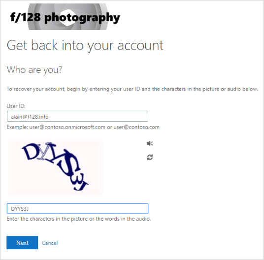
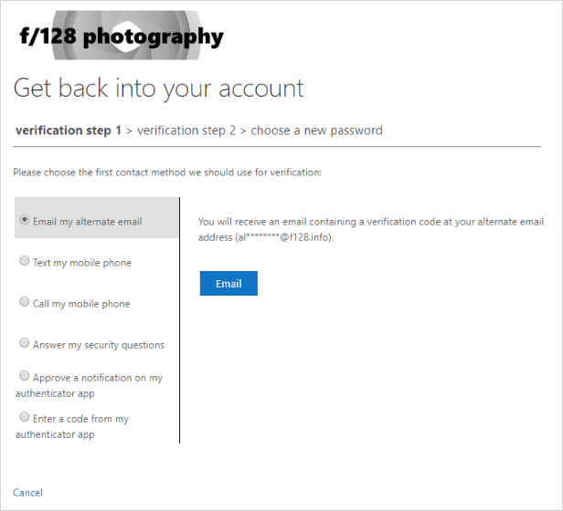

# Reset your work or school password using security info

If you forgot your work or school password, never got a password from your organization, or have been locked out of your account, you can use your security info and your mobile device to reset your work or school password. Your administrator must turn on this feature for you to be able to set up your information and reset your own password.

If you know your password, but want to change it, see the [Change your password steps](https://docs.microsoft.com/azure/active-directory/user-help/active-directory-passwords-update-your-own-password#how-to-change-your-password) sections of this article.

>[!Important]
>This article is intended for users trying to use reset a forgotten or unknown work or school account password. If you're an administrator looking for information about how to turn on self-service password reset for your employees or other users, see the [Deploy Azure AD self-service password reset and other articles](https://docs.microsoft.com/azure/active-directory/authentication/howto-sspr-deployment).

## How to reset or unlock your password for a work or school account

If you can't access your Azure Active Directory (Azure AD) account, it could be because either:

- Your password isn't working and you want to reset it, or

- You know your password, but your account is locked out and you need to unlock it.

### To reset your password and get back into your account

1. In the **Enter password** screen, select **Forgot my password**.

2. In the **Get back into your account** screen, type your work or school **User ID** (for example, your email address), prove you aren't a robot by entering the characters you see on the screen, and then select **Next**.

   

   >[!NOTE]
   >If your administrator hasn't turned on the ability for you to reset your own password, you'll see a **Contact your administrator** link instead of the **Get back into your account** screen. This link lets you contact your administrator about resetting your password, through either email or a web portal.

3. Choose one of the following methods to verify your identity and change your password. Depending on how your administrator has set up your organization, you might need to go through this process a second time, adding info for a second verification step.

    

    >[!NOTE]
    >Depending on how your administrator has set up your organization, some of these verification options might not be available. You must have previously set up your mobile device for verification using at least one of these methods.  Additionally, your new password might need to meet certain strength requirements. Strong passwords typically have 8 to 16 characters, including upper and lowercase characters, at least one number, and at least one special character.

- **Reset your password using an email address.** Sends an email to the email address you previously set up in two-step verification or security info. If your administrator has turned on the security info experience, you can find more info about setting up an email address in the [Set up security info to use email (preview)](security-info-setup-email.md) article. If you're not yet using security info, you can find more info about setting up an email address in the [Set up my account for two-step verification](multi-factor-authentication-end-user-first-time.md) article. 

    1. Select **Email my alternate email**, and then select **Email**.

    2. Type the verification code from the email into the box, and then select **Next**.

    3. Type and confirm your new password, and then select **Finish**.

- **Reset your password using a text message.** Sends a text message to the phone number you previously set up in security info. If your administrator has turned on the security info experience, you can find more info about setting up text messaging in the [Set up security info to use text messaging (preview)](security-info-setup-text-msg.md) article. If you're not yet using security info, you can find more info about setting up text messaging in the [Set up my account for two-step verification](multi-factor-authentication-end-user-first-time.md) article.

    1. Select **Text my mobile phone**, type your phone number, and then select **Text**.

    2. Type the verification code from the text message into the box, and then select **Next**.

    3. Type and confirm your new password, and then select **Finish**.

- **Reset your password using a phone number.** Sends a text message to the phone number you previously set up in security info. If your administrator has turned on the security info experience, you can find more info about setting up a phone number in the [Set up security info to use a phone call (preview)](security-info-setup-phone-number.md) article. If you're not yet using security info, you can find more info about setting up a phone number in the [Set up my account for two-step verification](multi-factor-authentication-end-user-first-time.md) article.

    1. Select **Call my mobile phone**, type your phone number, and then select **Call**.

    2. Answer the phone call and follow the instructions to verify your identity, and then select **Next**.

    3. Type and confirm your new password, and then select **Finish**.

- **Reset your password using security questions.** Shows you the list of security questions you set up in security info. If your administrator has turned on the security info experience, you can find more info about setting up your security questions in the [Set up security info to use pre-defined security questions (preview)](security-info-setup-questions.md) article. If you're not yet using security info, you can find more info about setting up security questions in the [Set up my account for two-step verification](multi-factor-authentication-end-user-first-time.md) article.

    1. Select **Answer my security questions**, answer the questions, and then select **Next**.

    2. Type and confirm your new password, and then select **Finish**.

- **Reset your password using a notification from your authenticator app.** Sends an approval notification to the authenticator app. If your administrator has turned on the security info experience, you can find more info about setting up an authenticator app to send a notification in the [Set up security info to use an authentication app (preview)](security-info-setup-auth-app.md) article. If you're not yet using security info, you can find more info about setting up an authenticator app to send a notification in the [Set up my account for two-step verification](multi-factor-authentication-end-user-first-time.md) article.

    1. Select **Approve a notification on my authenticator app**, and then select **Send Notification**.

    2. Approve the sign-in from your authenticator app.

    3. Type and confirm your new password, and then select **Finish**.

- **Reset your password using a code from your authenticator app.** Accepts a random code provided by your authentication app. If your administrator has turned on the security info experience, you can find more info about setting up an authenticator app to provide a code in the [Set up security info to use an authentication app (preview)](security-info-setup-auth-app.md) article. If you're not yet using security info, you can find more info about setting up an authenticator app to provide a code in the [Set up my account for two-step verification](multi-factor-authentication-end-user-first-time.md) article.

  1. Select **Enter a code from my authenticator app**, and then select **Send Notification**.

  2. Open your authenticator app, type the verification code for your account into the box, and then select **Next**.

  3. Type and confirm your new password, and then select **Finish**.

  4. After you get the message saying that your password has been reset, you can sign in to your account using your new password.

     If you still can't access your account, you should contact your organization's administrator for more help.

After resetting your password, you might get a confirmation email that comes from an account like, "Microsoft on behalf of \<*your_organization*>." If you get a similar email, but you didn't recently reset your password, you must contact your organization's administrator immediately.

## How to change your password

If you just want to change your password, you can do it through the Office 365 portal, the Azure Access Panel, or the Windows 10 sign-in page.

### To change your password using the Office 365 portal

Use this method if you typically access your apps through the Office portal:

1. Sign in to your [Office 365 account](https://portal.office.com), using your existing password.

2. Select your profile on the upper-right side, and then select **View account**.

3. Select **Security & privacy** > **Password**.

4. Type your old password, create and confirm your new password, and then select **Submit**.

### To change your password from the Azure Access Panel

Use this method if you typically access your apps from the Azure Access Panel (MyApps):

1. Sign in to the [Azure Access Panel](https://myapps.microsoft.com/), using your existing password.

2. Select your profile on the upper-right side, and then select **Profile**.

3. Select **Change password**.

4. Type your old password, create and confirm your new password, and then select **Submit**.

### To change your password at Windows sign-in

If your administrator turned on the functionality, you can see a link to **Reset password** on your Windows 7, Windows 8, Windows 8.1, or Windows 10 sign-in screen.

1. Select the **Reset password** link to start the password reset process without having to use the normal web-based experience.

2. Confirm your user ID and select **Next**.

3. Select and confirm a contact method for verification. If necessary, choose a second verification option that's different from your previous one, filling in the necessary info.

4. On the **Create a new password** page, type and confirm your new password, and then select **Next**.

    Strong passwords typically have 8 to 16 characters, including upper and lowercase characters, at least one number, and at least one special character.

5. After you get the message saying that your password has been reset, you can select **Finish**.

    If you still can't access your account, you should contact your organization's administrator for more help.

## Common problems and their solutions

Here are some common error cases and their solutions:

|Problem|Description|Solution|
| --- | --- | --- |
|When I try to change my password, I get an error. |Your password has a word, phrase, or pattern that makes your password easily guessable.| Try again using a stronger password.|
|After I enter my User ID, I go to a page that says, "Please contact your administrator."|Microsoft has determined that your user account password is managed by your administrator in an on-premises environment. As a result, you can't reset your password from the "Can't access your account" link. |Contact your administrator for more help.|
|After I enter my User ID, I get an error that says, "Your account is not enabled for password reset."|Your administrator hasn't set up your account so you can reset your own password.|Your administrator hasn't turned on password reset for your organization from the "Can't access your account" link, or hasn't licensed you to use the feature.   To reset your password, you must select the "contact an administrator link" to send an email to your company's administrator, and let them know you want to reset your password.|
|After I enter my User ID, I get an error that says, "We couldn't verify your account."|The sign-in process was unable to verify your account info.|There are two reasons you could be seeing this message.  1. Your administrator turned on password reset for your organization, but you haven't registered to use the service. To register for password reset, see one of the following articles, based on your verification method: [Set up security info to use an authenticator app (preview)](security-info-setup-auth-app.md), [Set up security info to use a phone call (preview)](security-info-setup-phone-number.md), [Set up security info to use text messaging (preview)](security-info-setup-text-msg.md), [Set up security info to use email (preview)](security-info-setup-email.md), or [Set up security info to use security questions (preview)](security-info-setup-questions.md).  2. Your administrator hasn't turned on password reset for your organization. In this situation, you must select the "contact an administrator link" to send an email to your administrator, asking to reset your password.|

## Next steps

- Learn about security info in the [Security info (preview) overview](user-help-security-info-overview.md) article.

- If you're trying to get back into a personal account like Xbox, hotmail.com, or outlook.com, try the suggestions in the [When you can't sign in to your Microsoft account article](https://support.microsoft.com/help/12429/microsoft-account-sign-in-cant).
