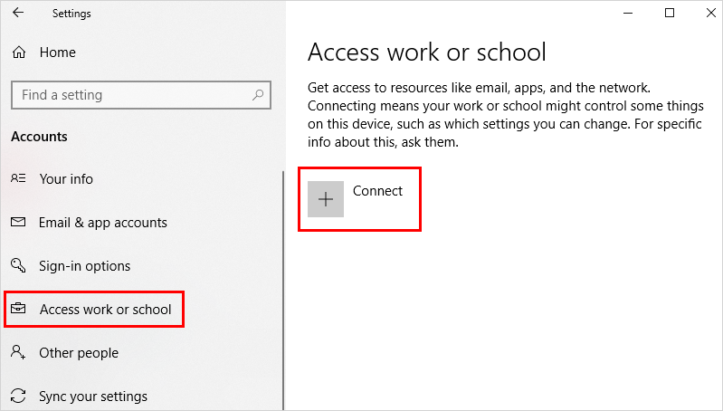
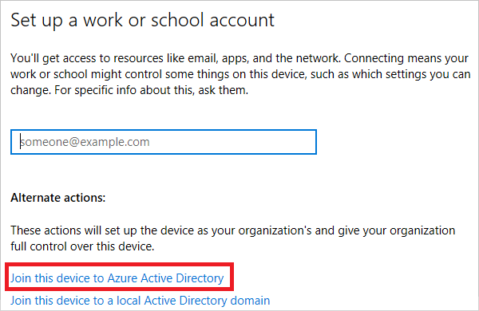

# Set up Azure Active Directory joined devices

With device management in Azure Active Directory (Azure AD), you can ensure that your users are accessing your resources from devices that meet your standards for security and compliance. For more information, see [Introduction to device management in Azure Active Directory](../device-management-introduction.md).

If you want to bring work-owned Windows 10 devices under the control of Azure AD, you can accomplish this by configuring Azure AD joined devices. This topic provides you with the related steps. 

## Prerequisites

To join a Windows 10 device, the device registration service must be configured to enable you to register devices. In addition to having permission to joining devices in your Azure AD tenant, you must have fewer devices registered than the configured maximum. For more information, see [configure device settings](../devices/device-management-azure-portal.md#configure-device-settings).

## What you should know

- Windows joins the device in the organization’s directory in Azure AD.

- You might be required to go through multi-factor authentication challenge. This challenge is configurable by your IT administrator.

- Azure AD checks whether the device requires mobile device management enrollment and enrolls it if applicable.

- If you are a managed user, Windows takes you to the desktop through the automatic sign-in.

- If you are a federated user, you have to sign in using your credentials.

- If you are federated, your Identity provider MUST support WS-Fed and WS-Trust username/password endpoint. This can be version 1.3 or 2005. This protocol support is required to both join the device to Azure AD and log on to the device with a password. 

## Joining a device

This section provides you with the steps to join your Windows 10 device to your Azure AD. A successfully joined  device shows up as **Connected to \<your Azure AD\>**.

**To join your Windows 10 device:**

1. In the **Start** menu, click **Settings**.

    

2. Click **Accounts**.

    

3. Click **Access work or school**.

    

4. On the **Access work or school** dialog, click **Connect**.

    

5. On the  **Setup a work or school account** dialog, click **Join this device to Azure Active Directory**.

    

6. On the **Let's get you signed in** dialog, enter your account name (for example, someone@example.com), and then click **Next**.

    

6. On the  **Enter password** dialog, enter your password, and then click **Sign in**.

    

7. On the  **Make sure this is your organization** dialog, click **Join**.

    

8. On the **You're all set** dialog, click **Done**.

    

## Verification

To verify whether a device is joined to an Azure AD, you can review the **Access work or school** dialog on your device.

Alternatively, you can run the following command: `dsregcmd /status`  
On a successfully joined device, **AzureAdJoined** is **Yes**.

You can also review device settings on the Azure AD portal.

For more information, see [locate devices](../devices/device-management-azure-portal.md#locate-devices).

## Next steps

For more information, see: 

- The [introduction to device management in Azure Active Directory](../devices/overview.md)
- [Managing devices using the Azure portal](../devices/device-management-azure-portal.md)

